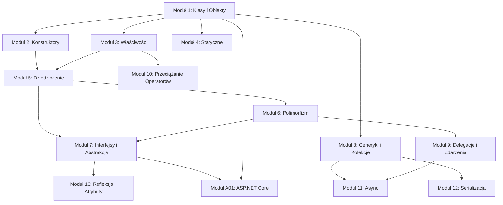

# C# Programowanie Obiektowe – Materiały Dydaktyczne

## 🎓 O tym repozytorium

Kompletne materiały dydaktyczne do nauki **Programowania Obiektowego w C#** na poziomie uniwersytetu/szkoły, od podstaw po zaawansowane koncepty, aż do praktycznego zastosowania w ASP.NET Core.

Projekt zawiera szczegółową teorię, praktyczne przykłady kodu, diagramy UML, testy jednostkowe, zadania ćwiczeniowe i rzeczywiste studia przypadków.

---

## 📂 Struktura projektu

Materiały podzielone są na 14 modułów tematycznych, każdy obejmujący 6-12 zagadnień szczegółowych:

```
csharp-programming/
├── README.md (ten plik)
├── LICENSE.md
└── src/
    ├── 01-klasy/                    # Klasy i Obiekty – Fundament OOP
    ├── 02-konstruktory/             # Konstruktory i Inicjalizacja
    ├── 03-wlasciwosci/              # Właściwości i Indeksatory
    ├── 04-statyczne/                # Składowe Statyczne
    ├── 05-dziedziczenie/            # Dziedziczenie
    ├── 06-polimorfizm/              # Polimorfizm
    ├── 07-interfejsy_abstrakcje/    # Interfejsy i Abstrakcja
    ├── 08-kolecje_generyczne/       # Generyki i Kolekcje
    ├── 09-delegacje_zdarzenia/      # Delegacje i Zdarzenia
    ├── 10-przeciazenie_operatorow/  # Przeciążanie Operatorów
    ├── 11-async/                    # Programowanie Asynchroniczne
    ├── 12-serializacja/             # Serializacja
    ├── 13-refleksja_atrybuty/       # Refleksja i Atrybuty
    └── A01-aspnet_core/             # ASP.NET Core – Praktyczne Zastosowanie
```

Każdy temat zawiera:
- 📄 **README.md** – Szczegółowa dokumentacja (2000-3500 słów)
- 💻 **code/** – Projekt .NET 9.0 z kodem + testami xUnit
- 📊 **diagrams/** – Diagramy Mermaid UML
- 📝 **tasks/** – Zadania z pełnymi rozwiązaniami


---

## 🚀 Szybki Start

### 1. Klonowanie repozytorium

```bash
git clone https://github.com/tborzyszkowski/csharp-programming.git
cd csharp-programming
```

### 2. Otwórz w VS Code

```bash
code .
```

### 3. Przejdź do tematu

```bash
cd src/01-klasy/_01_oop_fundamentals/code/
dotnet run
```

---

## �️ Mapa Zależności Modułów

Poniższy diagram pokazuje zalecaną kolejność nauki oraz zależności między modułami. Strzałka `A --> B` oznacza „A jest wymagane przed B”.



**Ścieżka fundamentalna (obowiązkowa):** Moduł 1 → 2 → 3 → 5 → 6 → 7  
**Ścieżka zaawansowana (po fundamentach):** Moduły 8, 9, 11, 12, 13 – można je studiować równolegle, o ile spełnione są ich zależności  
**Ścieżka opcjonalna:** Moduł 4 (statyczne) i Moduł 10 (operatory) można studiować w dowolnym momencie po Module 1/3  
**Ścieżka praktyczna (podsumowanie):** Moduł A01 – wymaga zrozumienia Modułów 1-7

Każda sekcja modułu poniżej zawiera pola **Wymaga** i **Prowadzi do** z bezpośrednimi linkami do powiązanych modułów.

---

## �📚 Moduły Nauczania

### **Moduł 1: Klasy i Obiekty** – Fundament OOP

**Cel:** Zrozumienie fundamentalnych koncepcji programowania obiektowego.

Moduł obejmuje 9 tematów:
1. Podstawowe pojęcia OOP (abstrakcja, enkapsulacja, dziedziczenie, polimorfizm)
2. Definicja i struktura klasy
3. Tworzenie i używanie obiektów
4. Słowo kluczowe `this`
5. Modyfikatory dostępu i enkapsulacja
6. Klasy częściowe (partial classes)
7. Metody częściowe (partial methods)
8. Struktury vs klasy (value types)
9. Diagramy UML – notacja i czytanie

**Dla kogo:** Wszyscy początkujący w OOP. Stanowi fundament dla wszystkich pozostałych modułów.

**Wymaga:** – (punkt startowy, brak wymagań wstępnych)  
**Prowadzi do:** Wszystkie kolejne moduły opierają się na tym module.

**Co jest tu wartościowe:** Solidne zrozumienie podstaw OOP – bez tego trudno będzie pracować z pozostałymi koncepcjami. Moduł zawiera rzeczywiste diagramy UML pokazujące relacje między klasami.

[Przejdź do modułu](src/01-klasy/README.md)

---

### **Moduł 2: Konstruktory i Inicjalizacja** – Tworzenie Obiektów

**Cel:** Opanowanie mechanizmów tworzenia i inicjalizacji obiektów.

Moduł obejmuje 10 tematów:
1. Konstruktory – podstawy, parametry
2. Łańcuchowe wywołanie konstruktorów (`this()`)
3. Inicjalizatory obiektów
4. Kolejność inicjalizacji (pola, konstruktor, właściwości)
5. Konstruktory struktur
6. Destruktory i garbage collection
7. Wprowadzenie do Design Patterns
8. Wzorzec Prototypu (Prototype Pattern)
9. Kod zarządzany vs niezarządzany (IDisposable, using)
10. Nowoczesne C# (records, init properties, primary constructors)

**Dla kogo:** Po Modułu 1. Niezbędne dla każdego, kto pracuje z tworzeniem obiektów.

**Wymaga:** [Moduł 1: Klasy i Obiekty](src/01-klasy/README.md)  
**Prowadzi do:** [Moduł 5: Dziedziczenie](src/05-dziedziczenie/README.md)

**Co jest tu wartościowe:** Poznasz różne sposoby inicjalizacji i nauczysz się zaawansowanych patternów. Szczególnie cenny jest temat destruktorów i IDisposable – częsta przyczyna wycieków zasobów.

[Przejdź do modułu](src/02-konstruktory/README.md)

---

### **Moduł 3: Właściwości i Indeksatory** – Enkapsulacja Danych

**Cel:** Opanowanie właściwości (properties) i indeksatorów – klucza do dobrze zaprojektowanego kodu.

Moduł obejmuje 7 tematów:
1. Właściwości vs pola
2. Auto properties (`{ get; set; }`)
3. Walidacja właściwości
4. Indeksatory – dostęp do danych jak tablica
5. `readonly` vs `const`
6. Init properties (C# 9+) – niezmienność
7. Nullable reference types – bezpieczeństwo typów

**Dla kogo:** Narzędzie codzienne dla każdego C# developera. Niezbędne przed Modułem 5 (dziedziczenie).

**Wymaga:** [Moduł 1: Klasy i Obiekty](src/01-klasy/README.md)  
**Prowadzi do:** [Moduł 5: Dziedziczenie](src/05-dziedziczenie/README.md), [Moduł 10: Przeciążanie Operatorów](src/10-przeciazenie_operatorow/README.md)

**Co jest tu wartościowe:** Pokażemy jak prawidłowo enkapsulować dane i chronić invarianty klasy. Nowocześni praktycy C# powinni znać init properties i nullable reference types.

[Przejdź do modułu](src/03-wlasciwosci/README.md)

---

### **Moduł 4: Składowe Statyczne** – Współdzielone Zasoby

**Cel:** Zrozumienie statycznych pól, metod i wzorca Singleton.

Moduł obejmuje 7 tematów:
1. Pola statyczne – zmienne dzielane między instancje
2. Metody statyczne – narzędzia utility
3. Konstruktory statyczne – inicjalizacja
4. Klasy statyczne – organizacja kodu
5. Metody rozszerzające (extension methods) – dodawanie funkcjonalności
6. Wzorzec Singleton – gwarantowanie jednej instancji
7. Static properties z Lazy<T> – nowoczesna inicjalizacja

**Dla kogo:** Średniozaawansowani. Niezbędny do zrozumienia wspólnych zasobów i patternów.

**Wymaga:** [Moduł 1: Klasy i Obiekty](src/01-klasy/README.md)  
**Prowadzi do:** [Moduł 6: Polimorfizm](src/06-polimorfizm/README.md) (wzorce Singleton wracają w kontekście Factory)

**Co jest tu wartościowe:** Extension methods to cenna umiejętność w C#. Singleton pattern należy do klasyki – poznaj go na praktycznych przykładach.

[Przejdź do modułu](src/04-statyczne/README.md)

---

### **Moduł 5: Dziedziczenie** – Hierarchie Klas

**Cel:** Opanowanie dziedziczenia – jednego z czterech filarów OOP.

Moduł obejmuje 7 tematów:
1. Podstawowe pojęcia dziedziczenia (klasa bazowa, pochodna)
2. Modyfikatory dostępu w kontekście dziedziczenia
3. Konstruktory klas pochodnych (`base` keyword)
4. `override` vs `new` – przesłonięcie vs ukrycie
5. Metody wirtualne (`virtual`) – polimorfizm
6. Klasy abstrakcyjne – umowy dla podklas
7. Sealed classes – zapobieganie dalszemu dziedziczeniu

**Dla kogo:** Krytyczny moduł po Modułu 1-3. Bez niego nie zrozumiesz polimorfizmu.

**Wymaga:** [Moduł 1: Klasy i Obiekty](src/01-klasy/README.md), [Moduł 2: Konstruktory](src/02-konstruktory/README.md), [Moduł 3: Właściwości](src/03-wlasciwosci/README.md)  
**Prowadzi do:** [Moduł 6: Polimorfizm](src/06-polimorfizm/README.md), [Moduł 7: Interfejsy i Abstrakcja](src/07-interfejsy_abstrakcje/README.md)

**Co jest tu wartościowe:** Zrozumienie relacji is-a i prawidłowego używania override vs new. Abstract classes to narzędzie do projektowania elastycznych architektur.

[Przejdź do modułu](src/05-dziedziczenie/README.md)

---

### **Moduł 6: Polimorfizm** – Dynamiczne Wiązanie

**Cel:** Opanowanie polimorfizmu i wzorców projektowych opartych na metodach wirtualnych.

Moduł obejmuje 6 tematów:
1. Funkcje wirtualne – wstęp do polimorfizmu
2. Praktyczne przykłady – payment gateway (real-world case study)
3. `virtual` vs `new` – pułapki i best practices
4. Metody klasy Object (ToString, Equals, GetHashCode)
5. Adapter Pattern + Factory Pattern – praktyczne wzorce
6. Default interface members (C# 8.0+) – nowoczesne interfejsy

**Dla kogo:** Po Modułu 5. Fundamentalny dla zrozumienia nowoczesnych architektur.

**Wymaga:** [Moduł 5: Dziedziczenie](src/05-dziedziczenie/README.md)  
**Prowadzi do:** [Moduł 7: Interfejsy i Abstrakcja](src/07-interfejsy_abstrakcje/README.md), [Moduł 9: Delegacje i Zdarzenia](src/09-delegacje_zdarzenia/README.md)

**Co jest tu wartościowe:** Payment gateway case study pokazuje jak rzeczywiście stosować polimorfizm w prawdziwych projektach. Nauczysz się implementować Adapter i Factory patterns.

[Przejdź do modułu](src/06-polimorfizm/README.md)

---

### **Moduł 7: Interfejsy i Abstrakcja** – Umowy i Kontrakty

**Cel:** Opanowanie interfejsów i abstrakcji – kluczy do słabo sprzężonego kodu.

Moduł obejmuje 7 tematów:
1. Klasy abstrakcyjne – wstęp
2. Metody abstrakcyjne – umowy
3. Sealed keyword – finalizacja hierarchii
4. Interfejsy – wprowadzenie i dependency injection
5. Jawna implementacja interfejsu – zaawansowane techniki
6. Konwersje i operatory castingu (`is`, `as`, pattern matching)
7. Zaawansowane interfejsy (C# 8.0+, 11.0+ static abstract)

**Dla kogo:** Po Modułu 5-6. Niezbędny do pisania testowalnego kodu i architektur SOLID.

**Wymaga:** [Moduł 5: Dziedziczenie](src/05-dziedziczenie/README.md), [Moduł 6: Polimorfizm](src/06-polimorfizm/README.md)  
**Prowadzi do:** [Moduł 13: Refleksja i Atrybuty](src/13-refleksja_atrybuty/README.md), [Moduł A01: ASP.NET Core](src/A01-aspnet_core/README.md)

**Co jest tu wartościowe:** Interfejsy to podstawa dependency injection i testowania. Nauczysz się projektować elastyczne systemy, gdzie komponenty nie zależą od konkretnych implementacji.

[Przejdź do modułu](src/07-interfejsy_abstrakcje/README.md)

---

### **Moduł 8: Generyki i Kolekcje** – Bezpieczeństwo Typów

**Cel:** Opanowanie typów generycznych i nowoczesnych kolekcji.

Moduł obejmuje 7 tematów:
1. Metody i klasy generyczne – wariancja typów
2. Ograniczenia typów generycznych (`where`)
3. IEnumerable i IEnumerator – iteracja
4. Interfejsy porównania (IComparable, IComparer, IEquatable)
5. Przegląd kolekcji – List, Dictionary, Queue, Stack, HashSet
6. LINQ – wprowadzenie – Query Syntax, Method Syntax, lazy evaluation
7. LINQ – zaawansowane techniki – Aggregate, SelectMany, Join, Expression Trees

**Dla kogo:** Średniozaawansowani. Narzędzie codzienne przy pracy z danymi.

**Wymaga:** [Moduł 1: Klasy i Obiekty](src/01-klasy/README.md)  
**Prowadzi do:** [Moduł 11: Programowanie Asynchroniczne](src/11-async/README.md), [Moduł 12: Serializacja](src/12-serializacja/README.md)

**Co jest tu wartościowe:** Generyki zapewniają type safety i wydajność. LINQ to język zapytań w C# – nauczysz się pisać ekspresyjny, deklaratywny kod. Collection expressions (C# 12) pokazują nowoczesne podejście.

[Przejdź do modułu](src/08-kolecje_generyczne/README.md)

---

### **Moduł 9: Delegacje i Zdarzenia** – Powiązania Słabe

**Cel:** Zrozumienie mechanizmów callback'ów i event-driven architecture.

Moduł obejmuje 8 tematów:
1. Idea i motywacja delegacji
2. Definicja i składnia delegacji
3. Predefiniowane generyczne delegacje (Action, Func, Predicate)
4. Wyrażenia lambda i metody anonimowe
5. Zdarzenia – fundamenty (standardowy wzorzec zdarzeń .NET)
6. Wzorce pracy ze zdarzeniami
7. Delegacje vs zdarzenia – kiedy co wybrać
8. Event-driven architecture – praktyczne implementacje

**Dla kogo:** Po Modułu 6. Narzędzie do loose coupling i reactive programming.

**Wymaga:** [Moduł 6: Polimorfizm](src/06-polimorfizm/README.md)  
**Prowadzi do:** [Moduł 11: Programowanie Asynchroniczne](src/11-async/README.md)

**Co jest tu wartościowe:** Delegacje to callbacks w C#. Event-driven architecture jest wszędzie – od GUI po backend. Nauczysz się RxJS-style reactive programming w C#.

[Przejdź do modułu](src/09-delegacje_zdarzenia/README.md)

---

### **Moduł 10: Przeciążanie Operatorów** – Semantyka Domeny

**Cel:** Opanowanie przeciążania operatorów dla intuicyjnego API.

Moduł obejmuje 10 tematów:
1. Operatory które można przeciążać
2. Operatory przeciążane pośrednio – relacje
3. Metoda definiująca operator – zasady
4. Operatory jednoargumentowe (+, -, !, ~)
5. Operatory ++, --
6. Operatory `true`, `false`
7. Operatory relacyjne (==, !=, <, >, <=, >=)
8. Operatory binarne arytmetyczne
9. Operatory konwersji – implicit/explicit
10. Kompletny przykład – system Vector3D

**Dla kogo:** Zaawansowani. Opcjonalny, ale cenny przy projektowaniu DSL'ów i klas domenowych.

**Wymaga:** [Moduł 3: Właściwości i Indeksatory](src/03-wlasciwosci/README.md)  
**Prowadzi do:** – (moduł samodzielny, opcjonalny)

**Co jest tu wartościowe:** Przeciążanie operatorów pozwala na intuicyjne API – np. Vector3D + Vector3D zamiast Vector3D.Add(). Naucz się implementować to bezpiecznie i elegancko.

[Przejdź do modułu](src/10-przeciazenie_operatorow/README.md)

---

### **Moduł 11: Programowanie Asynchroniczne** – I/O i Współbieżność

**Cel:** Opanowanie async/await i Task-based asynchronous pattern (TAP).

Moduł obejmuje 12 tematów:
1. Fundamenty async/await i Task
2. Breakfast example – sequential vs concurrent
3. Operacje I/O (HttpClient, File I/O)
4. CPU-bound operations (Task.Run)
5. Zaawansowane patterny (CancellationToken, ConfigureAwait)
6. Testowanie async kodu
7. Async LINQ i Channels
8. Dependency injection i async init
9. Real-world integration – kompleksowy system
10. Nowoczesne C# (ValueTask, async iterators)
11. Benchmarking performance
12. Reactive Extensions (Rx)

**Dla kogo:** Średniozaawansowani+. Niezbędny do nowoczesnych aplikacji webowych.

**Wymaga:** [Moduł 8: Generyki i Kolekcje](src/08-kolecje_generyczne/README.md), [Moduł 9: Delegacje i Zdarzenia](src/09-delegacje_zdarzenia/README.md)  
**Prowadzi do:** – (moduł zaawansowany, samodzielny)

**Co jest tu wartościowe:** Async/await to core feature nowoczesnego .NET. Nauczysz się pisać responsywne aplikacje i unikać deadlock'ów. Breakfast example pokazuje kiedy naprawdę potrzebna jest współbieżność.

[Przejdź do modułu](src/11-async/README.md)

---

### **Moduł 12: Serializacja** – Trwałość Danych

**Cel:** Opanowanie serializacji dla różnych formatów danych.

Moduł obejmuje 10 tematów:
1. Koncepty serializacji – object graphs
2. Historia i ewolucja (.NET 1.0 → 9.0)
3. XML serialization
4. Binary serialization (legacy)
5. JSON serialization (System.Text.Json) – nowoczesne podejście
6. Niestandardowa serializacja (ISerializable)
7. Circular references – grafy obiektów
8. Zaawansowane patterny – versioning, compatibility
9. Protocol Buffers i gRPC – nowoczesne formaty
10. Performance i bezpieczeństwo (Security concerns)

**Dla kogo:** Średniozaawansowani. Narzędzie do komunikacji między systemami.

**Wymaga:** [Moduł 8: Generyki i Kolekcje](src/08-kolecje_generyczne/README.md)  
**Prowadzi do:** – (moduł samodzielny)

**Co jest tu wartościowe:** JSON to standard. Nauczysz się serialize/deserialize obiekty bezpiecznie i wydajnie. Protocol Buffers pokazuje jak pracować z nowoczesnym toolingiem (gRPC).

[Przejdź do modułu](src/12-serializacja/README.md)

---

### **Moduł 13: Refleksja i Atrybuty** – Introspekcja i Metaprogramowanie

**Cel:** Opanowanie refleksji do introspekcji typów i atrybutów do metaprogramowania.

Moduł obejmuje 10 tematów:
1. Refleksja – wprowadzenie
2. Inspekcja typów – co można odkryć
3. System.Activator – dynamiczne tworzenie instancji
4. Niestandardowe atrybuty
5. Zaawansowane atrybuty
6. Czytanie atrybutów – reflection API
7. Wbudowane atrybuty – [Obsolete], [Serializable], etc.
8. Plugin systems – dynamiczne ładowanie
9. Expression trees i dynamic – zaawansowane techniki
10. Performance i best practices

**Dla kogo:** Zaawansowani. Opcjonalny, ale potężny dla framework'ów.

**Wymaga:** [Moduł 7: Interfejsy i Abstrakcja](src/07-interfejsy_abstrakcje/README.md)  
**Prowadzi do:** – (moduł zaawansowany, samodzielny)

**Co jest tu wartościowe:** Refleksja to moc – pozwala na dynamiczne odkrywanie i uruchamianie kodu. Atrybuty to deklaratywne metadata. Plugin systems to praktyczne zastosowanie – nauczysz się budować extensible aplikacje.

[Przejdź do modułu](src/13-refleksja_atrybuty/README.md)

---

### **Moduł A01: ASP.NET Core** – Praktyczne Zastosowanie

**Cel:** Praktyczne zastosowanie wszystkich koncepcji OOP w rzeczywistej aplikacji webowej.

Moduł obejmuje:
1. Fundamenty ASP.NET Core
2. Architektura MVC
3. Entity Framework Core i bazy danych
4. LINQ w praktyce
5. Razor vs Blazor – frontend
6. Dependency injection – praktycznie
7. Real-world CRUD aplikacja
8. REST API
9. Authentication i Authorization
10. Best practices

**Dla kogo:** Po zrozumieniu modułów 1-7. Praktyczne połączenie teorii z rzeczywistością.

**Wymaga:** [Moduł 1: Klasy i Obiekty](src/01-klasy/README.md) – [Moduł 7: Interfejsy i Abstrakcja](src/07-interfejsy_abstrakcje/README.md)  
**Prowadzi do:** – (moduł końcowy, praktyczne podsumowanie kursu)

**Co jest tu wartościowe:** Rzeczywisty projekt, który można uruchomić, modyfikować i rozbudowywać. Pokażemy jak architektura i wzorce stosują się w wielowarstwowej aplikacji. Entity Framework Core to ORM – narzędzie do pracy z bazami danych.

[Przejdź do modułu](src/A01-aspnet_core/README.md)

---

## 🎯 Cele Nauczania

Po ukończeniu całego kursu, zdobędziesz solidne fundamenty i zaawansowaną wiedzę z OOP w C#:

### Wiedza (Knowledge)
- **Cztery filary OOP** – Abstrakcja, Enkapsulacja, Dziedziczenie, Polimorfizm (Moduł 1)
- **Projektowanie klas** – Konstruktory, właściwości, indeksatory (Moduły 2-3)
- **Hierarchie klas** – Dziedziczenie, abstract, sealed, interfejsy (Moduły 5-7)
- **Polimorfizm i dispatch** – Virtual methods, late binding, wzorce projektowe (Moduł 6)
- **Zaawansowane koncepty** – Generyki, delegacje, zdarzenia, refleksja (Moduły 8-9, 13)
- **Asynchronizm** – Async/await, Task, współbieżność (Moduł 11)
- **Serializacja i persistence** – JSON, XML, custom serialization (Moduł 12)
- **Aplikacje webowe** – ASP.NET Core, MVC, Entity Framework, LINQ (Moduł A01)

### Umiejętności (Skills)
- **Projektowanie** – Tworzenie elastycznych architektur SOLID principles
- **Kodowanie** – Pisanie czystego, testowalnego kodu C#
- **Testowanie** – Testy jednostkowe z xUnit, TDD
- **Debugowanie** – Zrozumienie memory, GC, performance profiling
- **Komunikacja** – Dokumentacja XML comments, diagramy UML
- **Real-world** – Integracja i wdrażanie w rzeczywistych projektach

### Nowoczesne C# (C# 8.0+)
- Nullable reference types – bezpieczeństwo null safety
- Init properties – niezmienność
- Records – immutable data types
- Pattern matching – zaawansowane matching
- Default interface members – interfejsy z implementacją
- Top-level statements – uproszczona składnia
- Collection expressions – nowoczesne inicjalizatory

---

## 💻 Wymagania i Technologia

| Komponenta | Wersja | Uwagi |
|---|---|---|
| **C#** | 12.0+ | Nowoczesne features |
| **.NET** | 9.0+ | Cross-platform framework |
| **xUnit** | 2.6+ | Testy jednostkowe |
| **VS Code** | Latest | Rekomendowany editor |
| **Git** | Latest | Kontrola wersji |

**Wymagania przedwstępne:**
- Podstawowa znajomość C# (zmienne, pętle, instrukcje warunkowe)
- Zainstalowane .NET 9.0 SDK
- Dowolny edytor (VS Code, Visual Studio, Rider)

---

## 🌐 Referencje i Zasoby

### Oficjalna Dokumentacja .NET
- [Microsoft C# Documentation](https://learn.microsoft.com/en-us/dotnet/csharp/) – Kompletny reference
- [.NET Official Documentation](https://learn.microsoft.com/en-us/dotnet/) – Framework
- [C# Language Specification](https://learn.microsoft.com/en-us/dotnet/csharp/language-reference/language-specification/introduction) – Formalna specyfikacja
- [xUnit.net Documentation](https://xunit.net/) – Testing framework

### Polecane Książki

**Fundamenty OOP:**
- **"C# Player's Guide"** – RB Whitaker (najlepsza dla początkujących)
- **"C# in Depth"** – Jon Skeet (zaawansowany, wszystkie wersje C#)
- **"Object-Oriented Programming in C#"** – Szynkarczyk (polskie źródło)

**Design Patterns i Architektura:**
- **"Head First Design Patterns"** – Freeman & Robson (wizualne i zrozumiałe)
- **"Design Patterns: Elements of Reusable Object-Oriented Software"** – Gang of Four (klasyka)
- **"Refactoring: Improving the Design of Existing Code"** – Martin Fowler (praktyczne)
- **"SOLID Principles in C#"** – Szymon Kulec (praktyczne SOLID)

**Czysty Kod i Best Practices:**
- **"Clean Code"** – Robert C. Martin (wszyscy powinni przeczytać)
- **"The Pragmatic Programmer"** – Hunt & Thomas (mindset inżyniera)
- **"Code Complete"** – Steve McConnell (kompletna encyklopedia)

**Nowoczesny .NET:**
- **"ASP.NET Core in Action"** – Andrew Lock (web development)
- **"Entity Framework Core in Action"** – Jon P Smith (bazy danych)
- **"Concurrency in C# Cookbook"** – Stephen Cleary (async i threading)

### Zasoby Online
- [Refactoring.Guru](https://refactoring.guru/design-patterns/csharp) – Design patterns z C#
- [C# Yellow Book](https://www.robmiles.com/c-yellow-book/) – Darmowy e-book
- [Microsoft Learn C# Path](https://learn.microsoft.com/en-us/training/paths/csharp-first-steps/) – Interaktywne kursy
- [LeetCode](https://leetcode.com/) – Ćwiczenia algorytmiczne

---

## 🤝 Wkład w Projekt

Twój wkład pomaga uczynić ten projekt lepszym dla wszystkich studentów!

### Jak Wnieść Swój Wkład?

#### 🐛 Zgłaszanie Błędów
Jeśli znaleźć literówkę, błąd w kodzie, lub mylące wyjaśnienie:
1. Otwórz [GitHub Issue](https://github.com/tborzyszkowski/csharp-programming/issues/new)
2. Opisz problem jasno
3. Podaj link do konkretnego pliku/sekcji
4. Preferownie daj sugestię jak to naprawić

#### 💡 Prosimy o Opinie Studentów
Jeśli jakiś temat jest niejasny lub wymaga lepszego wyjaśnienia:
- **Które koncepty były najtrudniejsze?** – Pomóż nam ulepszyć objaśnienia
- **Czy brakuje przykładów?** – Zaproponuj konkretne case study
- **Czy jakiś kod nie działa?** – Zgłoś jako issue
- **Czy są typy?** – Małe edycje mogą oszczędzić czas innym

#### 🔧 Propozycje Ulepszeń
- Nowe przykłady praktyczne
- Dodatkowe diagramy
- Wyjaśnienia dla bardziej wizualnych uczniów
- Tłumaczenia
- Lepsze formatowanie

#### ✍️ Twój Kod/Artykuł
- Dodaj zadania ćwiczeniowe
- Rozszerz przykłady
- Podziel się swoim doświadczeniem jako komentarz do issue

### Wytyczne dla Współpracowników

- Kod: zgodny z [C# Coding Conventions](https://learn.microsoft.com/en-us/dotnet/csharp/fundamentals/coding-style/coding-conventions)
- Dokumentacja: Markdown, jasne wyjaśnienia
- Diagramy: Format Mermaid
- Testy: Każdy kod powinien mieć testy xUnit
- Commit messages: Jasne i opisowe (po angielsku lub polsku)

---

## 📝 Licencja

**CC BY-NC-SA 4.0** – Creative Commons Attribution-NonCommercial-ShareAlike 4.0 International

- ✅ Wolno dzielić, modyfikować i uczyć się na potrzeby edukacyjne
- ✅ Wolno używać w kursach i materiałach szkoleniowych
- ⚠️ Wymagane przypisanie autorstwa
- ❌ Nie do celów komercyjnych
- ❌ Pochodne prace muszą mieć tę samą licencję

Pełny tekst: [LICENSE.md](LICENSE.md)

---

## 💬 FAQ

### P: Ile czasu zajmie ten kurs?
**O:** Aby przejść wszystkie moduły 1-7 (fundamenty): 40-50 godzin.
Moduły 8-13 (zaawansowany): kolejne 30-40 godzin.
Szacunkowo: 3-4 miesiące przy 10 godzinach tygodniowo.

### P: Czy potrzebuję wcześniejszej wiedzy?
**O:** Tak. Powinieneś znać podstawy C# (zmienne, pętle, instrukcje warunkowe, metody). 
Jeśli nie znasz – zacznij od [Microsoft Learn C# Path](https://learn.microsoft.com/en-us/training/paths/csharp-first-steps/).

### P: Czy mogę pracować ze swoim własnym IDE?
**O:** Tak! Kod jest standardowy .NET. Możesz używać:
- Visual Studio Code (polecane)
- Visual Studio Community
- JetBrains Rider
- Dowolne IDE z obsługą .NET

### P: Czy kod jest testowany?
**O:** Tak! Każdy temat ma testy xUnit. Możesz uruchomić `dotnet test` w każdym folderze tematu.

### P: Czy mogę używać tych materiałów komercyjnie?
**O:** Nie. Licencja CC BY-NC-SA zabrania użytku komercyjnego. 
Jeśli chcesz użyć w kursie płatnym – skontaktuj się bezpośrednio.

### P: Jak zgłosić błędy lub sugestie?
**O:** [Otwórz GitHub Issue](https://github.com/tborzyszkowski/csharp-programming/issues) 
z opisem problemu i linkiem do konkretnego pliku.

### P: Czy są materiały wideo?
**O:** Dokumentacja ma linki do YouTube i Refactoring.Guru.
Możesz znaleźć i dodać swoje filmy – zgłoś issue z sugestią.

---

## 👨‍💼 O autorze

**Tomasz Borzyszkowski**  
- 🎓 Nauczyciel Programowania Obiektowego na Uniwersytecie Gdańskim
- 💻 Senior Software Engineer, C# / .NET specialist  
- 📚 Autor materiałów edukacyjnych open-source
- 🌐 GitHub: [@tborzyszkowski](https://github.com/tborzyszkowski)

---

## 📞 Kontakt i Wsparcie

- 🐛 **Błędy i Sugestie**: [GitHub Issues](https://github.com/tborzyszkowski/csharp-programming/issues)
- 💬 **Dyskusje**: [GitHub Discussions](https://github.com/tborzyszkowski/csharp-programming/discussions)
- 📧 **Email**: Dostępny w moim profilu GitHub
- ⭐ **Polubić**: Daj [Star](https://github.com/tborzyszkowski/csharp-programming) jeśli projekt Ci się podoba!

---

## 🙏 Podziękowania

Dziękuję za inspirację:
- **Microsoft Learn Team** – za doskonałą dokumentację
- **Refactoring.Guru** – za design patterns
- **RB Whitaker** – autor "C# Player's Guide"
- **Jon Skeet** – za "C# in Depth"
- **GitHub Education Community** – za wsparcie open-source
- **Wszystkim studentom** – za feedback i sugestie

---

**Powodzenia w nauce! 🚀**

Jeśli ten projekt Ci się podoba, daj ⭐ Star i podziel się z innymi!

---

_Last updated: 2026-08-31_  
_Version: 2.0 – Wszystkie 14 Modułów_  
_Licencja: CC BY-NC-SA 4.0_
