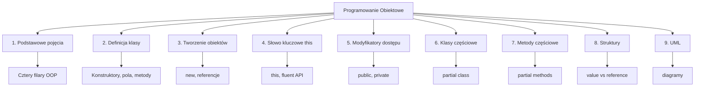

# Klasy i Obiekty w C# – Kompletny Kurs

## 📚 Strona tytułowa

**Kurs: Programowanie Obiektowe w C#**  
**Moduł 1: Klasy i Obiekty**  
**Poziom: Początkujący**  
**Język: C# 12+ / .NET 9.0**

---

## 🎯 Cel kursu

Nauczenie się fundamentów programowania obiektowego w C# z fokusem na klasy i obiekty.

---

## 📖 Struktura materiałów

### **Temat 1: Programowanie Obiektowe – Podstawowe Pojęcia**

Zrozumienie czterech filarów OOP: abstrakcja, enkapsulacja, dziedziczenie i polimorfizm.

- 📄 [README](_01_oop_fundamentals/README.md)
- 💻 [Kod źródłowy](_01_oop_fundamentals/code/)
- 📊 [Diagramy](_01_oop_fundamentals/diagrams/)
- 📝 [Zadania](_01_oop_fundamentals/tasks/)

---

### **Temat 2: Definicja Klasy w Języku C#**

Definiowanie klas, konstruktorów, pól, metod i właściwości.

- 📄 [README](_02_class_definition/README.md)
- 💻 [Kod źródłowy](_02_class_definition/code/)
- 📊 [Diagramy](_02_class_definition/diagrams/)
- 📝 [Zadania](_02_class_definition/tasks/)

---

### **Temat 3: Tworzenie i Korzystanie z Obiektów**

Operator `new`, referencje, inicjalizatory, zarządzanie pamięcią.

- 📄 [README](_03_object_usage/README.md)
- 💻 [Kod źródłowy](_03_object_usage/code/)
- 📊 [Diagramy](_03_object_usage/diagrams/)
- 📝 [Zadania](_03_object_usage/tasks/)

---

### **Temat 4: Słowo Kluczowe `this`**

Referencja do bieżącego obiektu, łańcuchowanie konstruktorów, fluent API.

- 📄 [README](_04_this_keyword/README.md)
- 💻 [Kod źródłowy](_04_this_keyword/code/)
- 📊 [Diagramy](_04_this_keyword/diagrams/)
- 📝 [Zadania](_04_this_keyword/tasks/)

---

### **Temat 5: Ukrywanie Informacji – Modyfikatory Dostępu**

`public`, `private`, `protected`, `internal` – kontrol dostępu do członków klasy.

- 📄 [README](_05_access_modifiers/README.md)
- 💻 [Kod źródłowy](_05_access_modifiers/code/)
- 📊 [Diagramy](_05_access_modifiers/diagrams/)
- 📝 [Zadania](_05_access_modifiers/tasks/)

---

### **Temat 6: Klasy Częściowe**

Rozdzielenie definicji klasy na wiele plików za pomocą `partial`.

- 📄 [README](_06_partial_classes/README.md)
- 💻 [Kod źródłowy](_06_partial_classes/code/)
- 📊 [Diagramy](_06_partial_classes/diagrams/)
- 📝 [Zadania](_06_partial_classes/tasks/)

---

### **Temat 7: Metody Częściowe**

Deklaracja metody w jednej części klasy, implementacja w drugiej.

- 📄 [README](_07_partial_methods/README.md)
- 💻 [Kod źródłowy](_07_partial_methods/code/)
- 📊 [Diagramy](_07_partial_methods/diagrams/)
- 📝 [Zadania](_07_partial_methods/tasks/)

---

### **Temat 8: Struktury – Słowo Kluczowe `struct`**

Value types vs Reference types, kiedy używać `struct` vs `class`.

- 📄 [README](_08_structs/README.md)
- 💻 [Kod źródłowy](_08_structs/code/)
- 📊 [Diagramy](_08_structs/diagrams/)
- 📝 [Zadania](_08_structs/tasks/)

---

### **Temat 9: Język UML – Diagramy**

Modelowanie systemów za pomocą diagramów UML (klasy, sekwencji, use case).

- 📄 [README](_09_uml/README.md)
- 💻 [Kod źródłowy](_09_uml/code/)
- 📊 [Diagramy](_09_uml/diagrams/)
- 📝 [Zadania](_09_uml/tasks/)

---

## 🚀 Jak zacząć

### Wymagania

- **Visual Studio Code** lub **Visual Studio 2022**
- **.NET 9.0 SDK** lub nowsze
- **Podstawowa znajomość C#**

### Kroki instalacji

```bash
# 1. Sprawdź wersję .NET
dotnet --version

# 2. Sklonuj repozytorium
git clone <URL>
cd src/01-klasy
```

### 📖 Dla każdego tematu - wejdź do folderu code/

```bash
# Przejdź do tematu 1
cd _01_oop_fundamentals/code/

# Uruchom program demonstracyjny
dotnet run

# Uruchom testy jednostkowe
dotnet test

# Przebuduj projekt (jeśli zmodyfikujesz kod)
dotnet build

# Wyczyść pliki tymczasowe
dotnet clean
```

### 💡 Workflow do nauki

1. **Przeczytaj README** tematu (`../README.md`)
2. **Spójrz na diagramy** (`../diagrams/`)
3. **Uruchom demonstrację** (`dotnet run`)
4. **Przeanalizuj kod** (`Program.cs`)
5. **Uruchom testy** (`dotnet test`)
6. **Zrób zadania** (`../tasks/README.md`)
7. **Napisz własny kod** (nowy plik lub zmień demonstrację)
8. **Testuj swoje rozwiązania**

---

## 🎯 Zadania dla studentów

Każdy temat zawiera **3-5 praktycznych zadań** przeznaczonych do samodzielnego wykonania.

### Struktura zadań

Każde zadanie zawiera:
- **Opis problemu** – Czego należy się nauczyć
- **Wymagania** – Co dokładnie zaimplementować
- **Przykład wyjścia** – Jak powinien wyglądać efekt
- **Wskazówki** – Podpowiedzi dla utknięcia
- **Rozwiązanie** – Kompletny kod z objaśnieniami

### Jak pracować z zadaniami

```bash
# 1. Wejdź do folderu zadań tematu
cd _01_oop_fundamentals/tasks/

# 2. Przeczytaj README.md
cat README.md

# 3. Stwórz nowy plik C# z własnym kodem
# Lub zmodyfikuj Program.cs w code/

# 4. Przetestuj swoją implementację
cd ../code/
dotnet run

# 5. Sprawdź swój kod z rozwiązaniem
cd ../tasks/
# (porównaj swój kod z sekcją "Rozwiązanie")
```

### 📝 Przykład zadania

**Zadanie 1: Klasa pojazdu z polimorfizmem**
- Stworzyć abstrakcyjną klasę `Vehicle`
- Implementować klasy `Car`, `Motorcycle`, `Truck`
- Demonstrować polimorfizm (każdy pojazd inaczej się uruchamia)
- Rozwiązanie znajduje się w `_01_oop_fundamentals/tasks/README.md`

### Poziomy trudności

- ⭐ **Poziom 1** – Proste, ~15 minut (Temat 1)
- ⭐⭐ **Poziom 2** – Średnie, ~30 minut (Tematy 2-5)
- ⭐⭐⭐ **Poziom 3** – Trudne, ~45-60 minut (Tematy 6-9)

---

## 📊 Mapa pojęć



---

## 🎓 Plan Nauki

| Dzień | Tematy | Czynności |
|-------|--------|-----------|
| 1 | 1-2 | Przeczytaj README, uruchom kod, zrób zadania |
| 2 | 3-4 | Przeczytaj README, uruchom kod, zrób zadania |
| 3 | 5-6 | Przeczytaj README, uruchom kod, zrób zadania |
| 4 | 7-8 | Przeczytaj README, uruchom kod, zrób zadania |
| 5 | 9 + Powtórzenie | UML, przegląd całych materiałów |

---

## 💡 Wskazówki dla uczniów

1. **Czytaj uważnie** – Każdy temat buduje na poprzednim
2. **Uruchom kod** – Praktyką się uczy
3. **Eksperymentuj** – Zmodyfikuj kod, zobacz co się zmienia
4. **Rób zadania** – To jest klucz do nauki
5. **Używaj debuggera** – Obserwuj wartości zmiennych

---

## 📝 Konwencje kodu

```csharp
// Klasy
public class MyClass { }

// Pola prywatne
private int myField;
private string _myField;

// Właściwości
public int MyProperty { get; set; }

// Metody
public void MyMethod() { }
public string GetName() { }

// Zmienne lokalne
int localVariable;
string myString;
```

---

## 🔗 Powiązane koncepty

- **Interfejsy** (IEnumerable, IDisposable)
- **Dziedziczenie** (base, virtual, override)
- **Polimorfizm** (abstract, virtual)
- **SOLID Principles**
- **Design Patterns**

---

## 📚 Dodatkowe zasoby

### Microsoft Dokumentacja
- [C# Programming Guide](https://learn.microsoft.com/en-us/dotnet/csharp/programming-guide/)
- [C# Language Reference](https://learn.microsoft.com/en-us/dotnet/csharp/language-reference/)
- [.NET Documentation](https://learn.microsoft.com/en-us/dotnet/)

### Książki
- **"C# Player's Guide"** – RB Whitaker
- **"Head First Design Patterns"** – Freeman & Robson
- **"Clean Code"** – Robert C. Martin

### Online
- [Refactoring.Guru - OOP](https://refactoring.guru/design-patterns/oop)
- [Code Maze - C# Tutorials](https://code-maze.com/csharp-tutorials/)
- [C# Station - Tutorials](https://www.csharp-station.com/)

---

## 🎯 Checklist – Czy jesteś gotów do dalszej nauki?

- [ ] Rozumiesz cztery filary OOP
- [ ] Umiesz tworzyć klasy z konstruktorami i metodami
- [ ] Znasz różnicę między klasami a strukturami
- [ ] Rozumiesz referencje i wartości
- [ ] Umiesz używać modyfikatorów dostępu
- [ ] Wiesz kiedy używać `private`, `public`, `protected`
- [ ] Rozumiesz `this` i fluent API
- [ ] Umiesz czytać diagramy UML

Jeśli odpowiedziałeś "TAK" na wszystkie pytania – **Gratuluję! Jesteś gotów do kolejnego modułu OOP!**

---

## 📞 Pomoc i wsparcie

- **GitHub Issues**: Zgłaszaj problemy w tym repozytorium
- **Stack Overflow**: Tag `csharp` dla pytań
- **Microsoft Learn**: Oficjalne dokumenty i samouczki

---

## 📝 Historia zmian

| Wersja | Data | Zmiana |
|--------|------|--------|
| 1.0 | 2024-08-30 | Inicjalna wersja |

---

## 👨‍🏫 Notatki dla nauczycieli

### Czas na lekcję

| Temat | Czas |
|-------|------|
| Każdy temat | 45-90 minut |
| Czytanie materiału | 15-20 minut |
| Demonstracja kodu | 15-20 minut |
| Zadania dla studentów | 15-30 minut |

### Sugerowane ćwiczenia dodatkowe

1. **Refactoring** - Weź stary kod i przepisz go OOP
2. **Mini-projekt** - Stwórz system (sklep, biblioteka, gra)
3. **Peer review** - Studenci recenzują kod siebie
4. **Live coding** - Razem naprawiajcie błędy

---

## 📄 Licencja

Te materiały są dostępne na licencji **CC BY-NC-SA 4.0**

---

**Powodzenia w nauce! 🚀**

