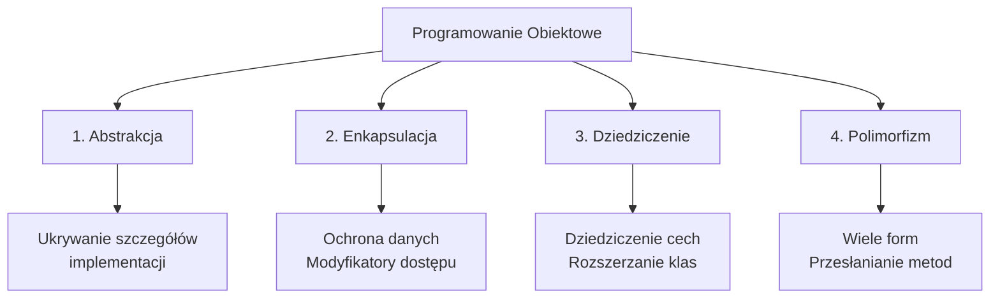
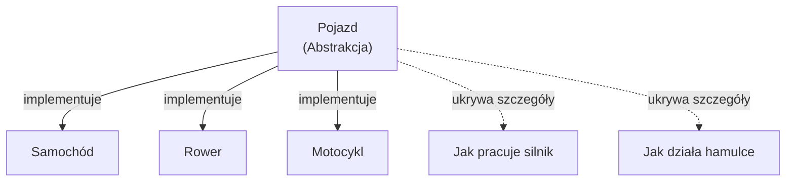
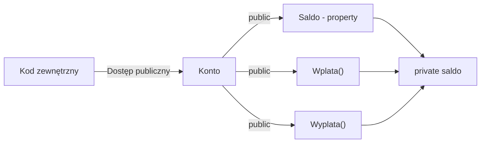
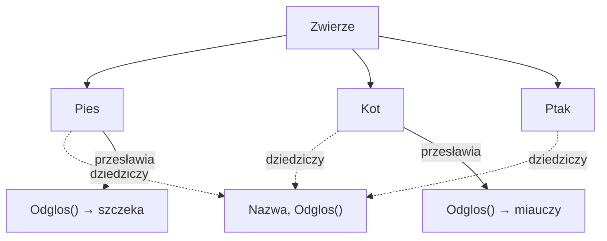
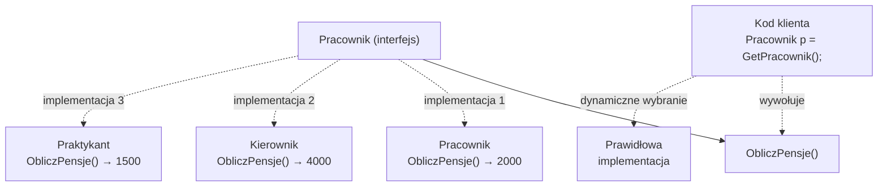
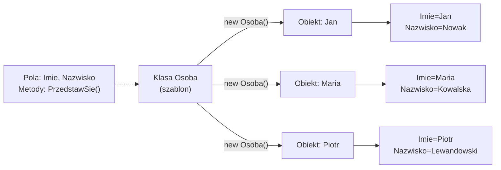
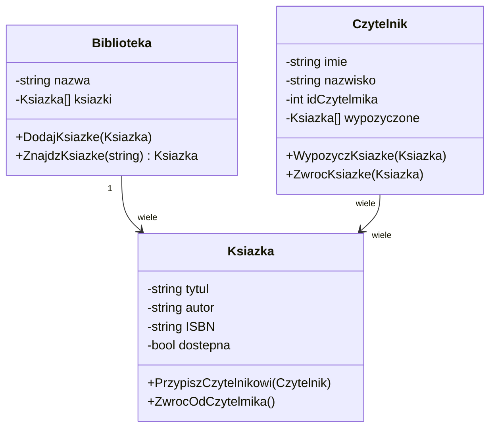
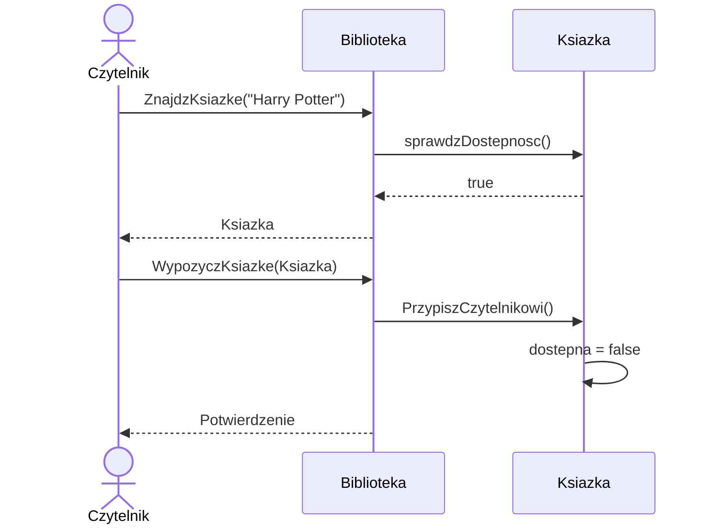

# Programowanie Obiektowe – Podstawowe Pojęcia

## 🎯 Cel rozdziału

Zrozumienie fundamentalnych koncepcji programowania obiektowego (OOP) oraz poznanie czterech filarów, na których opiera się ten paradygmat programowania.

## 📚 Spis treści

1. [Czym jest programowanie obiektowe?](#czym-jest-programowanie-obiektowe)
2. [Cztery filary OOP](#cztery-filary-oop)
   - [Abstrakcja](#abstrakcja)
   - [Enkapsulacja](#enkapsulacja)
   - [Dziedziczenie](#dziedziczenie)
   - [Polimorfizm](#polimorfizm)
3. [Klasa vs Obiekt](#klasa-vs-obiekt)
4. [Diagram UML](#diagram-uml)
5. [Praktyczne przykłady](#praktyczne-przykłady)
6. [Podsumowanie](#podsumowanie)

---

## 🚀 Jak pracować z tym tematem

### Uruchomienie demonstracji

```bash
# Wejdź do folderu code
cd code/

# Uruchom program demonstracyjny (pokazuje wszystkie 4 filary OOP)
dotnet run

# Uruchom testy jednostkowe
dotnet test
```

### Struktura pliku Program.cs

```
📄 Program.cs
├── Animal (abstrakcyjna klasa bazowa)
├── Dog, Cat (implementacja abstrakcji)
├── BankAccount (enkapsulacja)
├── Employee hierarchy (dziedziczenie & polimorfizm)
├── Main() - demonstracja
└── OOPFundamentalsTests - 8 testów xUnit
```

### Zadania dla studentów

Po przeczytaniu tego materiału przejdź do [📝 ZADANIA](tasks/README.md) gdzie znajdziesz:

1. **Zadanie 1** ⭐ – Klasa pojazdu z polimorfizmem (15 min)
   - Tworzymy `Vehicle` (abstrakcyjna) → `Car`, `Motorcycle`, `Truck`
   - Implementujemy polimorfizm (każdy pojazd inaczej się uruchamia)
   - **Rozwiązanie**: pełny kod w `tasks/README.md`

2. **Zadanie 2** ⭐ – System biblioteki z enkapsulacją (30 min)
   - Klasa `Book` z prywatnymi polami
   - Klasa `Library` zarządzająca kolekcją
   - Walidacja operacji pożyczania

3. **Zadanie 3** ⭐⭐ – System payroll z polimorfizmem (45 min)
   - Różne typy pracowników = różne pensje
   - `FullTimeEmployee`, `PartTimeEmployee`, `Manager`, `Contractor`
   - System wyliczający całkowitą pensję

**Każde zadanie zawiera wskazówki i pełne rozwiązanie!**

---

## Czym jest programowanie obiektowe?

**Programowanie obiektowe (OOP)** to paradygmat programowania, w którym program jest organizowany wokół **obiektów** i **klas** zamiast funkcji i logiki proceduralnej. Każdy obiekt reprezentuje encję z rzeczywistego świata, zawierającą **dane** (pola) i **zachowania** (metody).

### Historia i motywacja

Koncepcja OOP powstała w latach 60. XX wieku z potrzeby lepszego organizowania rosnących projektów informatycznych. Językami pionierami były Simula (1967) i Smalltalk (1980). Dzisiaj OOP jest jednym z dominujących paradygmatów, używanym w Java, C#, C++, Python i wielu innych językach.

### Korzyści OOP

- **Modularność**: Kod jest podzielony na niezależne obiekty
- **Ponowne wykorzystanie**: Klasy mogą być dziedziczone i rozszerzane
- **Łatwość konserwacji**: Zmiany w jednym obiekcie nie wpływają na inne
- **Skalowość**: Łatwiej zarządzać dużymi projektami
- **Intuicyjność**: Obiekty modelują rzeczywistość

---

## Cztery filary OOP



### 1. Abstrakcja

**Abstrakcja** to proces wyodrębniania istotnych cech obiektu i ukrywania nieważnych szczegółów implementacji.

#### Przykład koncepcyjny

Gdy jeździmy samochodem, nie musimy wiedzieć, jak dokładnie pracuje silnik. Interfejs (kierownica, pedały) abstrakcyjnie pokazuje nam, co możemy zrobić. To jest abstrakcja.

#### W kodzie C#

```csharp
// Abstrakcja: Definiujemy, co powinien robić samochód
// bez szczegółów implementacji
public abstract class Pojazd
{
    public abstract void Uruchom();
    public abstract void Zatrzymaj();
}

// Konkretna implementacja
public class Samochod : Pojazd
{
    public override void Uruchom()
    {
        // Szczegółowa implementacja rozruchu
        Console.WriteLine("Silnik pojazdu rusza...");
    }
    
    public override void Zatrzymaj()
    {
        Console.WriteLine("Hamulce pracują...");
    }
}
```

#### Diagram abstrakcji



### 2. Enkapsulacja

**Enkapsulacja** to bundlowanie danych i metod w jedną jednostkę (klasę) oraz ograniczenie dostępu do tych danych za pośrednictwem modyfikatorów dostępu.

#### Cel enkapsulacji

- **Ochrona danych**: Dane wewnętrzne nie mogą być zmieniane w dowolny sposób
- **Spójność**: Zawsze zachowujemy prawidłowy stan obiektu
- **Zmienność**: Możemy zmienić implementację bez wpływu na kod zewnętrzny

#### Przykład

```csharp
public class Konto
{
    private decimal saldo;  // Dane chronione
    
    // Dostęp do danych tylko przez publiczne metody
    public decimal Saldo
    {
        get { return saldo; }
        private set { saldo = value; }  // Tylko klasa może modyfikować
    }
    
    public void Wplata(decimal kwota)
    {
        if (kwota > 0)
        {
            saldo += kwota;
        }
    }
    
    public bool Wyplata(decimal kwota)
    {
        if (kwota > 0 && kwota <= saldo)
        {
            saldo -= kwota;
            return true;
        }
        return false;
    }
}
```

#### Diagram enkapsulacji



### 3. Dziedziczenie

**Dziedziczenie** pozwala klasie dziedziczyć pola i metody z innej klasy, tworzą hierarchię klas.

#### Koncepcja

```
Zwierzę (klasa bazowa)
├── Pies (klasa pochodna)
├── Kot (klasa pochodna)
└── Ptak (klasa pochodna)
```

#### Przykład

```csharp
// Klasa bazowa
public class Zwierze
{
    public string Nazwa { get; set; }
    
    public virtual void Odglos()
    {
        Console.WriteLine($"{Nazwa} wydaje dźwięk");
    }
}

// Klasy pochodne
public class Pies : Zwierze
{
    public override void Odglos()
    {
        Console.WriteLine($"{Nazwa} szczeka: Hau! Hau!");
    }
}

public class Kot : Zwierze
{
    public override void Odglos()
    {
        Console.WriteLine($"{Nazwa} miauczy: Miau!");
    }
}
```

#### Diagram dziedziczenia



### 4. Polimorfizm

**Polimorfizm** (wielopostaciowość) umożliwia obiektom różnych typów reagowanie na ten sam komunikat w inny sposób.

#### Rodzaje polimorfizmu

1. **Polimorfizm kompilacji** (static) - przeładowanie metod
2. **Polimorfizm czasu wykonania** (dynamic) - przesłanianie metod

#### Przykład

```csharp
// Polimorfizm kompilacji - przeładowanie
public class Kalkulator
{
    public int Dodaj(int a, int b) => a + b;
    public double Dodaj(double a, double b) => a + b;
    public decimal Dodaj(decimal a, decimal b) => a + b;
}

// Polimorfizm czasu wykonania - przesłanianie
public class Pracownik
{
    public virtual decimal ObliczPensje()
    {
        return 2000;
    }
}

public class Kierownik : Pracownik
{
    public override decimal ObliczPensje()
    {
        return 3500 + Bonus();  // Kierownik ma premię
    }
    
    private decimal Bonus() => 500;
}

// Użycie
Pracownik p1 = new Pracownik();
Pracownik p2 = new Kierownik();

Console.WriteLine(p1.ObliczPensje());  // 2000
Console.WriteLine(p2.ObliczPensje());  // 4000 (ten sam typ, inne zachowanie!)
```

#### Diagram polimorfizmu



---

## Klasa vs Obiekt

### Definicje

| Aspekt | Klasa | Obiekt |
|--------|-------|--------|
| **Czym jest?** | Plan/Szablon | Instancja klasy |
| **Istnienie** | Istnieje w kodzie | Istnieje w pamięci |
| **Liczba** | Jedna klasa | Wiele obiektów z jednej klasy |
| **Tworzenie** | Definiujemy raz | Tworzymy za pomocą `new` |
| **Pamięć** | Nie zajmuje pamięci | Zajmuje pamięć RAM |

### Analogia ze świata rzeczywistego

```
Klasa:   Projekt budynku (plan na papierze)
↓
Obiekty: Domy zbudowane według tego planu
         (każdy dom to osobny obiekt w real świecie)
```

### Diagram



---

## Diagram UML

### Diagram klas - Struktura systemu biblioteki



### Diagram sekwencji - Wypożyczenie książki



---

## Praktyczne przykłady

### Przykład 1: System zarządzania studentami

```csharp
// Abstrakcja - Osoba (klasa abstrakcyjna)
public abstract class Osoba
{
    public string Imie { get; set; }
    public string Nazwisko { get; set; }
    
    public abstract void Przedstaw();
}

// Konkretna klasa
public class Student : Osoba
{
    public string NumerIndeksu { get; set; }
    public decimal Srednia { get; set; }
    
    public override void Przedstaw()
    {
        Console.WriteLine($"Jestem studentem: {Imie} {Nazwisko}, " +
                         $"indeks: {NumerIndeksu}");
    }
    
    public void IdzNaZajecia()
    {
        Console.WriteLine($"{Imie} idzie na zajęcia");
    }
}

// Użycie
Student student = new Student
{
    Imie = "Krzysztof",
    Nazwisko = "Lewandowski",
    NumerIndeksu = "2024001",
    Srednia = 4.5m
};

student.Przedstaw();      // Polymorphism
student.IdzNaZajecia();    // Student-specific method
```

### Przykład 2: Implementacja czterech filarów

```csharp
// 1. ABSTRAKCJA - ukrywamy szczegóły
public abstract class Pojazd
{
    public abstract void Uruchom();
}

// 2. ENKAPSULACJA - dane chronione, dostęp przez metody
public class Samochod : Pojazd
{
    private int przebieg = 0;  // Dane chronione
    
    public int Przebieg => przebieg;  // Tylko do odczytu
    
    public override void Uruchom()
    {
        Console.WriteLine("Samochód się uruchamia");
    }
    
    public void Jedz(int km)
    {
        if (km > 0)
            przebieg += km;
    }
}

// 3. DZIEDZICZENIE
public class SamochodSportowy : Samochod
{
    public override void Uruchom()
    {
        Console.WriteLine("Silnik V8 rura! VROOOOM!");
    }
}

// 4. POLIMORFIZM
var pojazdy = new Pojazd[]
{
    new Samochod(),
    new SamochodSportowy()
};

foreach (var pojazd in pojazdy)
{
    pojazd.Uruchom();  // Każdy zachowuje się inaczej!
}
```

---

## Podsumowanie

### Kluczowe koncepcje

✅ **Abstrakcja** - ukrywanie szczegółów  
✅ **Enkapsulacja** - ochrona danych  
✅ **Dziedziczenie** - hierarchia klas  
✅ **Polimorfizm** - wielopostaciowość  

### Korzyści OOP

- Kod bardziej zorganizowany i czytelny
- Łatwiej naprawiać i rozszerzać
- Lepiej modeluje rzeczywistość
- Zwiększa ponowne wykorzystanie kodu

### Następny krok

W kolejnym rozdziale nauczysz się, jak **definiować klasy w C#** i tworzyć obiekty.

---

## 📖 Literatura i referencje

1. **Microsoft Docs** - Object-Oriented Programming  
   https://learn.microsoft.com/en-us/dotnet/csharp/fundamentals/object-oriented/

2. **C# Player** - OOP Fundamentals  
   https://csharpplayersguide.com/

3. **Refactoring.Guru** - OOP Principles  
   https://refactoring.guru/design-patterns/oop

4. **Head First Design Patterns** - Freeman & Robson (2004)

---

## 💡 Notatki dla wykładowcy

- Poświęć czas na wyjaśnienie różnicy między klasą a obiektem
- Użyj analogii ze świata rzeczywistego
- Zwróć uwagę na znaczenie czterech filarów
- Przygotuj interaktywne demo zmian zachowania obiektów

