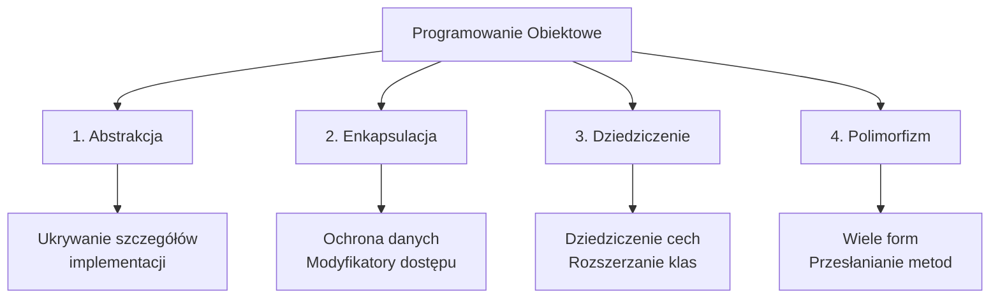
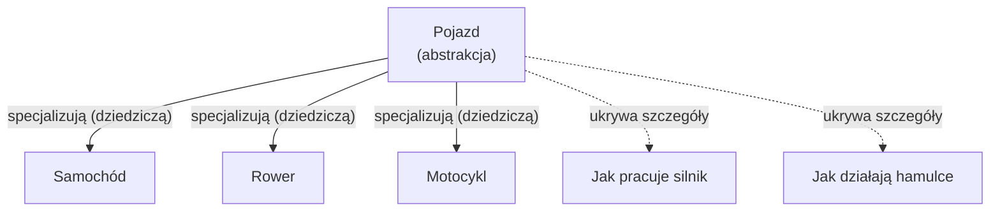
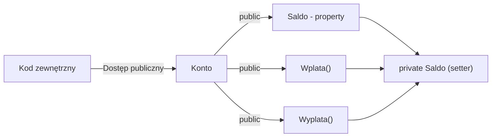
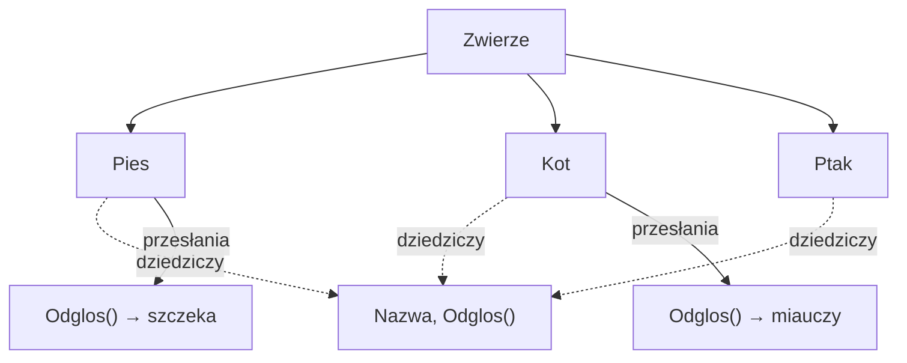
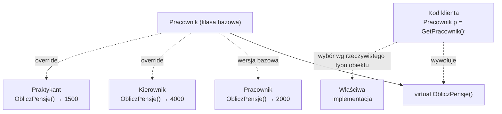
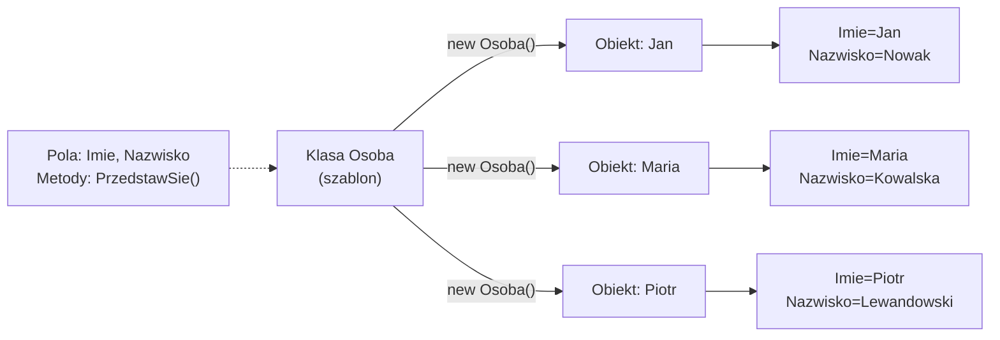
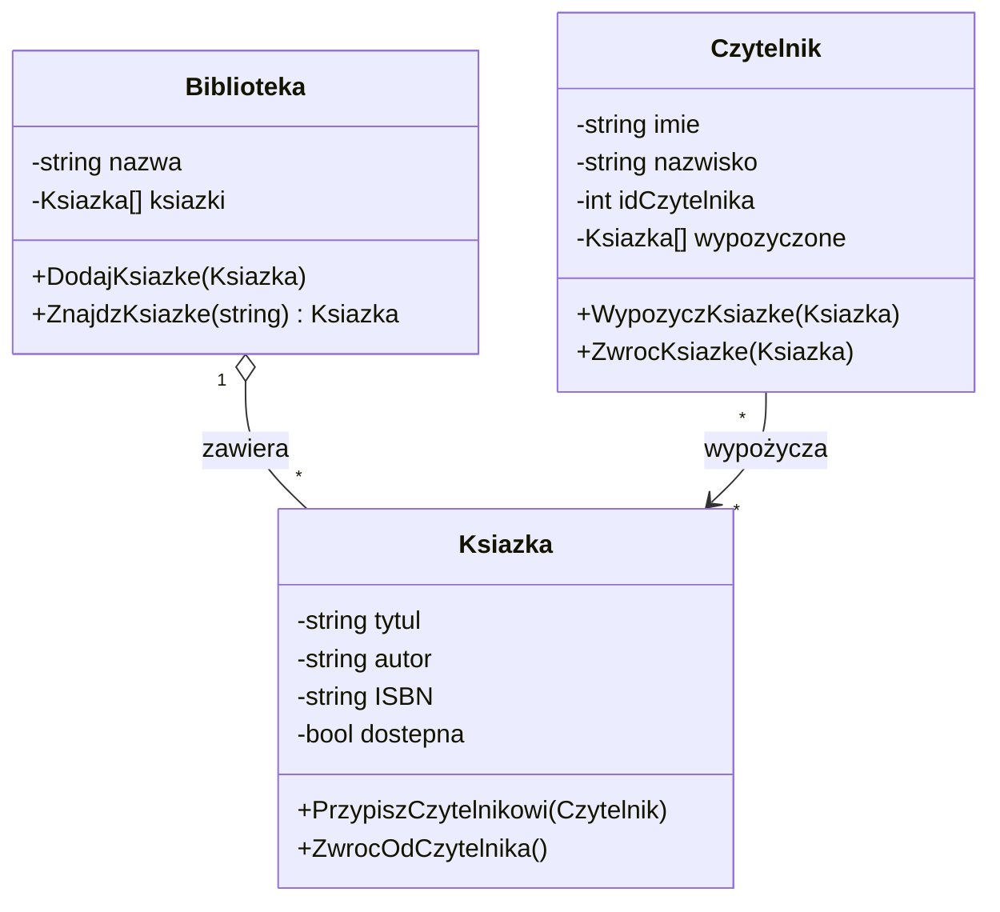
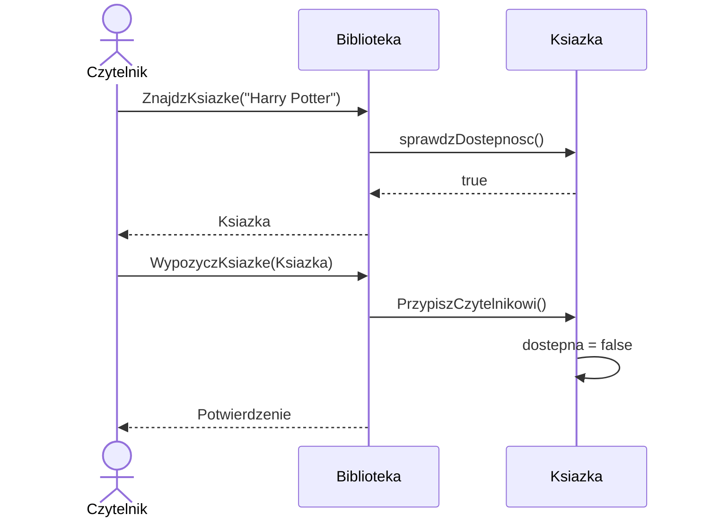

# Programowanie Obiektowe – Podstawowe Pojęcia

## 🎯 Cel rozdziału

Zrozumienie fundamentalnych koncepcji programowania obiektowego (OOP) oraz poznanie czterech filarów, na których opiera się ten paradygmat programowania.

## 📚 Spis treści

1. [Czym jest programowanie obiektowe?](#czym-jest-programowanie-obiektowe)
2. [Cztery filary OOP](#cztery-filary-oop)
   - [Abstrakcja](#abstrakcja)
   - [Enkapsulacja](#enkapsulacja)
   - [Dziedziczenie](#dziedziczenie)
   - [Polimorfizm](#polimorfizm)
3. [Klasa vs Obiekt](#klasa-vs-obiekt)
4. [Diagram UML](#diagram-uml)
5. [Praktyczne przykłady](#praktyczne-przykłady)
6. [Podsumowanie](#podsumowanie)

---

## 🚀 Jak pracować z tym tematem

### Uruchomienie demonstracji

```bash
# Wejdź do folderu code
cd code/

# Uruchom program demonstracyjny (pokazuje wszystkie 4 filary OOP)
dotnet run

# Uruchom testy jednostkowe
dotnet test
```

### Struktura pliku Program.cs

```
📄 Program.cs
├── Animal (abstrakcyjna klasa bazowa)
├── Dog, Cat (implementacja abstrakcji)
├── BankAccount (enkapsulacja)
├── Employee hierarchy (dziedziczenie & polimorfizm)
├── Main() - demonstracja
└── OOPFundamentalsTests - 11 testów xUnit
```

### Zadania dla studentów

Po przeczytaniu tego materiału przejdź do [📝 ZADANIA](tasks/README.md) gdzie znajdziesz:

1. **Zadanie 1** ⭐ – Klasa pojazdu z polimorfizmem (15 min)
   - Tworzymy `Vehicle` (abstrakcyjna) → `Car`, `Motorcycle`, `Truck`
   - Implementujemy polimorfizm (każdy pojazd inaczej się uruchamia)
   - **Rozwiązanie**: pełny kod w `tasks/README.md`

2. **Zadanie 2** ⭐ – System biblioteki z enkapsulacją (30 min)
   - Klasa `Book` z prywatnymi polami
   - Klasa `Library` zarządzająca kolekcją
   - Walidacja operacji pożyczania

3. **Zadanie 3** ⭐⭐ – System payroll z polimorfizmem (45 min)
   - Różne typy pracowników = różne pensje
   - `FullTimeEmployee`, `PartTimeEmployee`, `Manager`, `Contractor`
   - System wyliczający całkowitą pensję

**Każde zadanie zawiera wskazówki i pełne rozwiązanie!**

---

## Czym jest programowanie obiektowe?

**Programowanie obiektowe (OOP)** to paradygmat programowania, w którym program jest organizowany wokół **obiektów** i **klas** zamiast funkcji i logiki proceduralnej. Każdy obiekt reprezentuje encję z rzeczywistego świata, zawierającą **dane** (pola) i **zachowania** (metody).

### Historia i motywacja

Koncepcja OOP powstała w latach 60. XX wieku z potrzeby lepszego organizowania rosnących projektów informatycznych. Językami pionierami były Simula 67 (1967) i Smalltalk (rozwijany od lat 70., wydany publicznie jako Smalltalk-80). Dzisiaj OOP jest jednym z dominujących paradygmatów, używanym w Java, C#, C++, Python i wielu innych językach.

### Korzyści OOP

- **Modularność**: Kod jest podzielony na niezależne obiekty
- **Ponowne wykorzystanie**: Klasy mogą być dziedziczone i rozszerzane (często lepiej przez kompozycję niż dziedziczenie)
- **Łatwość konserwacji**: Dzięki enkapsulacji zmiana wewnętrznej implementacji obiektu ma ograniczony wpływ na resztę programu
- **Skalowalność**: Łatwiej zarządzać dużymi projektami
- **Intuicyjność**: Obiekty modelują pojęcia z dziedziny problemu

> OOP nie jest jedynym paradygmatem – nowoczesny C# łączy go z elementami programowania funkcyjnego (LINQ, lambdy,
> `record`). Dobry inżynier dobiera narzędzia do problemu.

---

## Cztery filary OOP


```mermaid
graph TB
    OOP["Programowanie Obiektowe"] --> A["1. Abstrakcja"]
    OOP --> E["2. Enkapsulacja"]
    OOP --> D["3. Dziedziczenie"]
    OOP --> P["4. Polimorfizm"]
    
    A --> A1["Ukrywanie szczegółów<br/>implementacji"]
    E --> E1["Ochrona danych<br/>Modyfikatory dostępu"]
    D --> D1["Dziedziczenie cech<br/>Rozszerzanie klas"]
    P --> P1["Wiele form<br/>Przesłanianie metod"]
```

### 1. Abstrakcja

**Abstrakcja** to proces wyodrębniania istotnych cech obiektu i ukrywania nieistotnych szczegółów implementacji. Modelujemy tylko to, co jest potrzebne w danym kontekście (klient banku ma numer konta i saldo, ale nie interesuje nas jego wzrost).

#### Przykład koncepcyjny

Gdy jeździmy samochodem, nie musimy wiedzieć, jak dokładnie pracuje silnik. Interfejs (kierownica, pedały) pokazuje nam, co możemy zrobić. To jest abstrakcja.

#### W kodzie C#

```csharp
// Abstrakcja: definiujemy, CO powinien robić pojazd,
// bez szczegółów JAK to robi
public abstract class Pojazd
{
    public abstract void Uruchom();
    public abstract void Zatrzymaj();
}

// Konkretna implementacja
public class Samochod : Pojazd
{
    public override void Uruchom()
    {
        // Szczegółowa implementacja rozruchu
        Console.WriteLine("Silnik pojazdu rusza...");
    }
    
    public override void Zatrzymaj()
    {
        Console.WriteLine("Hamulce pracują...");
    }
}
```

> Abstrakcję w C# wyrażamy klasami abstrakcyjnymi (`abstract class`) oraz **interfejsami** (`interface`).
> Interfejsy poznasz w module o dziedziczeniu i abstrakcji.

#### Diagram abstrakcji


```mermaid
graph TD
    A["Pojazd<br/>(abstrakcja)"] -->|"specjalizują (dziedziczą)"| B["Samochód"]
    A -->|"specjalizują (dziedziczą)"| C["Rower"]
    A -->|"specjalizują (dziedziczą)"| D["Motocykl"]
    
    A -.->|"ukrywa szczegóły"| E["Jak pracuje silnik"]
    A -.->|"ukrywa szczegóły"| F["Jak działają hamulce"]
```

### 2. Enkapsulacja

**Enkapsulacja** to zgrupowanie danych i metod w jednej jednostce (klasie) oraz ograniczenie dostępu do wewnętrznego stanu za pomocą modyfikatorów dostępu. Obiekt sam pilnuje, by jego stan był zawsze poprawny.

#### Cel enkapsulacji

- **Ochrona danych**: Dane wewnętrzne nie mogą być zmieniane w dowolny sposób
- **Spójność**: Obiekt zawsze pozostaje w poprawnym stanie (niezmienniki klasy)
- **Elastyczność**: Możemy zmienić implementację bez wpływu na kod zewnętrzny

#### Przykład

```csharp
public class Konto
{
    // Publiczny odczyt, ale zapis tylko wewnątrz klasy
    public decimal Saldo { get; private set; }
    
    public void Wplata(decimal kwota)
    {
        if (kwota > 0)
        {
            Saldo += kwota;
        }
    }
    
    public bool Wyplata(decimal kwota)
    {
        if (kwota > 0 && kwota <= Saldo)
        {
            Saldo -= kwota;
            return true;
        }
        return false;
    }
}
```

#### Diagram enkapsulacji


```mermaid
graph LR
    A["Kod zewnętrzny"] -->|"Dostęp publiczny"| B["Konto"]
    B -->|"public"| C["Saldo - property"]
    B -->|"public"| D["Wplata()"]
    B -->|"public"| E["Wyplata()"]
    C --> F["private Saldo (setter)"]
    D --> F
    E --> F
```

### 3. Dziedziczenie

**Dziedziczenie** pozwala klasie przejąć pola i metody z innej klasy, tworząc hierarchię klas. Klasa pochodna jest *rodzajem* klasy bazowej (relacja „jest”, *is-a*): Pies **jest** Zwierzęciem.

#### Koncepcja

```
Zwierzę (klasa bazowa)
├── Pies (klasa pochodna)
├── Kot (klasa pochodna)
└── Ptak (klasa pochodna)
```

#### Przykład

```csharp
// Klasa bazowa
public class Zwierze
{
    public string Nazwa { get; set; }
    
    public virtual void Odglos()
    {
        Console.WriteLine($"{Nazwa} wydaje dźwięk");
    }
}

// Klasy pochodne
public class Pies : Zwierze
{
    public override void Odglos()
    {
        Console.WriteLine($"{Nazwa} szczeka: Hau! Hau!");
    }
}

public class Kot : Zwierze
{
    public override void Odglos()
    {
        Console.WriteLine($"{Nazwa} miauczy: Miau!");
    }
}
```

#### Diagram dziedziczenia


```mermaid
graph TD
    A["Zwierze"]
    A --> B["Pies"]
    A --> C["Kot"]
    A --> D["Ptak"]
    
    B -.->|"dziedziczy"| E["Nazwa, Odglos()"]
    C -.->|"dziedziczy"| E
    D -.->|"dziedziczy"| E
    
    B -->|"przesłania"| F["Odglos() → szczeka"]
    C -->|"przesłania"| G["Odglos() → miauczy"]
```

> C# pozwala na dziedziczenie po **jednej** klasie bazowej (ale po wielu interfejsach). Dziedziczenia nie nadużywamy:
> jeśli relacja „jest” nie zachodzi, lepiej użyć kompozycji („ma”, *has-a*).

### 4. Polimorfizm

**Polimorfizm** (wielopostaciowość) umożliwia obiektom różnych typów reagowanie na ten sam komunikat w inny sposób.

#### Rodzaje polimorfizmu

1. **Polimorfizm kompilacji** (statyczny, *ad hoc*) - przeciążanie metod: wybór wersji metody następuje w czasie kompilacji na podstawie typów argumentów
2. **Polimorfizm czasu wykonania** (dynamiczny) - przesłanianie metod `virtual`/`override`: wybór implementacji zależy od **rzeczywistego typu obiektu** w czasie działania programu

W kontekście czterech filarów OOP „polimorfizm” oznacza zwykle ten drugi rodzaj.

#### Przykład

```csharp
// Polimorfizm kompilacji - przeładowanie
public class Kalkulator
{
    public int Dodaj(int a, int b) => a + b;
    public double Dodaj(double a, double b) => a + b;
    public decimal Dodaj(decimal a, decimal b) => a + b;
}

// Polimorfizm czasu wykonania - przesłanianie
public class Pracownik
{
    public virtual decimal ObliczPensje()
    {
        return 2000;
    }
}

public class Kierownik : Pracownik
{
    public override decimal ObliczPensje()
    {
        return 3500 + Bonus();  // Kierownik ma premię
    }
    
    private decimal Bonus() => 500;
}

// Użycie
Pracownik p1 = new Pracownik();
Pracownik p2 = new Kierownik();   // zmienna typu bazowego, obiekt typu pochodnego

Console.WriteLine(p1.ObliczPensje());  // 2000
Console.WriteLine(p2.ObliczPensje());  // 4000 (ten sam typ zmiennej, inne zachowanie!)
```

#### Diagram polimorfizmu


```mermaid
graph TB
    A["Pracownik (klasa bazowa)"]
    A --> B["virtual ObliczPensje()"]
    
    A -.->|"wersja bazowa"| C["Pracownik<br/>ObliczPensje() → 2000"]
    A -.->|"override"| D["Kierownik<br/>ObliczPensje() → 4000"]
    A -.->|"override"| E["Praktykant<br/>ObliczPensje() → 1500"]
    
    F["Kod klienta<br/>Pracownik p = GetPracownik();"] -.->|"wywołuje"| B
    F -.->|"wybór wg rzeczywistego typu obiektu"| G["Właściwa<br/>implementacja"]
```

---

## Klasa vs Obiekt

### Definicje

| Aspekt | Klasa | Obiekt |
|--------|-------|--------|
| **Czym jest?** | Plan/Szablon (typ) | Instancja klasy |
| **Istnienie** | Definicja w kodzie; metadane typu ładowane raz w czasie działania | Istnieje w pamięci podczas działania programu |
| **Liczba** | Jedna klasa | Wiele obiektów z jednej klasy |
| **Tworzenie** | Definiujemy raz | Tworzymy za pomocą `new` |
| **Pamięć** | Nie zajmuje jej *każdy obiekt osobno* (kod metod jest wspólny) | Każdy obiekt zajmuje pamięć na własne pola |

### Analogia ze świata rzeczywistego

```
Klasa:   Projekt budynku (plan na papierze)
↓
Obiekty: Domy zbudowane według tego planu
         (każdy dom to osobny obiekt w real świecie)
```

### Diagram


```mermaid
graph LR
    A["Klasa Osoba<br/>(szablon)"] -->|"new Osoba()"| B["Obiekt: Jan"]
    A -->|"new Osoba()"| C["Obiekt: Maria"]
    A -->|"new Osoba()"| D["Obiekt: Piotr"]
    
    E["Pola: Imie, Nazwisko<br/>Metody: PrzedstawSie()"] -.-> A
    
    B --> B1["Imie=Jan<br/>Nazwisko=Nowak"]
    C --> C1["Imie=Maria<br/>Nazwisko=Kowalska"]
    D --> D1["Imie=Piotr<br/>Nazwisko=Lewandowski"]
```

---

## Diagram UML

### Diagram klas - Struktura systemu biblioteki


```mermaid
classDiagram
    class Biblioteka {
        -string nazwa
        -Ksiazka[] ksiazki
        +DodajKsiazke(Ksiazka)
        +ZnajdzKsiazke(string) Ksiazka
    }
    
    class Ksiazka {
        -string tytul
        -string autor
        -string ISBN
        -bool dostepna
        +PrzypiszCzytelnikowi(Czytelnik)
        +ZwrocOdCzytelnika()
    }
    
    class Czytelnik {
        -string imie
        -string nazwisko
        -int idCzytelnika
        -Ksiazka[] wypozyczone
        +WypozyczKsiazke(Ksiazka)
        +ZwrocKsiazke(Ksiazka)
    }
    
    Biblioteka "1" o-- "*" Ksiazka : zawiera
    Czytelnik "*" --> "*" Ksiazka : wypożycza
```

### Diagram sekwencji - Wypożyczenie książki


```mermaid
sequenceDiagram
    actor Czytelnik
    participant Biblioteka
    participant Ksiazka
    
    Czytelnik->>Biblioteka: ZnajdzKsiazke("Harry Potter")
    Biblioteka->>Ksiazka: sprawdzDostepnosc()
    Ksiazka-->>Biblioteka: true
    Biblioteka-->>Czytelnik: Ksiazka
    
    Czytelnik->>Biblioteka: WypozyczKsiazke(Ksiazka)
    Biblioteka->>Ksiazka: PrzypiszCzytelnikowi()
    Ksiazka->>Ksiazka: dostepna = false
    Biblioteka-->>Czytelnik: Potwierdzenie
```

---

## Praktyczne przykłady

### Przykład 1: System zarządzania studentami

```csharp
// Abstrakcja - Osoba (klasa abstrakcyjna)
public abstract class Osoba
{
    public string Imie { get; set; } = "";
    public string Nazwisko { get; set; } = "";
    
    public abstract void Przedstaw();
}

// Konkretna klasa
public class Student : Osoba
{
    public string NumerIndeksu { get; set; } = "";
    public decimal Srednia { get; set; }
    
    public override void Przedstaw()
    {
        Console.WriteLine($"Jestem studentem: {Imie} {Nazwisko}, " +
                         $"indeks: {NumerIndeksu}");
    }
    
    public void IdzNaZajecia()
    {
        Console.WriteLine($"{Imie} idzie na zajęcia");
    }
}

// Użycie
Student student = new Student
{
    Imie = "Krzysztof",
    Nazwisko = "Lewandowski",
    NumerIndeksu = "2024001",
    Srednia = 4.5m
};

student.Przedstaw();       // wywołanie przesłoniętej metody abstrakcyjnej
student.IdzNaZajecia();    // metoda specyficzna dla Studenta
```

### Przykład 2: Implementacja czterech filarów

```csharp
// 1. ABSTRAKCJA - ukrywamy szczegóły
public abstract class Pojazd
{
    public abstract void Uruchom();
}

// 2. ENKAPSULACJA - dane chronione, dostęp przez metody
public class Samochod : Pojazd
{
    private int przebieg = 0;  // Dane chronione
    
    public int Przebieg => przebieg;  // Tylko do odczytu
    
    public override void Uruchom()
    {
        Console.WriteLine("Samochód się uruchamia");
    }
    
    public void Jedz(int km)
    {
        if (km > 0)
            przebieg += km;
    }
}

// 3. DZIEDZICZENIE
public class SamochodSportowy : Samochod
{
    public override void Uruchom()
    {
        Console.WriteLine("Silnik V8 ryczy! VROOOOM!");
    }
}

// 4. POLIMORFIZM
var pojazdy = new Pojazd[]
{
    new Samochod(),
    new SamochodSportowy()
};

foreach (var pojazd in pojazdy)
{
    pojazd.Uruchom();  // Każdy zachowuje się inaczej!
}
```

---

## Podsumowanie

### Kluczowe koncepcje

✅ **Abstrakcja** - ukrywanie szczegółów  
✅ **Enkapsulacja** - ochrona danych  
✅ **Dziedziczenie** - hierarchia klas  
✅ **Polimorfizm** - wielopostaciowość  

### Korzyści OOP

- Kod bardziej zorganizowany i czytelny
- Łatwiej naprawiać i rozszerzać
- Lepiej modeluje rzeczywistość
- Zwiększa ponowne wykorzystanie kodu

### Następny krok

W kolejnym rozdziale nauczysz się, jak **definiować klasy w C#** i tworzyć obiekty.

---

## 📖 Literatura i referencje

1. **Microsoft Docs** - Object-Oriented Programming  
   https://learn.microsoft.com/en-us/dotnet/csharp/fundamentals/object-oriented/

2. **C# Player** - OOP Fundamentals  
   https://csharpplayersguide.com/

3. **Refactoring.Guru** - OOP Principles  
   https://refactoring.guru/design-patterns/oop

4. **Head First Design Patterns** - Freeman & Robson (2004)

---

## 💡 Notatki dla wykładowcy

- Poświęć czas na wyjaśnienie różnicy między klasą a obiektem
- Użyj analogii ze świata rzeczywistego
- Zwróć uwagę na znaczenie czterech filarów
- Przygotuj interaktywne demo zmian zachowania obiektów

