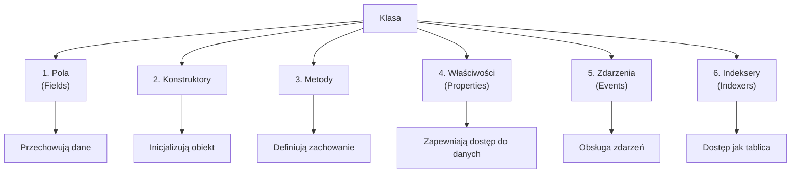
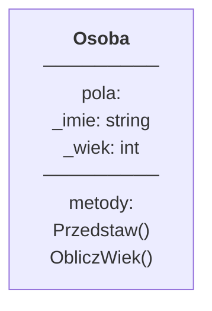
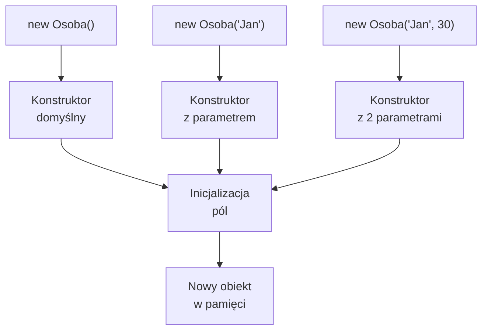

## Enkapsulacja w praktyce

### Pełny przykład klasy

```csharp
public class Pracownik
{
    // ========== POLA PRYWATNE ==========
    private string firstName;
    private string lastName;
    private decimal salary;
    private DateTime dateOfBirth;
    private static int employeeCount = 0;
    
    // ========== KONSTRUKTORY ==========
    
    /// <summary>
    /// Konstruktor domyślny
    /// </summary>
    public Pracownik()
    {
        firstName = "Nieznane";
        lastName = "Nieznane";
        salary = 0;
        employeeCount++;
    }
    
    /// <summary>
    /// Konstruktor z parametrami
    /// </summary>
    public Pracownik(string firstName, string lastName, DateTime dateOfBirth)
    {
        this.firstName = firstName;
        this.lastName = lastName;
        this.dateOfBirth = dateOfBirth;
        this.salary = 0;
        employeeCount++;
    }
    
    // ========== WŁAŚCIWOŚCI ==========
    
    public string FirstName
    {
        get { return firstName; }
        set { firstName = value ?? ""; }
    }
    
    public string LastName
    {
        get { return lastName; }
        set { lastName = value ?? ""; }
    }
    
    public string FullName => $"{firstName} {lastName}";
    
    public decimal Salary
    {
        get { return salary; }
        set
        {
            if (value >= 0)
                salary = value;
            else
                throw new ArgumentException("Pensja nie może być ujemna");
        }
    }
    
    public int Age => DateTime.Now.Year - dateOfBirth.Year;
    
    public static int EmployeeCount => employeeCount;
    
    // ========== METODY ==========
    
    public void GiveRaise(decimal amount)
    {
        if (amount > 0)
            salary += amount;
    }
    
    public void PrintInfo()
    {
        Console.WriteLine($"Pracownik: {FullName}");
        Console.WriteLine($"Wiek: {Age}");
        Console.WriteLine($"Pensja: {Salary:C}");
    }
    
    public override string ToString()
    {
        return $"{FullName} ({Salary:C})";
    }
}
```

### Użycie

```csharp
var emp1 = new Pracownik("Jan", "Kowalski", new DateTime(1990, 5, 15));
emp1.Salary = 3000;
emp1.PrintInfo();

emp1.GiveRaise(500);
Console.WriteLine($"Nowa pensja: {emp1.Salary:C}");

Console.WriteLine($"Liczba pracowników: {Pracownik.EmployeeCount}");
```

---

## Podsumowanie

### Kluczowe pojęcia

✅ **Klasa** - szablon dla obiektów  
✅ **Pola** - przechowują dane  
✅ **Konstruktory** - inicjalizują obiekty  
✅ **Metody** - definiują zachowanie  
✅ **Właściwości** - kontrolowany dostęp do danych  
✅ **Enkapsulacja** - ochrona danych  

### Konwencje C#

- PascalCase dla klas, metod, właściwości
- camelCase dla parametrów i zmiennych lokalnych
- `_` lub `private` dla pól prywatnych
- Properties do publicznego dostępu do danych

### Następny krok

W kolejnym rozdziale nauczysz się **tworzyć obiekty i z nich korzystać**.

---

## 📖 Literatura i referencje

1. **Microsoft Docs** - Classes and Structs  
   https://learn.microsoft.com/en-us/dotnet/csharp/fundamentals/types/classes

2. **Microsoft Docs** - Properties  
   https://learn.microsoft.com/en-us/dotnet/csharp/properties

3. **C# Player** - Classes  
   https://csharpplayersguide.com/

4. **Code Maze** - C# Properties  
   https://code-maze.com/csharp-properties/

---

## 💡 Notatki dla wykładowcy

- Podkreśl różnicę między polem a właściwością
- Pokaż, dlaczego enkapsulacja jest ważna (niemożliwość ustawienia wiek=-10)
- Omów konwencje nazewnictwa C#
- Przygotuj interaktywne demo z modyfikowaniem pól

# Definicja Klasy w Języku C#

## 🎯 Cel rozdziału

Nauczenie się definiowania klas w C#, zapoznanie się z polami, metodami, właściwościami, konstruktorami i ich znaczeniem w programowaniu obiektowym.

## 📚 Spis treści

1. [Syntaktyka klasy](#syntaktyka-klasy)
2. [Komponenty klasy](#komponenty-klasy)
3. [Konstruktory](#konstruktory)
4. [Pola i zmienne](#pola-i-zmienne)
5. [Metody](#metody)
6. [Właściwości (Properties)](#właściwości-properties)
7. [Enkapsulacja w praktyce](#enkapsulacja-w-praktyce)
8. [Podsumowanie](#podsumowanie)

---

## 🚀 Jak pracować z tym tematem

### Uruchomienie kodu

```bash
cd code/

# Uruchom demonstrację
dotnet run

# Uruchom testy
dotnet test
```

### Zadania dla studentów

[📝 ZADANIA](tasks/README.md) – 3 praktyczne ćwiczenia:
- Tworzenie klasy `Person` z konstruktorami
- System `BankAccount` z enkapsulacją
- Klasa `Product` ze statycznymi polami

---

## Syntaktyka klasy

Klasa w C# definiuje się za pomocą słowa kluczowego `class`.

### Podstawowa struktura

```csharp
public class NazwaKlasy
{
    // Pola (data members)
    private int wiek;
    
    // Konstruktor
    public NazwaKlasy()
    {
        wiek = 0;
    }
    
    // Metoda
    public void Zmien(int nowyWiek)
    {
        wiek = nowyWiek;
    }
}
```

### Konwencje nazewnictwa

| Element | Konwencja | Przykład |
|---------|-----------|----------|
| Klasa | PascalCase | `Person`, `BankAccount` |
| Pole prywatne | camelCase z `_` | `_age`, `_firstName` |
| Własność publiczna | PascalCase | `Age`, `FirstName` |
| Metoda | PascalCase | `GetAge()`, `CalculateSalary()` |
| Parametr metody | camelCase | `age`, `firstName` |
| Zmienna lokalna | camelCase | `totalSalary`, `isActive` |

---

## Komponenty klasy

Klasa C# może zawierać następujące komponenty:



### Diagram klasy - Anatomia



---

## Konstruktory

**Konstruktor** to specjalna metoda wywoływana przy tworzeniu obiektu. Służy do inicjalizacji pól klasy.

### Rodzaje konstruktorów

#### 1. Konstruktor domyślny (bezparametrowy)

```csharp
public class Osoba
{
    private string imie;
    private int wiek;
    
    // Konstruktor domyślny
    public Osoba()
    {
        imie = "Nieznane";
        wiek = 0;
    }
}

// Użycie
var osoba = new Osoba();  // Bezboolowe wartości
```

#### 2. Konstruktor z parametrami

```csharp
public class Osoba
{
    private string imie;
    private int wiek;
    
    // Konstruktor z parametrami
    public Osoba(string imie, int wiek)
    {
        this.imie = imie;
        this.wiek = wiek;
    }
}

// Użycie
var osoba = new Osoba("Jan", 30);
```

#### 3. Przeciążanie konstruktorów

```csharp
public class Osoba
{
    private string imie;
    private int wiek;
    
    // Konstruktor domyślny
    public Osoba()
    {
        imie = "Nieznane";
        wiek = 0;
    }
    
    // Konstruktor z jednym parametrem
    public Osoba(string imie) : this(imie, 0)
    {
    }
    
    // Konstruktor z dwoma parametrami
    public Osoba(string imie, int wiek)
    {
        this.imie = imie;
        this.wiek = wiek;
    }
}

// Użycie - każdy konstruktor działa
var osoba1 = new Osoba();
var osoba2 = new Osoba("Marta");
var osoba3 = new Osoba("Piotr", 25);
```

#### 4. Inicjalizator obiektu (object initializer)

```csharp
public class Osoba
{
    public string Imie { get; set; }
    public int Wiek { get; set; }
    public string Miasto { get; set; }
}

// Użycie inicjalizatora
var osoba = new Osoba 
{ 
    Imie = "Anna",
    Wiek = 28,
    Miasto = "Warszawa"
};
```

### Diagram konstruktorów



---

## Pola i zmienne

### Pola (Fields)

Pola przechowują dane dla każdego obiektu.

```csharp
public class Student
{
    // Pola instancji - każdy obiekt ma własną kopię
    private string imie;
    private double srednia;
    
    // Pole statyczne - wspólne dla całej klasy
    private static int liczbaStudentow = 0;
}
```

### Rodzaje pól

| Rodzaj | Zakres | Żywotność |
|--------|--------|-----------|
| **Pole instancji** | Każdy obiekt osobno | Życie obiektu |
| **Pole statyczne** | Cała klasa (wszyscy) | Program |
| **Pole const** | Stała wartość | Program |

### Pola statyczne

```csharp
public class Student
{
    private static int liczbaStudentow = 0;  // Wspólne dla wszystkich
    private string imie;
    
    public Student(string imie)
    {
        this.imie = imie;
        liczbaStudentow++;  // Każdy nowy student
    }
    
    public static int LiczbaStudentow => liczbaStudentow;
}

// Użycie
var s1 = new Student("Jan");
var s2 = new Student("Maria");
Console.WriteLine(Student.LiczbaStudentow);  // 2
```

---

## Metody

**Metoda** to funkcja zdefiniowana wewnątrz klasy, która wykonuje określone działania.

### Syntaktyka metody

```csharp
[modyfikator dostępu] [static] [return type] NazwaMetody(parametry)
{
    // Ciało metody
    return wartość;  // Jeśli return type != void
}
```

### Rodzaje metod

#### 1. Metoda zwracająca wartość

```csharp
public class Kalkulator
{
    public int Dodaj(int a, int b)
    {
        return a + b;
    }
}

var calc = new Kalkulator();
int wynik = calc.Dodaj(5, 3);  // 8
```

#### 2. Metoda bez wartości zwracanej (void)

```csharp
public class Osoba
{
    private string imie;
    
    public void Przedstaw()
    {
        Console.WriteLine($"Jestem {imie}");
    }
}

var osoba = new Osoba("Jan");
osoba.Przedstaw();
```

#### 3. Metoda statyczna

```csharp
public class Matematyka
{
    public static int Abs(int liczba)
    {
        return liczba < 0 ? -liczba : liczba;
    }
}

// Wywoływanie na klasie, nie na obiekcie
int wynik = Matematyka.Abs(-5);  // 5
```

#### 4. Metoda z parametrami opcjonalnymi

```csharp
public class Osoba
{
    public void Przywitaj(string imie = "Gość", string pozdrowienie = "Cześć")
    {
        Console.WriteLine($"{pozdrowienie}, {imie}!");
    }
}

var osoba = new Osoba();
osoba.Przywitaj();                        // Cześć, Gość!
osoba.Przywitaj("Marta");                 // Cześć, Marta!
osoba.Przywitaj("Piotr", "Witaj");        // Witaj, Piotr!
```

#### 5. Metoda z parametrami nazwanym (named parameters)

```csharp
osoba.Przywitaj(pozdrowienie: "Hej", imie: "Sławek");  // Hej, Sławek!
```

---

## Właściwości (Properties)

**Właściwość** to członek klasy, który zapewnia kontrolowany dostęp do pól prywatnych.

### Czemu właściwości zamiast pól publicznych?

```csharp
// ❌ ZŁEGO - pole publiczne
public class Osoba
{
    public int Wiek;  // Można ustawić na -100!
}

var osoba = new Osoba();
osoba.Wiek = -100;  // Błąd logiczny


// ✅ DOBRY - właściwość
public class Osoba
{
    private int wiek;
    
    public int Wiek
    {
        get { return wiek; }
        set 
        { 
            if (value >= 0)
                wiek = value;
        }
    }
}

var osoba = new Osoba();
osoba.Wiek = -100;  // Bez efektu
osoba.Wiek = 25;    // OK
```

### Rodzaje właściwości

#### 1. Właściwość auto-implementowana

```csharp
public class Osoba
{
    public string Imie { get; set; }
    public int Wiek { get; set; }
}

// C# automatycznie tworzy pola prywatne
```

#### 2. Właściwość read-only (tylko do odczytu)

```csharp
public class Osoba
{
    private int wiek;
    
    public int Wiek => wiek;  // Wyrażenie lambda
    
    public void ObchodziUrodziny()
    {
        wiek++;
    }
}
```

#### 3. Właściwość write-only (tylko do zapisu)

```csharp
public class Konto
{
    private string pin;
    
    public string Pin
    {
        set { pin = value; }
    }
}
```

#### 4. Właściwość z walidacją

```csharp
public class Osoba
{
    private string email;
    
    public string Email
    {
        get { return email; }
        set
        {
            if (value.Contains("@"))
                email = value;
            else
                throw new ArgumentException("Email musi zawierać @");
        }
    }
}
```

#### 5. Właściwość z różnymi poziomami dostępu

```csharp
public class Osoba
{
    private int _pin;
    
    public string Imie { get; set; }
    
    // Publiczny getter, prywatny setter
    public int Pin
    {
        get { return _pin; }
        private set { _pin = value; }
    }
}
```

### Diagram właściwości

```mermaid
graph LR
    A["Pole prywatne<br/>_wiek: int"] --> B["Właściwość<br/>Wiek"]
    B --> C["getter"]
    B --> D["setter<br/>z walidacją"]
    C --> E["Kod publiczny"]
    D --> E
