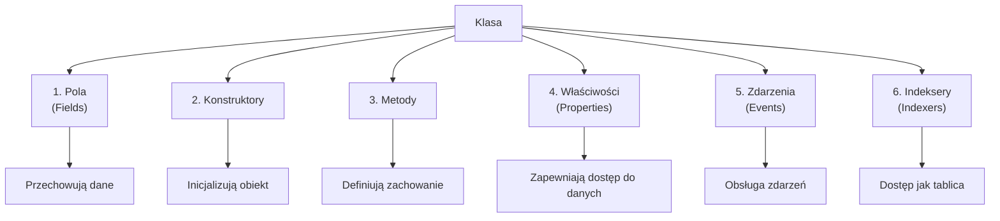
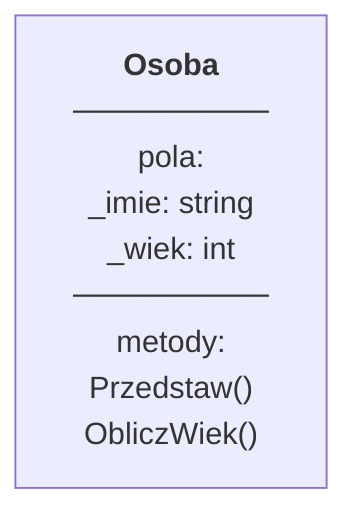
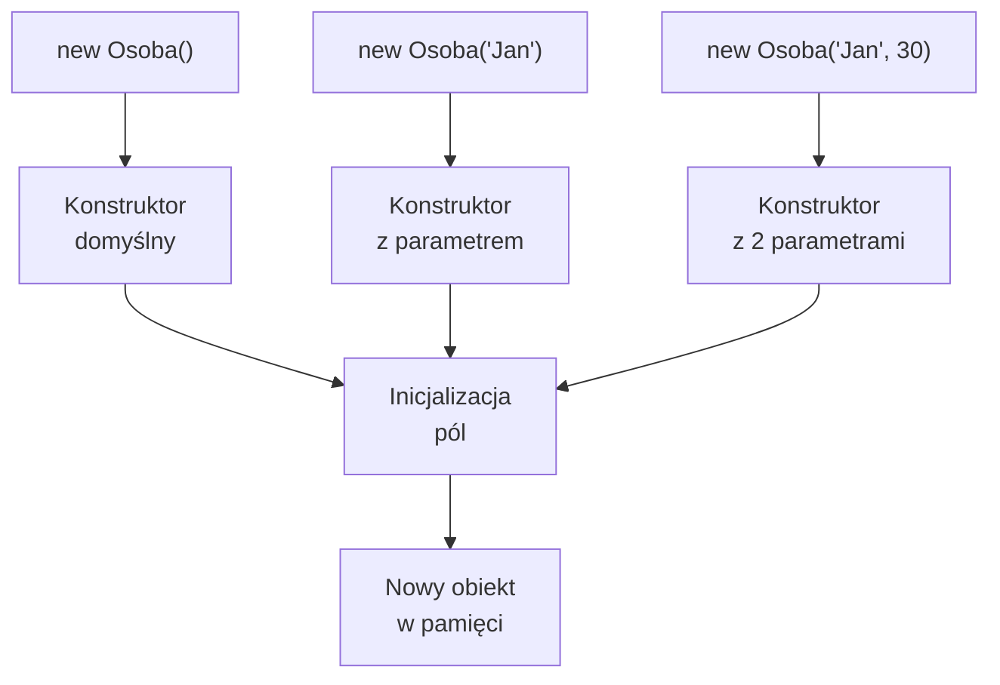
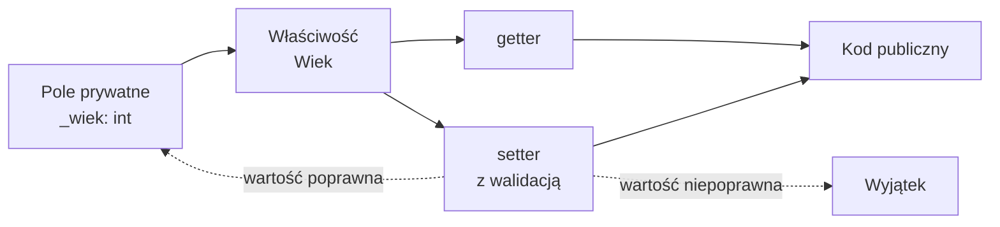

# Definicja Klasy w Języku C#

## 🎯 Cel rozdziału

Nauczenie się definiowania klas w C#, zapoznanie się z polami, metodami, właściwościami, konstruktorami i ich znaczeniem w programowaniu obiektowym.

## 📚 Spis treści

1. [Syntaktyka klasy](#syntaktyka-klasy)
2. [Komponenty klasy](#komponenty-klasy)
3. [Konstruktory](#konstruktory)
4. [Pola i zmienne](#pola-i-zmienne)
5. [Metody](#metody)
6. [Właściwości (Properties)](#właściwości-properties)
7. [Enkapsulacja w praktyce](#enkapsulacja-w-praktyce)
8. [Podsumowanie](#podsumowanie)

---

## 🚀 Jak pracować z tym tematem

### Uruchomienie kodu

```bash
cd code/

# Uruchom demonstrację
dotnet run

# Uruchom testy
dotnet test
```

### Zadania dla studentów

[📝 ZADANIA](tasks/README.md) – 3 praktyczne ćwiczenia:
- Klasa `Rectangle` z walidacją właściwości
- Klasa `NumericSequence` (ciąg arytmetyczny) z właściwościami obliczanymi
- Klasa `Employee` z walidacją i statycznym licznikiem identyfikatorów

---

## Syntaktyka klasy

Klasa w C# definiuje się za pomocą słowa kluczowego `class`.

### Podstawowa struktura

```csharp
public class NazwaKlasy
{
    // Pola (data members)
    private int wiek;
    
    // Konstruktor
    public NazwaKlasy()
    {
        wiek = 0;
    }
    
    // Metoda
    public void Zmien(int nowyWiek)
    {
        wiek = nowyWiek;
    }
}
```

### Konwencje nazewnictwa

| Element | Konwencja | Przykład |
|---------|-----------|----------|
| Klasa | PascalCase | `Person`, `BankAccount` |
| Pole prywatne | `_camelCase` (zalecenie Microsoft) | `_age`, `_firstName` |
| Właściwość publiczna | PascalCase | `Age`, `FirstName` |
| Metoda | PascalCase | `GetAge()`, `CalculateSalary()` |
| Parametr metody | camelCase | `age`, `firstName` |
| Zmienna lokalna | camelCase | `totalSalary`, `isActive` |

> **Uwaga:** w przykładach tego modułu pola prywatne są często zapisywane bez prefiksu `_` (np. `firstName`)
> i rozróżniane od parametrów przez `this.firstName` – to druga, również spotykana konwencja.
> Ważne, aby w jednym projekcie stosować jedną z nich konsekwentnie. Identyfikatory w kodzie piszemy
> po angielsku; polskie nazwy (`Osoba`, `Pracownik`) pojawiają się tylko w przykładach dydaktycznych w README.

---

## Komponenty klasy

Klasa C# może zawierać następujące komponenty:


```mermaid
graph TB
    Klasa["Klasa"] --> Pola["1. Pola<br/>(Fields)"]
    Klasa --> Konstruktory["2. Konstruktory"]
    Klasa --> Metody["3. Metody"]
    Klasa --> Wlasciwosci["4. Właściwości<br/>(Properties)"]
    Klasa --> Zdarzenia["5. Zdarzenia<br/>(Events)"]
    Klasa --> Indeksery["6. Indeksery<br/>(Indexers)"]
    
    Pola --> P1["Przechowują dane"]
    Konstruktory --> P2["Inicjalizują obiekt"]
    Metody --> P3["Definiują zachowanie"]
    Wlasciwosci --> P4["Zapewniają dostęp do danych"]
    Zdarzenia --> P5["Obsługa zdarzeń"]
    Indeksery --> P6["Dostęp jak tablica"]
```

### Diagram klasy - Anatomia


```mermaid
graph LR
    A["<b>Osoba</b><br/>─────────<br/>pola:<br/>_imie: string<br/>_wiek: int<br/>─────────<br/>metody:<br/>Przedstaw()<br/>ObliczWiek()"]
```

---

## Konstruktory

**Konstruktor** to specjalna metoda wywoływana przy tworzeniu obiektu. Służy do inicjalizacji pól klasy.

### Rodzaje konstruktorów

#### 1. Konstruktor domyślny (bezparametrowy)

```csharp
public class Osoba
{
    private string imie;
    private int wiek;
    
    // Konstruktor domyślny
    public Osoba()
    {
        imie = "Nieznane";
        wiek = 0;
    }
}

// Użycie
var osoba = new Osoba();  // imie = "Nieznane", wiek = 0
```

> **Domyślny konstruktor kompilatora:** jeśli klasa nie definiuje *żadnego* konstruktora, kompilator dodaje
> niejawny konstruktor bezparametrowy. Gdy tylko dopiszesz własny konstruktor (z parametrami lub bez),
> niejawny konstruktor **znika** – `new Osoba()` przestaje się kompilować, jeśli sam go nie zdefiniujesz.

#### 2. Konstruktor z parametrami

```csharp
public class Osoba
{
    private string imie;
    private int wiek;
    
    // Konstruktor z parametrami
    public Osoba(string imie, int wiek)
    {
        this.imie = imie;
        this.wiek = wiek;
    }
}

// Użycie
var osoba = new Osoba("Jan", 30);
```

#### 3. Przeciążanie konstruktorów

```csharp
public class Osoba
{
    private string imie;
    private int wiek;
    
    // Konstruktor domyślny
    public Osoba()
    {
        imie = "Nieznane";
        wiek = 0;
    }
    
    // Konstruktor z jednym parametrem
    public Osoba(string imie) : this(imie, 0)
    {
    }
    
    // Konstruktor z dwoma parametrami
    public Osoba(string imie, int wiek)
    {
        this.imie = imie;
        this.wiek = wiek;
    }
}

// Użycie - każdy konstruktor działa
var osoba1 = new Osoba();
var osoba2 = new Osoba("Marta");
var osoba3 = new Osoba("Piotr", 25);
```

#### 4. Inicjalizator obiektu (object initializer)

```csharp
public class Osoba
{
    public string Imie { get; set; }
    public int Wiek { get; set; }
    public string Miasto { get; set; }
}

// Użycie inicjalizatora
var osoba = new Osoba 
{ 
    Imie = "Anna",
    Wiek = 28,
    Miasto = "Warszawa"
};
```

### Diagram konstruktorów


```mermaid
graph TD
    A["new Osoba()"] --> B["Konstruktor<br/>domyślny"]
    C["new Osoba('Jan')"] --> D["Konstruktor<br/>z parametrem"]
    E["new Osoba('Jan', 30)"] --> F["Konstruktor<br/>z 2 parametrami"]
    
    B --> G["Inicjalizacja<br/>pól"]
    D --> G
    F --> G
    G --> H["Nowy obiekt<br/>w pamięci"]
```

---

## Pola i zmienne

### Pola (Fields)

Pola przechowują dane dla każdego obiektu.

```csharp
public class Student
{
    // Pola instancji - każdy obiekt ma własną kopię
    private string imie;
    private double srednia;
    
    // Pole statyczne - wspólne dla całej klasy
    private static int liczbaStudentow = 0;
}
```

### Rodzaje pól

| Rodzaj | Zakres | Żywotność |
|--------|--------|-----------|
| **Pole instancji** | Każdy obiekt osobno | Życie obiektu |
| **Pole statyczne** | Cała klasa (wszyscy) | Program |
| **Pole const** | Stała wartość | Program |

### Pola statyczne

```csharp
public class Student
{
    private static int liczbaStudentow = 0;  // Wspólne dla wszystkich
    private string imie;
    
    public Student(string imie)
    {
        this.imie = imie;
        liczbaStudentow++;  // Każdy nowy student
    }
    
    public static int LiczbaStudentow => liczbaStudentow;
}

// Użycie
var s1 = new Student("Jan");
var s2 = new Student("Maria");
Console.WriteLine(Student.LiczbaStudentow);  // 2
```

---

## Metody

**Metoda** to funkcja zdefiniowana wewnątrz klasy, która wykonuje określone działania.

### Syntaktyka metody

```csharp
[modyfikator dostępu] [static] [return type] NazwaMetody(parametry)
{
    // Ciało metody
    return wartość;  // Jeśli return type != void
}
```

### Rodzaje metod

#### 1. Metoda zwracająca wartość

```csharp
public class Kalkulator
{
    public int Dodaj(int a, int b)
    {
        return a + b;
    }
}

var calc = new Kalkulator();
int wynik = calc.Dodaj(5, 3);  // 8
```

#### 2. Metoda bez wartości zwracanej (void)

```csharp
public class Osoba
{
    private string imie;
    
    public void Przedstaw()
    {
        Console.WriteLine($"Jestem {imie}");
    }
}

var osoba = new Osoba("Jan");
osoba.Przedstaw();
```

#### 3. Metoda statyczna

```csharp
public class Matematyka
{
    public static int Abs(int liczba)
    {
        return liczba < 0 ? -liczba : liczba;
    }
}

// Wywoływanie na klasie, nie na obiekcie
int wynik = Matematyka.Abs(-5);  // 5
```

#### 4. Metoda z parametrami opcjonalnymi

```csharp
public class Osoba
{
    public void Przywitaj(string imie = "Gość", string pozdrowienie = "Cześć")
    {
        Console.WriteLine($"{pozdrowienie}, {imie}!");
    }
}

var osoba = new Osoba();
osoba.Przywitaj();                        // Cześć, Gość!
osoba.Przywitaj("Marta");                 // Cześć, Marta!
osoba.Przywitaj("Piotr", "Witaj");        // Witaj, Piotr!
```

#### 5. Metoda z parametrami nazwanym (named parameters)

```csharp
osoba.Przywitaj(pozdrowienie: "Hej", imie: "Sławek");  // Hej, Sławek!
```

---

## Właściwości (Properties)

**Właściwość** to członek klasy, który zapewnia kontrolowany dostęp do pól prywatnych.

### Czemu właściwości zamiast pól publicznych?

```csharp
// ❌ ŹLE - pole publiczne
public class Osoba
{
    public int Wiek;  // Można ustawić na -100!
}

var osoba = new Osoba();
osoba.Wiek = -100;  // Błąd logiczny - nic tego nie blokuje


// ✅ DOBRZE - właściwość z walidacją
public class Osoba
{
    private int wiek;
    
    public int Wiek
    {
        get { return wiek; }
        set 
        { 
            if (value < 0)
                throw new ArgumentOutOfRangeException(nameof(value), "Wiek nie może być ujemny");
            wiek = value;
        }
    }
}

var osoba = new Osoba();
osoba.Wiek = 25;    // OK
osoba.Wiek = -100;  // ArgumentOutOfRangeException
```

> Niepoprawną wartość można też po cichu zignorować lub zastąpić domyślną (tak robi część przykładów
> w `Program.cs`), ale rzucenie wyjątku jest bezpieczniejsze: błąd jest widoczny natychmiast, a nie
> dopiero jako dziwne zachowanie programu później.

### Rodzaje właściwości

#### 1. Właściwość auto-implementowana

```csharp
public class Osoba
{
    public string Imie { get; set; }
    public int Wiek { get; set; }
}

// C# automatycznie tworzy ukryte pole prywatne (backing field)
```

Ponieważ włączone są typy referencyjne dopuszczające null (`<Nullable>enable</Nullable>`), właściwości typu
`string` muszą dostać wartość przed zakończeniem konstruktora – inaczej kompilator ostrzeże (CS8618).
Najprościej: `public string Imie { get; set; } = "";` albo `public required string Imie { get; set; }` (C# 11).

#### 2. Właściwość read-only (tylko do odczytu)

```csharp
public class Osoba
{
    private int wiek;
    
    public int Wiek => wiek;  // expression-bodied member (składnia =>)
    
    public void ObchodziUrodziny()
    {
        wiek++;
    }
}
```

#### 3. Właściwość write-only (tylko do zapisu)

```csharp
public class Konto
{
    private string pin;
    
    public string Pin
    {
        set { pin = value; }
    }
}
```

Właściwości tylko do zapisu są rzadkie i uważane za zły styl (trudno je odczytać, np. w debugerze).
Lepiej udostępnić metodę, np. `ZmienPin(string staryPin, string nowyPin)`, jak w `BankAccount` z `Program.cs`.

#### 4. Właściwość z walidacją

```csharp
public class Osoba
{
    private string email = "";
    
    public string Email
    {
        get { return email; }
        set
        {
            if (string.IsNullOrWhiteSpace(value) || !value.Contains('@'))
                throw new ArgumentException("Email musi zawierać @", nameof(value));
            email = value;
        }
    }
}
```

#### 5. Właściwość z różnymi poziomami dostępu

```csharp
public class Konto
{
    // Publiczny getter, prywatny setter: czytać może każdy, zmieniać tylko sama klasa
    public decimal Saldo { get; private set; }

    public void Wplata(decimal kwota)
    {
        if (kwota <= 0)
            throw new ArgumentOutOfRangeException(nameof(kwota));
        Saldo += kwota;
    }
}
```

### Diagram właściwości


```mermaid
graph LR
    A["Pole prywatne<br/>_wiek: int"] --> B["Właściwość<br/>Wiek"]
    B --> C["getter"]
    B --> D["setter<br/>z walidacją"]
    C --> E["Kod publiczny"]
    D --> E
    D -.->|"wartość poprawna"| A
    D -.->|"wartość niepoprawna"| F["Wyjątek"]
```

#### 6. Właściwości `init` i `required` (C# 9 / C# 11)

```csharp
public class Osoba
{
    // init: wartość można ustawić tylko w konstruktorze lub inicjalizatorze obiektu,
    // potem obiekt jest niezmienny
    public required string Imie { get; init; }
    public required string Nazwisko { get; init; }
    public int Wiek { get; init; }
}

var osoba = new Osoba { Imie = "Anna", Nazwisko = "Nowak", Wiek = 28 };
// osoba.Imie = "Ewa";   // BŁĄD KOMPILACJI - init pozwala ustawić wartość tylko przy tworzeniu
// new Osoba { Wiek = 3 } // BŁĄD KOMPILACJI - brak wymaganych właściwości (required)
```

`required` wymusza na kompilatorze ustawienie właściwości przy tworzeniu obiektu, a `init` zapobiega
późniejszej zmianie. Szerzej: moduł *03-wlasciwosci*.

---

## Enkapsulacja w praktyce

### Pełny przykład klasy

```csharp
public class Pracownik
{
    // ========== POLA ==========
    private string _firstName = "";
    private string _lastName = "";
    private decimal _salary;
    private readonly DateTime _dateOfBirth;        // readonly: ustawiane tylko w konstruktorze
    private static int _employeeCount;             // wspólne dla wszystkich obiektów

    // ========== KONSTRUKTORY ==========

    // Jeden konstruktor "główny"; pozostałe delegują do niego przez this(...)
    public Pracownik(string firstName, string lastName, DateTime dateOfBirth)
    {
        FirstName = firstName;     // przez właściwość, więc walidacja działa również tutaj
        LastName = lastName;
        _dateOfBirth = dateOfBirth;
        _employeeCount++;
    }

    public Pracownik() : this("Nieznane", "Nieznane", DateTime.Today) { }

    // ========== WŁAŚCIWOŚCI ==========

    public string FirstName
    {
        get => _firstName;
        set => _firstName = string.IsNullOrWhiteSpace(value)
            ? throw new ArgumentException("Imię nie może być puste", nameof(value))
            : value;
    }

    public string LastName
    {
        get => _lastName;
        set => _lastName = string.IsNullOrWhiteSpace(value)
            ? throw new ArgumentException("Nazwisko nie może być puste", nameof(value))
            : value;
    }

    public string FullName => $"{_firstName} {_lastName}";

    public decimal Salary
    {
        get => _salary;
        set
        {
            if (value < 0)
                throw new ArgumentOutOfRangeException(nameof(value), "Pensja nie może być ujemna");
            _salary = value;
        }
    }

    // Wiek liczymy z uwzględnieniem tego, czy urodziny już były w tym roku
    public int Age
    {
        get
        {
            var today = DateTime.Today;
            int age = today.Year - _dateOfBirth.Year;
            if (_dateOfBirth.Date > today.AddYears(-age)) age--;
            return age;
        }
    }

    public static int EmployeeCount => _employeeCount;

    // ========== METODY ==========

    public void GiveRaise(decimal amount)
    {
        if (amount <= 0)
            throw new ArgumentOutOfRangeException(nameof(amount), "Podwyżka musi być dodatnia");
        _salary += amount;
    }

    public override string ToString() => $"{FullName}, {Age} lat ({Salary:C})";
}
```

> **Dlaczego nie `DateTime.Now.Year - dateOfBirth.Year`?** Taki wzór pomija to, czy urodziny już
> były w bieżącym roku, więc przez część roku zwraca wiek o 1 za duży. Zawsze sprawdzaj wzory
> na przypadkach granicznych.

### Użycie

```csharp
var emp1 = new Pracownik("Jan", "Kowalski", new DateTime(1990, 5, 15));
emp1.Salary = 3000;
emp1.GiveRaise(500);
Console.WriteLine(emp1);                                  // Jan Kowalski, 36 lat (3 500,00 zł)

Console.WriteLine($"Liczba pracowników: {Pracownik.EmployeeCount}");   // dostęp przez NAZWĘ KLASY

emp1.Salary = -1;   // ArgumentOutOfRangeException - obiekt nigdy nie trafia w niepoprawny stan
```

> **Pole statyczne a wielowątkowość:** `_employeeCount++` nie jest operacją atomową. W programie
> wielowątkowym użyj `Interlocked.Increment(ref _employeeCount)`. Do tego tematu wrócimy w module o
> programowaniu współbieżnym.

---

## Podsumowanie

### Kluczowe pojęcia

✅ **Klasa** - szablon dla obiektów  
✅ **Pola** - przechowują dane  
✅ **Konstruktory** - inicjalizują obiekty; własny konstruktor wyłącza niejawny bezparametrowy  
✅ **Metody** - definiują zachowanie  
✅ **Właściwości** - kontrolowany dostęp do danych (walidacja, pola obliczane, `init`)  
✅ **Enkapsulacja** - ochrona danych i gwarancja poprawnego stanu obiektu  

### Konwencje C#

- PascalCase dla klas, metod, właściwości
- camelCase dla parametrów i zmiennych lokalnych
- `_camelCase` dla pól prywatnych (albo camelCase z `this.` – konsekwentnie w całym projekcie)
- Właściwości do publicznego dostępu do danych, pola zawsze prywatne

### Następny krok

W kolejnym rozdziale nauczysz się **tworzyć obiekty i z nich korzystać**.

---

## 📖 Literatura i referencje

1. **Microsoft Docs** - Classes and Structs  
   https://learn.microsoft.com/en-us/dotnet/csharp/fundamentals/types/classes

2. **Microsoft Docs** - Properties  
   https://learn.microsoft.com/en-us/dotnet/csharp/properties

3. **Microsoft Docs** - C# Coding Conventions  
   https://learn.microsoft.com/en-us/dotnet/csharp/fundamentals/coding-style/identifier-names

4. **Code Maze** - C# Properties  
   https://code-maze.com/csharp-properties/

---

## 💡 Notatki dla wykładowcy

- Podkreśl różnicę między polem a właściwością
- Pokaż, dlaczego enkapsulacja jest ważna (niemożliwość ustawienia wieku = -10)
- Omów konwencje nazewnictwa C# i dlaczego spójność jest ważniejsza niż sama konwencja
- Zapytaj: co się stanie z `new Osoba()`, gdy dopiszemy konstruktor z parametrami?
- Przygotuj interaktywne demo z modyfikowaniem pól
