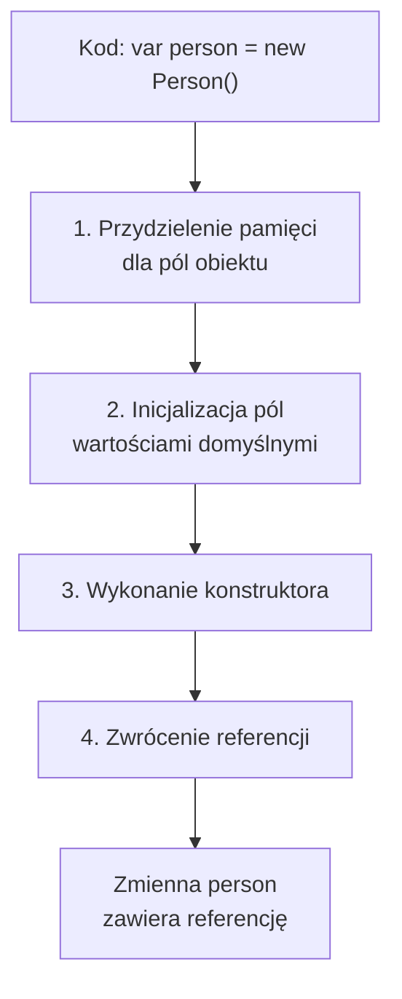
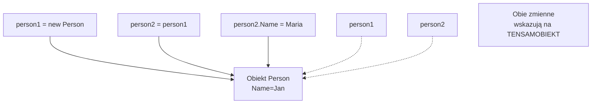
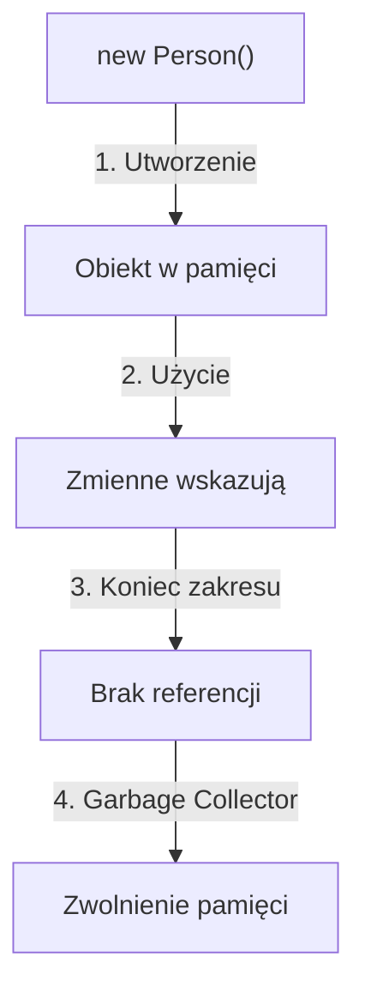

# Tworzenie i Korzystanie z Obiektów

## 🎯 Cel rozdziału

Nauczenie się tworzyć obiekty za pomocą operatora `new`, zrozumienie referencji, zarządzania pamięcią i cyklu życia obiektu w C#.

## 📚 Spis treści

1. [Operator new](#operator-new)
2. [Referencje vs Wartości](#referencje-vs-wartości)
3. [Inicjalizatory obiektów](#inicjalizatory-obiektów)
4. [Identyczność i równość](#identyczność-i-równość)
5. [Garbage collection](#garbage-collection)
6. [Podsumowanie](#podsumowanie)

---

## 🚀 Jak pracować z tym tematem

### Uruchomienie kodu

```bash
cd code/

# Demonstracja – porównanie referencji i wartości
dotnet run

# Testy jednostkowe
dotnet test
```

### Zadania dla studentów

[📝 ZADANIA](tasks/README.md) – Ćwiczenia z obiektami:
- Tworzenie obiektów operatorem `new`
- Rozumienie referencji (reference equality vs value equality)
- Inicjalizatory obiektów

---

## Operator new

Operator `new` tworzy nową instancję klasy (obiekt) w pamięci i zwraca referencję do niej.

### Przydział pamięci



### Przykład

```csharp
// Deklaracja zmiennej (typ)
Person person;

// Tworzenie obiektu operatorem new
person = new Person("Jan", 30);

// Lub w jednej linii
Person person2 = new Person("Maria", 25);
```

### Omówienie

- `new` wykonuje konstruktor
- Każde `new` tworzy nowy, odrębny obiekt w pamięci
- Zmienna przechowuje **referencję** do obiektu, nie sam obiekt

---

## Referencje vs Wartości

### Typy referencyjne (Reference Types)

Klasy są typami referencyjnymi. Zmienna przechowuje adres do obiektu w pamięci.

```csharp
public class Person
{
    public string Name { get; set; }
}

var person1 = new Person { Name = "Jan" };
var person2 = person1;  // Obie zmienne wskazują NA TEN SAM OBIEKT

person2.Name = "Maria";
Console.WriteLine(person1.Name);  // "Maria" - zmiana widoczna!

Console.WriteLine(ReferenceEquals(person1, person2));  // true
```

### Diagram referencji



### Typy wartościowe (Value Types)

Struktury (struct) są typami wartościowymi. Zmienna zawiera sam wartość.

```csharp
public struct Point
{
    public int X { get; set; }
    public int Y { get; set; }
}

var point1 = new Point { X = 10, Y = 20 };
var point2 = point1;  // KOPIA wartości

point2.X = 30;
Console.WriteLine(point1.X);  // 10 - bez zmian!

Console.WriteLine(point1.Equals(point2));  // false (różne wartości)
```

### Porównanie

| Aspekt | Klasa (Reference) | Struktura (Value) |
|--------|-------------------|-------------------|
| Przechowywanie | Referencja (adres) | Wartość |
| Przypisanie | Kopia referencji | Kopia wartości |
| Równość | ReferenceEquals() | Equals() |
| Cykl życia | Garbage Collection | Stack (zwykle) |
| Wydajność | Wolniejsze (na stercie) | Szybsze |

---

## Inicjalizatory obiektów

### Object initializer

```csharp
public class Person
{
    public string Name { get; set; }
    public int Age { get; set; }
    public string City { get; set; }
}

// Tradycyjny sposób
var person1 = new Person();
person1.Name = "Jan";
person1.Age = 30;
person1.City = "Warszawa";

// Z inicjalizatorem - krótszy i bardziej czytelny
var person2 = new Person
{
    Name = "Maria",
    Age = 25,
    City = "Kraków"
};
```

### Collection initializer

```csharp
var people = new List<Person>
{
    new Person { Name = "Jan", Age = 30 },
    new Person { Name = "Maria", Age = 25 },
    new Person { Name = "Piotr", Age = 35 }
};
```

### Target-typed new (C# 9+)

```csharp
Person person = new("Jan", 30);  // Typ wiadomy z kontekstu
List<int> numbers = new() { 1, 2, 3 };
```

---

## Identyczność i równość

### Identyczność (Identity)

Czy dwie zmienne wskazują na tensamobjekt?

```csharp
var person1 = new Person { Name = "Jan" };
var person2 = new Person { Name = "Jan" };
var person3 = person1;

Console.WriteLine(ReferenceEquals(person1, person2));  // false - różne obiekty
Console.WriteLine(ReferenceEquals(person1, person3));  // true - tensamobjekt
```

### Równość (Equality)

Czy obiekty mają tę samą zawartość?

```csharp
Console.WriteLine(person1 == person2);      // false - domyślnie porównuje referencje
Console.WriteLine(person1.Equals(person2)); // ? - zależy od implementacji
```

### Przesłanianie Equals()

```csharp
public class Person
{
    public string Name { get; set; }
    public int Age { get; set; }
    
    public override bool Equals(object? obj)
    {
        if (obj is not Person other) return false;
        return Name == other.Name && Age == other.Age;
    }
    
    public override int GetHashCode()
    {
        return HashCode.Combine(Name, Age);
    }
}

var person1 = new Person { Name = "Jan", Age = 30 };
var person2 = new Person { Name = "Jan", Age = 30 };

Console.WriteLine(person1.Equals(person2));  // true - równe zawartości
Console.WriteLine(person1 == person2);       // false - różne obiekty
```

---

## Garbage collection

### Cykl życia obiektu



### Automatyczne zarządzanie pamięcią

```csharp
void CreatePerson()
{
    var person = new Person { Name = "Jan" };
    Console.WriteLine(person.Name);
    // Koniec metody - zmienna person wychodzi z zakresu
}

// Po wyjściu z metody, obiekt jest kandydatem do garbage collection
// (jeśli nie ma innych referencji)

static void Main()
{
    CreatePerson();
    // Obiekt person został usunięty z pamięci
}
```

### Jawne usuwanie zasobów (IDisposable)

```csharp
public class FileHandler : IDisposable
{
    private FileStream? fileStream;
    
    public void OpenFile(string path)
    {
        fileStream = File.OpenRead(path);
    }
    
    public void Dispose()
    {
        fileStream?.Dispose();  // Zwolnienie zasobów
    }
}

// Użycie
using (var handler = new FileHandler())
{
    handler.OpenFile("file.txt");
}  // Dispose() wywoływane automatycznie
```

---

## Podsumowanie

### Kluczowe koncepcje

✅ **Operator new** - tworzy obiekty  
✅ **Referencje** - klasy przechowują adresy  
✅ **Inicjalizatory** - wygodny sposób tworzenia  
✅ **Garbage collection** - automatyczne zarządzanie pamięcią  
✅ **Equals vs ReferenceEquals** - równość vs identyczność  

### Najlepsze praktyki

- Zawsze porównuj obiekty za pomocą `Equals()`, nie `==`
- Przesłaniaj `Equals()` i `GetHashCode()` dla typów wartościowych
- Używaj inicjalizatorów dla bardziej czytelnego kodu
- Implementuj `IDisposable` dla zasobów (pliki, bazy danych)

### Następny krok

Zapoznaj się ze **słowem kluczowym `this`**, które ułatwia pracę z polami obiektu.

---

## 📖 Literatura i referencje

1. **Microsoft Docs** - Object Creation  
   https://learn.microsoft.com/en-us/dotnet/csharp/fundamentals/object-oriented/objects

2. **Microsoft Docs** - Memory Management  
   https://learn.microsoft.com/en-us/dotnet/standard/garbage-collection/

3. **C# Reference** - new Operator  
   https://learn.microsoft.com/en-us/dotnet/csharp/language-reference/operators/new-operator

