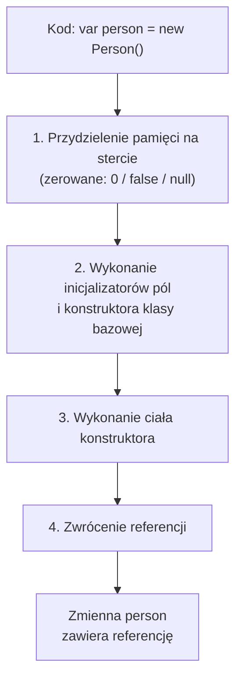
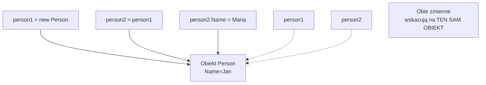
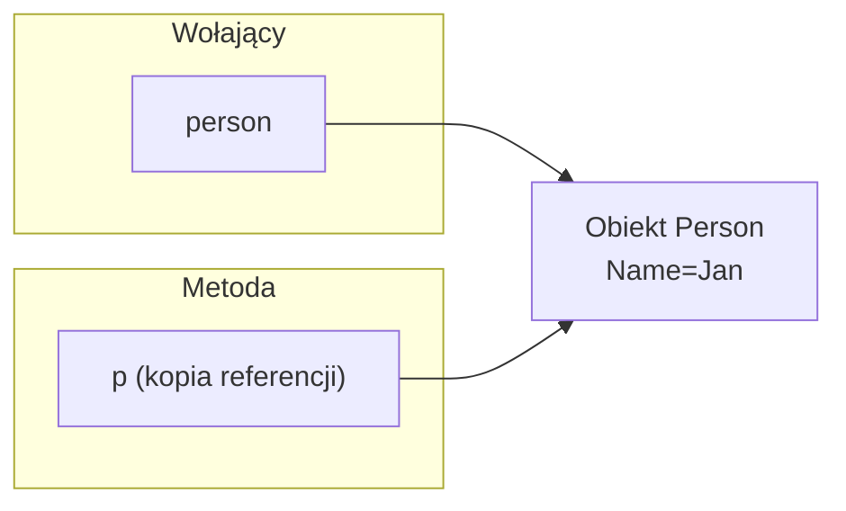
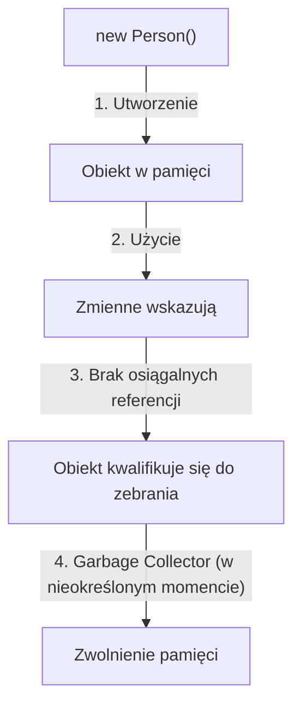

# Tworzenie i Korzystanie z Obiektów

## 🎯 Cel rozdziału

Nauczenie się tworzyć obiekty za pomocą operatora `new`, zrozumienie referencji, zarządzania pamięcią i cyklu życia obiektu w C#.

## 📚 Spis treści

1. [Operator new](#operator-new)
2. [Referencje vs Wartości](#referencje-vs-wartości)
3. [Inicjalizatory obiektów](#inicjalizatory-obiektów)
4. [Identyczność i równość](#identyczność-i-równość)
5. [null i przekazywanie obiektów do metod](#null-i-przekazywanie-obiektów-do-metod)
6. [Garbage collection](#garbage-collection)
7. [Podsumowanie](#podsumowanie)

---

## 🚀 Jak pracować z tym tematem

### Uruchomienie kodu

```bash
cd code/

# Demonstracja – porównanie referencji i wartości
dotnet run

# Testy jednostkowe
dotnet test
```

### Zadania dla studentów

[📝 ZADANIA](tasks/README.md) – Ćwiczenia z obiektami:
- Tworzenie obiektów operatorem `new`
- Rozumienie referencji (reference equality vs value equality)
- Inicjalizatory obiektów

---

## Operator new

Operator `new` tworzy nową instancję klasy (obiekt) w pamięci i zwraca referencję do niej.

### Przydział pamięci


```mermaid
graph TB
    A["Kod: var person = new Person()"] 
    B["1. Przydzielenie pamięci na stercie<br/>(zerowane: 0 / false / null)"]
    C["2. Wykonanie inicjalizatorów pól<br/>i konstruktora klasy bazowej"]
    D["3. Wykonanie ciała konstruktora"]
    E["4. Zwrócenie referencji"]
    F["Zmienna person<br/>zawiera referencję"]
    
    A --> B --> C --> D --> E --> F
```

### Przykład

```csharp
// Deklaracja zmiennej (typ) - jeszcze żaden obiekt nie istnieje, zmienna nie ma wartości
Person person;

// Tworzenie obiektu operatorem new
person = new Person("Jan", 30);

// Lub w jednej linii
Person person2 = new Person("Maria", 25);
```

### Omówienie

- `new` wykonuje konstruktor
- Każde `new` tworzy nowy, odrębny obiekt w pamięci
- Zmienna przechowuje **referencję** do obiektu, nie sam obiekt
- Deklaracja zmiennej (`Person person;`) **nie tworzy** obiektu – dopiero `new` go tworzy

---

## Referencje vs Wartości

### Typy referencyjne (Reference Types)

Klasy są typami referencyjnymi. Zmienna przechowuje adres do obiektu w pamięci.

```csharp
public class Person
{
    public string Name { get; set; }
}

var person1 = new Person { Name = "Jan" };
var person2 = person1;  // Obie zmienne wskazują NA TEN SAM OBIEKT

person2.Name = "Maria";
Console.WriteLine(person1.Name);  // "Maria" - zmiana widoczna!

Console.WriteLine(ReferenceEquals(person1, person2));  // true
```

### Diagram referencji


```mermaid
graph TB
    A["person1 = new Person"] --> B["Obiekt Person<br/>Name=Jan"]
    C["person2 = person1"] --> B
    
    D["person2.Name = Maria"] --> B
    
    E["person1"] -.-> B
    F["person2"] -.-> B
    
    G["Obie zmienne<br/>wskazują na TEN SAM OBIEKT"]
```

### Typy wartościowe (Value Types)

Struktury (`struct`) są typami wartościowymi. Zmienna zawiera samą wartość, a przypisanie ją kopiuje.

```csharp
public struct Point
{
    public int X { get; set; }
    public int Y { get; set; }
}

var point1 = new Point { X = 10, Y = 20 };
var point2 = point1;  // KOPIA wartości

point2.X = 30;
Console.WriteLine(point1.X);  // 10 - bez zmian!

Console.WriteLine(point1.Equals(point2));  // false (pola mają różne wartości: 10 != 30)
```

> Uwaga: zmienne (mutable) struktury, jak powyżej, są tu użyte wyłącznie do pokazania kopiowania.
> W realnym kodzie struktury powinny być niezmienne – patrz temat 8.

### Porównanie

| Aspekt | Klasa (Reference) | Struktura (Value) |
|--------|-------------------|-------------------|
| Zmienna zawiera | Referencję (adres) obiektu | Samą wartość (pola) |
| Przypisanie `b = a` | Kopia referencji (jeden obiekt, dwie zmienne) | Kopia całej wartości (dwa niezależne egzemplarze) |
| Domyślne `Equals()` | Równość referencji (ten sam obiekt?) | Równość pól (te same wartości?) |
| Domyślne `==` | Porównanie referencji | Niedostępne, dopóki nie zdefiniujesz operatora |
| Gdzie jest pamięć | Obiekt na stercie (heap), sprzątany przez GC | Tam, gdzie zadeklarowano zmienną: na stosie lub wewnątrz obiektu/tablicy na stercie |
| Wartość `null` | Możliwa | Niemożliwa (chyba że `Nullable<T>`, np. `int?`) |

> Typy wartościowe nie są „zawsze szybsze”: duże struktury są kosztowne w kopiowaniu, a rzutowanie
> na `object` powoduje *boxing* (alokację na stercie). Zasady wyboru – w temacie 8.

---

## Inicjalizatory obiektów

### Object initializer

```csharp
public class Person
{
    public string Name { get; set; }
    public int Age { get; set; }
    public string City { get; set; }
}

// Tradycyjny sposób
var person1 = new Person();
person1.Name = "Jan";
person1.Age = 30;
person1.City = "Warszawa";

// Z inicjalizatorem - krótszy i bardziej czytelny
var person2 = new Person
{
    Name = "Maria",
    Age = 25,
    City = "Kraków"
};
```

Inicjalizator obiektu to tylko skrót składniowy: kompilator najpierw wywołuje konstruktor,
a potem ustawia wskazane właściwości (muszą być dostępne `set` lub `init`).

### Collection initializer

```csharp
var people = new List<Person>
{
    new Person { Name = "Jan", Age = 30 },
    new Person { Name = "Maria", Age = 25 },
    new Person { Name = "Piotr", Age = 35 }
};
```

### Target-typed new (C# 9+)

```csharp
Person person = new("Jan", 30);  // Typ wiadomy z kontekstu
List<int> numbers = new() { 1, 2, 3 };
```

---

## Identyczność i równość

### Identyczność (Identity)

Czy dwie zmienne wskazują na ten sam obiekt?

```csharp
var person1 = new Person { Name = "Jan" };
var person2 = new Person { Name = "Jan" };
var person3 = person1;

Console.WriteLine(ReferenceEquals(person1, person2));  // false - różne obiekty
Console.WriteLine(ReferenceEquals(person1, person3));  // true - ten sam obiekt
```

### Równość (Equality)

Czy obiekty mają tę samą zawartość?

```csharp
Console.WriteLine(person1 == person2);      // false - domyślnie porównuje referencje
Console.WriteLine(person1.Equals(person2)); // ? - zależy od implementacji
```

### Przesłanianie Equals()

```csharp
public class Person
{
    public string Name { get; set; }
    public int Age { get; set; }
    
    public override bool Equals(object? obj)
    {
        if (obj is not Person other) return false;
        return Name == other.Name && Age == other.Age;
    }
    
    public override int GetHashCode()
    {
        return HashCode.Combine(Name, Age);
    }
}

var person1 = new Person { Name = "Jan", Age = 30 };
var person2 = new Person { Name = "Jan", Age = 30 };

Console.WriteLine(person1.Equals(person2));  // true - równe zawartości
Console.WriteLine(person1 == person2);       // false - operator == nie został przeciążony, porównuje referencje
```

> **Reguła kontraktu:** jeśli dwa obiekty są równe według `Equals()`, muszą mieć ten sam `GetHashCode()`.
> Inaczej obiekty „zgubią się” w `Dictionary` i `HashSet`. Uwaga: jeśli `GetHashCode()` zależy od pól
> **zmiennych** (jak `Name` powyżej), zmiana pola po wstawieniu obiektu do `HashSet` psuje wyszukiwanie.
> Dlatego typy z semantyką wartości najlepiej robić niezmiennymi – albo użyć `record` (temat 02-konstruktory),
> który generuje `Equals`, `GetHashCode` i `==` automatycznie.

---

## null i przekazywanie obiektów do metod

### null

Zmienna typu referencyjnego może **nie wskazywać na żaden obiekt** – wtedy ma wartość `null`.
Próba użycia takiej zmiennej kończy się wyjątkiem `NullReferenceException` w czasie działania programu.

```csharp
Person? nobody = null;           // '?' - świadomie dopuszczamy null (nullable reference types)

Console.WriteLine(nobody.Name);        // NullReferenceException!
Console.WriteLine(nobody?.Name);       // null - operator ?. przerywa, gdy lewa strona to null
Console.WriteLine(nobody?.Name ?? "brak");  // "brak" - ?? podaje wartość zastępczą

if (nobody is not null) { /* bezpieczne użycie */ }
```

W projektach z `<Nullable>enable</Nullable>` kompilator ostrzega, gdy zmienna typu `Person` (bez `?`)
mogłaby mieć wartość `null` – warto traktować te ostrzeżenia jak błędy.

### Do metody trafia kopia referencji

```csharp
static void Rename(Person p)  => p.Name = "Zmieniony";           // zmienia OBIEKT
static void Replace(Person p) => p = new Person { Name = "Nowy" }; // zmienia tylko LOKALNĄ kopię referencji
static void ReplaceByRef(ref Person p) => p = new Person { Name = "Nowy" };

var person = new Person { Name = "Jan" };

Rename(person);
Console.WriteLine(person.Name);   // "Zmieniony" - obie referencje wskazują na ten sam obiekt

person.Name = "Jan";
Replace(person);
Console.WriteLine(person.Name);   // "Jan" - zmienna wołającego nadal wskazuje stary obiekt

ReplaceByRef(ref person);
Console.WriteLine(person.Name);   // "Nowy" - ref przekazuje samą zmienną, nie jej kopię
```


```mermaid
graph LR
    subgraph Wołający
        V["person"]
    end
    subgraph Metoda
        P["p (kopia referencji)"]
    end
    V --> O["Obiekt Person<br/>Name=Jan"]
    P --> O
```

Kluczowa zasada: **w C# wszystko domyślnie przekazuje się przez wartość** – dla typów referencyjnych
kopiowana jest referencja, nie obiekt.

---

## Garbage collection

### Cykl życia obiektu


```mermaid
graph TD
    A["new Person()"] -->|"1. Utworzenie"| B["Obiekt w pamięci"]
    B -->|"2. Użycie"| C["Zmienne wskazują"]
    C -->|"3. Brak osiągalnych referencji"| D["Obiekt kwalifikuje się do zebrania"]
    D -->|"4. Garbage Collector (w nieokreślonym momencie)"| E["Zwolnienie pamięci"]
```

### Automatyczne zarządzanie pamięcią

```csharp
static void CreatePerson()
{
    var person = new Person { Name = "Jan" };
    Console.WriteLine(person.Name);
    // Koniec metody - zmienna person wychodzi z zakresu
}

static void Main()
{
    CreatePerson();
    // Obiekt Person nie ma już żadnych referencji, więc KWALIFIKUJE SIĘ do usunięcia.
    // Kiedy dokładnie zostanie usunięty, decyduje GC - nie wiemy (i nie powinniśmy zakładać).
}
```

- GC działa w nieokreślonych momentach (najczęściej gdy brakuje pamięci), więc **nie wywołuje się go ręcznie**
  (`GC.Collect()` w kodzie produkcyjnym to zwykle błąd).
- Obiekt jest „żywy”, dopóki jest osiągalny z jakiejkolwiek referencji (zmienna lokalna, pole, kolekcja).
  Zapomniana referencja w długo żyjącej kolekcji lub zdarzeniu to typowy *wyciek pamięci* w C#.
- GC zarządza **pamięcią**, ale nie innymi zasobami (pliki, połączenia, gniazda) – do nich służy `IDisposable`.

### Jawne zwalnianie zasobów (IDisposable)

```csharp
public class FileHandler : IDisposable
{
    private FileStream? fileStream;
    
    public void OpenFile(string path)
    {
        fileStream = File.OpenRead(path);
    }
    
    public void Dispose()
    {
        fileStream?.Dispose();  // Zwolnienie zasobów niezarządzanych
    }
}

// Użycie - Dispose() wywoływane automatycznie na końcu bloku
using (var handler = new FileHandler())
{
    handler.OpenFile("file.txt");
}

// Skrócona forma (C# 8): Dispose() na końcu bieżącego zakresu
using var handler2 = new FileHandler();
handler2.OpenFile("file.txt");
```

---

## Podsumowanie

### Kluczowe koncepcje

✅ **Operator new** - tworzy obiekty  
✅ **Referencje** - klasy przechowują adresy; do metod przekazywana jest kopia referencji  
✅ **Inicjalizatory** - wygodny sposób tworzenia  
✅ **null** - brak obiektu; używaj `?.`, `??` i włączonych typów nullable  
✅ **Garbage collection** - automatyczne zarządzanie pamięcią (nie zasobami!)  
✅ **Equals vs ReferenceEquals** - równość vs identyczność  

### Najlepsze praktyki

- Pamiętaj: dla klas `==` domyślnie porównuje **referencje**; do porównania zawartości użyj `Equals()`
  (lub zdefiniuj własny `==`). Wyjątki: `string` i typy z przeciążonym `==` porównują zawartość
- Przesłaniając `Equals()`, zawsze przesłoń też `GetHashCode()` (te same pola!); rozważ `IEquatable<T>`
- Dla typów o semantyce wartości preferuj `record` / niezmienne `struct`
- Używaj inicjalizatorów dla bardziej czytelnego kodu
- Implementuj `IDisposable` dla zasobów (pliki, bazy danych) i używaj `using`

### Następny krok

Zapoznaj się ze **słowem kluczowym `this`**, które ułatwia pracę z polami obiektu.

---

## 📖 Literatura i referencje

1. **Microsoft Docs** - Object Creation  
   https://learn.microsoft.com/en-us/dotnet/csharp/fundamentals/object-oriented/objects

2. **Microsoft Docs** - Memory Management  
   https://learn.microsoft.com/en-us/dotnet/standard/garbage-collection/

3. **C# Reference** - new Operator  
   https://learn.microsoft.com/en-us/dotnet/csharp/language-reference/operators/new-operator

