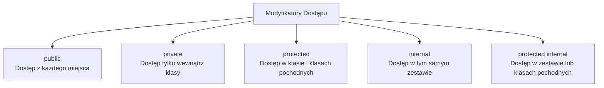

# Ukrywanie Informacji – Modyfikatory Dostępu

## 🎯 Cel

Zrozumienie modyfikatorów dostępu (public, private, protected, internal) i enkapsulacji.

---

## 🚀 Jak pracować z tym tematem

### Uruchomienie kodu

```bash
cd code/

# Demonstracja modyfikatorów dostępu
dotnet run

# Testy jednostkowe
dotnet test
```

### Zadania dla studentów

[📝 ZADANIA](tasks/README.md) – Ćwiczenia z dostępem:
- Enkapsulacja danych (`BankAccount` z PIN-em)
- Zdefiniowanie publicznych/prywatnych metod
- Protected w dziedziczeniu

---

## Modyfikatory dostępu w C#



## Szczegóły

| Modyfikator | W klasie | W zestawie | Poza zestawem | Klasy pochodne |
|---|---|---|---|---|
| `public` | ✅ | ✅ | ✅ | ✅ |
| `private` | ✅ | ❌ | ❌ | ❌ |
| `protected` | ✅ | ✅ | ❌ | ✅ |
| `internal` | ✅ | ✅ | ❌ | ❌ |
| `protected internal` | ✅ | ✅ | ❌ | ✅ |

## Przykład

```csharp
public class BankAccount
{
    // Publiczne - dostęp z wszędzie
    public string AccountHolder { get; }
    
    // Prywatne - tylko wewnątrz klasy
    private decimal balance;
    private int pin;
    
    public decimal Balance => balance;
    
    public void Deposit(decimal amount)
    {
        if (amount > 0)
            balance += amount;
    }
    
    private bool VerifyPin(int providedPin) => providedPin == pin;
}
```

## Najlepsze praktyki

✅ Pola - `private`  
✅ Właściwości - `public`  
✅ Metody pomocnicze - `private`  
✅ Metody publiczne - `public`  

---

## 📖 Referencje

[Microsoft Docs - Access Modifiers](https://learn.microsoft.com/en-us/dotnet/csharp/fundamentals/access-modifiers)

