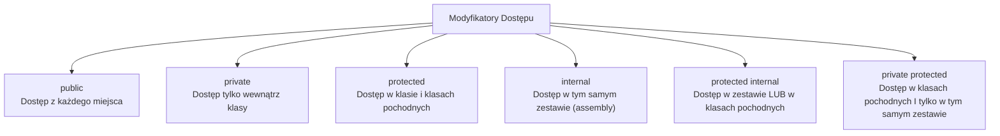

# Ukrywanie Informacji – Modyfikatory Dostępu

## 🎯 Cel

Zrozumienie modyfikatorów dostępu (public, private, protected, internal) i enkapsulacji.

---

## 🚀 Jak pracować z tym tematem

### Uruchomienie kodu

```bash
cd code/

# Demonstracja modyfikatorów dostępu
dotnet run

# Testy jednostkowe
dotnet test
```

### Zadania dla studentów

[📝 ZADANIA](tasks/README.md) – Ćwiczenia z dostępem:
- Klasa `User` z prywatnym hasłem, publicznym odczytem i prywatnym zapisem właściwości
- Blokada konta po trzech nieudanych logowaniach (stan chroniony przed zewnętrzną zmianą)
- Rozszerzenie: klasa pochodna i składowe `protected`

---

## Modyfikatory dostępu w C#


```mermaid
graph TB
    A["Modyfikatory Dostępu"]
    A --> B["public<br/>Dostęp z każdego miejsca"]
    A --> C["private<br/>Dostęp tylko wewnątrz klasy"]
    A --> D["protected<br/>Dostęp w klasie i klasach pochodnych"]
    A --> E["internal<br/>Dostęp w tym samym zestawie (assembly)"]
    A --> F["protected internal<br/>Dostęp w zestawie LUB w klasach pochodnych"]
    A --> G["private protected<br/>Dostęp w klasach pochodnych I tylko w tym samym zestawie"]
```

**Zestaw (assembly)** to skompilowana jednostka (`.dll` / `.exe`) – zazwyczaj jeden projekt `.csproj`.

## Szczegóły

Kto ma dostęp do składowej zadeklarowanej w klasie `A` (w zestawie `X`)?

| Modyfikator | Sama klasa `A` | Klasa pochodna w `X` | Inna klasa w `X` | Klasa pochodna w innym zestawie | Inna klasa w innym zestawie |
|---|:---:|:---:|:---:|:---:|:---:|
| `public` | ✅ | ✅ | ✅ | ✅ | ✅ |
| `protected internal` | ✅ | ✅ | ✅ | ✅ | ❌ |
| `internal` | ✅ | ✅ | ✅ | ❌ | ❌ |
| `protected` | ✅ | ✅ | ❌ | ✅ | ❌ |
| `private protected` | ✅ | ✅ | ❌ | ❌ | ❌ |
| `private` | ✅ | ❌ | ❌ | ❌ | ❌ |

> **Częsty błąd:** `protected` **nie** daje dostępu innym klasom z tego samego zestawu – tylko klasom pochodnym.
> Dostęp „w zestawie” zapewnia `internal`. `protected internal` to suma (LUB) obu, a `private protected` to ich
> iloczyn (I).

### Domyślne poziomy dostępu

Gdy modyfikator pominięto:

| Element | Domyślny dostęp |
|---|---|
| Składowe klasy i struktury (pola, metody, właściwości, konstruktory) | `private` |
| Typ najwyższego poziomu (klasa, struktura, interfejs, enum) | `internal` |
| Składowe interfejsu | `public` |
| Typ zagnieżdżony | `private` |

Mimo to **warto pisać modyfikator jawnie** – kod staje się czytelniejszy.

> Od C# 11 istnieje też modyfikator `file` – typ widoczny tylko w jednym pliku źródłowym (używany głównie przez generatory kodu).

## Przykład

```csharp
public class BankAccount
{
    // Publiczne - dostęp z każdego miejsca (tylko do odczytu)
    public string AccountHolder { get; }
    
    // Prywatne - tylko wewnątrz klasy
    private decimal balance;
    private int pin;
    
    // Publiczny odczyt, ale stan zmienia tylko klasa (przez metody)
    public decimal Balance => balance;
    
    public void Deposit(decimal amount)
    {
        if (amount > 0)
            balance += amount;
    }
    
    // Pomocnicza metoda prywatna - szczegół implementacji, można ją zmienić bez wpływu na użytkowników klasy
    private bool VerifyPin(int providedPin) => providedPin == pin;
}
```

### `protected` w praktyce

```csharp
public class Document
{
    protected string Content { get; set; } = "";   // widoczne w klasie i klasach pochodnych
    private string Metadata { get; set; } = "";    // widoczne tylko w Document

    public void SetContent(string content) => Content = content;   // publiczny, kontrolowany dostęp
    protected void AddMetadata(string meta) => Metadata = meta;
}

public class SecretDocument : Document
{
    public void Classify(string level)
    {
        Content = "[TAJNE] " + Content;   // OK - protected w klasie pochodnej
        AddMetadata(level);                // OK - protected
        // Metadata = level;               // BŁĄD KOMPILACJI - private w klasie bazowej
    }
}

var doc = new SecretDocument();
doc.SetContent("treść");      // OK - public
// doc.Content = "...";         // BŁĄD KOMPILACJI - protected nie jest widoczne spoza klasy i klas pochodnych
```

### `internal` w praktyce

`internal` ukrywa szczegóły implementacji biblioteki przed jej użytkownikami, ale pozwala korzystać z nich
wewnątrz tego samego projektu. Jeśli projekt testów ma mieć dostęp do elementów `internal`, dodaj w bibliotece
atrybut `[assembly: InternalsVisibleTo("NazwaProjektuTestow")]`.

## Najlepsze praktyki

✅ Zasada **minimalnych uprawnień**: zaczynaj od `private` i poszerzaj dostęp tylko wtedy, gdy to konieczne  
✅ Pola – `private` (dostęp z zewnątrz przez właściwości lub metody)  
✅ Właściwości – zwykle `public`, często z `private set` / `init`  
✅ Metody pomocnicze (szczegóły implementacji) – `private`  
✅ Metody stanowiące interfejs klasy – `public`  
✅ Składowe przeznaczone dla klas pochodnych – `protected`  
❌ Nie udostępniaj pól publicznie – tracisz kontrolę nad stanem obiektu  

> **Enkapsulacja to nie tylko `private`.** Metoda `public decimal[] GetItems() => items;` zwracająca wewnętrzną tablicę
> (albo `List<T>`) pozwala wywołującemu zmienić jej zawartość z pominięciem klasy. Zwracaj kopię lub
> `IReadOnlyList<T>`.

---

## 📖 Referencje

[Microsoft Docs - Access Modifiers](https://learn.microsoft.com/en-us/dotnet/csharp/fundamentals/access-modifiers)

