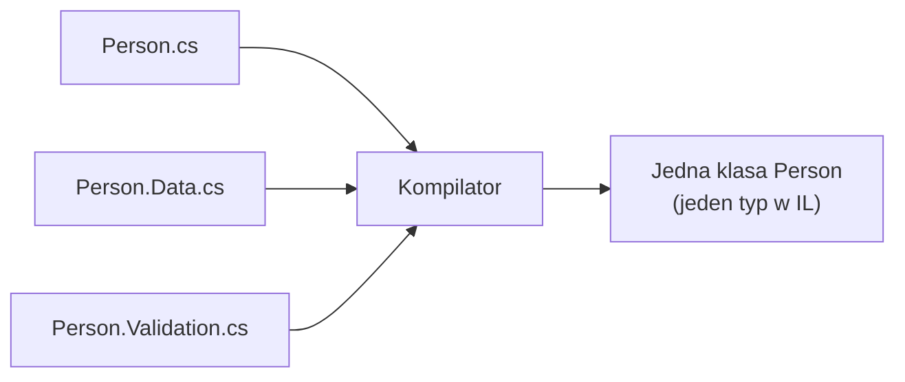

# Klasy Częściowe (Partial Classes)

## 🎯 Cel

Rozbicie definicji jednej klasy na wiele plików (lub części w jednym pliku) słowem kluczowym `partial`.
Kompilator łączy wszystkie części w **jeden typ** – w czasie działania programu nie ma śladu po podziale.

---

## 🚀 Uruchomienie

```bash
cd code/
dotnet run
dotnet test
```

Klasa `Employee` w `code/` jest rozdzielona na trzy pliki: `Employee.cs`, `Employee.Business.cs`
i `Employee.Validation.cs`. Otwórz je obok siebie i zauważ, że metody z jednego pliku używają
prywatnych pól zadeklarowanych w innym.

## Syntaktyka

```csharp
// Plik 1: Person.cs
public partial class Person
{
    public string Name { get; set; } = "";
    public int Age { get; set; }
}

// Plik 2: Person.Data.cs
public partial class Person
{
    public void LoadFromDatabase() { /* ... */ }
    public void SaveToDatabase() { /* ... */ }
}

// Plik 3: Person.Validation.cs
public partial class Person
{
    public bool IsValid() => !string.IsNullOrEmpty(Name) && Age >= 0;
}
```



## Zastosowania

- **Kod generowany** – narzędzie (designer Windows Forms, scaffolding Entity Framework, generatory kodu
  Roslyn, np. `[GeneratedRegex]`) zapisuje swoją część do osobnego pliku, a Ty dopisujesz własną logikę w drugim
  – **ponowne wygenerowanie nie nadpisze Twojego kodu**. To najważniejsze zastosowanie w praktyce.
- Bardzo duże klasy – czytelniejszy podział (choć często sygnał, że klasę warto podzielić na kilka klas)
- Współpraca wielu programistów nad jedną klasą (mniej konfliktów przy scalaniu zmian)
- Wydzielenie zagnieżdżonych klas pomocniczych lub implementacji interfejsów do osobnych plików

## Zasady

✅ Każda część musi mieć słowo kluczowe `partial` i tę samą nazwę oraz przestrzeń nazw  
✅ Wszystkie części muszą być kompilowane **razem**, w tym samym zestawie (assembly) – nie można rozszerzyć
   klasy `partial` z innego projektu  
✅ Jeśli część określa modyfikator dostępu (`public`, `internal`), wszystkie części, które go określają,
   muszą podawać **ten sam** (sprzeczne dostępy dają błąd kompilacji CS0262)  
✅ Modyfikatory `abstract`, `sealed` oraz klasa bazowa zadeklarowane w **dowolnej** części dotyczą całej klasy
   (klasa bazowa nie może być w różnych częściach różna)  
✅ Implementowane interfejsy ze wszystkich części są **sumowane**  
✅ Wszystkie części widzą nawzajem swoje składowe, także `private`  
✅ Ta sama składowa (np. metoda o tej samej sygnaturze) nie może być zdefiniowana dwa razy  
✅ Działa również dla `struct`, `interface` i `record`  

## Czego `partial` **nie** robi

- Nie tworzy osobnych typów ani nie dodaje warstwy abstrakcji – to tylko organizacja kodu źródłowego
- Nie pozwala „dopisywać” klas z bibliotek – do tego służą metody rozszerzające (*extension methods*) lub dziedziczenie
- Nie zmienia kolejności inicjalizacji: kolejność inicjalizatorów pól między plikami jest **nieokreślona**
  – nie polegaj na niej

---

## 📖 Referencje

[Microsoft Docs - Partial Classes](https://learn.microsoft.com/en-us/dotnet/csharp/programming-guide/classes-and-structs/partial-classes-and-methods)

