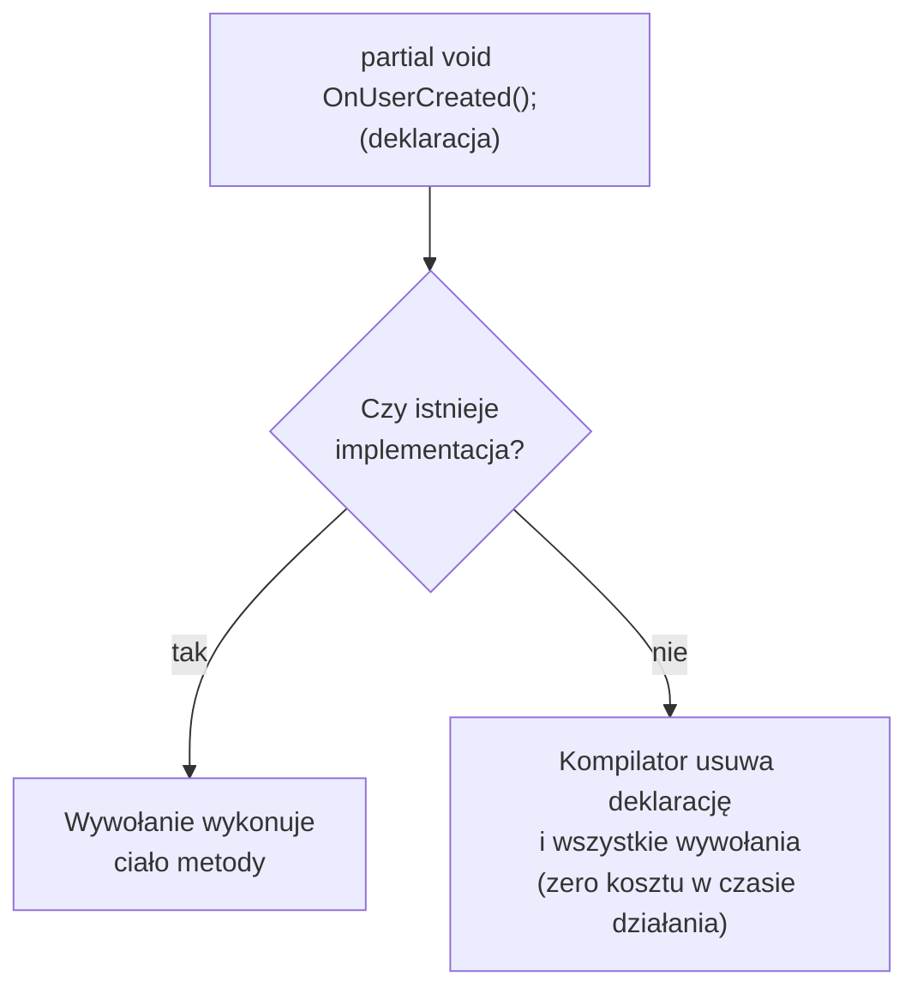

# Metody Częściowe (Partial Methods)

## 🎯 Cel

Deklaracja metody w jednej części klasy częściowej i (opcjonalnie) jej implementacja w drugiej.
Metody częściowe służą głównie jako **punkty zaczepienia (hooks)** w kodzie generowanym.

---

## 🚀 Uruchomienie

```bash
cd code/
dotnet run
dotnet test
```

## Syntaktyka (klasyczne metody częściowe)

```csharp
public partial class User
{
    // Deklaracja (część 1) - bez ciała, zakończona średnikiem
    partial void OnUserCreated();

    public User(string name)
    {
        Name = name;
        OnUserCreated();  // Wywołanie - kompilator usunie je, jeśli nie ma implementacji
    }

    public string Name { get; }
}

public partial class User
{
    // Implementacja (część 2) - opcjonalna
    partial void OnUserCreated()
    {
        Console.WriteLine("Użytkownik utworzony!");
    }
}
```



## Zasady

### Klasyczne metody częściowe (brak modyfikatora dostępu)

✅ Metoda jest niejawnie `private`  
✅ Zwraca `void` i nie ma parametrów `out`  
✅ Implementacja jest **opcjonalna** – bez niej wywołanie (wraz z **obliczaniem argumentów**) jest usuwane  
✅ Można ich używać tylko w typach `partial`  
❌ Nie mogą mieć modyfikatora dostępu, `virtual`, `override`, `sealed`, `new`, `extern`, parametrów `out`  

### Rozszerzone metody częściowe (C# 9+)

Jeśli deklaracja ma **modyfikator dostępu** (np. `public`), **zwraca wartość** (nie `void`), ma parametr `out`
albo użyto jednego z modyfikatorów `virtual`/`override`/`sealed`/`new`/`extern` – implementacja jest
**obowiązkowa** (inaczej błąd kompilacji CS8795), bo kompilator nie mógłby po prostu usunąć wywołania.

```csharp
public partial class User
{
    public partial bool CanChangeName(string newName);   // deklaracja - implementacja WYMAGANA
}

public partial class User
{
    public partial bool CanChangeName(string newName) => !string.IsNullOrWhiteSpace(newName);
}
```

Od C# 13 istnieją analogicznie **właściwości częściowe** (`partial string Name { get; set; }`) i indeksatory.

## Metody częściowe a zdarzenia i delegaty

| | Metoda częściowa | Zdarzenie (`event`) / delegat |
|---|---|---|
| Kiedy „podłączamy” obsługę | w czasie **kompilacji** | w czasie **działania** programu |
| Koszt, gdy brak obsługi | zerowy (wywołanie usunięte) | niewielki (sprawdzenie `null`) |
| Liczba obsługujących | jedna implementacja | wiele subskrybentów |
| Można zmieniać dynamicznie | nie | tak |

Używaj metod częściowych, gdy kod generowany ma dać programiście możliwość wpięcia się w swoje działanie
(np. `OnPropertyChanged`, `OnModelCreating`). Do komunikacji między obiektami w czasie działania
wybieraj zdarzenia (moduł o delegatach i zdarzeniach).

## Przykład z `Program.cs`

`User` deklaruje trzy hooki: dwa zaimplementowane (`OnUserCreated`, `OnNameChanged`), jeden **bez**
implementacji (`OnNameChanging` – jego wywołanie znika z kodu IL) oraz rozszerzoną metodę częściową
`CanChangeName`, która musi mieć implementację i zwraca wynik.

---

## 📖 Referencje

[Microsoft Docs - Partial Methods](https://learn.microsoft.com/en-us/dotnet/csharp/programming-guide/classes-and-structs/partial-classes-and-methods#partial-methods)

