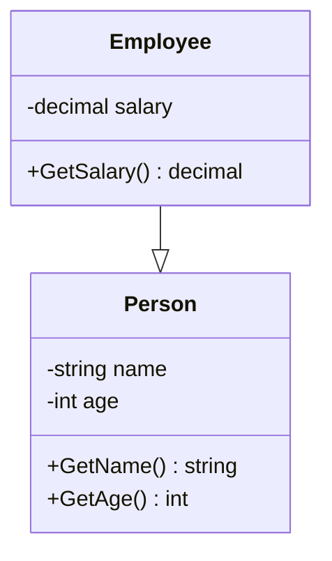

# Język UML – Diagramy

## 🎯 Cel

Modelowanie systemów za pomocą UML.

---

## 🚀 Uruchomienie

```bash
cd code/
dotnet run
dotnet test
```

## Diagramy UML

### 1. Diagram Klas (Class Diagram)

```
┌─────────────────┐
│    Person       │
├─────────────────┤
│ - name: string  │
│ - age: int      │
├─────────────────┤
│ + GetName()     │
│ + GetAge()      │
└─────────────────┘
```

**Symbole:**
- `-` private
- `+` public
- `#` protected
- `~` internal

### 2. Diagram Sekwencji (Sequence Diagram)

Pokazuje interakcję między obiektami w czasie.

### 3. Diagram Use Case

Pokazuje funkcjonalności systemu z perspektywy użytkownika.

## Przykład



---

## 📖 Referencje

[UML 2.5 Standard](https://www.omg.org/spec/UML/2.5.1/)

