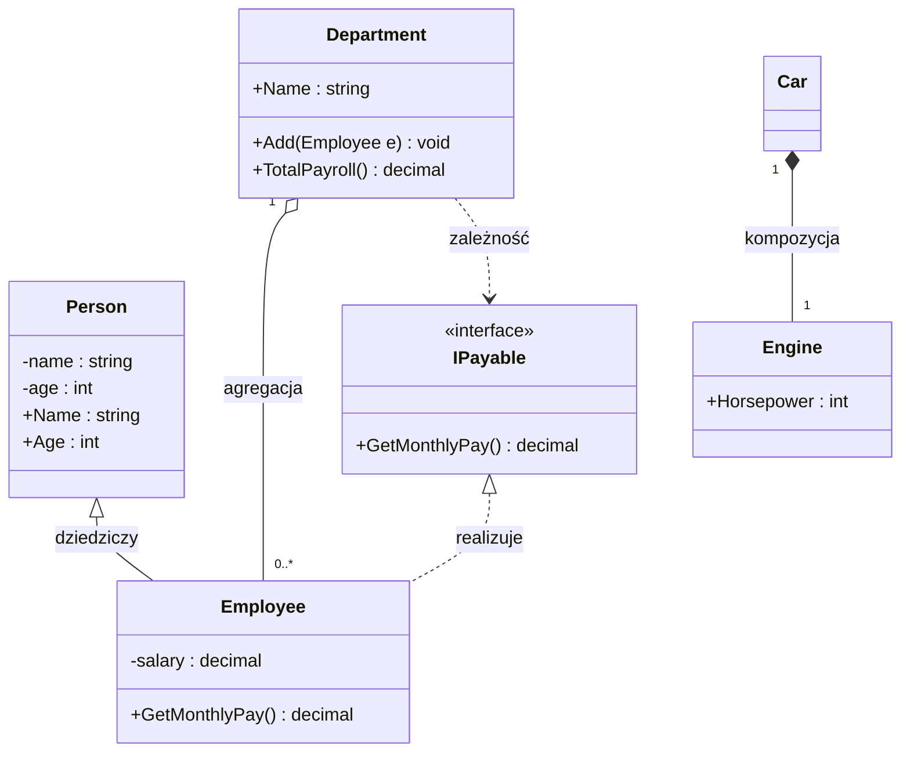
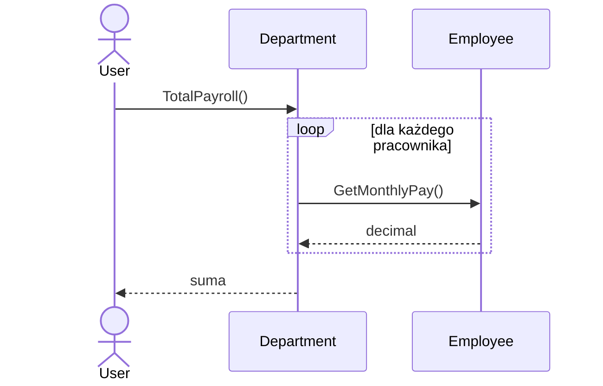
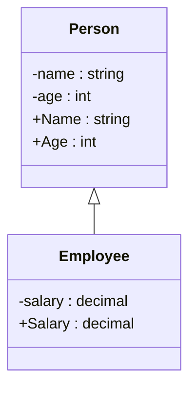

# Język UML – Diagramy

## 🎯 Cel

Modelowanie systemów za pomocą UML – jak zamienić pomysł na czytelny diagram klas i sekwencji, i jak diagram
przekłada się na kod C#.

---

## 🚀 Uruchomienie

```bash
cd code/
dotnet run
dotnet test
```

Kod w `code/Program.cs` ilustruje każdą z omawianych relacji (dziedziczenie, realizacja interfejsu, agregacja,
kompozycja, zależność) – porównaj go z diagramem poniżej.

## Czym jest UML?

**UML (Unified Modeling Language)** to ustandaryzowany (OMG, ISO/IEC 19505) język graficzny do opisu struktury
i zachowania systemów. Służy do **komunikacji** – w zespole, z klientem, w dokumentacji – a nie do „programowania
rysunkami”. Diagramy powinny być tak szczegółowe, jak wymaga tego cel (szkic architektury ≠ dokumentacja klasy).

| Rodzaj | Pytanie, na które odpowiada | Typ |
|---|---|---|
| **Diagram klas** | Jakie są klasy i jakie relacje je łączą? | strukturalny |
| **Diagram sekwencji** | Jakie wiadomości wymieniają obiekty w czasie w danym scenariuszu? | behawioralny |
| **Diagram przypadków użycia** | Co system oferuje aktorom (użytkownikom, systemom zewnętrznym)? | behawioralny |

## 1. Diagram klas (Class Diagram)

Klasa to prostokąt z trzema przedziałami: **nazwa**, **atrybuty (pola/właściwości)**, **operacje (metody)**.

```
┌────────────────────┐
│       Person       │
├────────────────────┤
│ - name: string     │
│ - age: int         │
├────────────────────┤
│ + Name: string     │
│ + Introduce(): void│
└────────────────────┘
```

**Widoczność (odpowiedniki w C#):**

| Symbol UML | Znaczenie | C# |
|---|---|---|
| `+` | publiczny | `public` |
| `-` | prywatny | `private` |
| `#` | chroniony | `protected` |
| `~` | pakietowy | `internal` |

**Dodatkowe oznaczenia:** składowa statyczna – podkreślona; klasa/metoda abstrakcyjna – *kursywa* (w Mermaid
`<<abstract>>`); interfejs – stereotyp `<<interface>>`; typ wyliczeniowy – `<<enumeration>>`.

### Relacje między klasami

| Relacja | Notacja Mermaid | Znaczenie | Odpowiednik w C# |
|---|---|---|---|
| **Dziedziczenie** (generalizacja) | `Person <\|-- Employee` | „jest rodzajem” (is-a) | `class Employee : Person` |
| **Realizacja** | `IPayable <\|.. Employee` | klasa implementuje interfejs | `class Employee : IPayable` |
| **Asocjacja** | `Teacher --> Course` | „zna / używa” (trwałe powiązanie) | pole lub właściwość typu `Course` |
| **Agregacja** | `Department o-- Employee` | „ma” – **słaba** (część istnieje niezależnie) | kolekcja odwołań, obiekty tworzone na zewnątrz |
| **Kompozycja** | `Car *-- Engine` | „składa się z” – **silna** (część żyje i umiera z całością) | całość tworzy część i jest jej jedynym właścicielem |
| **Zależność** | `Department ..> IPayable` | „chwilowo używa” | parametr metody, zmienna lokalna |


```mermaid
classDiagram
    class Person {
        -name : string
        -age : int
        +Name : string
        +Age : int
    }

    class IPayable {
        <<interface>>
        +GetMonthlyPay() decimal
    }

    class Employee {
        -salary : decimal
        +GetMonthlyPay() decimal
    }

    class Department {
        +Name : string
        +Add(Employee e) void
        +TotalPayroll() decimal
    }

    class Car
    class Engine {
        +Horsepower : int
    }

    Person <|-- Employee : dziedziczy
    IPayable <|.. Employee : realizuje
    Department "1" o-- "0..*" Employee : agregacja
    Department ..> IPayable : zależność
    Car "1" *-- "1" Engine : kompozycja
```

**Krotność (multiplicity):** `1` – dokładnie jeden, `0..1` – opcjonalny, `*` lub `0..*` – dowolnie wiele,
`1..*` – co najmniej jeden.

### Jak odróżnić agregację od kompozycji?

Zapytaj: *czy część ma sens bez całości i kto ją tworzy?* Silnik bez samochodu w tym modelu nie istnieje –
kompozycja. Pracownik po rozwiązaniu działu nadal istnieje – agregacja. W praktyce wiele zespołów
stosuje po prostu asocjację `-->`; ważne, by diagram był czytelny i spójny.

## 2. Diagram sekwencji (Sequence Diagram)

Pokazuje **kolejność wiadomości** wymienianych między obiektami w jednym scenariuszu – czas płynie z góry na dół.


```mermaid
sequenceDiagram
    actor User
    participant Dept as Department
    participant Emp as Employee

    User->>Dept: TotalPayroll()
    loop dla każdego pracownika
        Dept->>Emp: GetMonthlyPay()
        Emp-->>Dept: decimal
    end
    Dept-->>User: suma
```

Strzałka ciągła z pełnym grotem (`->>`) – wywołanie; przerywana (`-->>`) – odpowiedź; `loop`, `alt`, `opt` –
bloki sterujące (pętla, alternatywa, opcja).

## 3. Diagram przypadków użycia (Use Case)

Pokazuje funkcje systemu z perspektywy użytkownika: **aktorzy** (postacie) i **przypadki użycia** (elipsy).
Mermaid nie ma dedykowanego diagramu use case; używa się narzędzi takich jak PlantUML, draw.io czy StarUML.

```
 Aktor: Pracownik HR          ┌─────────────────────────────┐
      (postać)    ─────────▶  │ (Dodaj pracownika)          │
                  ─────────▶  │ (Zmień wynagrodzenie)       │
 Aktor: Księgowy  ─────────▶  │ (Wygeneruj listę płac)      │
                              └─────────────────────────────┘
                                        granica systemu
```

## Przykład z kodu


```mermaid
classDiagram
    class Person {
        -name : string
        -age : int
        +Name : string
        +Age : int
    }

    class Employee {
        -salary : decimal
        +Salary : decimal
    }

    Person <|-- Employee
```

```csharp
public class Person
{
    private string name;   // "-name : string"
    private int age;       // "-age : int"
    public string Name => name;   // "+Name : string" (właściwość)
    public int Age => age;
}

public class Employee : Person   // "Person <|-- Employee"
{
    private decimal salary;
    public decimal Salary => salary;
}
```

> W UML właściwość C# (`Name`) zapisujemy jako atrybut (`+Name : string`) albo jako parę operacji `getName()/setName()` –
> oba zapisy są poprawne; ważne, by trzymać się jednego w całym diagramie.

## Dobre praktyki

- Jeden diagram = jedna myśl (nie mieszaj 40 klas na jednym rysunku).
- Nazywaj relacje i podawaj krotności tam, gdzie mają znaczenie.
- Pomijaj szczegóły, które nie są potrzebne odbiorcy (gettery/settery, metody pomocnicze).
- Diagram jest nieaktualny, gdy rozjedzie się z kodem – generuj go z kodu lub aktualizuj razem z kodem.
- Diagram ma przekazać **pomysł**; nie musi odtwarzać 1:1 każdej linii kodu.

---

## 📖 Referencje

- [UML 2.5 Standard](https://www.omg.org/spec/UML/2.5.1/)
- [Mermaid – Class diagrams](https://mermaid.js.org/syntax/classDiagram.html)
- [Mermaid – Sequence diagrams](https://mermaid.js.org/syntax/sequenceDiagram.html)

