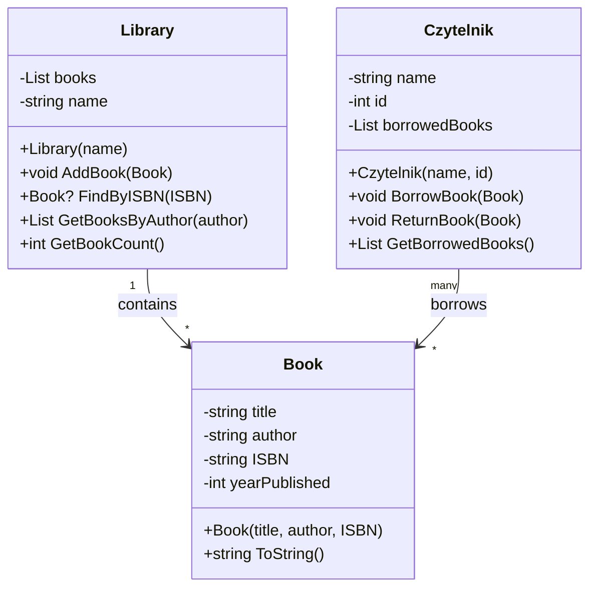
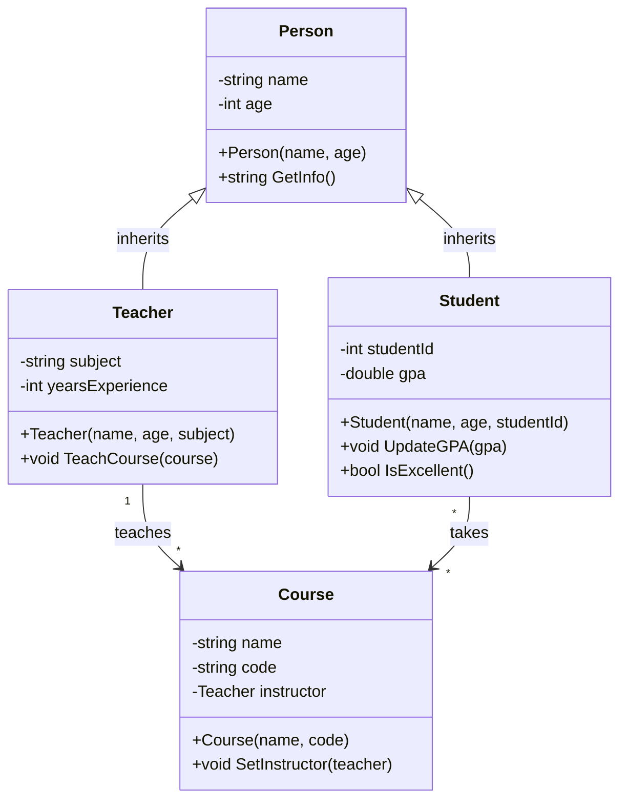
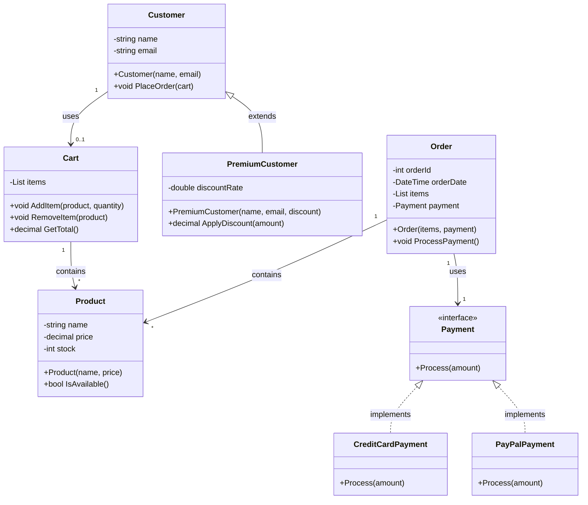

# Zadania - UML (Unified Modeling Language)

## 📝 Zadanie 1: Diagram biblioteki

Stwórz diagram UML dla systemu biblioteki zawierającego:
- Book (title, author, ISBN)
- Library (books[])
- Czytelnik (name, id, books[])

Pokaż relacje i dziedziczenie.

---

## 📝 Zadanie 2: Diagram szkoły

Zaprojektuj system szkoły z:
- Person (base class)
- Student extends Person
- Teacher extends Person
- Course (klasa)
- Relacje: Teacher prowadzi Course, Student bierze Course

---

## 📝 Zadanie 3: Diagram e-commerce

Modeluj system sklepu online:
- Product, Cart, Order
- Customer (base)
- PremiumCustomer extends Customer
- Payment (interface)

---

## ✅ Zadanie 1 - Rozwiązanie: Diagram Biblioteki

### Diagram UML (Mermaid)



### Kod - Book Class

```csharp
public class Book
{
    public string Title { get; private set; }
    public string Author { get; private set; }
    public string ISBN { get; private set; }
    public int YearPublished { get; private set; }
    
    public Book(string title, string author, string isbn, int year)
    {
        Title = title;
        Author = author;
        ISBN = isbn;
        YearPublished = year;
    }
    
    public override string ToString() => $"{Title} by {Author} ({ISBN})";
}
```

### Kod - Library Class

```csharp
public class Library
{
    private string name;
    private List<Book> books = new();
    
    public string Name => name;
    public int BookCount => books.Count;
    
    public Library(string name)
    {
        this.name = name;
    }
    
    public void AddBook(Book book)
    {
        if (book != null && !books.Contains(book))
            books.Add(book);
    }
    
    public Book? FindByISBN(string isbn)
    {
        return books.FirstOrDefault(b => b.ISBN == isbn);
    }
    
    public List<Book> GetBooksByAuthor(string author)
    {
        return books.Where(b => b.Author == author).ToList();
    }
    
    public override string ToString() => $"{name} ({BookCount} books)";
}
```

### Kod - Czytelnik Class

```csharp
public class Czytelnik
{
    private string name;
    private int id;
    private List<Book> borrowedBooks = new();
    
    public string Name => name;
    public int Id => id;
    public int BorrowedCount => borrowedBooks.Count;
    
    public Czytelnik(string name, int id)
    {
        this.name = name;
        this.id = id;
    }
    
    public void BorrowBook(Book book)
    {
        if (book != null && !borrowedBooks.Contains(book))
            borrowedBooks.Add(book);
    }
    
    public void ReturnBook(Book book)
    {
        borrowedBooks.Remove(book);
    }
    
    public List<Book> GetBorrowedBooks() => borrowedBooks.ToList();
    
    public override string ToString() => $"{name} ({borrowedBooks.Count} books)";
}

// Test
var library = new Library("Biblioteka Publiczna");
var book1 = new Book("Quo Vadis", "Henryk Sienkiewicz", "978-0-1234567", 1896);
var book2 = new Book("Pan Tadeusz", "Adam Mickiewicz", "978-0-2234567", 1834);

library.AddBook(book1);
library.AddBook(book2);

var czytelnik = new Czytelnik("Jan Kowalski", 123);
czytelnik.BorrowBook(book1);

Console.WriteLine($"Biblioteka: {library}");
Console.WriteLine($"Czytelnik: {czytelnik}");
Console.WriteLine($"Wypożyczone: {string.Join(", ", czytelnik.GetBorrowedBooks())}");
```

### Wyjaśnienie

- **1 Library** zawiera **wiele Books** (1:*)
- **Wiele Czytelników** może wypożyczać **wiele Books** (*:*)
- **Agregacja**: Library ma Books
- **Asocjacja**: Czytelnik używa Books (ale je nie posiaduje)

---

## ✅ Zadanie 2 - Rozwiązanie: Diagram Szkoły

### Diagram UML



### Kod

```csharp
public abstract class Person
{
    public string Name { get; protected set; }
    public int Age { get; protected set; }
    
    protected Person(string name, int age)
    {
        Name = name;
        Age = age;
    }
    
    public virtual string GetInfo() => $"{Name}, {Age}";
}

public class Student : Person
{
    public int StudentId { get; private set; }
    public double GPA { get; private set; }
    
    public Student(string name, int age, int studentId) : base(name, age)
    {
        StudentId = studentId;
        GPA = 0.0;
    }
    
    public void UpdateGPA(double gpa)
    {
        GPA = Math.Min(4.0, Math.Max(0.0, gpa));
    }
    
    public bool IsExcellent() => GPA >= 3.5;
    
    public override string ToString() => $"Student: {Name} (ID:{StudentId}, GPA:{GPA:F2})";
}

public class Teacher : Person
{
    public string Subject { get; private set; }
    public int YearsExperience { get; private set; }
    
    public Teacher(string name, int age, string subject, int years = 0) : base(name, age)
    {
        Subject = subject;
        YearsExperience = years;
    }
    
    public override string ToString() => $"Teacher: {Name} ({Subject}, {YearsExperience} years)";
}

public class Course
{
    public string Name { get; private set; }
    public string Code { get; private set; }
    public Teacher? Instructor { get; private set; }
    private List<Student> students = new();
    
    public Course(string name, string code)
    {
        Name = name;
        Code = code;
    }
    
    public void SetInstructor(Teacher teacher)
    {
        Instructor = teacher;
    }
    
    public void AddStudent(Student student)
    {
        if (!students.Contains(student))
            students.Add(student);
    }
    
    public override string ToString() => $"{Code}: {Name} ({students.Count} students)";
}

// Test
var teacher = new Teacher("Dr. Smith", 45, "Mathematics", 10);
var course = new Course("Calculus 101", "MATH101");
course.SetInstructor(teacher);

var student1 = new Student("Alice", 20, 1001);
student1.UpdateGPA(3.8);
course.AddStudent(student1);

Console.WriteLine($"Course: {course}");
Console.WriteLine($"Teacher: {teacher}");
Console.WriteLine($"Student: {student1} - Excellent: {student1.IsExcellent()}");
```

### Wyjaśnienie

- **Dziedziczenie**: Student i Teacher dziedziczą po Person (`<|--`)
- **Asocjacja**: Teacher prowadzi Course (`-->`)
- **Wielokrotność**: Teacher prowadzi *wiele* Courses (1:*)
- **Abstract Base**: Person jest klasą abstrakcyjną
- **Polimorfizm**: GetInfo() overridewany przez klasy pochodne

---

## ✅ Zadanie 3 - Rozwiązanie: Diagram E-commerce

### Diagram UML



### Kod

```csharp
public class Product
{
    public string Name { get; private set; }
    public decimal Price { get; private set; }
    public int Stock { get; private set; }
    
    public Product(string name, decimal price, int stock = 0)
    {
        Name = name;
        Price = price;
        Stock = stock;
    }
    
    public bool IsAvailable() => Stock > 0;
}

public class Cart
{
    private Dictionary<Product, int> items = new();
    
    public void AddItem(Product product, int quantity = 1)
    {
        if (product.IsAvailable())
        {
            if (items.ContainsKey(product))
                items[product] += quantity;
            else
                items[product] = quantity;
        }
    }
    
    public decimal GetTotal() => items.Sum(item => item.Key.Price * item.Value);
    public int ItemCount => items.Count;
}

public abstract class Customer
{
    public string Name { get; protected set; }
    public string Email { get; protected set; }
    
    protected Customer(string name, string email)
    {
        Name = name;
        Email = email;
    }
    
    public abstract decimal GetDiscount(decimal amount);
}

public class RegularCustomer : Customer
{
    public RegularCustomer(string name, string email) : base(name, email) { }
    
    public override decimal GetDiscount(decimal amount) => 0;  // No discount
}

public class PremiumCustomer : Customer
{
    private double discountRate;
    
    public PremiumCustomer(string name, string email, double discount) : base(name, email)
    {
        discountRate = discount;
    }
    
    public override decimal GetDiscount(decimal amount) => amount * (decimal)discountRate;
}

public interface IPayment
{
    bool Process(decimal amount);
}

public class CreditCardPayment : IPayment
{
    public bool Process(decimal amount)
    {
        Console.WriteLine($"Processing credit card payment: {amount:C}");
        return true;
    }
}

public class PayPalPayment : IPayment
{
    public bool Process(decimal amount)
    {
        Console.WriteLine($"Processing PayPal payment: {amount:C}");
        return true;
    }
}

public class Order
{
    public int OrderId { get; private set; }
    public DateTime OrderDate { get; private set; }
    public List<Product> Items { get; private set; }
    public IPayment Payment { get; private set; }
    
    public Order(List<Product> items, IPayment payment)
    {
        OrderId = new Random().Next(1000, 9999);
        OrderDate = DateTime.Now;
        Items = items;
        Payment = payment;
    }
    
    public void ProcessPayment(decimal total)
    {
        Payment.Process(total);
    }
}

// Test
var laptop = new Product("Laptop", 1200);
var mouse = new Product("Mouse", 25);

var customer = new PremiumCustomer("Jan Nowak", "jan@example.com", 0.1);  // 10% discount
var cart = new Cart();
cart.AddItem(laptop);
cart.AddItem(mouse, 2);

decimal total = cart.GetTotal();
decimal discount = customer.GetDiscount(total);
decimal finalAmount = total - discount;

Console.WriteLine($"Cart total: {total:C}");
Console.WriteLine($"Discount: {discount:C}");
Console.WriteLine($"Final: {finalAmount:C}");

var payment = new CreditCardPayment();
var order = new Order(new() { laptop, mouse }, payment);
order.ProcessPayment(finalAmount);
```

### Wyjaśnienie

- **Interfejs**: Payment (`<<interface>>`) - wiele implementacji
- **Polimorfizm**: CreditCard, PayPal implementują Payment różnie
- **Dziedziczenie**: PremiumCustomer extends Customer
- **Asocjacja**: Order zawiera Products i Payment
- **Strategia**: Strategy pattern z Payment interface

---

## 🧪 Testy

```csharp
[Fact]
public void UML_Library_System()
{
    var lib = new Library("City Library");
    var book = new Book("1984", "Orwell", "978-0451524935", 1949);
    lib.AddBook(book);
    
    Assert.Equal(1, lib.BookCount);
}

[Fact]
public void UML_School_System()
{
    var teacher = new Teacher("Dr. Smith", 45, "Math");
    var student = new Student("Alice", 20, 1001);
    var course = new Course("Calculus", "MATH101");
    
    course.SetInstructor(teacher);
    course.AddStudent(student);
    
    Assert.Equal(teacher, course.Instructor);
}

[Fact]
public void UML_Ecommerce_System()
{
    var laptop = new Product("Laptop", 1000);
    var cart = new Cart();
    cart.AddItem(laptop);
    
    Assert.Equal(1000, cart.GetTotal());
}
```

---

## 📊 UML Quick Reference

| Symbol | Znaczenie | Przykład |
|--------|-----------|----------|
| `-` | private | `-string name` |
| `+` | public | `+void Update()` |
| `#` | protected | `#bool Validate()` |
| `<\|--` | Dziedziczenie | `Student <\|-- Person` |
| `-->` | Asocjacja | `Library --> Book` |
| `<\|..` | Implementacja | `PayPal <\|.. IPayment` |
| `*` | Wiele | `Library --> * Book` |

---

## 📚 Zasoby Edukacyjne

**Pojęcia kluczowe**:
- UML to standard do modelowania systemów software
- Diagramy pokazują strukturę i relacje między klasami
- Narzędzia: Lucidchart, Draw.io, Mermaid, StarUML

**YouTube - UML Tutorials**:
- https://www.youtube.com/results?search_query=UML+class+diagram+tutorial
- https://www.youtube.com/results?search_query=C%23+design+patterns+UML

**Interactive Tool - Mermaid**:
- https://mermaid.live - Rysuj UML diagramy online

**Microsoft Docs - Design Patterns**:
- https://learn.microsoft.com/en-us/dotnet/standard/design-guidelines/
