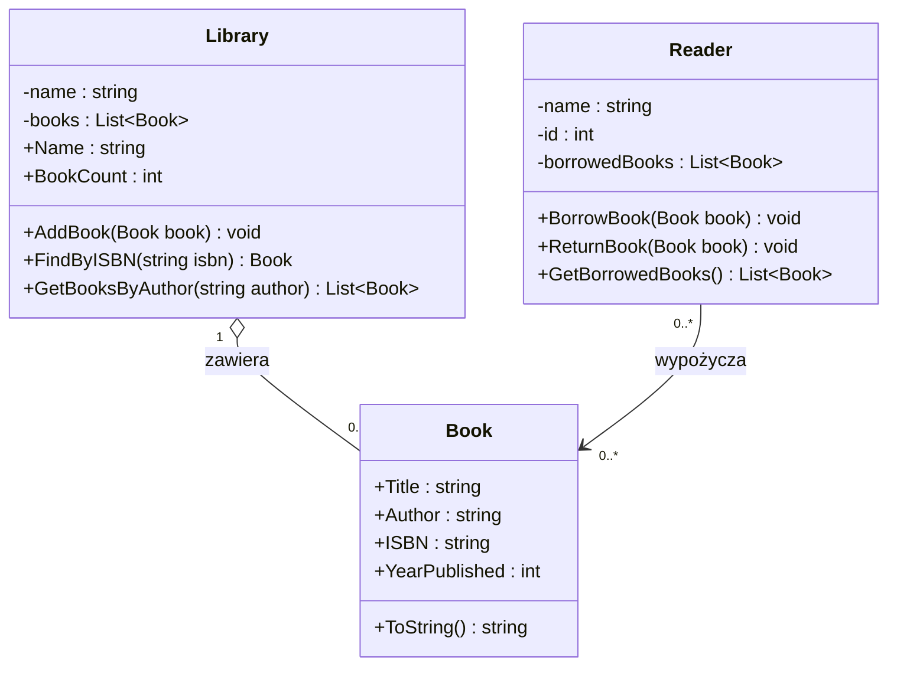
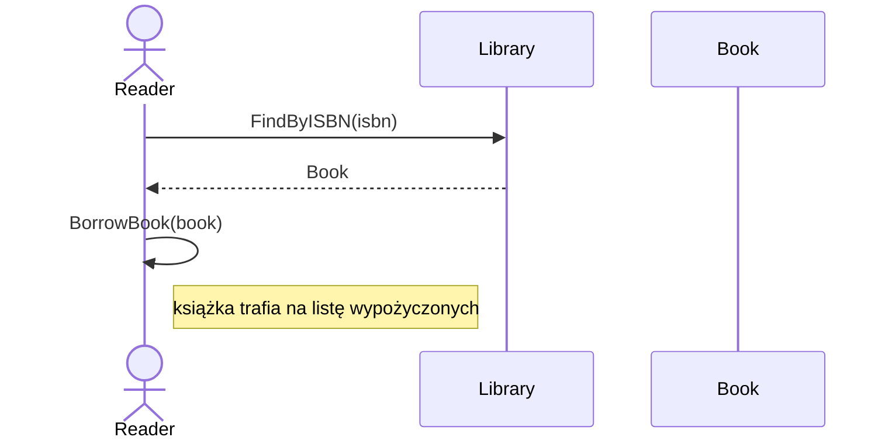
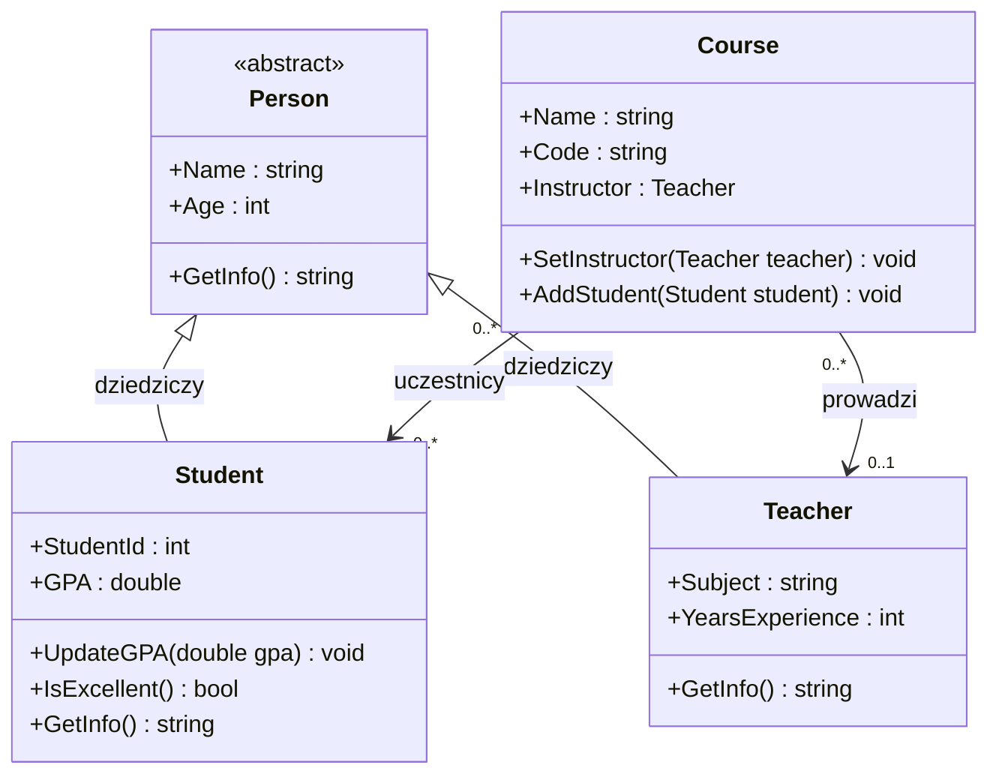
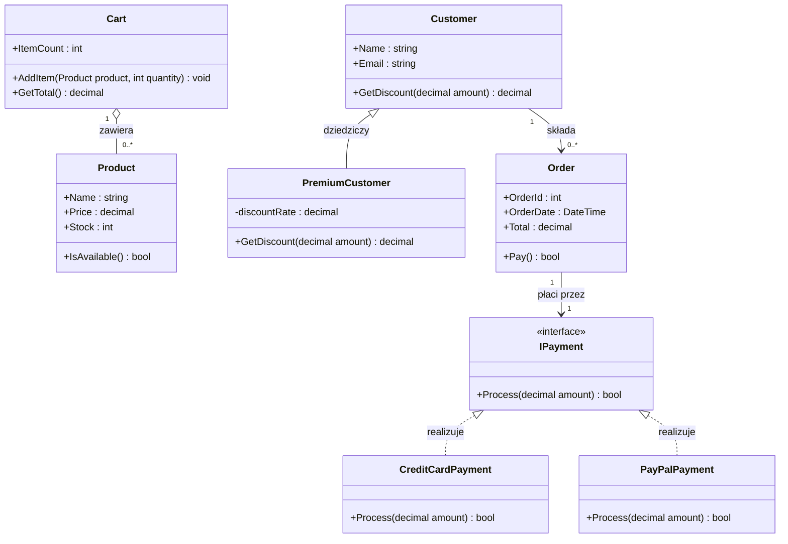

# Zadania - UML (Unified Modeling Language)

## 📝 Zadanie 1: Diagram biblioteki

Stwórz diagram UML dla systemu biblioteki zawierającego:
- `Book` (title, author, ISBN)
- `Library` (books[])
- `Reader` (name, id, books[])

Pokaż relacje z krotnościami i zdecyduj, czy relacja `Library`–`Book` to asocjacja, agregacja czy kompozycja
(uzasadnij: czy książka istnieje po likwidacji biblioteki?). Dodaj też diagram sekwencji dla scenariusza
„Czytelnik wypożycza książkę”.

> Nazwy klas piszemy po angielsku (`Reader`, nie `Czytelnik`) – nie mieszamy języków w identyfikatorach.

---

## 📝 Zadanie 2: Diagram szkoły

Zaprojektuj system szkoły z:
- `Person` (klasa bazowa)
- `Student` dziedziczy po `Person`
- `Teacher` dziedziczy po `Person`
- `Course` (klasa)
- Relacje: `Teacher` prowadzi `Course`, `Student` bierze `Course`

---

## 📝 Zadanie 3: Diagram e-commerce

Modeluj system sklepu online:
- `Product`, `Cart`, `Order`
- `Customer` (baza)
- `PremiumCustomer` dziedziczy po `Customer`
- `IPayment` (interfejs) z co najmniej dwiema implementacjami

---

## ✅ Zadanie 1 - Rozwiązanie: Diagram Biblioteki

### Diagram UML (Mermaid)


```mermaid
classDiagram
    class Book {
        +Title : string
        +Author : string
        +ISBN : string
        +YearPublished : int
        +ToString() string
    }

    class Library {
        -name : string
        -books : List~Book~
        +Name : string
        +BookCount : int
        +AddBook(Book book) void
        +FindByISBN(string isbn) Book
        +GetBooksByAuthor(string author) List~Book~
    }

    class Reader {
        -name : string
        -id : int
        -borrowedBooks : List~Book~
        +BorrowBook(Book book) void
        +ReturnBook(Book book) void
        +GetBorrowedBooks() List~Book~
    }

    Library "1" o-- "0..*" Book : zawiera
    Reader "0..*" --> "0..*" Book : wypożycza
```

### Diagram sekwencji - wypożyczenie książki


```mermaid
sequenceDiagram
    actor Reader
    participant Library
    participant Book

    Reader->>Library: FindByISBN(isbn)
    Library-->>Reader: Book
    Reader->>Reader: BorrowBook(book)
    Note right of Reader: książka trafia na listę wypożyczonych
```

### Kod - Book Class

```csharp
public class Book
{
    public string Title { get; }
    public string Author { get; }
    public string ISBN { get; }
    public int YearPublished { get; }
    
    public Book(string title, string author, string isbn, int year)
    {
        Title = title;
        Author = author;
        ISBN = isbn;
        YearPublished = year;
    }
    
    public override string ToString() => $"{Title} by {Author} ({ISBN})";
}
```

### Kod - Library Class

```csharp
public class Library
{
    private readonly string name;
    private readonly List<Book> books = new();
    
    public string Name => name;
    public int BookCount => books.Count;
    
    public Library(string name)
    {
        this.name = name;
    }
    
    public void AddBook(Book book)
    {
        ArgumentNullException.ThrowIfNull(book);
        if (!books.Contains(book))
            books.Add(book);
    }
    
    public Book? FindByISBN(string isbn)
    {
        return books.FirstOrDefault(b => b.ISBN == isbn);
    }
    
    public List<Book> GetBooksByAuthor(string author)
    {
        return books.Where(b => b.Author == author).ToList();
    }
    
    public override string ToString() => $"{name} ({BookCount} books)";
}
```

### Kod - Reader Class

```csharp
public class Reader
{
    private readonly string name;
    private readonly int id;
    private readonly List<Book> borrowedBooks = new();
    
    public string Name => name;
    public int Id => id;
    public int BorrowedCount => borrowedBooks.Count;
    
    public Reader(string name, int id)
    {
        this.name = name;
        this.id = id;
    }
    
    public void BorrowBook(Book book)
    {
        ArgumentNullException.ThrowIfNull(book);
        if (!borrowedBooks.Contains(book))
            borrowedBooks.Add(book);
    }
    
    public void ReturnBook(Book book)
    {
        borrowedBooks.Remove(book);
    }
    
    // Kopia - nie wystawiamy wewnętrznej listy na zewnątrz (enkapsulacja)
    public List<Book> GetBorrowedBooks() => borrowedBooks.ToList();
    
    public override string ToString() => $"{name} ({borrowedBooks.Count} books)";
}

// Test
var library = new Library("Biblioteka Publiczna");
var book1 = new Book("Quo Vadis", "Henryk Sienkiewicz", "978-0-1234567", 1896);
var book2 = new Book("Pan Tadeusz", "Adam Mickiewicz", "978-0-2234567", 1834);

library.AddBook(book1);
library.AddBook(book2);

var reader = new Reader("Jan Kowalski", 123);
reader.BorrowBook(book1);

Console.WriteLine($"Biblioteka: {library}");
Console.WriteLine($"Czytelnik: {reader}");
Console.WriteLine($"Wypożyczone: {string.Join(", ", reader.GetBorrowedBooks())}");
```

### Wyjaśnienie

- **1 Library** zawiera **wiele Books** (1 : 0..*)
- **Wielu Readerów** może wypożyczać **wiele Books** (* : *)
- **Agregacja** (`o--`): `Library` „ma” `Book`i, ale książki istnieją niezależnie od biblioteki (mogą trafić do innej)
- **Asocjacja** (`-->`): `Reader` jedynie odnosi się do `Book` (nie jest jej właścicielem)
- Diagram pokazuje tylko istotne składowe – kod ma też konstruktory, których nie rysujemy

---

## ✅ Zadanie 2 - Rozwiązanie: Diagram Szkoły

### Diagram UML


```mermaid
classDiagram
    class Person {
        <<abstract>>
        +Name : string
        +Age : int
        +GetInfo() string
    }

    class Student {
        +StudentId : int
        +GPA : double
        +UpdateGPA(double gpa) void
        +IsExcellent() bool
        +GetInfo() string
    }

    class Teacher {
        +Subject : string
        +YearsExperience : int
        +GetInfo() string
    }

    class Course {
        +Name : string
        +Code : string
        +Instructor : Teacher
        +SetInstructor(Teacher teacher) void
        +AddStudent(Student student) void
    }

    Person <|-- Student : dziedziczy
    Person <|-- Teacher : dziedziczy
    Course "0..*" --> "0..1" Teacher : prowadzi
    Course "0..*" --> "0..*" Student : uczestnicy
```

### Kod

```csharp
public abstract class Person
{
    public string Name { get; protected set; }
    public int Age { get; protected set; }
    
    protected Person(string name, int age)
    {
        Name = name;
        Age = age;
    }
    
    public virtual string GetInfo() => $"{Name}, {Age}";
}

public class Student : Person
{
    public int StudentId { get; private set; }
    public double GPA { get; private set; }
    
    public Student(string name, int age, int studentId) : base(name, age)
    {
        StudentId = studentId;
        GPA = 0.0;
    }
    
    public void UpdateGPA(double gpa)
    {
        GPA = Math.Min(4.0, Math.Max(0.0, gpa));
    }
    
    public bool IsExcellent() => GPA >= 3.5;
    
    public override string GetInfo() => $"{base.GetInfo()}, ID: {StudentId}, GPA: {GPA:F2}";
    
    public override string ToString() => $"Student: {Name} (ID:{StudentId}, GPA:{GPA:F2})";
}

public class Teacher : Person
{
    public string Subject { get; private set; }
    public int YearsExperience { get; private set; }
    
    public Teacher(string name, int age, string subject, int years = 0) : base(name, age)
    {
        Subject = subject;
        YearsExperience = years;
    }
    
    public override string GetInfo() => $"{base.GetInfo()}, {Subject}";
    
    public override string ToString() => $"Teacher: {Name} ({Subject}, {YearsExperience} years)";
}

public class Course
{
    public string Name { get; private set; }
    public string Code { get; private set; }
    public Teacher? Instructor { get; private set; }
    private List<Student> students = new();
    
    public Course(string name, string code)
    {
        Name = name;
        Code = code;
    }
    
    public void SetInstructor(Teacher teacher)
    {
        Instructor = teacher;
    }
    
    public void AddStudent(Student student)
    {
        if (!students.Contains(student))
            students.Add(student);
    }
    
    public override string ToString() => $"{Code}: {Name} ({students.Count} students)";
}

// Test
var teacher = new Teacher("Dr. Smith", 45, "Mathematics", 10);
var course = new Course("Calculus 101", "MATH101");
course.SetInstructor(teacher);

var student1 = new Student("Alice", 20, 1001);
student1.UpdateGPA(3.8);
course.AddStudent(student1);

Console.WriteLine($"Course: {course}");
Console.WriteLine($"Teacher: {teacher}");
Console.WriteLine($"Student: {student1} - Excellent: {student1.IsExcellent()}");
```

### Wyjaśnienie

- **Dziedziczenie**: `Student` i `Teacher` dziedziczą po `Person` (`<|--`)
- **Asocjacja**: `Course` zna swojego `Teacher`a i listę `Student`ów (`-->` – strzałka pokazuje kierunek nawigacji: kurs ma referencje)
- **Krotność**: jeden nauczyciel może prowadzić *wiele* kursów (0..*), kurs ma co najwyżej jednego prowadzącego (0..1)
- **Klasa abstrakcyjna**: `Person` (`<<abstract>>`) – nie tworzymy „samej osoby”
- **Polimorfizm**: `GetInfo()` jest przesłaniane (`override`) w `Student` i `Teacher`

---

## ✅ Zadanie 3 - Rozwiązanie: Diagram E-commerce

### Diagram UML


```mermaid
classDiagram
    class Product {
        +Name : string
        +Price : decimal
        +Stock : int
        +IsAvailable() bool
    }

    class Cart {
        +ItemCount : int
        +AddItem(Product product, int quantity) void
        +GetTotal() decimal
    }

    class Customer {
        +Name : string
        +Email : string
        +GetDiscount(decimal amount) decimal
    }

    class PremiumCustomer {
        -discountRate : decimal
        +GetDiscount(decimal amount) decimal
    }

    class Order {
        +OrderId : int
        +OrderDate : DateTime
        +Total : decimal
        +Pay() bool
    }

    class IPayment {
        <<interface>>
        +Process(decimal amount) bool
    }

    class CreditCardPayment {
        +Process(decimal amount) bool
    }

    class PayPalPayment {
        +Process(decimal amount) bool
    }

    Cart "1" o-- "0..*" Product : zawiera
    Customer "1" --> "0..*" Order : składa
    Customer <|-- PremiumCustomer : dziedziczy
    Order "1" --> "1" IPayment : płaci przez
    IPayment <|.. CreditCardPayment : realizuje
    IPayment <|.. PayPalPayment : realizuje
```

### Kod

```csharp
public class Product
{
    public string Name { get; }
    public decimal Price { get; }
    public int Stock { get; }
    
    public Product(string name, decimal price, int stock = 1)
    {
        ArgumentException.ThrowIfNullOrWhiteSpace(name);
        ArgumentOutOfRangeException.ThrowIfNegative(price);
        ArgumentOutOfRangeException.ThrowIfNegative(stock);
        
        Name = name;
        Price = price;
        Stock = stock;
    }
    
    public bool IsAvailable() => Stock > 0;
}

public class Cart
{
    private readonly Dictionary<Product, int> items = new();
    
    public void AddItem(Product product, int quantity = 1)
    {
        ArgumentNullException.ThrowIfNull(product);
        if (quantity < 1)
            throw new ArgumentOutOfRangeException(nameof(quantity));
        if (!product.IsAvailable())
            throw new InvalidOperationException($"Produkt '{product.Name}' jest niedostępny");
        
        items[product] = items.GetValueOrDefault(product) + quantity;
    }
    
    public decimal GetTotal() => items.Sum(item => item.Key.Price * item.Value);
    public int ItemCount => items.Count;
}

// Customer jest klasą konkretną z metodą wirtualną - zwykły klient nie ma rabatu
public class Customer
{
    public string Name { get; }
    public string Email { get; }
    
    public Customer(string name, string email)
    {
        Name = name;
        Email = email;
    }
    
    public virtual decimal GetDiscount(decimal amount) => 0m;
}

public class PremiumCustomer : Customer
{
    private readonly decimal discountRate;   // decimal, bo to kwoty pieniężne (nie double!)
    
    public PremiumCustomer(string name, string email, decimal discountRate) : base(name, email)
    {
        this.discountRate = discountRate;
    }
    
    public override decimal GetDiscount(decimal amount) => amount * discountRate;
}

public interface IPayment
{
    bool Process(decimal amount);
}

public class CreditCardPayment : IPayment
{
    public bool Process(decimal amount)
    {
        Console.WriteLine($"Processing credit card payment: {amount:C}");
        return true;
    }
}

public class PayPalPayment : IPayment
{
    public bool Process(decimal amount)
    {
        Console.WriteLine($"Processing PayPal payment: {amount:C}");
        return true;
    }
}

public class Order
{
    private static int _lastId = 1000;
    
    public int OrderId { get; }
    public DateTime OrderDate { get; }
    public decimal Total { get; }
    public IPayment Payment { get; }
    
    public Order(decimal total, IPayment payment)
    {
        OrderId = Interlocked.Increment(ref _lastId);   // unikalny numer zamówienia
        OrderDate = DateTime.Now;
        Total = total;
        Payment = payment;
    }
    
    // Zamówienie zna swoją kwotę - nie trzeba jej przekazywać z zewnątrz
    public bool Pay() => Payment.Process(Total);
}

// Test
var laptop = new Product("Laptop", 1200m, stock: 5);
var mouse = new Product("Mouse", 25m, stock: 50);

var customer = new PremiumCustomer("Jan Nowak", "jan@example.com", 0.1m);  // 10% rabatu
var cart = new Cart();
cart.AddItem(laptop);
cart.AddItem(mouse, 2);

decimal total = cart.GetTotal();                    // 1250
decimal discount = customer.GetDiscount(total);     // 125
decimal finalAmount = total - discount;             // 1125

Console.WriteLine($"Cart total: {total:C}");
Console.WriteLine($"Discount: {discount:C}");
Console.WriteLine($"Final: {finalAmount:C}");

var order = new Order(finalAmount, new CreditCardPayment());
order.Pay();
```

### Wyjaśnienie

- **Interfejs**: `IPayment` (`<<interface>>`) – wiele implementacji; `Order` zależy od interfejsu, nie od konkretnej klasy
- **Polimorfizm**: `CreditCardPayment` i `PayPalPayment` realizują `IPayment` różnie; `PremiumCustomer` przesłania `GetDiscount`
- **Dziedziczenie**: `PremiumCustomer` dziedziczy po `Customer` (`<|--`)
- **Agregacja**: `Cart` zawiera `Product`y, ale produkty istnieją w katalogu niezależnie od koszyka
- **Asocjacja**: `Customer` składa wiele `Order`ów (`1` → `0..*`)
- **Strategia**: to wzorzec Strategy – sposób płatności wymienia się bez zmian w `Order`
- **Kwoty pieniężne zawsze jako `decimal`** – `double` daje błędy zaokrągleń binarnych (np. `0.1 + 0.2 != 0.3`)
- Uwaga projektowa: prawdziwy koszyk musi też obsłużyć zmniejszanie stanu magazynowego i usuwanie pozycji – tu
  pominięte, by skupić się na notacji UML

---

## 🧪 Testy

```csharp
[Fact]
public void UML_Library_System()
{
    var lib = new Library("City Library");
    var book = new Book("1984", "Orwell", "978-0451524935", 1949);
    lib.AddBook(book);
    
    Assert.Equal(1, lib.BookCount);
    Assert.Same(book, lib.FindByISBN("978-0451524935"));
}

[Fact]
public void UML_School_System()
{
    var teacher = new Teacher("Dr. Smith", 45, "Math");
    var student = new Student("Alice", 20, 1001);
    var course = new Course("Calculus", "MATH101");
    
    course.SetInstructor(teacher);
    course.AddStudent(student);
    
    Assert.Same(teacher, course.Instructor);
    Assert.Contains("Math", teacher.GetInfo());   // przesłonięte GetInfo
}

[Fact]
public void UML_Ecommerce_System()
{
    var laptop = new Product("Laptop", 1000m);   // domyślnie 1 szt. na stanie
    var cart = new Cart();
    cart.AddItem(laptop);
    
    Assert.Equal(1000m, cart.GetTotal());
}

[Fact]
public void UML_Ecommerce_OutOfStockProduct_CannotBeAdded()
{
    var cart = new Cart();
    
    Assert.Throws<InvalidOperationException>(() => cart.AddItem(new Product("Ghost", 10m, stock: 0)));
}

[Fact]
public void UML_Ecommerce_PremiumCustomer_GetsDiscount()
{
    Customer regular = new Customer("A", "a@example.com");
    Customer premium = new PremiumCustomer("B", "b@example.com", 0.1m);
    
    Assert.Equal(0m, regular.GetDiscount(200m));
    Assert.Equal(20m, premium.GetDiscount(200m));   // polimorfizm przez zmienną typu bazowego
}
```

---

## 📊 UML Quick Reference

| Symbol (Mermaid) | Znaczenie | Przykład |
|--------|-----------|----------|
| `-` | private | `-name : string` |
| `+` | public | `+Update() void` |
| `#` | protected | `#Validate() bool` |
| `<\|--` | Dziedziczenie | `Person <\|-- Student` |
| `<\|..` | Realizacja interfejsu | `IPayment <\|.. PayPalPayment` |
| `-->` | Asocjacja (kierunkowa) | `Course --> Teacher` |
| `o--` | Agregacja | `Library o-- Book` |
| `*--` | Kompozycja | `Car *-- Engine` |
| `..>` | Zależność | `Order ..> IPayment` |
| `"1"`, `"0..*"` | Krotność | `Library "1" o-- "0..*" Book` |

---

## 📚 Zasoby Edukacyjne

**Pojęcia kluczowe**:
- UML to standard do modelowania systemów oprogramowania
- Diagramy pokazują strukturę i relacje między klasami (oraz interakcje w czasie – diagram sekwencji)
- Narzędzia: Mermaid (tekst w Markdown), PlantUML, draw.io, StarUML

**Interaktywny edytor Mermaid**:
- https://mermaid.live – rysuj diagramy UML online

**Dokumentacja**:
- https://learn.microsoft.com/en-us/dotnet/standard/design-guidelines/
- https://mermaid.js.org/syntax/classDiagram.html
