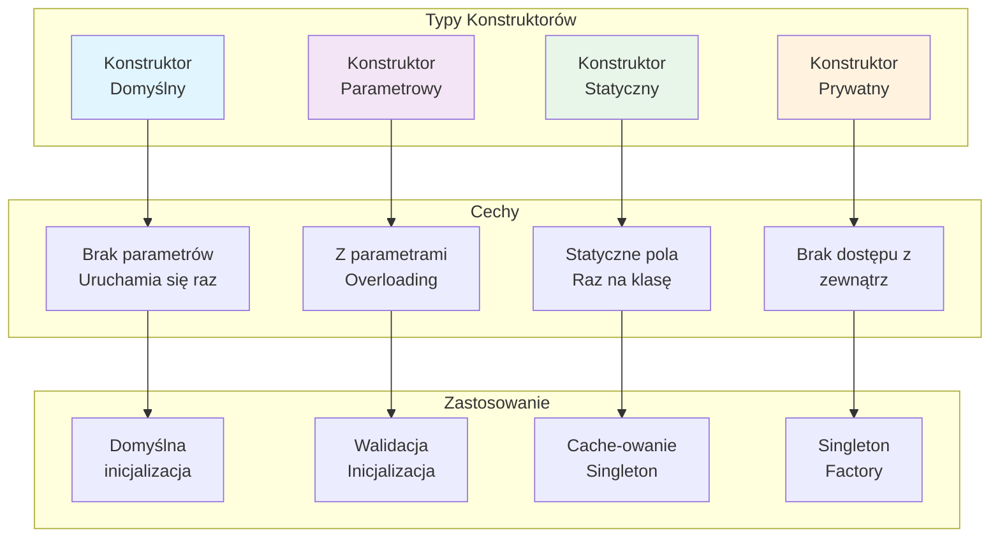
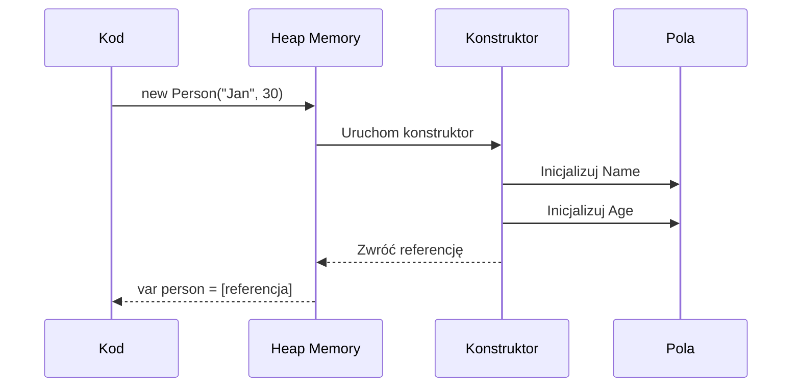

# Konstruktory: o co chodzi?

## 🎯 Cel rozdziału

Zrozumienie roli konstruktorów w C#, ich syntaktyki, parametrów, i różnych typów konstruktorów (domyślny, parametrowy, statyczny, prywatny).

## 📚 Spis treści

1. [Co to jest konstruktor?](#co-to-jest-konstruktor)
2. [Konstruktor domyślny](#konstruktor-domyślny)
3. [Konstruktor parametrowy](#konstruktor-parametrowy)
4. [Konstruktor statyczny](#konstruktor-statyczny)
5. [Konstruktor prywatny](#konstruktor-prywatny)
6. [Best Practices](#best-practices)
7. [Diagrama koncepcji](#diagrama-koncepcji)
8. [Podsumowanie](#podsumowanie)

---

## Co to jest konstruktor?

**Konstruktor** to specjalna metoda wywoływana automatycznie w momencie tworzenia nowej instancji klasy. Jego głównym zadaniem jest inicjalizacja pól i właściwości obiektu.

### Definicja formalna

```csharp
public class Person
{
    // Konstruktor - ma taką samą nazwę jak klasa
    public Person(string name, int age)
    {
        Name = name;
        Age = age;
    }
    
    public string Name { get; set; }
    public int Age { get; set; }
}
```

### Kiedy konstruktor się uruchamia?

```csharp
// Konstruktor uruchamia się w momencie użycia operatora 'new'
var person = new Person("Anna", 30);  // ← Tutaj uruchamia się konstruktor
```

---

## Konstruktor domyślny

**Konstruktor domyślny** to konstruktor bez parametrów. Jeśli go nie zdefiniujesz, C# automatycznie generuje pusty:

```csharp
public class Car
{
    // Jeśli nie definiujesz żadnego konstruktora,
    // C# automatycznie tworzy domyślny:
    // public Car() { }
}

// Użycie
var car = new Car();  // Domyślny konstruktor uruchamia się automatycznie
```

### Problem: domyślny konstruktor może być zbyt permisywny

```csharp
public class BankAccount
{
    public decimal Balance { get; set; }
    
    // Niebezpieczeństwo: można utworzyć konto bez inicjalizacji
    // var account = new BankAccount();  // Balance = 0 (nieistniejące konto!)
}
```

**Rozwiązanie**: zdefiniuj jawnie konstruktor z parametrami:

```csharp
public class BankAccount
{
    private decimal balance;
    
    public BankAccount(decimal initialBalance)
    {
        if (initialBalance < 0)
            throw new ArgumentException("Saldo nie może być ujemne!");
        
        balance = initialBalance;
    }
    
    public decimal Balance => balance;
}

// Teraz trzeba podać saldo przy tworzeniu:
var account = new BankAccount(1000);  // OK
// var account = new BankAccount();    // BŁĄD kompilacji!
```

---

## Konstruktor parametrowy

**Konstruktor parametrowy** to konstruktor przyjmujący argumenty. Może być wiele wersji (overloading):

```csharp
public class Employee
{
    public string Name { get; set; }
    public string Department { get; set; }
    public decimal Salary { get; set; }
    
    // Konstruktor 1: tylko imię
    public Employee(string name)
    {
        Name = name;
        Department = "HR";
        Salary = 3000;
    }
    
    // Konstruktor 2: imię i dział
    public Employee(string name, string department)
    {
        Name = name;
        Department = department;
        Salary = 3000;
    }
    
    // Konstruktor 3: wszystkie pola
    public Employee(string name, string department, decimal salary)
    {
        Name = name;
        Department = department;
        Salary = salary;
    }
}

// Używanie
var emp1 = new Employee("Jan");
var emp2 = new Employee("Maria", "IT");
var emp3 = new Employee("Piotr", "Finance", 5000);
```

### Problem: Powtórzenie kodu

Powyższy kod ma duplikacje. Rozwiązanie: łańcuchowe konstruktory (`this()`) - omówione w Temacie 2.

---

## Konstruktor statyczny

**Konstruktor statyczny** inicjalizuje statyczne pola klasy. Uruchamia się raz, przed pierwszym użyciem klasy:

```csharp
public class Logger
{
    // Statyczne pole - dzielone przez wszystkie instancje
    private static int logCount = 0;
    private static string logFile;
    
    // Konstruktor statyczny - uruchamia się raz
    static Logger()
    {
        logFile = "logs.txt";
        File.WriteAllText(logFile, "Logger initialized\n");
        Console.WriteLine("Logger static constructor called");
    }
    
    // Konstruktor zwykły
    public Logger(string name)
    {
        Console.WriteLine($"Logger instance for {name} created");
    }
    
    public static int GetLogCount() => logCount;
}

// Użycie
Console.WriteLine("Before using Logger");
var log1 = new Logger("Main");     // Konstruktor statyczny uruchamia się tutaj!
var log2 = new Logger("Service");  // Konstruktor statyczny się nie powtarza
```

**Wynik:**
```
Before using Logger
Logger static constructor called
Logger instance for Main created
Logger instance for Service created
```

---

## Konstruktor prywatny

**Konstruktor prywatny** uniemożliwia tworzenie instancji z zewnątrz. Używa się do implementacji wzorców jak Singleton lub Factory:

### Singleton Pattern

```csharp
public class Database
{
    private static Database instance;
    
    // Prywatny konstruktor - nie można tworzyć z zewnątrz
    private Database()
    {
        Console.WriteLine("Database initialized");
    }
    
    // Statyczna metoda do pobrania instancji
    public static Database GetInstance()
    {
        if (instance == null)
        {
            instance = new Database();  // OK - wewnątrz klasy
        }
        return instance;
    }
    
    public void Query(string sql)
    {
        Console.WriteLine($"Executing: {sql}");
    }
}

// Użycie
var db1 = Database.GetInstance();
var db2 = Database.GetInstance();
Console.WriteLine(ReferenceEquals(db1, db2));  // True - to ta sama instancja!

// var db3 = new Database();  // BŁĄD! Konstruktor jest prywatny
```

### Factory Pattern

```csharp
public class Document
{
    public string Type { get; }
    public string Content { get; }
    
    // Prywatny konstruktor
    private Document(string type, string content)
    {
        Type = type;
        Content = content;
    }
    
    // Statyczne fabryki
    public static Document CreatePDF(string content)
        => new Document("PDF", content);
    
    public static Document CreateWord(string content)
        => new Document("Word", content);
    
    public static Document CreateHTML(string content)
        => new Document("HTML", content);
}

// Użycie
var pdf = Document.CreatePDF("Hello PDF");
var doc = Document.CreateWord("Hello Word");
var web = Document.CreateHTML("Hello Web");

Console.WriteLine(pdf.Type);   // PDF
Console.WriteLine(doc.Type);   // Word
```

---

## Best Practices

### ✅ Dobre praktyki

1. **Zawsze waliduj parametry** w konstruktorze:
   ```csharp
   public class Age
   {
       private int years;
       
       public Age(int years)
       {
           if (years < 0 || years > 150)
               throw new ArgumentException("Wiek musi być między 0 a 150");
           
           this.years = years;
       }
   }
   ```

2. **Unikaj ciężkich operacji w konstruktorze**:
   ```csharp
   // ❌ Źle - konstruktor nie powinien robić I/O
   public class UserManager
   {
       public UserManager()
       {
           var users = File.ReadAllText("users.json");  // Slow!
       }
   }
   
   // ✅ Dobrze - rozdziel tworzenie od inicjalizacji
   public class UserManager
   {
       public UserManager() { }
       
       public async Task InitializeAsync()
       {
           var users = await File.ReadAllTextAsync("users.json");
       }
   }
   ```

3. **Używaj właściwości zamiast pól**:
   ```csharp
   // ❌ Źle
   public class Person
   {
       public string name;  // pole publiczne
   }
   
   // ✅ Dobrze
   public class Person
   {
       public string Name { get; set; }  // właściwość
   }
   ```

4. **Preferuj readonly dla niezmiennych pól**:
   ```csharp
   public class Person
   {
       private readonly string name;  // Nie można zmienić po inicjalizacji
       
       public Person(string name) => this.name = name;
       
       public string Name => name;
   }
   ```

5. **Dokumentuj konstruktory XML komentarzami**:
   ```csharp
   /// <summary>
   /// Tworzy nową instancję klasy Person.
   /// </summary>
   /// <param name="name">Pełne imię i nazwisko</param>
   /// <param name="age">Wiek osoby (0-150)</param>
   /// <exception cref="ArgumentNullException">Jeśli name jest null</exception>
   public Person(string name, int age)
   {
       if (string.IsNullOrWhiteSpace(name))
           throw new ArgumentNullException(nameof(name));
       
       Name = name;
       Age = age;
   }
   ```

---

## Diagrama koncepcji



---

## Diagram przepływu - tworzenie obiektu



---

## Podsumowanie

| Typ Konstruktora | Cechy | Zastosowanie |
|------------------|-------|--------------|
| **Domyślny** | Brak parametrów, auto-generated | Proste inicjalizacje |
| **Parametrowy** | Z parametrami, overloading | Walidacja, flexibilność |
| **Statyczny** | Inicjalizuje pola statyczne | Cache, singleton |
| **Prywatny** | Brak dostępu z zewnątrz | Singleton, factory |

---

## 🚀 Jak pracować z tym tematem

```bash
cd code/

# Uruchom demonstrację
rtk dotnet run

# Uruchom testy
rtk dotnet test

# Zbuduj projekt
rtk dotnet build
```

---

## 📖 Referencje

- [Microsoft Learn: Constructors](https://learn.microsoft.com/en-us/dotnet/csharp/programming-guide/classes-and-structs/constructors)
- [MSDN: Static Constructors](https://learn.microsoft.com/en-us/dotnet/csharp/programming-guide/classes-and-structs/static-constructors)
- [YouTube: C# Constructors](https://www.youtube.com/results?search_query=C%23+constructors+tutorial)

---

**Przejdź do**: [Zadania do samodzielnego wykonania](tasks/README.md)
