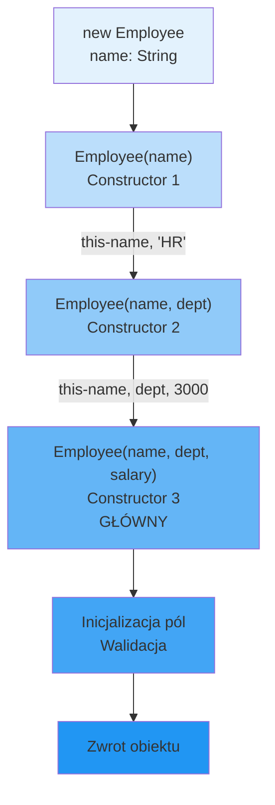

# Łańcuchowe Wywołanie Konstruktorów

## 🎯 Cel rozdziału

Zrozumienie, jak unikać duplikacji kodu w konstruktorach poprzez używanie słowa kluczowego `this()` do łańcuchowania konstruktorów.

## 📚 Spis treści

1. [Problem: Duplikacja kodu](#problem-duplikacja-kodu)
2. [Rozwiązanie: this()](#rozwiązanie-this)
3. [Kolejność wykonania](#kolejność-wykonania)
4. [Best Practices](#best-practices)
5. [Zaawansowane wzorce](#zaawansowane-wzorce)
6. [Diagrama koncepcji](#diagrama-koncepcji)

---

## Problem: Duplikacja kodu

Bez łańcuchowania konstruktorów, kod się powtarza:

```csharp
public class Employee
{
    public string Name { get; set; }
    public string Department { get; set; }
    public decimal Salary { get; set; }
    
    // Konstruktor 1
    public Employee(string name)
    {
        Name = name;
        Department = "HR";
        Salary = 3000;
    }
    
    // Konstruktor 2 - DUPLIKACJA
    public Employee(string name, string department)
    {
        Name = name;              // Powtórzenie
        Department = department;
        Salary = 3000;            // Powtórzenie
    }
    
    // Konstruktor 3 - JESZCZE WIĘCEJ DUPLIKACJI
    public Employee(string name, string department, decimal salary)
    {
        Name = name;              // Powtórzenie
        Department = department;  // Powtórzenie
        Salary = salary;
    }
}
```

**Problemy:**
- ❌ Kod się powtarza
- ❌ Jeśli zmienisz inicjalizację, musisz zmienić we wszystkich konstruktorach
- ❌ Walidacja jest rozproszona

---

## Rozwiązanie: this()

Używając `this()`, jeden konstruktor może wywoływać inny konstruktor tej samej klasy:

```csharp
public class Employee
{
    public string Name { get; set; }
    public string Department { get; set; }
    public decimal Salary { get; set; }
    
    // Konstruktor 1: najmniej parametrów
    public Employee(string name) 
        : this(name, "HR")  // Łańcuch do konstruktora 2
    {
    }
    
    // Konstruktor 2: średniozaawansowany
    public Employee(string name, string department)
        : this(name, department, 3000)  // Łańcuch do konstruktora 3
    {
    }
    
    // Konstruktor 3: pełny konstruktor (główny)
    public Employee(string name, string department, decimal salary)
    {
        // Tylko tutaj logika inicjalizacji
        if (string.IsNullOrWhiteSpace(name))
            throw new ArgumentException("Name cannot be empty");
        
        Name = name;
        Department = department;
        Salary = salary;
    }
}
```

**Korzyści:**
- ✅ Brak duplikacji kodu
- ✅ Walidacja w jednym miejscu
- ✅ Łatwo znaleźć główną inicjalizację
- ✅ Zachowanie DRY (Don't Repeat Yourself)

---

## Kolejność Wykonania

Ważne: łańcuch konstruktorów wykonuje się **od najmniej do najbardziej parametrowego**:

```csharp
var emp = new Employee("Jan");

// Kolejność wykonania:
// 1. Najpierw się uruchamia this(name, "HR")
// 2. Potem this(name, department, 3000)
// 3. Wreszcie kod głównego konstruktora (z 3 parametrami)
```

### Wizualizacja

```
new Employee("Jan")
        ↓
    this("Jan", "HR")
        ↓
    this("Jan", "HR", 3000)
        ↓
    [główny konstruktor - logika]
```

---

## Praktyczne Przykłady

### Przykład 1: Klasa Point

```csharp
public class Point
{
    public double X { get; }
    public double Y { get; }
    
    // Konstruktor dla punktu na osi X
    public Point(double x) : this(x, 0) { }
    
    // Konstruktor dla obu współrzędnych
    public Point(double x, double y)
    {
        if (double.IsNaN(x) || double.IsNaN(y))
            throw new ArgumentException("Coordinates cannot be NaN");
        
        X = x;
        Y = y;
    }
    
    public double Distance() => Math.Sqrt(X * X + Y * Y);
    
    public override string ToString() => $"({X}, {Y})";
}

// Użycie
var p1 = new Point(3);        // (3, 0)
var p2 = new Point(3, 4);     // (3, 4)
```

### Przykład 2: Klasa Configuration

```csharp
public class DatabaseConfig
{
    public string Server { get; }
    public string Database { get; }
    public int Port { get; }
    public string Username { get; }
    public string Password { get; }
    
    // Domyślna konfiguracja
    public DatabaseConfig() 
        : this("localhost", "mydb") { }
    
    // Z serwerem i bazą
    public DatabaseConfig(string server, string database)
        : this(server, database, 5432, "admin", "password") { }
    
    // Pełna konfiguracja
    public DatabaseConfig(string server, string database, int port, 
                         string username, string password)
    {
        if (port <= 0 || port > 65535)
            throw new ArgumentException("Invalid port");
        
        Server = server;
        Database = database;
        Port = port;
        Username = username;
        Password = password;
    }
    
    public string GetConnectionString() 
        => $"Server={Server};Database={Database};Port={Port};User={Username}";
}

// Użycie
var config1 = new DatabaseConfig();                          // Domyślna
var config2 = new DatabaseConfig("db.example.com", "shop");  // Z serwerem
var config3 = new DatabaseConfig("localhost", "test", 3306, "root", "secret");  // Pełna
```

---

## Best Practices

### ✅ Dobre praktyki

1. **Łańcuch od najmniej do najbardziej parametrowego**:
   ```csharp
   public Employee(string name) 
       : this(name, "HR") { }
   
   public Employee(string name, string dept) 
       : this(name, dept, 3000) { }
   
   public Employee(string name, string dept, decimal salary)
   {
       // Główna logika
   }
   ```

2. **Umieść logikę walidacji w głównym konstruktorze**:
   ```csharp
   public class Product
   {
       public string Name { get; }
       public decimal Price { get; }
       
       public Product(string name) 
           : this(name, 0) { }
       
       public Product(string name, decimal price)
       {
           // TUTAJ walidacja, nie w poprzednim
           if (string.IsNullOrEmpty(name))
               throw new ArgumentException();
           
           if (price < 0)
               throw new ArgumentException();
           
           Name = name;
           Price = price;
       }
   }
   ```

3. **Używaj wartości domyślnych w `this()`**:
   ```csharp
   public class Settings
   {
       public string Theme { get; }
       public bool DarkMode { get; }
       public int FontSize { get; }
       
       public Settings() 
           : this("Default") { }
       
       public Settings(string theme) 
           : this(theme, false) { }
       
       public Settings(string theme, bool darkMode)
           : this(theme, darkMode, 12) { }
       
       public Settings(string theme, bool darkMode, int fontSize)
       {
           Theme = theme;
           DarkMode = darkMode;
           FontSize = fontSize;
       }
   }
   ```

### ❌ Anty-wzorce

```csharp
// ❌ Nie łańcuchuj w złej kolejności
public class Bad
{
    public Bad(string name, string dept, decimal salary)
        : this(name) { }  // Źले - logika robi się skomplikowana
    
    public Bad(string name) { }
}

// ❌ Nie umieszczaj logiki w obu konstruktorach
public class Bad2
{
    public Bad2(string name) 
        : this(name, "HR") { }
    
    public Bad2(string name, string dept)
    {
        // Walidacja tutaj... i w konstruktorze 1? Duplikacja!
        if (string.IsNullOrEmpty(name)) throw new Exception();
        Name = name;
    }
    
    public string Name { get; set; }
}
```

---

## Zaawansowane Wzorce

### Wzorzec Fluent Builder + Constructor Chaining

```csharp
public class HttpRequest
{
    public string Url { get; }
    public string Method { get; }
    public Dictionary<string, string> Headers { get; }
    public string? Body { get; }
    
    public HttpRequest(string url) 
        : this(url, "GET") { }
    
    public HttpRequest(string url, string method)
        : this(url, method, new Dictionary<string, string>()) { }
    
    public HttpRequest(string url, string method, Dictionary<string, string> headers)
        : this(url, method, headers, null) { }
    
    public HttpRequest(string url, string method, Dictionary<string, string> headers, string? body)
    {
        Url = url;
        Method = method;
        Headers = headers;
        Body = body;
    }
    
    public HttpRequest WithHeader(string key, string value)
    {
        Headers[key] = value;
        return this;
    }
    
    public override string ToString() => $"{Method} {Url}";
}

// Użycie
var request = new HttpRequest("https://api.example.com/users")
    .WithHeader("Authorization", "Bearer token")
    .WithHeader("Content-Type", "application/json");
```

---

## Diagrama koncepcji



---

## Podsumowanie

| Aspekt | Opis |
|--------|------|
| **Cel** | Unikanie duplikacji w konstruktorach |
| **Syntaktyka** | `public Constructor(...) : this(...) { }` |
| **Kolejność** | Najmniej → Najbardziej parametrowy |
| **Walidacja** | W głównym konstruktorze |
| **Korzyści** | DRY, łatwość utrzymania, czystość kodu |

---

## 🚀 Jak pracować z tym tematem

```bash
cd code/

dotnet run
dotnet test
dotnet build
```

---

**Przejdź do**: [Zadania do samodzielnego wykonania](tasks/README.md)
