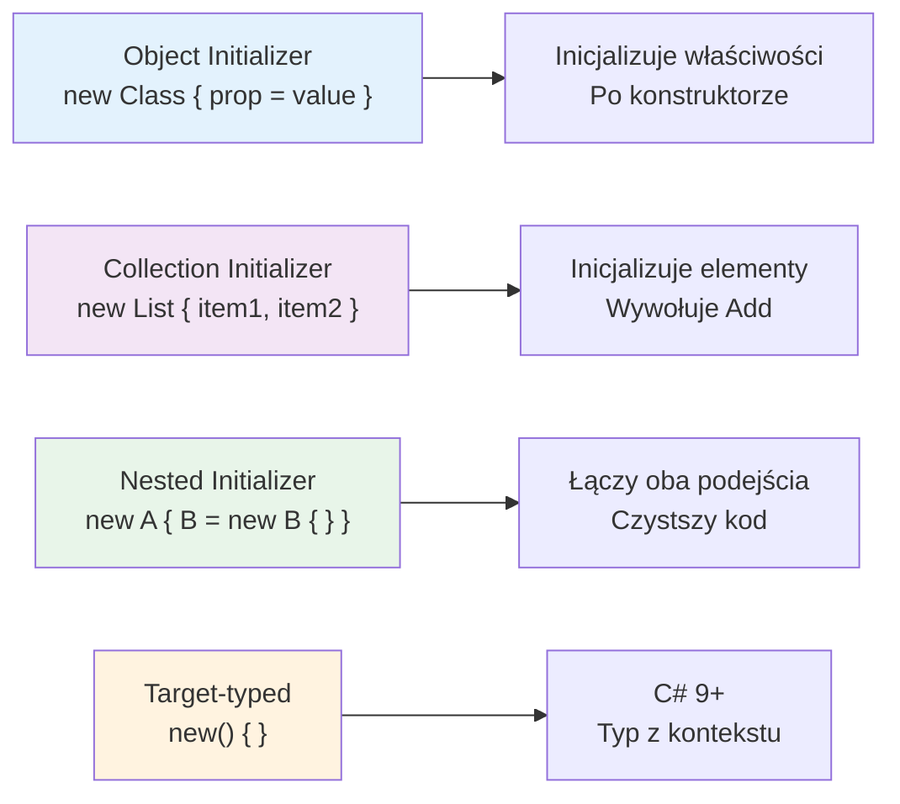

# Inicjalizatory Obiektów

## 🎯 Cel rozdziału

Zrozumienie inicjalizatorów obiektów i kolekcji - składni pozwalającej na eleganckie tworzenie i wypełnianie obiektów w jednym wyrażeniu, bez osobnych instrukcji przypisania po konstruktorze.

## 📚 Spis treści

1. [Object Initializers](#object-initializers)
2. [Collection Initializers](#collection-initializers)
3. [Nested Initializers](#nested-initializers)
4. [Target-typed expressions](#target-typed-expressions)
5. [Best Practices](#best-practices)

---

## Object Initializers

**Object Initializer** to składnia pozwalająca na ustawienie dostępnych składowych (właściwości z `set`/`init` oraz pól) obiektu bezpośrednio po wywołaniu konstruktora:

```csharp
// Tradycyjnie
var person = new Person("Jan", 30);
person.City = "Warszawa";
person.Email = "jan@example.com";

// Z initializer - czystsze!
var person = new Person("Jan", 30)
{
    City = "Warszawa",
    Email = "jan@example.com"
};
```

### Co robi kompilator?

Inicjalizator to **skrót składniowy** – settery **są wywoływane** (tak jak w pierwszej wersji). Kolejność:

1. wywołanie konstruktora,
2. przypisania w kolejności zapisu w inicjalizatorze (na tymczasowej zmiennej),
3. dopiero wtedy wynik trafia do zmiennej `person`.

Konsekwencja: jeśli któryś setter rzuci wyjątek, zmienna nie zostanie w ogóle przypisana (nie zobaczysz
obiektu „w połowie zainicjowanego”). Inicjalizator działa tylko dla składowych **dostępnych** z miejsca użycia
– `private set` blokuje go tak samo jak zwykłe przypisanie.

### `init` i `required` (C# 9 / C# 11)

```csharp
public class User
{
    public required string Email { get; init; }   // wymagane przy tworzeniu, potem tylko do odczytu
    public string? Nick { get; init; }            // opcjonalne
}

var u = new User { Email = "jan@example.com" };
// new User { Nick = "j" };   // BŁĄD kompilacji: brak wymaganego Email
// u.Email = "x";             // BŁĄD kompilacji: init-only
```

Połączenie inicjalizatora z `init`/`required` daje niezmienne obiekty tworzone czytelnie. Więcej w temacie 10.

### Przykład

```csharp
public class Car
{
    public string Brand { get; set; }
    public string Model { get; set; }
    public int Year { get; set; }
}

// Stosując initializer
var car = new Car
{
    Brand = "Tesla",
    Model = "Model 3",
    Year = 2024
};
```

### Inicjalizator bez konstruktora z parametrami

```csharp
var car = new Car()  // Konstruktor domyślny
{
    Brand = "BMW",
    Model = "X5",
    Year = 2023
};

// Nawet krócej - () jest opcjonalne
var car = new Car
{
    Brand = "BMW",
    Model = "X5",
    Year = 2023
};
```

---

## Collection Initializers

**Collection Initializer** to inicjalizowanie kolekcji elementami. Działa dla każdego typu, który implementuje `IEnumerable` i ma metodę `Add` – kompilator zamienia każdy element na wywołanie `Add(...)`:

```csharp
// Tradycyjnie
var numbers = new List<int>();
numbers.Add(1);
numbers.Add(2);
numbers.Add(3);

// Z initializer - zwięźle!
var numbers = new List<int> { 1, 2, 3 };

// Dictionary - wywołuje Add(klucz, wartość)
var ages = new Dictionary<string, int>
{
    { "Anna", 30 },
    { "Jan", 25 },
    { "Maria", 28 }
};

// Dictionary - index initializer (C# 6+): używa indeksatora []
var ages = new Dictionary<string, int>
{
    ["Anna"] = 30,
    ["Jan"] = 25,
    ["Maria"] = 28
};
```

> **Różnica:** `{ "Anna", 30 }` wywołuje `Add`, które przy zduplikowanym kluczu **rzuca** `ArgumentException`.
> `["Anna"] = 30` używa indeksatora, który **nadpisuje** istniejącą wartość bez błędu.

---

## Nested Initializers

Kombinowanie object i collection initializers:

```csharp
public class Person
{
    public string Name { get; set; } = "";
    public List<string> PhoneNumbers { get; set; } = new();   // musi być już utworzona (patrz uwaga)
    public Address Address { get; set; } = new();
}

public class Address
{
    public string Street { get; set; } = "";
    public string City { get; set; } = "";
}

// Zagnieżdżone initializers
var person = new Person
{
    Name = "Anna",
    PhoneNumbers = { "123456789", "987654321" },  // Collection initializer: DODAJE do istniejącej listy
    Address = new Address  // Nested object initializer
    {
        Street = "Piotrkowska 10",
        City = "Łódź"
    }
};
```

> **Pułapka:** zapis `PhoneNumbers = { "1", "2" }` (bez `new`) **nie tworzy** nowej listy, tylko wywołuje `Add` na liście,
> która już istnieje w właściwości. Gdyby właściwość miała wartość `null` (brak `= new()`), program rzuciłby
> `NullReferenceException`. Zapis `PhoneNumbers = new List<string> { "1", "2" }` podmienia całą listę.

---

## Target-typed Expressions

C# 9+ - możliwość pominięcia typu gdy jest znany z kontekstu:

```csharp
// C# 8 - trzeba podać typ
List<int> numbers = new List<int> { 1, 2, 3 };

// C# 9+ - typ jest znany z kontekstu
List<int> numbers = new() { 1, 2, 3 };

// W parametrach metod
public void PrintNumbers(List<int> numbers) { }

PrintNumbers(new() { 1, 2, 3 });  // Typ znany z sygnatury metody
```

### Wyrażenia kolekcji (C# 12)

Najnowsza, najkrótsza forma – nawiasy kwadratowe, działająca dla list, tablic, `Span<T>`, zbiorów i innych:

```csharp
List<int> numbers = [1, 2, 3];
int[] array = [1, 2, 3];

int[] more = [..numbers, 4, 5];   // spread: rozwija elementy innej kolekcji

PrintNumbers([1, 2, 3]);
```

Wyrażenia kolekcji **nie działają dla słowników** w C# 12–13 – tam nadal używamy `new() { ["a"] = 1 }`.

---

## Best Practices

### ✅ Dobre praktyki

1. **Używaj initializers dla czytelności**:
   ```csharp
   // ✅ Dobrze - jasne co się ustawia
   var config = new AppConfig
   {
       Debug = true,
       MaxConnections = 100,
       Timeout = 30
   };
   ```

2. **Łącz konstruktory z initializers**:
   ```csharp
   // ✅ Obowiązkowe w konstruktorze + opcjonalne w initializer
   var user = new User("john@example.com")  // Obowiązkowy email
   {
       FirstName = "John",  // Opcjonalne
       LastName = "Doe"
   };
   ```

3. **Kolekcje w initializer**:
   ```csharp
   var team = new Team
   {
       Name = "Development",
       Members = new List<string> { "Alice", "Bob", "Charlie" }
   };
   ```

---

## Diagrama koncepcji



---

## Podsumowanie

| Składnia | Działanie | Wersja C# |
|----------|----------|-----------|
| `new T { P = v }` | konstruktor + settery (`set`/`init`) | 3.0 |
| `new List<T> { a, b }` | wywołania `Add` | 3.0 |
| `new Dictionary<K,V> { [k] = v }` | indeksator (nadpisuje) | 6.0 |
| `T x = new() { ... }` | typ z kontekstu | 9.0 |
| `required` / `init` | wymuszone i niezmienne właściwości | 11.0 / 9.0 |
| `List<T> x = [a, b]` | wyrażenie kolekcji | 12.0 |

---

## 🚀 Jak pracować z tym tematem

```bash
cd code/
dotnet run
dotnet test
```

**Przejdź do**: [Zadania do samodzielnego wykonania](tasks/README.md)
