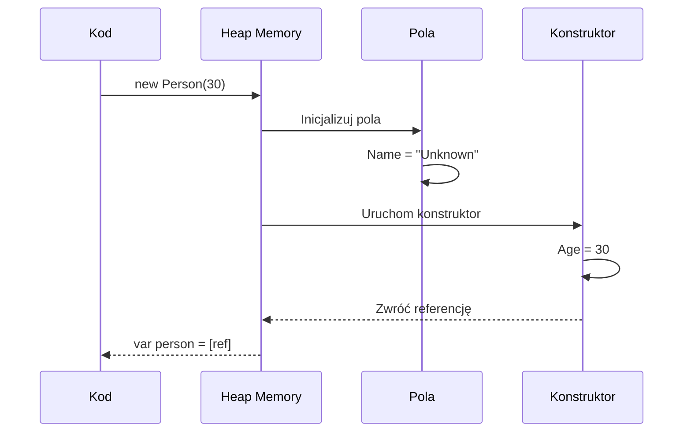

# Kolejność Inicjalizacji Obiektów i Pól

## 🎯 Cel rozdziału

Zrozumienie dokładnej kolejności wykonania kodu podczas tworzenia obiektu - pola, inicjalizatory, konstruktor.

## 📚 Spis treści

1. [Sekwencja inicjalizacji](#sekwencja-inicjalizacji)
2. [Pola vs Właściwości](#pola-vs-właściwości)
3. [Pola Initialize w konstruktorze](#pola-w-konstruktorze)
4. [Statyczne vs Instance](#statyczne-vs-instance)

---

## Sekwencja inicjalizacji

Dokładna kolejność dla klasy:

1. **Pola instance** - inicjalizatory (field initializers)
2. **Konstruktor** - ciało konstruktora
3. **Właściwości** - getter/setter jeśli używane w initializer

### Przykład

```csharp
public class Person
{
    // Krok 1: Pola inicjalizują się NAJPIERW
    public string Name { get; set; } = "Unknown";
    public int Age { get; set; }
    
    // Krok 2: Konstruktor uruchamia się DRUGI
    public Person(int age)
    {
        Console.WriteLine($"[Constructor] Setting age to {age}");
        Age = age;
    }
}

var person = new Person(30);
// Wynik:
// [Field Init] Name = "Unknown"
// [Constructor] Setting age to 30
```

---

## Pola vs Właściwości

```csharp
public class Example
{
    // Pole z inicjalizatorem
    private string field = "field value";
    
    // Właściwość auto
    public string Prop { get; set; } = "prop value";
    
    // W konstruktorze - oba już zainicjalizowane
    public Example()
    {
        Console.WriteLine($"field: {field}");   // "field value"
        Console.WriteLine($"Prop: {Prop}");     // "prop value"
    }
}
```

---

## Diagram sekwencji



---

## Zalecenia

- ✅ Inicjalizuj pola wartościami domyślnymi
- ✅ Rozszerz inicjalizację w konstruktorze
- ✅ Unikaj złożonej logiki w initializers pól
- ✅ Pamiętaj: pola inicjalizują się PRZED konstruktorem

---

## 🚀 Jak pracować z tym tematem

```bash
cd code/
dotnet run
dotnet test
```

**Przejdź do**: [Zadania do samodzielnego wykonania](tasks/README.md)
