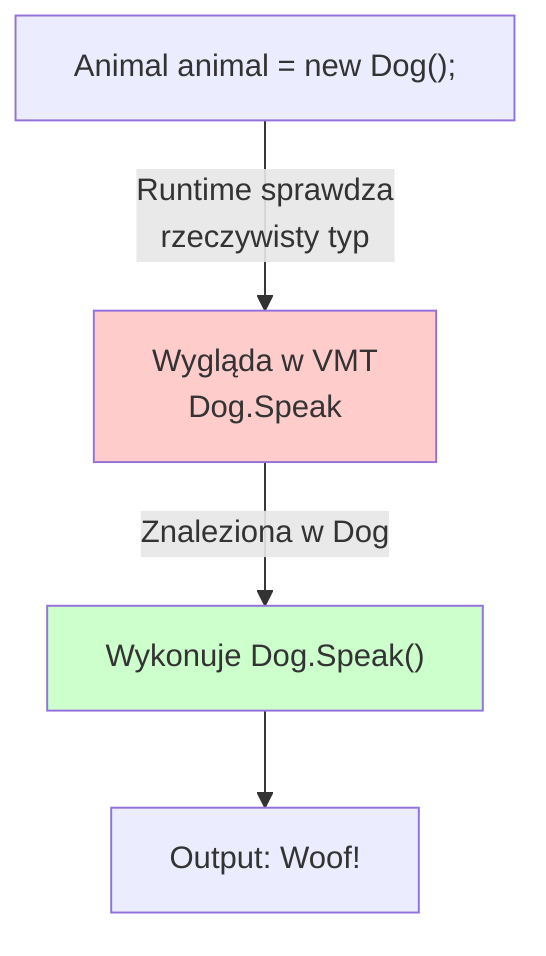

# Temat 1: Funkcje Wirtualne - Wstęp

## 📌 Cel Tematu

Zrozumienie **funkcji wirtualnych** (`virtual`) jako fundamentu **polimorfizmu** w C# - mechanizmu pozwalającego na dynamiczne wiązanie (late binding) metod w runtime.

## 🎯 Kluczowe Koncepty

### 1. Co to jest funkcja wirtualna?

Funkcja wirtualna to metoda w klasie bazowej, którą możemy **przesłonić** (override) w klasach pochodnych. Jej wykonanie jest określane **w runtime** na podstawie rzeczywistego typu obiektu, a nie typu zmiennej.

```csharp
public class Animal
{
    public virtual void Speak()  // Słowo virtual oznacza: mogę być przesłonięta
    {
        Console.WriteLine("Generic animal sound");
    }
}

public class Dog : Animal
{
    public override void Speak()  // override - przesłaniamy metodę
    {
        Console.WriteLine("Woof! Woof!");
    }
}
```

### 2. Polimorfizm a Funkcje Wirtualne

**Polimorfizm** (z grec. "wiele form") oznacza, że ten sam kod może działać na różne sposoby:

```csharp
Animal animal = new Dog();        // Zmienna typu Animal
animal.Speak();                    // Ale wołamy Dog.Speak()!
                                   // Compiler: pytaj Animala
                                   // Runtime: wykonaj Dog'a
```

To jest **wczesne wiązanie vs. późne wiązanie**:

| Aspekt | Bez Virtual | Z Virtual |
|--------|-------------|-----------|
| **Kiedy decyzja** | Compile-time | Runtime |
| **Typ zmiennej** | Decyduje typ zmiennej | Ignoruje się |
| **Typ obiektu** | Ignoruje się | Decyduje rzeczywisty typ |
| **Słowo kluczowe** | (brak) | `virtual` w bazie, `override` w pochodnej |

### 3. Dlaczego wirtualne metody są ważne?

Pozwalają nam pisać kod, który pracuje z **abstrakcyjnym typem** (Animal), ale wykonuje **konkretne działania** (Dog, Cat, Bird):

```csharp
List<Animal> animals = new()
{
    new Dog(),
    new Cat(),
    new Bird()
};

foreach (var animal in animals)
{
    animal.Speak();  // Każdy robi to, co powinien!
}
// Output:
// Woof! Woof!
// Meow! Meow!
// Tweet! Tweet!
```

---

## 📚 Teoria: Wczesne vs. Późne Wiązanie

### Wczesne Wiązanie (Early Binding) - BEZ Virtual

```csharp
public class Vehicle
{
    public void Start()  // Brak 'virtual'
    {
        Console.WriteLine("Vehicle starting...");
    }
}

public class Car : Vehicle
{
    public void Start()  // Brak 'override' - tylko przesłaniamy
    {
        Console.WriteLine("Car starting...");
    }
}

Vehicle vehicle = new Car();
vehicle.Start();  // Wywoła: Vehicle.Start() - decyzja na compile-time!
```

**Wczesne wiązanie** = compiler patrzy na typ zmiennej (`Vehicle`) i wola metodę z Vehicle.

### Późne Wiązanie (Late Binding) - Z Virtual

```csharp
public class Vehicle
{
    public virtual void Start()  // 'virtual' - mogę być przesłonięta
    {
        Console.WriteLine("Vehicle starting...");
    }
}

public class Car : Vehicle
{
    public override void Start()  // 'override' - przesłaniam wirtualną
    {
        Console.WriteLine("Car starting...");
    }
}

Vehicle vehicle = new Car();
vehicle.Start();  // Wywoła: Car.Start() - decyzja w runtime!
```

**Późne wiązanie** = runtime patrzy na rzeczywisty typ obiektu (`Car`) i wola metodę z Car.

---

## 🔍 Dlaczego to Działa? - Virtual Method Table (VMT)

Każda klasa z wirtualnymi metodami posiada **tablicę metod wirtualnych (VMT)**. Runtime używa VMT do znalezienia właściwej metody:

```
Animal (VMT):
  ├─ Speak() → Animal.Speak
  ├─ Eat() → Animal.Eat
  └─ Sleep() → Animal.Sleep

Dog (VMT) - dziedziczy z Animal:
  ├─ Speak() → Dog.Speak    [OVERRIDE]
  ├─ Eat() → Animal.Eat     [DZIEDZICZONE]
  └─ Sleep() → Animal.Sleep [DZIEDZICZONE]

Cat (VMT) - dziedziczy z Animal:
  ├─ Speak() → Cat.Speak    [OVERRIDE]
  ├─ Eat() → Animal.Eat     [DZIEDZICZONE]
  └─ Sleep() → Animal.Sleep [DZIEDZICZONE]
```

---

## 💡 Praktyczne Zastosowania

### 1. Framework'i i Biblioteki

```csharp
// Framework definiuje klasę bazową
public abstract class HttpResponse
{
    public virtual void SendHeader()
    {
        Console.WriteLine("HTTP/1.1 200 OK");
    }
}

// Deweloper tworzy swoją implementację
public class JsonResponse : HttpResponse
{
    public override void SendHeader()
    {
        Console.WriteLine("HTTP/1.1 200 OK");
        Console.WriteLine("Content-Type: application/json");
    }
}
```

### 2. Systemy Pluginów

```csharp
public class PluginManager
{
    private List<Plugin> plugins = new();
    
    public void ExecuteAll()
    {
        foreach (var plugin in plugins)
        {
            plugin.Execute();  // Każdy plugin robi coś innego!
        }
    }
}

public abstract class Plugin
{
    public abstract void Execute();  // Każdy plugin musi to implementować
}
```

### 3. Kololekcje Różnych Typów

```csharp
List<PaymentMethod> methods = new()
{
    new CreditCard(),
    new PayPal(),
    new Bitcoin(),
    new BankTransfer()
};

decimal total = 1000m;
foreach (var method in methods)
{
    method.ProcessPayment(total);  // Każdy płaci po swojemu!
}
```

---

## 🎓 Reguły Virtual Methods

### ✅ Wymagania dla Virtual

1. **Klasa bazowa**: metoda musi mieć `virtual`
2. **Klasa pochodna**: metoda musi mieć `override`
3. **Sygnatura**: musi być identyczna (nazwa, parametry, return type)

```csharp
public class Base
{
    public virtual void Method()  // ✅ Wirtualna
    {
    }
    
    public virtual int Calculate(int x)  // ✅ Wirtualna z parametrem
    {
        return x * 2;
    }
}

public class Derived : Base
{
    public override void Method()  // ✅ Override identycznej sygnatury
    {
    }
    
    public override int Calculate(int x)  // ✅ Override identycznej sygnatury
    {
        return x * 3;
    }
}
```

### ❌ Błędy

```csharp
// Błąd 1: brak 'virtual' w klasie bazowej
public class Base
{
    public void Method() { }  // ❌ Nie virtual!
}

public class Derived : Base
{
    public override void Method() { }  // ❌ BŁĄD: nie ma co przesłaniać!
}

// Błąd 2: inna sygnatura
public class Base
{
    public virtual void Method(int x) { }  // ✅ Virtual
}

public class Derived : Base
{
    public override void Method() { }  // ❌ BŁĄD: inna sygnatura!
}
```

---

## 📊 Diagram: Virtual Methods Flow



---

## 🔗 Referencje

- [Microsoft Learn: Virtual Methods](https://learn.microsoft.com/en-us/dotnet/csharp/fundamentals/object-oriented/polymorphism)
- [C# Player's Guide - Chapt. 15: Polymorphism](https://csharpplayersguide.com)
- [CLR via C# - Jeffrey Richter: Chapt. 7-8](https://www.microsoftonline.com/clr-via-csharp)

---

## ✨ Podsumowanie

| Koncept | Znaczenie |
|---------|-----------|
| **virtual** | Metoda może być przesłonięta |
| **override** | Przesłaniam metodę wirtualną |
| **Late Binding** | Decyzja o metodzie w runtime |
| **Polimorfizm** | Ten sam kod, różne wykonania |
| **VMT** | Tablica do szukania metod |

---

## 📁 Kod Demonstracyjny

Znajduje się w katalogu `code/`:
- `Program.cs` - Demonstracja i testy xUnit

Uruchomienie:
```bash
cd code
dotnet run
dotnet test
```

---

## 🎯 Następny Krok

Przejdź do Tematu 2: **Przykład: Funkcje Wirtualne** - konkretny przykład e-commerce payment system.
