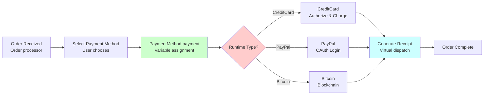

# Temat 2: Przykład - Funkcje Wirtualne w Praktyce

## 📌 Cel Tematu

Rzeczywisty przykład systemu e-commerce z różnymi metodami płatności - pokazanie **polimorfizmu** w działaniu na praktycznym case'u biznesowym.

## 🎯 Problem Biznesowy

Sklep internetowy musi obsługiwać wiele metod płatności:
- Karty kredytowe
- PayPal
- Przelewy bankowe
- Kryptowaluty
- BNPL (Buy Now Pay Later)

**Bez polimorfizmu**: Ogromny switch statement

```csharp
switch(paymentType)
{
    case "CreditCard":
        // 50 linii kodu...
        break;
    case "PayPal":
        // 50 linii kodu...
        break;
    case "Bitcoin":
        // 50 linii kodu...
        break;
    // ... i tak dalej
}
```

**Z polimorfizmem**: Jeden kod działa dla wszystkich!

```csharp
PaymentMethod payment = GetPaymentMethod(type);
payment.ProcessPayment();
payment.GenerateReceipt();
```

---

## 🏗️ Architektura Systemu

```
┌─────────────────────────────────┐
│   PaymentProcessor (klient)     │
│   - ProcessOrder()              │
│   - Nie wie jakiej płatności!   │
└────────────────┬────────────────┘
                 │
          (virtual dispatch)
                 │
    ┌────────────┴────────────┬──────────────┐
    │                         │              │
┌───▼────────┐    ┌──────────▼──┐    ┌─────▼──────┐
│ CreditCard │    │    PayPal   │    │   Bitcoin  │
│ - Validate │    │ - Login OAuth│   │ - Wallet  │
│ - Charge   │    │ - Transfer  │    │ - Sign Tx │
└────────────┘    └─────────────┘    └────────────┘
```

---

## 💳 Implementacja: Payment Gateway

### Klasa Bazowa

```csharp
public abstract class PaymentMethod
{
    public string Name { get; set; }
    public string TransactionId { get; set; }
    
    public abstract void Authorize();
    public abstract void ProcessPayment();
    public abstract void GenerateReceipt();
}
```

### Konkretne Implementacje

```csharp
public class CreditCardPayment : PaymentMethod
{
    public string CardNumber { get; set; }
    public string CVV { get; set; }
    
    public override void Authorize()
    {
        Console.WriteLine("✓ Validating card...");
        // Logika walidacji
    }
    
    public override void ProcessPayment()
    {
        Authorize();
        Console.WriteLine("💳 Charging credit card...");
        TransactionId = Guid.NewGuid().ToString();
    }
    
    public override void GenerateReceipt()
    {
        Console.WriteLine($"Credit Card Receipt: {TransactionId}");
    }
}
```

---

## 🏪 Order Processing System

```csharp
public class Order
{
    public string OrderId { get; set; }
    public List<Item> Items { get; set; }
    public decimal Total { get; set; }
}

public class OrderProcessor
{
    // Uniwersalny kod - pracuje z KAŻDĄ metodą płatności!
    public bool ProcessOrder(Order order, PaymentMethod payment)
    {
        try
        {
            Console.WriteLine($"Processing order {order.OrderId}...");
            
            payment.ProcessPayment();  // Late binding - każdy robi coś innego!
            payment.GenerateReceipt();
            
            Console.WriteLine("✓ Order completed successfully\n");
            return true;
        }
        catch (Exception ex)
        {
            Console.WriteLine($"✗ Error: {ex.Message}\n");
            return false;
        }
    }
}
```

---

## 📊 Diagram: E-Commerce Payment Flow



---

## 🔐 Bezpieczeństwo: Chained Authorization

```csharp
public class SecurePaymentProcessor
{
    private List<IValidator> validators = new()
    {
        new FraudDetector(),
        new LocationValidator(),
        new RateLimiter()
    };
    
    public bool Process(PaymentMethod payment, Order order)
    {
        // Każdy validator może weto (virtual dispatch!)
        foreach (var validator in validators)
        {
            if (!validator.IsValid(payment, order))
                return false;
        }
        
        payment.ProcessPayment();
        return true;
    }
}
```

---

## 📦 Real-World: E-Commerce Platforms

### Shopify-like Architecture

```
User → Order → PaymentGateway
                    ├─ Stripe
                    ├─ Square
                    ├─ Authorize.net
                    ├─ PayPal
                    └─ Custom Integration
```

Każdy gateway implementuje `IPaymentGateway`:
- Inna walidacja
- Inna komunikacja z API
- Inne fees
- Inna szybkość

Ale dla kodu e-commerce - nie ma różnicy!

---

## 💰 Bonus Features: Pricing Strategies

```csharp
public abstract class PricingStrategy
{
    public abstract decimal ApplyDiscount(decimal amount);
}

public class CreditCardPrice : PricingStrategy
{
    public override decimal ApplyDiscount(decimal amount)
    {
        return amount * 0.98m;  // 2% discount
    }
}

public class PayPalPrice : PricingStrategy
{
    public override decimal ApplyDiscount(decimal amount)
    {
        return amount * 0.97m;  // 3% discount
    }
}

// Użycie:
decimal finalPrice = strategy.ApplyDiscount(100m);  // Virtual!
```

---

## ⚡ Performance Considerations

| Aspekt | Wpływ |
|--------|-------|
| **Virtual Call Overhead** | ~10-30ns na x64 |
| **Method Table Lookup** | Opłacalne dla setek transakcji |
| **Inlining** | JIT optimizer może wciąż inlinować! |

**Konkluzja**: Polimorfizm prawie nic nie kosztuje w nowoczesnym .NET

---

## 🎓 Uczenia

Po tym temacie powinieneś:
- [ ] Zrozumieć praktyczne zastosowanie polimorfizmu
- [ ] Wiedzieć, jak projektować hierarchie klas
- [ ] Umieć pracować z wirtualnymi metodami
- [ ] Znać `try-catch` w kontekście polimorfizmu

---

## 📚 Referencje

- [Payment Processing Design Patterns](https://martinfowler.com/eaaCatalog/)
- [Stripe API Design](https://stripe.com/docs/api)
- [Strategy Pattern](https://refactoring.guru/design-patterns/strategy)

---

## 📁 Kod Demonstracyjny

Znajduje się w katalogu `code/`:
- `Program.cs` - Pełny e-commerce payment system

Uruchomienie:
```bash
cd code
dotnet run
dotnet test
```

---

## 🚀 Następny Krok

Przejdź do Tematu 3: **Virtual vs New** - co się stanie gdy coś pójdzie nie tak!
