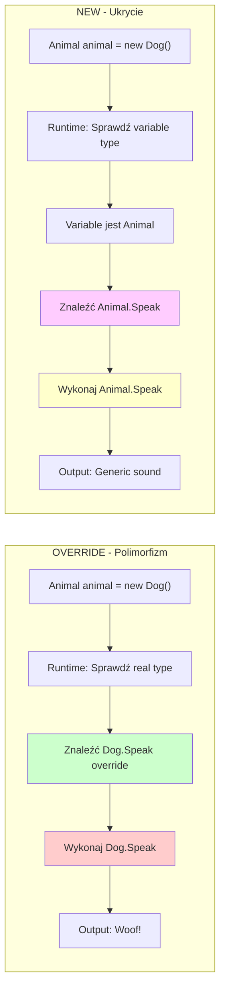

# Temat 3: Virtual vs New - Kombinacja Słów Kluczowych

## 📌 Cel Tematu

Zrozumienie **różnicy między `override` i `new`** - dwie sposoby przesłaniania metod, które prowadzą do **kompletnie różnego zachowania**.

## ⚠️ Problem: Co Się Dzieje Tutaj?

```csharp
public class Animal
{
    public virtual void Speak() => Console.WriteLine("Animal sound");
}

public class Dog : Animal
{
    public new void Speak() => Console.WriteLine("Woof!");  // ❌ BEZ override!
}

Animal animal = new Dog();
animal.Speak();  // Co się wypisze??
```

Odpowiedź: `"Animal sound"` - a nie `"Woof!"`! Dlaczego?

---

## 🔍 Głębokie Wyjaśnienie

### Override vs New

| Aspect | Override | New |
|--------|----------|-----|
| **Słowo kluczowe** | `public override` | `public new` |
| **Wymaga virtual** | TAK | NIE |
| **Late binding** | TAK | NIE |
| **Polimorfizm** | TAK | NIE |
| **Typ zmiennej** | Ignoruje | Decyduje |
| **Typ obiektu** | Decyduje | Ignoruje |

### Przykład: Override (Polimorfizm)

```csharp
public class Animal
{
    public virtual void Speak()
    {
        Console.WriteLine("Generic sound");
    }
}

public class Dog : Animal
{
    public override void Speak()  // ✅ OVERRIDE - będzie użyta w runtime!
    {
        Console.WriteLine("Woof!");
    }
}

Animal animal = new Dog();
animal.Speak();  // Output: "Woof!" (Dog's version)
```

**Override** = Runtime patrzy na rzeczywisty typ obiektu (Dog)

### Przykład: New (Ukrycie)

```csharp
public class Animal
{
    public void Speak()  // Bez 'virtual'
    {
        Console.WriteLine("Generic sound");
    }
}

public class Dog : Animal
{
    public new void Speak()  // ⚠️  NEW - ukrycie, nie override!
    {
        Console.WriteLine("Woof!");
    }
}

Animal animal = new Dog();
animal.Speak();  // Output: "Generic sound" (Animal's version)
```

**New** = Runtime ignoruje rzeczywisty typ, patrzy na typ zmiennej (Animal)

---

## 📊 Diagram: Override vs New



---

## 🎯 Reguły

### ✅ Override (Prawidłowe)

```csharp
public class Base
{
    public virtual void Method() { }  // ✅ Virtual
}

public class Derived : Base
{
    public override void Method() { }  // ✅ Override
}
```

### ⚠️  New (Może Być Ryzykowne)

```csharp
public class Base
{
    public virtual void Method() { }  // Virtual
}

public class Derived : Base
{
    public new void Method() { }  // ⚠️  Ukrycie - narusza Liskov
}

// Problemem jest:
Base b = new Derived();
b.Method();  // Wołuje Base, nie Derived!
// Kontrakt jest złamany
```

---

## 🚨 Problemy z New

### Problem 1: Łamanie Oczekiwań

```csharp
public abstract class PaymentMethod
{
    public virtual void ProcessPayment()
    {
        Console.WriteLine("Processing...");
    }
}

public class SpecialPayment : PaymentMethod
{
    public new void ProcessPayment()  // ⚠️  OOPS!
    {
        Console.WriteLine("Special processing...");
    }
}

List<PaymentMethod> payments = new() { new SpecialPayment() };
foreach (var p in payments)
{
    p.ProcessPayment();  // Wołuje Base, nie Special!
    // Bug! Kod był w SpecialPayment!
}
```

### Problem 2: Debugging Nightmare

```csharp
// Ktoś widzi:
payment.ProcessPayment();

// I myśli "to wołuje SpecialPayment.ProcessPayment()"
// ALE to wołuje Base.ProcessPayment()!
// Dlaczego? Bo `new` zamiast `override`
```

---

## 💡 Kiedy Używać Co?

### Użyj `override` gdy:
- [ ] Metoda w bazowej jest `virtual`
- [ ] Chcesz **zmienić zachowanie** w pochodnej
- [ ] Chcesz **polimorfizmu** (late binding)
- [ ] Chcesz szanować kontrakt klasy bazowej

### Użyj `new` gdy:
- [ ] Metoda w bazowej jest **zwykła** (nie virtual)
- [ ] Chcesz **całkowicie inną metodę** (inna sygnatura często)
- [ ] To rzadkie! Prawie nigdy nie powinieneś używać `new`

---

## 🔗 Liskov Substitution Principle (LSP)

**GOLDEN RULE**: Obiekt klasy pochodnej powinien zachowywać się tak, jak klasa bazowa.

```csharp
// ✅ DOBRY WZORZEC (LSP Honored)
public abstract class Bird
{
    public virtual void Fly() => Console.WriteLine("Flying");
}

public class Eagle : Bird
{
    public override void Fly() => Console.WriteLine("Flying high!");  // ✅ LSP
}

// ❌ ZŁY WZORZEC (LSP Violated)
public abstract class Bird
{
    public virtual void Fly() => Console.WriteLine("Flying");
}

public class Penguin : Bird
{
    public new void Fly() => throw new NotSupportedException("Penguins can't fly");  // ❌ LSP
}

// Teraz ten kod jest zepsuty:
Bird bird = new Penguin();
bird.Fly();  // Hm, co się stanie??
```

---

## 📊 Real-World Przykłady

### Baza danych: Repository Pattern

```csharp
public abstract class Repository<T>
{
    public virtual void Save(T item)
    {
        Console.WriteLine("Saving to database...");
    }
}

// ✅ DOBRY - CacheRepository
public class CacheRepository<T> : Repository<T>
{
    public override void Save(T item)  // ✅ Override
    {
        Console.WriteLine("Saving to cache first...");
        base.Save(item);  // Call base
        Console.WriteLine("Also saving to database...");
    }
}

// ❌ ZŁY - DatabaseSpecificRepository  
public class DatabaseSpecificRepository<T> : Repository<T>
{
    public new void Save(T item)  // ❌ New - będzie bug!
    {
        Console.WriteLine("Custom save logic...");
    }
}
```

---

## 🎓 Reguły Kciuka

1. **Zawsze używaj `override`**, jeśli metoda bazowa jest `virtual`
2. **`new` to prawie zawsze bug** w design'ie
3. Jeśli naprawdę potrzebujesz `new`, przespróbuj redesign
4. **Przesłaniająca metoda powinna robić "więcej" lub "lepiej"**, a nie coś zupełnie innego

---

## 📁 Kod Demonstracyjny

Znajduje się w katalogu `code/`:
- `Program.cs` - Porównanie override vs new

---

## 🔗 Referencje

- [Liskov Substitution Principle](https://en.wikipedia.org/wiki/Liskov_substitution_principle)
- [Override vs New (StackOverflow)](https://stackoverflow.com/questions/9134504/override-vs-new)

Uruchomienie:
```bash
cd code
dotnet run
```
