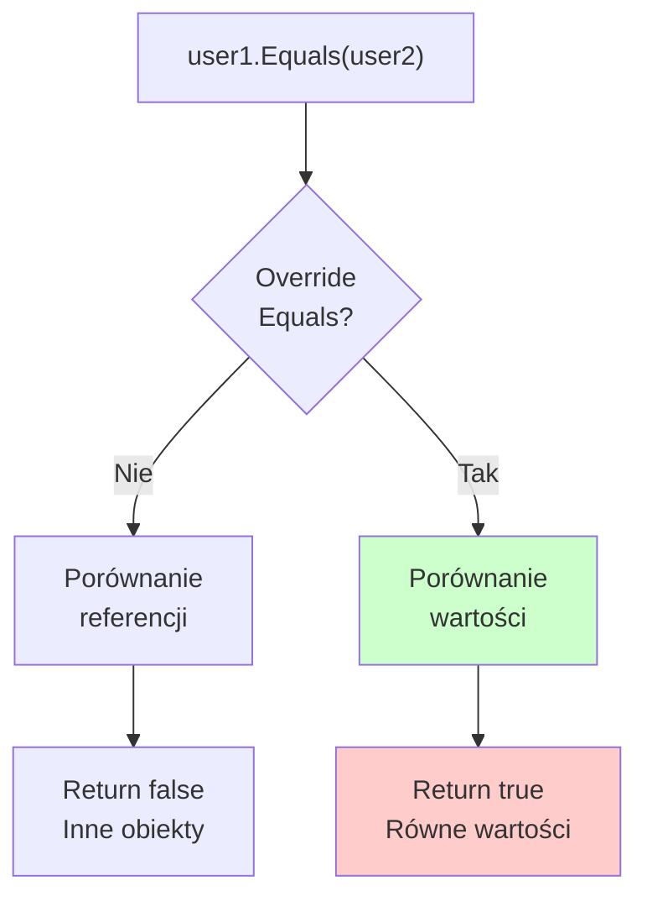

# Temat 4: Metody Klasy Object - ToString, Equals, GetHashCode

## 📌 Cel Tematu

Zrozumienie trzech kluczowych metod dziedziczonych z `object`:
- `ToString()` - reprezentacja tekstowa
- `Equals()` - porównanie równości
- `GetHashCode()` - hash dla kolekcji (Dict, Set)

## 🎯 Fundamenty

### Wszystko Dziedziczy z Object

```csharp
public class MyClass { }
// Równoważnie:
public class MyClass : object { }
```

**Każda klasa w C# ma dostęp do:**
- `ToString()` - zwraca string reprezentację
- `Equals()` - porównuje dwie instancje
- `GetHashCode()` - zwraca int hash
- `GetType()` - zwraca typ obiektu
- `MemberwiseClone()` - tworzy płytką kopię

---

## 📝 ToString()

### Domyślna Implementacja

```csharp
public class Person
{
    public string Name { get; set; }
}

var p = new Person { Name = "John" };
Console.WriteLine(p.ToString());  // Output: "Namespace.Person"
```

**Domyślnie**: Zwraca pełną nazwę klasy (namespace + class)

### Przesłanianie ToString()

```csharp
public class Person
{
    public string Name { get; set; }
    public int Age { get; set; }
    
    public override string ToString()
    {
        return $"Person: {Name}, Age {Age}";
    }
}

var p = new Person { Name = "John", Age = 30 };
Console.WriteLine(p.ToString());  // Output: "Person: John, Age 30"
```

### Real-World: E-Commerce

```csharp
public class Product
{
    public string Name { get; set; }
    public decimal Price { get; set; }
    
    public override string ToString()
    {
        return $"[{Name}] ${Price:F2}";
    }
}

var products = new List<Product>
{
    new() { Name = "Laptop", Price = 999.99m },
    new() { Name = "Mouse", Price = 29.99m }
};

foreach (var p in products)
{
    Console.WriteLine(p);  // Automatycznie wołuje ToString()!
}
// Output:
// [Laptop] $999.99
// [Mouse] $29.99
```

---

## 🔍 Equals() i GetHashCode()

### Domyślna Implementacja Equals()

```csharp
public class User
{
    public int Id { get; set; }
    public string Name { get; set; }
}

var user1 = new User { Id = 1, Name = "John" };
var user2 = new User { Id = 1, Name = "John" };

Console.WriteLine(user1.Equals(user2));  // false!
// Domyślnie: porównuje referencje, nie wartości!
```

**Domyślnie**: Equals() porównuje **referencje** (czy to ten sam obiekt w pamięci)

### Przesłanianie Equals() i GetHashCode()

```csharp
public class User : IEquatable<User>
{
    public int Id { get; set; }
    public string Name { get; set; }
    
    public override bool Equals(object? obj)
    {
        if (obj is not User other)
            return false;
        
        return Id == other.Id && Name == other.Name;
    }
    
    public override int GetHashCode()
    {
        return HashCode.Combine(Id, Name);
    }
}

var user1 = new User { Id = 1, Name = "John" };
var user2 = new User { Id = 1, Name = "John" };

Console.WriteLine(user1.Equals(user2));  // true!
Console.WriteLine(user1.GetHashCode() == user2.GetHashCode());  // true!
```

---

## ⚡ GetHashCode() - Dlaczego to Ważne?

### Kolekcje HashSet i Dictionary

```csharp
var users = new HashSet<User>
{
    new() { Id = 1, Name = "John" },
    new() { Id = 1, Name = "John" }  // Duplikat?
};

Console.WriteLine(users.Count);  // Bez GetHashCode: 2 (błąd!)
                                 // Z GetHashCode: 1 (prawidłowo!)
```

### Jak Działa HashSet

1. Wołuje `GetHashCode()` - szybkie sprawdzenie
2. Jeśli hash jest taki sam, wołuje `Equals()`
3. Jeśli Equals() zwraca true - duplikat!

**REGUŁA**: Jeśli przesłaniajesz `Equals()`, MUSISZ przesłonić `GetHashCode()`

```csharp
public class Product
{
    public int Id { get; set; }
    
    public override bool Equals(object? obj)
    {
        return obj is Product p && p.Id == Id;
    }
    
    public override int GetHashCode()  // ✅ ZAWSZE razem z Equals!
    {
        return Id.GetHashCode();
    }
}
```

---

## 📊 Diagram: Equals & GetHashCode Flow



---

## 💰 Real-World: E-Commerce Product Equality

```csharp
public class Product : IEquatable<Product>
{
    public int ProductId { get; set; }
    public string Name { get; set; }
    
    // Dwa produkty są równe jeśli mają ten sam ID
    public override bool Equals(object? obj) => Equals(obj as Product);
    
    public bool Equals(Product? other)
    {
        return other != null && ProductId == other.ProductId;
    }
    
    public override int GetHashCode()
    {
        return ProductId.GetHashCode();
    }
    
    public override string ToString()
    {
        return $"Product#{ProductId}: {Name}";
    }
}

// Użycie
var cart1 = new HashSet<Product>
{
    new() { ProductId = 1, Name = "Laptop" },
    new() { ProductId = 2, Name = "Mouse" }
};

var cart2 = new HashSet<Product>
{
    new() { ProductId = 1, Name = "Laptop" },  // Duplikat
    new() { ProductId = 3, Name = "Keyboard" }
};

var combined = new HashSet<Product>(cart1);
combined.UnionWith(cart2);

Console.WriteLine($"Unique products: {combined.Count}");  // 3
foreach (var product in combined)
{
    Console.WriteLine($"  - {product}");
}
```

---

## 🎓 Wytyczne

| Metoda | Kiedy | Jak |
|--------|-------|-----|
| **ToString()** | Zawsze (debug, logs, UI) | Zwróć user-friendly string |
| **Equals()** | Gdy porównywacie wartości | Porównaj pola, nie referencje |
| **GetHashCode()** | Razem z Equals() | Musi być konsystentny z Equals() |

---

## ⚠️  Reguły

1. **Jeśli przesłonisz Equals(), przesłoń GetHashCode()**
2. **Jeśli a.Equals(b), to a.GetHashCode() == b.GetHashCode()**
3. **ToString() to dla ludzi, nie dla maszyn**
4. **Equality może być różne od "identyczności"**

---

## 📁 Kod Demonstracyjny

Znajduje się w katalogu `code/`:
- `Program.cs` - ToString, Equals, GetHashCode w akcji

Uruchomienie:
```bash
cd code
dotnet run
```

---

## 🔗 Referencje

- [Object.ToString()](https://learn.microsoft.com/en-us/dotnet/api/system.object.tostring)
- [Object.Equals()](https://learn.microsoft.com/en-us/dotnet/api/system.object.equals)
- [Object.GetHashCode()](https://learn.microsoft.com/en-us/dotnet/api/system.object.gethashcode)
- [IEquatable<T>](https://learn.microsoft.com/en-us/dotnet/api/system.iequatable-1)
