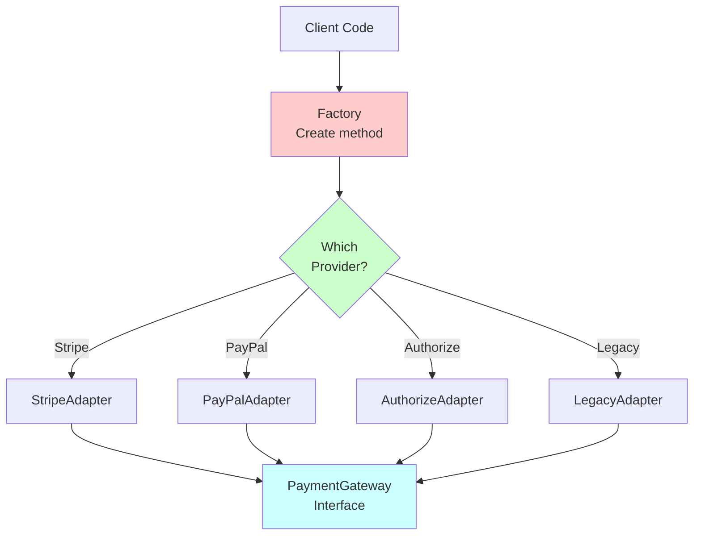

# Temat 5: Wzorzec Adapter Połączony z Fabryką

## 📌 Cel Tematu

Połączenie dwóch wzorców projektowych:
- **Adapter** - konwersja interfejsu na inny
- **Factory** - centralne tworzenie obiektów

Praktyczne zastosowanie: integracja systemów payment z różnymi gatewayami.

## 🎯 Problem: Różne Interfejsy

Wyobraź sobie e-commerce z wieloma payment gateway'ami:
- Stripe API
- PayPal API
- Authorize.net API
- Własny system Legacy

**Problem**: Każdy ma inny interfejs!

```csharp
// Stripe
stripe.Charge(amount, token);

// PayPal
paypal.Execute(transaction);

// Legacy
legacyPay.ProcessTransaction(id, amount, method);
```

**Rozwiązanie**: Adapter + Factory

---

## 🏗️ Adapter Pattern

### Klasa Bazowa (Target Interface)

```csharp
public abstract class PaymentGateway
{
    public abstract void Authorize(decimal amount);
    public abstract void Capture();
    public abstract void Refund();
}
```

### Adaptory (Adapters)

```csharp
// Adapt Stripe to our interface
public class StripeAdapter : PaymentGateway
{
    private readonly IStripeClient _stripeClient;
    
    public override void Authorize(decimal amount)
    {
        _stripeClient.Charge(amount, token);  // Stripe's method
    }
}

// Adapt PayPal to our interface
public class PayPalAdapter : PaymentGateway
{
    private readonly IPayPalClient _paypalClient;
    
    public override void Authorize(decimal amount)
    {
        _paypalClient.Execute(new Transaction { Amount = amount });  // PayPal's method
    }
}
```

---

## 🏭 Factory Pattern

### Simple Factory

```csharp
public class PaymentGatewayFactory
{
    public static PaymentGateway Create(string providerName)
    {
        return providerName switch
        {
            "Stripe" => new StripeAdapter(),
            "PayPal" => new PayPalAdapter(),
            "Authorize" => new AuthorizeNetAdapter(),
            "Legacy" => new LegacyPaymentAdapter(),
            _ => throw new ArgumentException($"Unknown provider: {providerName}")
        };
    }
}

// Użycie
var gateway = PaymentGatewayFactory.Create("Stripe");
gateway.Authorize(100m);
```

---

## 📊 Diagram: Adapter + Factory



---

## 💳 Real-World: Payment Processing

### Przed (Bez Adapteru)

```csharp
public void ProcessPayment(string provider, decimal amount)
{
    switch (provider)
    {
        case "Stripe":
            var stripe = new StripeClient();
            stripe.Charge(amount, token);  // Stripe's API
            break;
        
        case "PayPal":
            var paypal = new PayPalClient();
            paypal.Execute(new Transaction { Amount = amount });  // PayPal's API
            break;
        
        case "Legacy":
            var legacy = new LegacyPaymentSystem();
            legacy.ProcessTransaction(id, amount, method);  // Legacy API
            break;
    }
}

// Problem: Duża switch, różne API'e w jednym miejscu
```

### Po (Z Adapterem + Fabryką)

```csharp
public void ProcessPayment(string provider, decimal amount)
{
    var gateway = PaymentGatewayFactory.Create(provider);
    gateway.Authorize(amount);      // ✅ Unified interface
    gateway.Capture();
    gateway.Refund();
}

// Elegancko! Jeden interfejs dla wszystkich
```

---

## 🔌 Integracja: Fake vs Real

### Dla Testów

```csharp
public class FakePaymentGateway : PaymentGateway
{
    public override void Authorize(decimal amount)
    {
        Console.WriteLine($"[FAKE] Authorized ${amount}");
    }
    
    public override void Capture()
    {
        Console.WriteLine("[FAKE] Captured");
    }
}

// W Factory:
public static PaymentGateway Create(string providerName)
{
    if (providerName == "Fake" || providerName == "Test")
        return new FakePaymentGateway();
    
    // ... real providers
}
```

---

## 💾 Dependency Injection Integration

```csharp
public class OrderService
{
    private readonly IPaymentGatewayFactory _factory;
    
    public OrderService(IPaymentGatewayFactory factory)
    {
        _factory = factory;  // Injected!
    }
    
    public void ProcessOrder(Order order)
    {
        var gateway = _factory.Create(order.PaymentProvider);
        gateway.Authorize(order.Total);
        gateway.Capture();
    }
}

// Rejestracja w DI:
services.AddScoped<IPaymentGatewayFactory, PaymentGatewayFactory>();
services.AddScoped<OrderService>();
```

---

## 🎯 Złożony Adapter: Multi-Provider Fallback

```csharp
public class FallbackAdapter : PaymentGateway
{
    private readonly List<PaymentGateway> _gateways;
    
    public FallbackAdapter(params PaymentGateway[] gateways)
    {
        _gateways = gateways.ToList();
    }
    
    public override void Authorize(decimal amount)
    {
        foreach (var gateway in _gateways)
        {
            try
            {
                gateway.Authorize(amount);
                return;  // Success!
            }
            catch
            {
                // Try next gateway
            }
        }
        
        throw new Exception("All payment gateways failed");
    }
}

// Użycie
var fallback = new FallbackAdapter(
    new StripeAdapter(),
    new PayPalAdapter(),
    new LegacyPaymentAdapter()
);

fallback.Authorize(100m);  // Spróbuj Stripe, potem PayPal, potem Legacy
```

---

## 🏪 E-Commerce Integration

```csharp
public class PaymentProcessor
{
    private readonly IPaymentGatewayFactory _factory;
    
    public PaymentProcessor(IPaymentGatewayFactory factory)
    {
        _factory = factory;
    }
    
    public PaymentResult ProcessOrder(Order order)
    {
        var gateway = _factory.Create(order.PaymentMethod);
        
        gateway.Authorize(order.Total);
        gateway.Capture();
        
        return new PaymentResult
        {
            TransactionId = gateway.TransactionId,
            Status = PaymentStatus.Completed
        };
    }
}
```

---

## 📁 Kod Demonstracyjny

Znajduje się w katalogu `code/`:
- `Program.cs` - Pełna implementacja Adapter + Factory

Uruchomienie:
```bash
cd code
dotnet run
```

---

## 🔗 Referencje

- [Adapter Pattern](https://refactoring.guru/design-patterns/adapter)
- [Factory Pattern](https://refactoring.guru/design-patterns/factory-method)
- [Payment Processing Architecture](https://martinfowler.com/articles/patterns-of-distributed-systems/)

---

## 🚀 Następny Krok

Przejdź do Tematu 6: **Default Interface Members** - nowoczesne C# 8+ features
