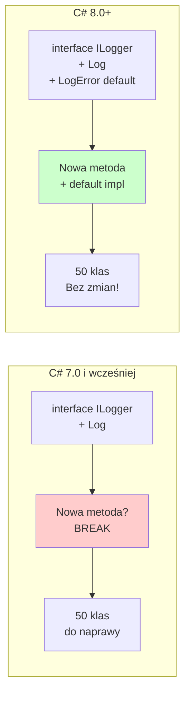

# Temat 6: Default Interface Members - Nowoczesne C# (8+)

## 📌 Cel Tematu

Zrozumienie **Default Interface Members** - nowa funcjonalność od C# 8.0 pozwalająca na **implementację kodu w interface'ach**.

## 🚀 Co Nowego w C# 8.0+?

Tradycyjnie, interface zawiera TYLKO deklaracje:

```csharp
public interface IPaymentMethod
{
    void Pay(decimal amount);      // Deklaracja - MUSI implementować
    string GetTransactionId();      // Deklaracja - MUSI implementować
}
```

**Teraz** (C# 8.0+), możesz mieć implementację!

```csharp
public interface IPaymentMethod
{
    void Pay(decimal amount);
    
    // ✅ NEW: Default implementation
    public string GetTransactionId()
    {
        return Guid.NewGuid().ToString();  // Kod w interface'ie!
    }
}
```

---

## 🎯 Kiedy to Jest Przydatne?

### Problem: Dodawanie Nowej Metody do Interface'u

Wyobraź sobie starą aplikację z 50 klasami implementującymi interface:

```csharp
public interface ILogger
{
    void Log(string message);
}

// 50 klas:
public class ConsoleLogger : ILogger { }
public class FileLogger : ILogger { }
public class DatabaseLogger : ILogger { }
// ... i 47 więcej
```

Teraz musisz dodać nową metodę `LogError()`.

### Rozwiązanie 1: Dodaj do Interface'u

```csharp
public interface ILogger
{
    void Log(string message);
    void LogError(string error);  // ❌ BREAK: Wszystkie 50 klas teraz się nie kompilują!
}
```

**Rezultat**: Musisz zaktualizować wszystkie 50 klas! 💔

### Rozwiązanie 2: Default Implementation (C# 8.0+)

```csharp
public interface ILogger
{
    void Log(string message);
    
    // ✅ NEW: Default implementation - domyślne zachowanie
    public void LogError(string error)
    {
        Log($"ERROR: {error}");  // Domyślnie loguje jako zwykły Log
    }
}

// ✅ Wszystkie 50 klas się KOMPILUJĄ bez zmian!
// Mogą przesłonić LogError jeśli chcą, ale nie muszą
```

---

## 💡 Praktyczne Zastosowania

### 1. Backward Compatibility

```csharp
public interface IDataRepository<T>
{
    T GetById(int id);
    
    // C# 8.0+: Default implementation
    public IEnumerable<T> GetAll()
    {
        // Domyślna, prosta implementacja
        return new List<T>();
    }
}

// Stare klasy się kompilują bez zmian
// Nowe klasy mogą przesłonić GetAll
```

### 2. Extension Methods as Defaults

```csharp
public interface ICalculator
{
    int Add(int a, int b);
    int Subtract(int a, int b);
    
    // ✅ Default: Combine other methods
    public int DuplicateResult(int a, int b)
    {
        return Add(a, b) * 2;  // Używa innych metod interface'u!
    }
}
```

### 3. Logging/Validation Wrapper

```csharp
public interface IService
{
    void DoWork(string input);
    
    // ✅ Default: Add logging
    public void DoWorkWithLogging(string input)
    {
        Console.WriteLine($"[LOG] Starting work with '{input}'");
        DoWork(input);
        Console.WriteLine("[LOG] Work completed");
    }
}

public class MyService : IService
{
    public void DoWork(string input)
    {
        Console.WriteLine($"Actually doing work: {input}");
    }
}

// Użycie
IService service = new MyService();
service.DoWorkWithLogging("test");  // Dodane logowanie bez zmiany klasy!
```

---

## 🔐 Access Modifiers w Interface'ach (C# 11+)

```csharp
public interface IAdvanced
{
    // Public - dostęp wszędzie
    public void PublicMethod() { }
    
    // Private - dostęp tylko w interface'ie
    private void PrivateHelper()
    {
        Console.WriteLine("Helper");
    }
    
    // Protected - dostęp w klasach implementujących
    protected void ProtectedMethod()
    {
        PrivateHelper();  // Może wołać private
    }
    
    // Internal - dostęp w assembly
    internal void InternalMethod() { }
}

public class Implementation : IAdvanced
{
    public void PublicMethod() { }
    
    public void CallerMethod()
    {
        // PublicMethod();        // ✅ OK
        // PrivateHelper();       // ❌ Private, niedostępny
        // ProtectedMethod();     // ✅ OK (protected)
    }
}
```

---

## 📊 Diagram: Default Interface Members Evolution



---

## ⚡ Static Members w Interface'ach (C# 11+)

```csharp
public interface IConverter
{
    // Static members - dostęp bez instancji!
    static int ConversionFactor = 1000;
    
    static string Format(int value)
    {
        return $"{value / ConversionFactor}";
    }
    
    // Instance member
    int Convert(int input);
}

public class MyConverter : IConverter
{
    public int Convert(int input)
    {
        return input * IConverter.ConversionFactor;
    }
}

// Użycie
Console.WriteLine(IConverter.Format(5000));  // Bezpośrednio z interface'u!
```

---

## 🎓 Zasady

| Feature | C# 7.0 | C# 8.0+ | C# 11+ |
|---------|--------|---------|--------|
| Deklaracje metod | ✅ | ✅ | ✅ |
| Domyślne implementacje | ❌ | ✅ | ✅ |
| Access modifiers (private) | ❌ | ❌ | ✅ |
| Static members | ❌ | ❌ | ✅ |
| Properties z backingiem | ❌ | ✅ | ✅ |

---

## 📁 Kod Demonstracyjny

Znajduje się w katalogu `code/`:
- `Program.cs` - Default interface members w praktyce

Uruchomienie:
```bash
cd code
dotnet run
```

---

## 🔗 Referencje

- [Default Interface Members (C# 8.0)](https://learn.microsoft.com/en-us/dotnet/csharp/tutorials/default-interface-members-versions)
- [Interfaces (C# 11+ Features)](https://learn.microsoft.com/en-us/dotnet/csharp/language-reference/keywords/interface)
- [Static Abstract Members](https://learn.microsoft.com/en-us/dotnet/csharp/whats-new/csharp-11#static-abstract-members-in-interfaces)

---

## 🚀 Wnioski

- **Default implementations** = łatwa ewolucja interfejsów
- **Access modifiers** = lepsze enkapsulacja
- **Static members** = helper methods bez instancji
- **Backward compatibility** = nie łamiesz istniejącego kodu

---

*Nowoczesne C# daje nam nowe możliwości projektowania interfejsów!*
