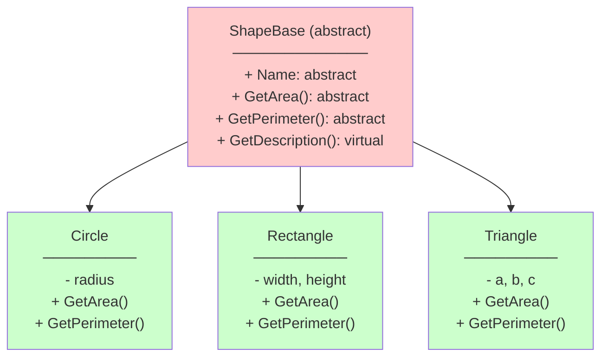

# TEMAT 1: Klasy Abstrakcyjne - Wstęp

## 📖 Wprowadzenie

**Klasa abstrakcyjna** to klasa, która nie może być bezpośrednio instantiowana. Służy jako szablon (template) dla klas pochodnych.

```
┌─────────────────────────────────┐
│    AnimalBase (abstract)        │  ← Nie można: new AnimalBase()
├─────────────────────────────────┤
│ - Name                          │
│ + Sleep()                       │  Metoda konkretna
│ + Speak() { abstract }          │  Musi być implementowana
│ + Describe() { abstract }       │
└─────────────────────────────────┘
         ▲           ▲
         │           │
    ┌────┴───┐   ┌───┴────┐
    │   Dog  │   │  Cat   │
    │        │   │        │
    └────────┘   └────────┘
    ✅ Można:    ✅ Można:
    new Dog()    new Cat()
```

---

## 🎯 Kluczowe Koncepty

### 1. Słowo kluczowe `abstract`

```csharp
// ❌ Błąd - nie można instantiować
var animal = new AnimalBase("Generic");  // Compiler Error!

// ✅ Poprawnie - klasa konkretna
var dog = new Dog("Buddy");
```

### 2. Konwencja Nazewnictwa: `Base`

Gdy tworzymy klasę abstrakcyjną, dodajemy przyrostek **`Base`**:

- ✅ `AnimalBase` - klasa abstrakcyjna
- ✅ `ShapeBase` - klasa abstrakcyjna
- ✅ `PaymentMethodBase` - klasa abstrakcyjna

### 3. Metody w Klasie Abstrakcyjnej

Klasa abstrakcyjna może zawierać:

| Typ Metody | Opis | Przykład |
|-----------|------|---------|
| **Konkretna** | Implementacja zawarta w klasie | `void Sleep()` |
| **Abstrakcyjna** | Tylko sygnatura, brak implementacji | `abstract void Speak();` |
| **Wirtualna** | Domyślna implementacja, może być override'owana | `virtual string Describe()` |

---

## 💻 Praktyczne Przykłady

### Przykład 1: Animal Hierarchy

```csharp
// Klasa abstrakcyjna
public abstract class AnimalBase
{
    public string Name { get; set; }
    
    public AnimalBase(string name) => Name = name;
    
    // Metoda konkretna - dostępna dla wszystkich zwierząt
    public void Sleep()
    {
        Console.WriteLine($"{Name} is sleeping...");
    }
    
    // Metody abstrakcyjne - MUSZĄ być zaimplementowane
    public abstract void Speak();
    public abstract string Describe();
}

// Klasa konkretna #1
public class Dog : AnimalBase
{
    public Dog(string name) : base(name) { }
    
    public override void Speak()
    {
        Console.WriteLine($"{Name}: Woof! Woof!");
    }
    
    public override string Describe()
    {
        return $"Dog named {Name}";
    }
}

// Klasa konkretna #2
public class Cat : AnimalBase
{
    public Cat(string name) : base(name) { }
    
    public override void Speak()
    {
        Console.WriteLine($"{Name}: Meow!");
    }
    
    public override string Describe()
    {
        return $"Cat named {Name}";
    }
}
```

### Example 2: Shape Library

```csharp
public abstract class ShapeBase
{
    public abstract string Name { get; }
    public abstract double GetArea();
    public abstract double GetPerimeter();
    
    public virtual string GetDescription()
    {
        return $"{Name} - Area: {GetArea():F2}";
    }
}

public class Circle : ShapeBase
{
    private readonly double _radius;
    public override string Name => "Circle";
    
    public Circle(double radius) => _radius = radius;
    
    public override double GetArea() => Math.PI * _radius * _radius;
    public override double GetPerimeter() => 2 * Math.PI * _radius;
}

public class Rectangle : ShapeBase
{
    private readonly double _width, _height;
    public override string Name => "Rectangle";
    
    public Rectangle(double width, double height)
    {
        _width = width;
        _height = height;
    }
    
    public override double GetArea() => _width * _height;
    public override double GetPerimeter() => 2 * (_width + _height);
}
```

### Polimorfizm z Klasami Abstrakcyjnymi

```csharp
// ✅ Można używać klasy abstrakcyjnej jako typ referencji!
List<AnimalBase> animals = new()
{
    new Dog("Buddy"),
    new Cat("Whiskers"),
    new Dog("Rex")
};

foreach (var animal in animals)
{
    animal.Speak();     // Wołuje override'owaną metodę
    animal.Sleep();     // Wołuje konkretną metodę z klasy abstrakcyjnej
    Console.WriteLine(animal.Describe());
}
```

**Output**:
```
Buddy: Woof! Woof!
Buddy is sleeping...
Dog named Buddy

Whiskers: Meow!
Whiskers is sleeping...
Cat named Whiskers

Rex: Woof! Woof!
Rex is sleeping...
Dog named Rex
```

---

## 📊 Diagram: Hierarchia Figur Geometrycznych



---

## ⚡ Ograniczenia i Reguły

### 1. Klasa Abstrakcyjna Nie Może Być Instantiowana

```csharp
// ❌ Compiler Error
var animal = new AnimalBase("Generic");

// ✅ Poprawnie
var dog = new Dog("Buddy");
```

### 2. Muszą Implementować Wszystkie Metody Abstrakcyjne

```csharp
public class Parrot : AnimalBase
{
    // ❌ ERROR: Missing implementation of Speak()
    public override string Describe() => "Parrot";
}

// ✅ Poprawnie
public class Parrot : AnimalBase
{
    public override void Speak() => Console.WriteLine("Squawk!");
    public override string Describe() => "Parrot";
}
```

### 3. Można Dziedziczyć z Innej Klasy Abstrakcyjnej

```csharp
public abstract class BirdBase : AnimalBase
{
    public abstract int GetWingspan();
}

public class Eagle : BirdBase
{
    // Musi implementować WSZYSTKIE abstrakcyjne metody
    // zarówno z BirdBase jak i AnimalBase
    public override void Speak() { }
    public override string Describe() { }
    public override int GetWingspan() { }
}
```

---

## 🏢 Real-World: Payment Processing System

```csharp
public abstract class PaymentMethodBase
{
    public string TransactionId { get; protected set; }
    
    public abstract void Authorize(decimal amount);
    public abstract void Charge(decimal amount);
    public abstract void Refund(decimal amount);
    
    // Konkretna metoda - każda metoda płatności generuje paragon
    public virtual void PrintReceipt(decimal amount, string status)
    {
        Console.WriteLine($"Receipt: {TransactionId} - ${amount} - {status}");
    }
}

public class CreditCardPayment : PaymentMethodBase
{
    private readonly string _cardNumber;
    
    public CreditCardPayment(string cardNumber)
    {
        _cardNumber = cardNumber;
        TransactionId = Guid.NewGuid().ToString();
    }
    
    public override void Authorize(decimal amount)
    {
        Console.WriteLine($"[CC] Authorizing ${amount} on card ****{_cardNumber[^4..]}");
    }
    
    public override void Charge(decimal amount)
    {
        Console.WriteLine($"[CC] Charging ${amount}");
    }
    
    public override void Refund(decimal amount)
    {
        Console.WriteLine($"[CC] Refunding ${amount}");
    }
}

public class PayPalPayment : PaymentMethodBase
{
    private readonly string _email;
    
    public PayPalPayment(string email)
    {
        _email = email;
        TransactionId = Guid.NewGuid().ToString();
    }
    
    public override void Authorize(decimal amount) { }
    public override void Charge(decimal amount) { }
    public override void Refund(decimal amount) { }
}

// Użycie
List<PaymentMethodBase> payments = new()
{
    new CreditCardPayment("1234-5678-9012-3456"),
    new PayPalPayment("user@paypal.com")
};

foreach (var payment in payments)
{
    payment.Authorize(100m);      // Różne implementacje
    payment.Charge(100m);
    payment.PrintReceipt(100m, "Completed");  // Ta sama implementacja
}
```

---

## 🔑 Kluczowe Punkty

✅ **Klasa abstrakcyjna**:
- Nie może być instantiowana
- Może mieć metody konkretne i abstrakcyjne
- Służy jako template dla klas pochodnych
- Konwencja: przyrostek `Base` w nazwie

✅ **Metody abstrakcyjne**:
- Brak implementacji (tylko sygnatura)
- Muszą być implementowane w klasach pochodnych
- Wymuszają kontakt na podklasach

✅ **Polimorfizm**:
- Można używać klasy abstrakcyjnej jako typ referencji
- Runtime wołuje override'owaną metodę

---

## 📚 Referencje

- [Microsoft: Abstract Classes](https://learn.microsoft.com/en-us/dotnet/csharp/fundamentals/types/classes#abstract-classes)
- [Microsoft: Polymorphism](https://learn.microsoft.com/en-us/dotnet/csharp/fundamentals/object-oriented/polymorphism)
- [C# Players Guide - Chapter 16: Polymorphism](https://csharpplayersguide.com/)

---

## ✅ Efekty Uczenia

Po tym temacie student powinien:

- [ ] Rozumieć pojęcie klasy abstrakcyjnej
- [ ] Znać słowo kluczowe `abstract`
- [ ] Wiedzieć o konwencji nazewnictwa `Base`
- [ ] Implementować metody abstrakcyjne
- [ ] Używać klasy abstrakcyjnej jako typ referencji
- [ ] Projektować hierarchie klas za pomocą abstrakcji
- [ ] Zastosować w praktyce (np. Shape library, Payment system)

---

*Ostatnia aktualizacja: 2024-08-30*
