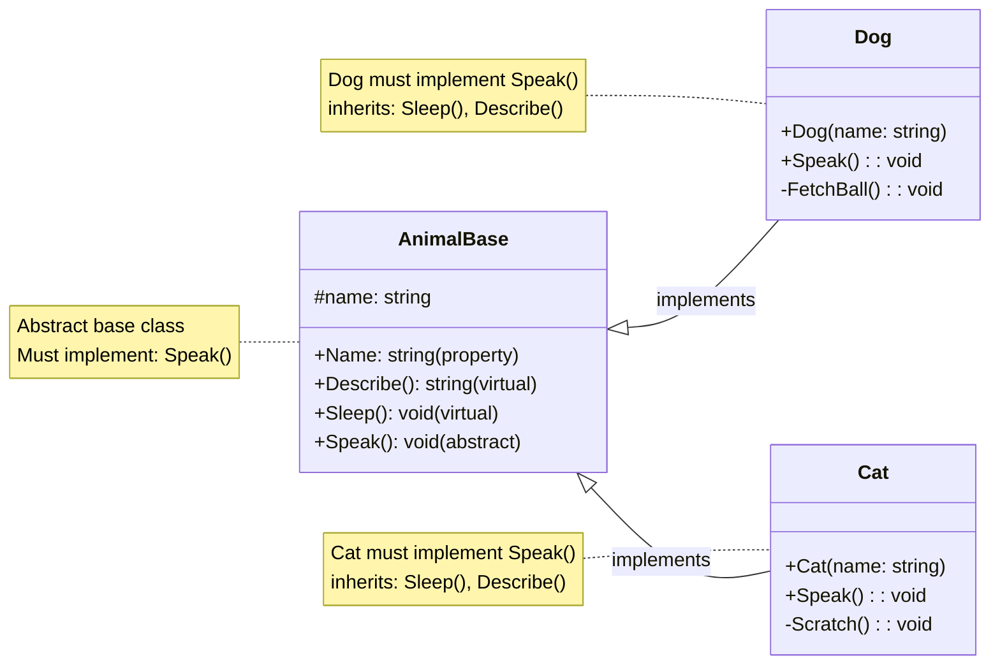
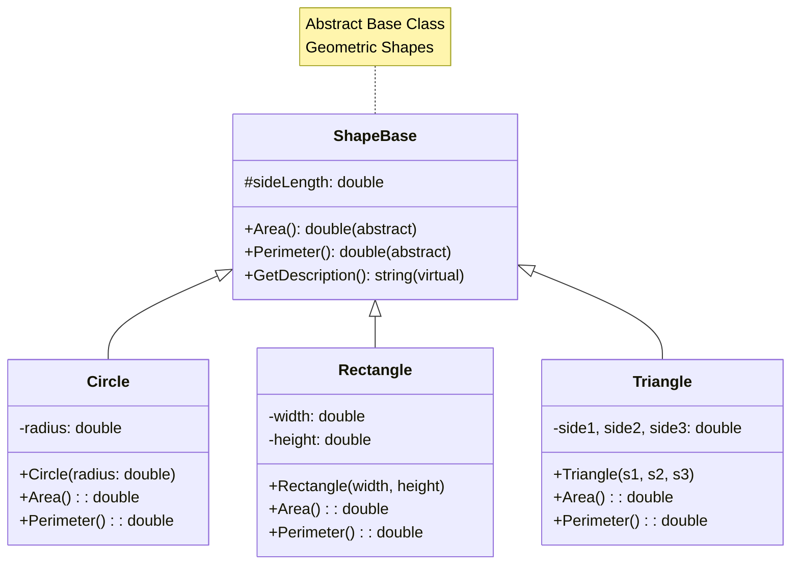
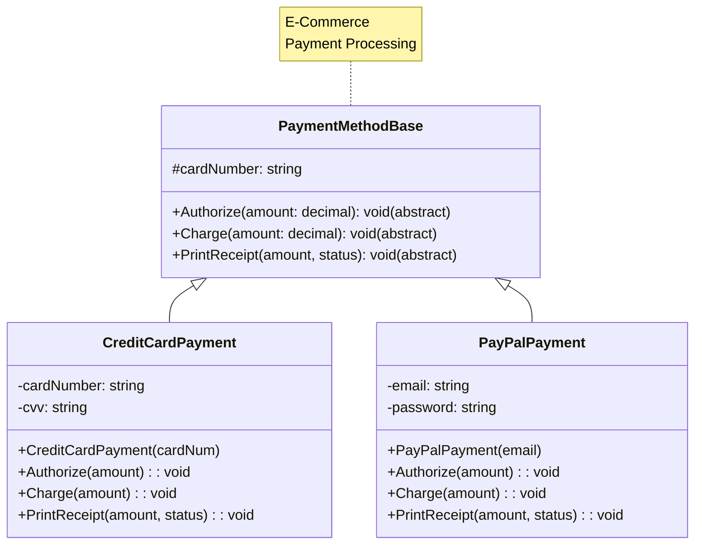
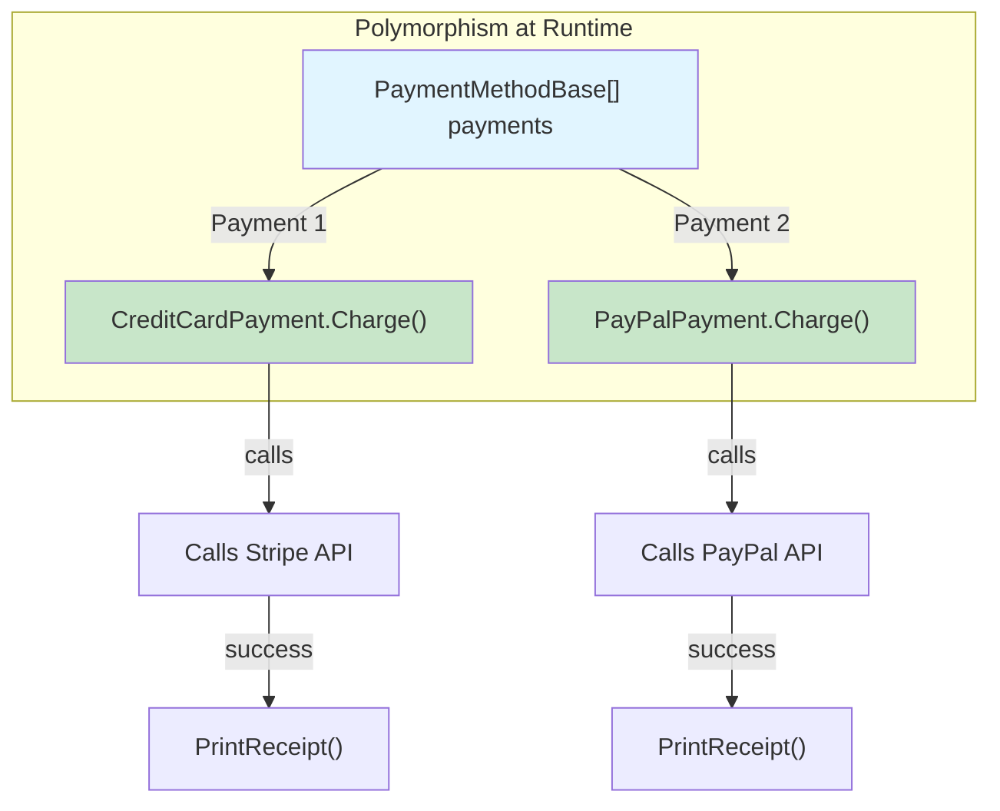

```mermaid
classDiagram
    direction LR
    
    %% Abstract Base Class
    class AnimalBase {
        #name: string
        +Name: string (property)
        +Describe(): string (virtual)
        +Sleep(): void (virtual)
        +Speak(): void (abstract)
    }
    
    %% Concrete Implementations
    class Dog {
        +Dog(name: string)
        +Speak(): void
        -FetchBall(): void
    }
    
    class Cat {
        +Cat(name: string)
        +Speak(): void
        -Scratch(): void
    }
    
    %% Inheritance Relationships
    AnimalBase <|-- Dog: implements
    AnimalBase <|-- Cat: implements
    
    %% Abstract Method Notation
    note for AnimalBase "Abstract base class<br/>Must implement: Speak()"
    note for Dog "Dog must implement Speak()<br/>inherits: Sleep(), Describe()"
    note for Cat "Cat must implement Speak()<br/>inherits: Sleep(), Describe()"
```

---

```mermaid
classDiagram
    direction TB
    
    %% Abstract Base Class
    class ShapeBase {
        #sideLength: double
        +Area(): double (abstract)
        +Perimeter(): double (abstract)
        +GetDescription(): string (virtual)
    }
    
    %% Concrete Shape Classes
    class Circle {
        -radius: double
        +Circle(radius: double)
        +Area(): double
        +Perimeter(): double
    }
    
    class Rectangle {
        -width: double
        -height: double
        +Rectangle(width, height)
        +Area(): double
        +Perimeter(): double
    }
    
    class Triangle {
        -side1, side2, side3: double
        +Triangle(s1, s2, s3)
        +Area(): double
        +Perimeter(): double
    }
    
    %% Relationships
    ShapeBase <|-- Circle
    ShapeBase <|-- Rectangle
    ShapeBase <|-- Triangle
    
    note for ShapeBase "Abstract Base Class<br/>Geometric Shapes"
```

---

```mermaid
classDiagram
    direction TB
    
    %% Payment Abstract Base
    class PaymentMethodBase {
        #cardNumber: string
        +Authorize(amount: decimal): void (abstract)
        +Charge(amount: decimal): void (abstract)
        +PrintReceipt(amount, status): void (abstract)
    }
    
    class CreditCardPayment {
        -cardNumber: string
        -cvv: string
        +CreditCardPayment(cardNum)
        +Authorize(amount): void
        +Charge(amount): void
        +PrintReceipt(amount, status): void
    }
    
    class PayPalPayment {
        -email: string
        -password: string
        +PayPalPayment(email)
        +Authorize(amount): void
        +Charge(amount): void
        +PrintReceipt(amount, status): void
    }
    
    PaymentMethodBase <|-- CreditCardPayment
    PaymentMethodBase <|-- PayPalPayment
    
    note for PaymentMethodBase "E-Commerce<br/>Payment Processing"
```

---

```mermaid
graph TD
    subgraph "Polymorphism at Runtime"
        A["PaymentMethodBase[] payments"] -->|Payment 1| B["CreditCardPayment.Charge()"]
        A -->|Payment 2| C["PayPalPayment.Charge()"]
    end
    
    B -->|calls| D["Calls Stripe API"]
    C -->|calls| E["Calls PayPal API"]
    
    D -->|success| F["PrintReceipt()"]
    E -->|success| G["PrintReceipt()"]
    
    style A fill:#e1f5ff
    style B fill:#c8e6c9
    style C fill:#c8e6c9
```
