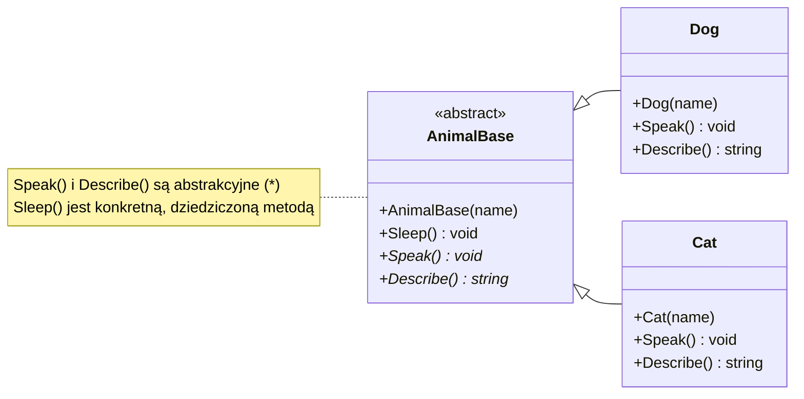
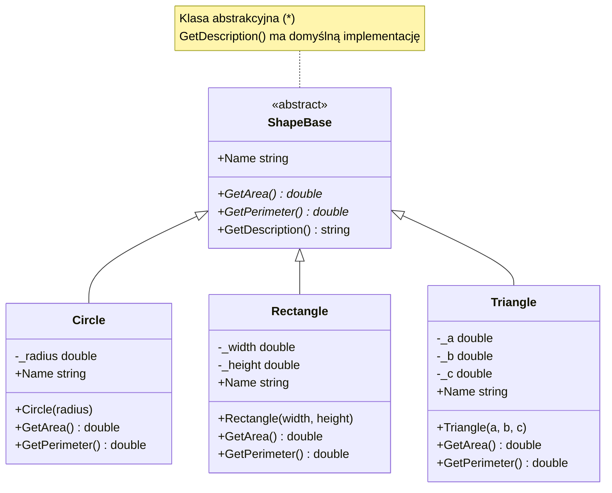
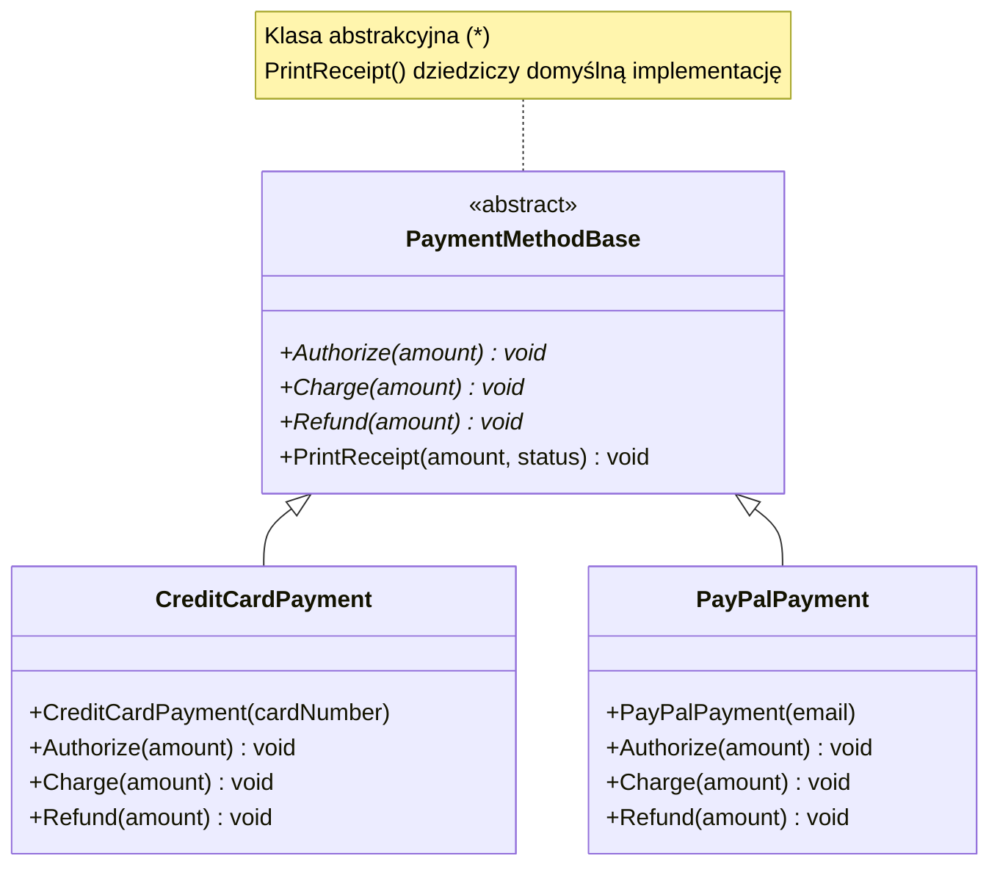
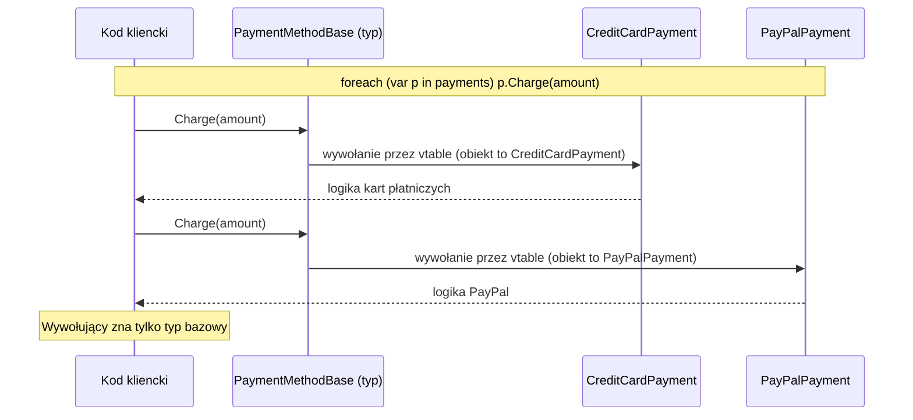

```mermaid
classDiagram
    direction LR
    
    %% Abstract Base Class
    class AnimalBase {
        <<abstract>>
        +AnimalBase(name)
        +Sleep() void
        +Speak()* void
        +Describe()* string
    }
    
    %% Concrete Implementations
    class Dog {
        +Dog(name)
        +Speak() void
        +Describe() string
    }
    
    class Cat {
        +Cat(name)
        +Speak() void
        +Describe() string
    }
    
    %% Inheritance Relationships
    AnimalBase <|-- Dog
    AnimalBase <|-- Cat
    
    note for AnimalBase "Speak() i Describe() są abstrakcyjne (*)<br/>Sleep() jest konkretną, dziedziczoną metodą"
```

---

```mermaid
classDiagram
    direction TB
    
    %% Abstract Base Class
    class ShapeBase {
        <<abstract>>
        +Name string
        +GetArea()* double
        +GetPerimeter()* double
        +GetDescription() string
    }
    
    %% Concrete Shape Classes
    class Circle {
        -_radius double
        +Circle(radius)
        +Name string
        +GetArea() double
        +GetPerimeter() double
    }
    
    class Rectangle {
        -_width double
        -_height double
        +Rectangle(width, height)
        +Name string
        +GetArea() double
        +GetPerimeter() double
    }
    
    class Triangle {
        -_a double
        -_b double
        -_c double
        +Triangle(a, b, c)
        +Name string
        +GetArea() double
        +GetPerimeter() double
    }
    
    %% Relationships
    ShapeBase <|-- Circle
    ShapeBase <|-- Rectangle
    ShapeBase <|-- Triangle
    
    note for ShapeBase "Klasa abstrakcyjna (*)<br/>GetDescription() ma domyślną implementację"
```

---

```mermaid
classDiagram
    direction TB
    
    %% Payment Abstract Base
    class PaymentMethodBase {
        <<abstract>>
        +Authorize(amount)* void
        +Charge(amount)* void
        +Refund(amount)* void
        +PrintReceipt(amount, status) void
    }
    
    class CreditCardPayment {
        +CreditCardPayment(cardNumber)
        +Authorize(amount) void
        +Charge(amount) void
        +Refund(amount) void
    }
    
    class PayPalPayment {
        +PayPalPayment(email)
        +Authorize(amount) void
        +Charge(amount) void
        +Refund(amount) void
    }
    
    PaymentMethodBase <|-- CreditCardPayment
    PaymentMethodBase <|-- PayPalPayment
    
    note for PaymentMethodBase "Klasa abstrakcyjna (*)<br/>PrintReceipt() dziedziczy domyślną implementację"
```

---

```mermaid
sequenceDiagram
    participant Caller as Kod kliencki
    participant Base as PaymentMethodBase (typ)
    participant Card as CreditCardPayment
    participant PayPal as PayPalPayment

    Note over Caller,PayPal: foreach (var p in payments) p.Charge(amount);
    Caller->>Base: Charge(amount)
    Base->>Card: wywołanie przez vtable (obiekt to CreditCardPayment)
    Card-->>Caller: logika kart płatniczych
    Caller->>Base: Charge(amount)
    Base->>PayPal: wywołanie przez vtable (obiekt to PayPalPayment)
    PayPal-->>Caller: logika PayPal
    Note over Caller: Wywołujący zna tylko typ bazowy
```
