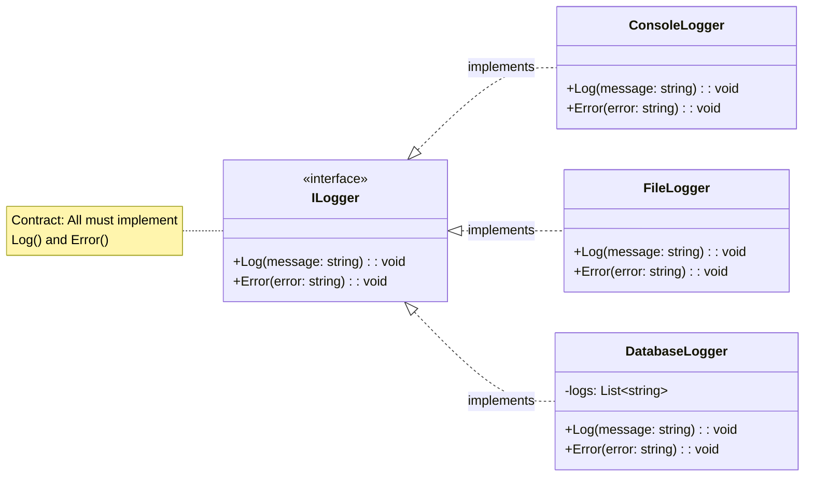
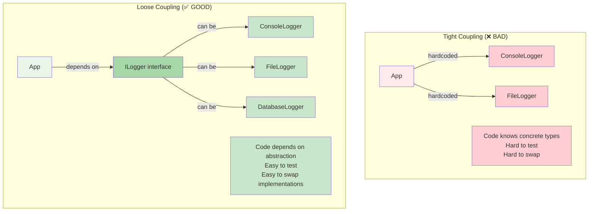
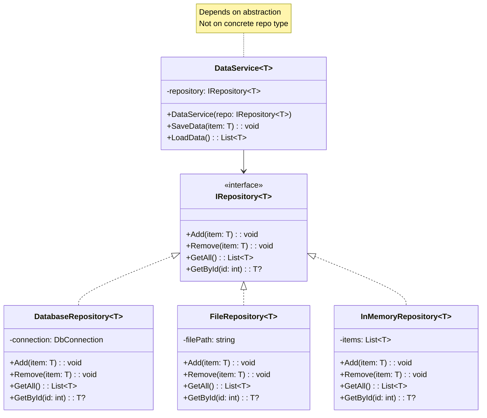
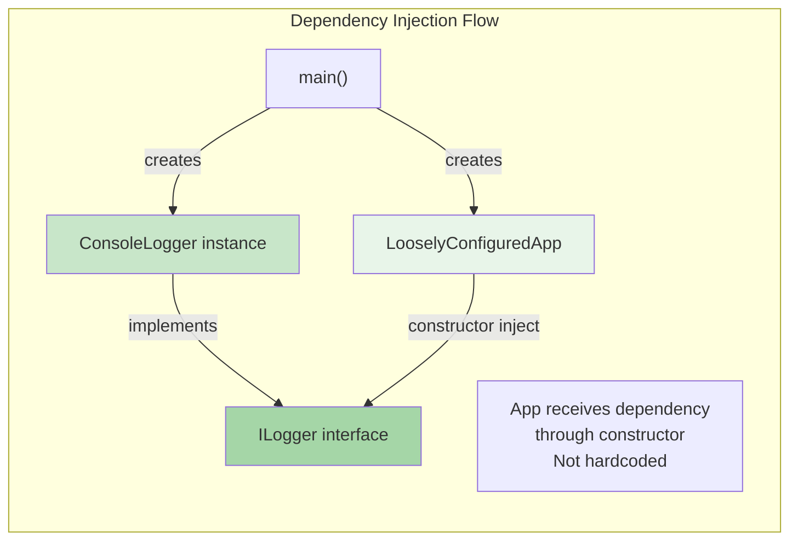
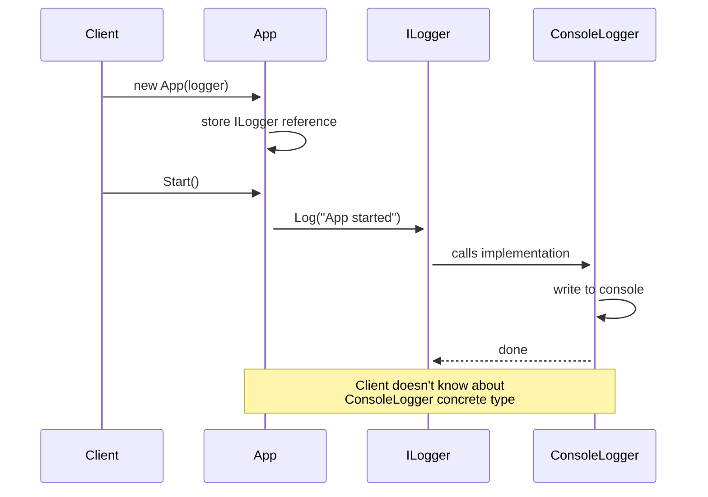
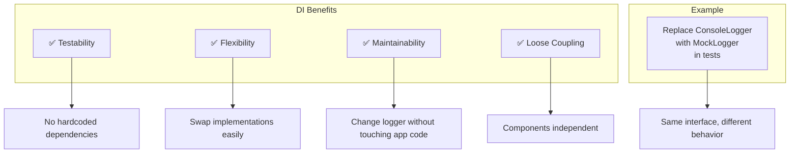

```mermaid
classDiagram
    direction LR
    
    %% Interface Contract
    class ILogger {
        <<interface>>
        +Log(message: string): void
        +Error(error: string): void
    }
    
    %% Multiple Implementations
    class ConsoleLogger {
        +Log(message: string): void
        +Error(error: string): void
    }
    
    class FileLogger {
        +Log(message: string): void
        +Error(error: string): void
    }
    
    class DatabaseLogger {
        -logs: List~string~
        +Log(message: string): void
        +Error(error: string): void
    }
    
    %% Implementation Relationships
    ILogger <|.. ConsoleLogger: implements
    ILogger <|.. FileLogger: implements
    ILogger <|.. DatabaseLogger: implements
    
    note for ILogger "Contract: All must implement<br/>Log() and Error()"
```

---

```mermaid
graph TB
    subgraph "Tight Coupling (❌ BAD)"
        A1["App"] -->|hardcoded| B1["ConsoleLogger"]
        A1 -->|hardcoded| C1["FileLogger"]
        note1["Code knows concrete types<br/>Hard to test<br/>Hard to swap"]
    end
    
    subgraph "Loose Coupling (✅ GOOD)"
        A2["App"] -->|depends on| D["ILogger interface"]
        D -->|can be| B2["ConsoleLogger"]
        D -->|can be| C2["FileLogger"]
        D -->|can be| E["DatabaseLogger"]
        note2["Code depends on abstraction<br/>Easy to test<br/>Easy to swap implementations"]
    end
    
    style A1 fill:#ffebee
    style B1 fill:#ffcdd2
    style C1 fill:#ffcdd2
    style note1 fill:#ffcdd2
    
    style A2 fill:#e8f5e9
    style D fill:#a5d6a7
    style B2 fill:#c8e6c9
    style C2 fill:#c8e6c9
    style E fill:#c8e6c9
    style note2 fill:#c8e6c9
```

---

```mermaid
classDiagram
    direction TB
    
    %% Repository Interface
    class IRepository~T~ {
        <<interface>>
        +Add(item: T): void
        +Remove(item: T): void
        +GetAll(): List~T~
        +GetById(id: int): T?
    }
    
    %% Multiple Repository Implementations
    class DatabaseRepository~T~ {
        -connection: DbConnection
        +Add(item: T): void
        +Remove(item: T): void
        +GetAll(): List~T~
        +GetById(id: int): T?
    }
    
    class FileRepository~T~ {
        -filePath: string
        +Add(item: T): void
        +Remove(item: T): void
        +GetAll(): List~T~
        +GetById(id: int): T?
    }
    
    class InMemoryRepository~T~ {
        -items: List~T~
        +Add(item: T): void
        +Remove(item: T): void
        +GetAll(): List~T~
        +GetById(id: int): T?
    }
    
    %% Consumer with Dependency Injection
    class DataService~T~ {
        -repository: IRepository~T~
        +DataService(repo: IRepository~T~)
        +SaveData(item: T): void
        +LoadData(): List~T~
    }
    
    %% Relationships
    IRepository~T~ <|.. DatabaseRepository~T~
    IRepository~T~ <|.. FileRepository~T~
    IRepository~T~ <|.. InMemoryRepository~T~
    
    DataService~T~ --> IRepository~T~
    
    note for DataService "Depends on abstraction<br/>Not on concrete repo type"
```

---

```mermaid
graph LR
    subgraph "Dependency Injection Flow"
        A["main()"]
        A -->|creates| B["ConsoleLogger instance"]
        B -->|implements| C["ILogger interface"]
        A -->|creates| D["LooselyConfiguredApp"]
        D -->|constructor inject| C
        
        note1["App receives dependency<br/>through constructor<br/>Not hardcoded"]
    end
    
    style C fill:#a5d6a7
    style D fill:#e8f5e9
    style B fill:#c8e6c9
```

---

```mermaid
sequenceDiagram
    participant Client
    participant App
    participant ILogger
    participant ConsoleLogger
    
    Client->>+App: new App(logger)
    App->>App: store ILogger reference
    Client->>+App: Start()
    App->>+ILogger: Log("App started")
    ILogger->>+ConsoleLogger: calls implementation
    ConsoleLogger->>ConsoleLogger: write to console
    ConsoleLogger-->>ILogger: done
    
    note over App,ConsoleLogger: Client doesn't know about<br/>ConsoleLogger concrete type
```

---

```mermaid
graph TD
    subgraph "DI Benefits"
        A["✅ Testability"]
        B["✅ Flexibility"] 
        C["✅ Maintainability"]
        D["✅ Loose Coupling"]
    end
    
    subgraph "Example"
        E["Replace ConsoleLogger<br/>with MockLogger<br/>in tests"]
    end
    
    A --> F["No hardcoded dependencies"]
    B --> G["Swap implementations easily"]
    C --> H["Change logger without touching app code"]
    D --> I["Components independent"]
    
    E --> J["Same interface, different behavior"]
```
