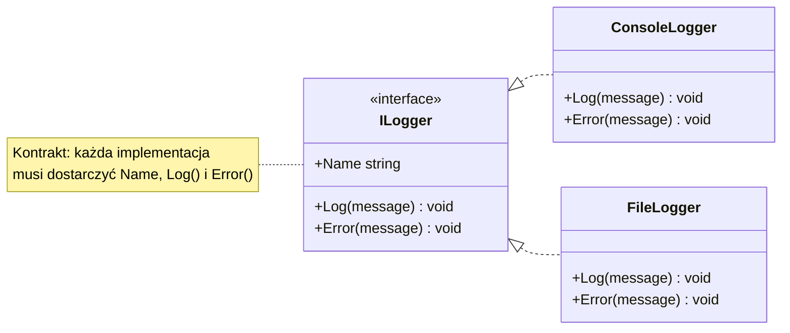
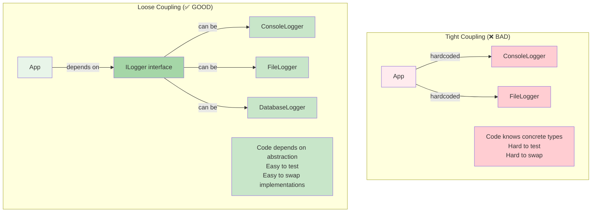
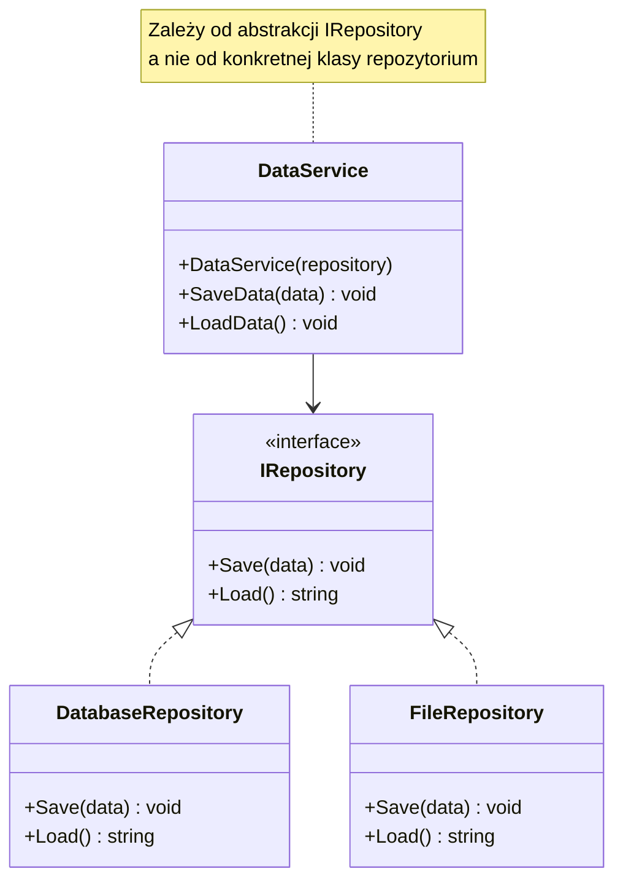
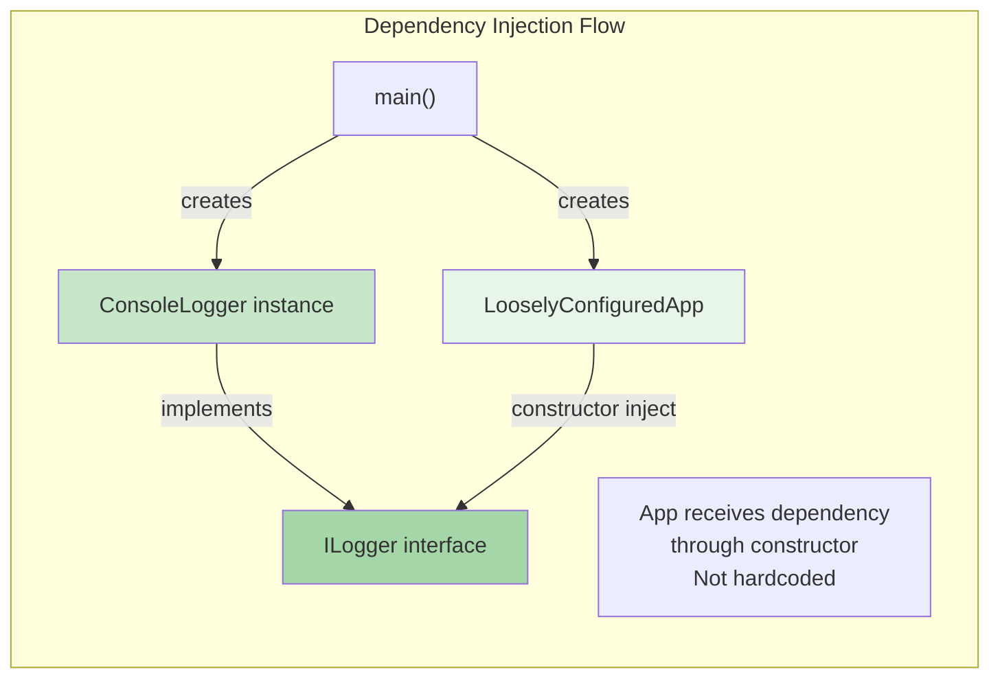
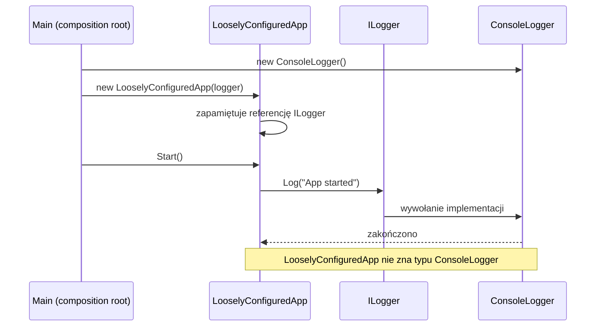
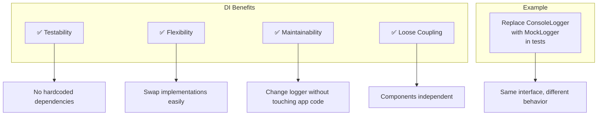

```mermaid
classDiagram
    direction LR
    
    %% Interface Contract
    class ILogger {
        <<interface>>
        +Name string
        +Log(message) void
        +Error(message) void
    }
    
    %% Multiple Implementations
    class ConsoleLogger {
        +Log(message) void
        +Error(message) void
    }
    
    class FileLogger {
        +Log(message) void
        +Error(message) void
    }
    
    %% Implementation Relationships
    ILogger <|.. ConsoleLogger
    ILogger <|.. FileLogger
    
    note for ILogger "Kontrakt: każda implementacja<br/>musi dostarczyć Name, Log() i Error()"
```

---

```mermaid
graph TB
    subgraph "Tight Coupling (❌ BAD)"
        A1["App"] -->|hardcoded| B1["ConsoleLogger"]
        A1 -->|hardcoded| C1["FileLogger"]
        note1["Code knows concrete types<br/>Hard to test<br/>Hard to swap"]
    end
    
    subgraph "Loose Coupling (✅ GOOD)"
        A2["App"] -->|depends on| D["ILogger interface"]
        D -->|can be| B2["ConsoleLogger"]
        D -->|can be| C2["FileLogger"]
        D -->|can be| E["DatabaseLogger"]
        note2["Code depends on abstraction<br/>Easy to test<br/>Easy to swap implementations"]
    end
    
    style A1 fill:#ffebee
    style B1 fill:#ffcdd2
    style C1 fill:#ffcdd2
    style note1 fill:#ffcdd2
    
    style A2 fill:#e8f5e9
    style D fill:#a5d6a7
    style B2 fill:#c8e6c9
    style C2 fill:#c8e6c9
    style E fill:#c8e6c9
    style note2 fill:#c8e6c9
```

---

```mermaid
classDiagram
    direction TB
    
    %% Repository Interface
    class IRepository {
        <<interface>>
        +Save(data) void
        +Load() string
    }
    
    class DatabaseRepository {
        +Save(data) void
        +Load() string
    }
    
    class FileRepository {
        +Save(data) void
        +Load() string
    }
    
    %% Consumer with Dependency Injection
    class DataService {
        +DataService(repository)
        +SaveData(data) void
        +LoadData() void
    }
    
    %% Relationships
    IRepository <|.. DatabaseRepository
    IRepository <|.. FileRepository
    DataService --> IRepository
    
    note for DataService "Zależy od abstrakcji IRepository<br/>a nie od konkretnej klasy repozytorium"
```

---

```mermaid
graph LR
    subgraph "Dependency Injection Flow"
        A["main()"]
        A -->|creates| B["ConsoleLogger instance"]
        B -->|implements| C["ILogger interface"]
        A -->|creates| D["LooselyConfiguredApp"]
        D -->|constructor inject| C
        
        note1["App receives dependency<br/>through constructor<br/>Not hardcoded"]
    end
    
    style C fill:#a5d6a7
    style D fill:#e8f5e9
    style B fill:#c8e6c9
```

---

```mermaid
sequenceDiagram
    participant Main as Main (composition root)
    participant App as LooselyConfiguredApp
    participant ILogger as ILogger
    participant ConsoleLogger as ConsoleLogger

    Main->>ConsoleLogger: new ConsoleLogger()
    Main->>App: new LooselyConfiguredApp(logger)
    App->>App: zapamiętuje referencję ILogger
    Main->>App: Start()
    App->>ILogger: Log("App started")
    ILogger->>ConsoleLogger: wywołanie implementacji
    ConsoleLogger-->>App: zakończono
    
    Note over App,ConsoleLogger: LooselyConfiguredApp nie zna typu ConsoleLogger
```

---

```mermaid
graph TD
    subgraph "DI Benefits"
        A["✅ Testability"]
        B["✅ Flexibility"] 
        C["✅ Maintainability"]
        D["✅ Loose Coupling"]
    end
    
    subgraph "Example"
        E["Replace ConsoleLogger<br/>with MockLogger<br/>in tests"]
    end
    
    A --> F["No hardcoded dependencies"]
    B --> G["Swap implementations easily"]
    C --> H["Change logger without touching app code"]
    D --> I["Components independent"]
    
    E --> J["Same interface, different behavior"]
```
