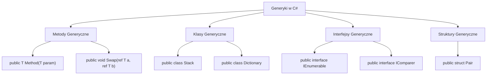
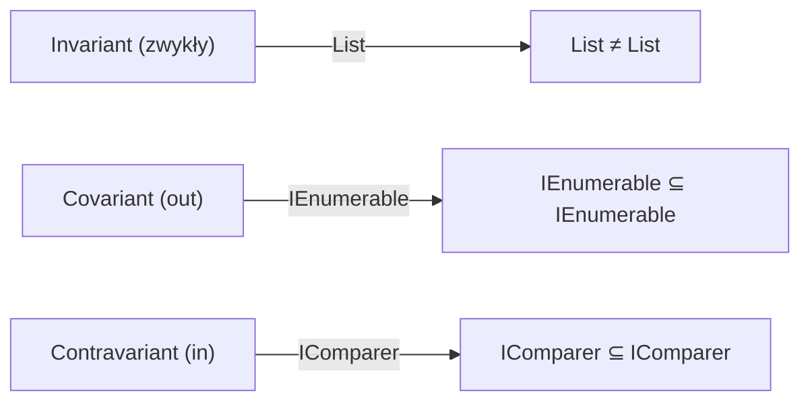

# 1. Metody i Klasy Generyczne

## 📌 Cel Tematu

Nauczenie się:
- Co to są generyki i dlaczego są potrzebne
- Jak definiować metody i klasy generyczne
- Komponenty generyczne oraz praktyczne zastosowania
- Wariancja typów (`in`, `out`)
- Nowoczesne cechy C# 9+ (records, pattern matching z generaliami)

## 🎯 Dlaczego Generyki?

Przed generaliami, aby zaakceptować wiele typów, trzeba było używać `object`:

```csharp
// ❌ Bez generyk – niebezpieczne
public class Stack
{
    private object[] items;
    
    public void Push(object item) => /* ... */;
    public object Pop() => /* ... */;
}

// Użycie
Stack stack = new Stack();
stack.Push(42);
int value = (int)stack.Pop();  // Niebezpieczne rzutowanie!
```

### Problemy:
- 🔴 **Boxing/unboxing** – obniża wydajność dla typów wartościowych
- 🔴 **Brak bezpieczeństwa typów** – błędy w runtime, nie w compile-time
- 🔴 **Kod mniej czytelny** – wymaga rzutowań

Z generaliami:

```csharp
// ✅ Z generaliami – bezpieczne
public class Stack<T>
{
    private T[] items;
    
    public void Push(T item) => /* ... */;
    public T Pop() => /* ... */;
}

// Użycie
Stack<int> intStack = new Stack<int>();
intStack.Push(42);
int value = intStack.Pop();  // Bezpieczne, bez rzutowania!
```

### Korzyści:
- ✅ **Bezpieczeństwo typów** – erros w compile-time
- ✅ **Wydajność** – bez boxing/unboxing
- ✅ **Czytelność** – jasne zamiaru kodu

---

## 📖 Metodzie Generyczne

### Składnia Podstawowa

```csharp
public T GetFirst<T>(T[] array)
{
    return array.Length > 0 ? array[0] : default(T);
}

// Użycie
int[] numbers = { 1, 2, 3 };
int first = GetFirst(numbers);  // T = int

string[] names = { "Alice", "Bob" };
string firstName = GetFirst(names);  // T = string
```

### Metody z Wieloma Parametrami Typów

```csharp
public class Pair<TKey, TValue>
{
    public TKey Key { get; set; }
    public TValue Value { get; set; }
    
    public Pair(TKey key, TValue value)
    {
        Key = key;
        Value = value;
    }
}

// Użycie
var pair = new Pair<string, int>("Alice", 30);
```

### Metody Zwracające Różne Typy

```csharp
public class Converter
{
    // Konwersja między typami
    public static TOutput Convert<TInput, TOutput>(TInput input)
    {
        if (input is TOutput result)
            return result;
        
        throw new InvalidOperationException(
            $"Cannot convert {typeof(TInput).Name} to {typeof(TOutput).Name}");
    }
}

// Użycie
int number = Converter.Convert<string, int>("42");
```

---

## 🏗️ Klasy Generyczne

### Definicja Prostej Klasy Generycznej

```csharp
public class Repository<T> where T : class
{
    private List<T> items = new();
    
    public void Add(T item) => items.Add(item);
    public void Remove(T item) => items.Remove(item);
    public List<T> GetAll() => new(items);
    public T GetById(int index) => index >= 0 && index < items.Count 
        ? items[index] 
        : null;
}
```

### Praktyczny Przykład: Stack<T>

```csharp
public class Stack<T>
{
    private T[] items;
    private int count;
    
    public Stack(int capacity = 10)
    {
        items = new T[capacity];
        count = 0;
    }
    
    public void Push(T item)
    {
        if (count == items.Length)
            Resize();
        items[count++] = item;
    }
    
    public T Pop()
    {
        if (count == 0)
            throw new InvalidOperationException("Stack is empty");
        return items[--count];
    }
    
    public bool IsEmpty => count == 0;
    public int Count => count;
    
    private void Resize()
    {
        T[] newItems = new T[items.Length * 2];
        Array.Copy(items, newItems, count);
        items = newItems;
    }
}

// Użycie
Stack<int> stack = new();
stack.Push(1);
stack.Push(2);
int value = stack.Pop();  // 2
```

---

## 📦 Wariancja Typów

### Kowariantność (`out`)

Kowariantność pozwala na przypisanie bardziej specjalistycznego typu do bardziej ogólnego:

```csharp
public interface IEnumerable<out T>  // out = kowariantny
{
    IEnumerator<T> GetEnumerator();
}

// Klasa bazowa
class Animal { }

// Klasa pochodna
class Dog : Animal { }

// Bez out – błąd kompilacji!
// IEnumerable<Dog> dogs = GetAnimals();  // ❌

// Z out – działa!
public IEnumerable<Animal> GetAnimals()
{
    yield return new Dog();
    yield return new Animal();
}

IEnumerable<Animal> animals = GetAnimals();
```

### Kontrawariantność (`in`)

Kontrawariantność pozwala na przypisanie bardziej ogólnego typu do bardziej specjalistycznego:

```csharp
public interface IComparer<in T>  // in = kontrawariantny
{
    int Compare(T x, T y);
}

// Bez in – błąd kompilacji!
// IComparer<Animal> animalComparer = GetDogComparer();  // ❌

// Z in – działa!
public class DogComparer : IComparer<Dog>
{
    public int Compare(Dog x, Dog y) => x.Name.CompareTo(y.Name);
}

// Dog jest bardziej specjalistyczne, więc możemy go przypisać do bardziej ogólnego
IComparer<Animal> comparer = new DogComparer();
```

---

## 🆕 Nowoczesne Cechy C# 9+

### Records z Typami Generycznymi

```csharp
// C# 9 – records z typami generycznymi
public record Box<T>(T Content);

// Użycie
var intBox = new Box<int>(42);
var stringBox = new Box<string>("Hello");

// Deconstruction
var (content) = intBox;
```

### Generic Async Methods

```csharp
public async Task<T> FetchData<T>(string url) where T : class
{
    using (var client = new HttpClient())
    {
        var response = await client.GetAsync(url);
        var json = await response.Content.ReadAsStringAsync();
        return JsonSerializer.Deserialize<T>(json);
    }
}
```

---

## 🔧 Praktyczne Zastosowania

### 1. Repository Pattern

```csharp
public interface IRepository<T> where T : class
{
    Task<T> GetById(int id);
    Task<IEnumerable<T>> GetAll();
    Task Add(T entity);
    Task Update(T entity);
    Task Delete(int id);
}

public class GenericRepository<T> : IRepository<T> where T : class
{
    private readonly List<T> database = new();
    
    public Task<T> GetById(int id)
    {
        // Implementacja
        return Task.FromResult<T>(null);
    }
    
    // Pozostałe metody...
}
```

### 2. Factory Pattern

```csharp
public class Factory<T> where T : class, new()
{
    public T Create() => new T();
    
    public T CreateWithInitialization(Action<T> initialize)
    {
        var instance = new T();
        initialize(instance);
        return instance;
    }
}

// Użycie
var factory = new Factory<Person>();
var person = factory.Create();
```

### 3. Builder Pattern

```csharp
public class Builder<T> where T : class, new()
{
    private readonly T instance = new();
    private readonly Dictionary<string, object> properties = new();
    
    public Builder<T> Set<TProp>(string name, TProp value)
    {
        properties[name] = value;
        return this;
    }
    
    public T Build()
    {
        // Ustawienie właściwości na instancji
        return instance;
    }
}
```

---

## 📊 Diagramy

### Hierarchia Generyk



### Wariancja Typów



---

## 💡 Best Practices

1. **Nazewnictwo** – Używaj `T`, `U`, `K`, `V` dla jednog otpowego, bardziej czytelnych nazw dla wieluparametrów
   ```csharp
   public class Dictionary<TKey, TValue>  // ✅ Czytelne
   public class Pair<T, U>                // ❌ Mniej jasne
   ```

2. **Constraints** – Zawsze dodaj właściwe ograniczenia
   ```csharp
   public T GetMax<T>(T a, T b) where T : IComparable<T>  // ✅
   ```

3. **Nested Generics** – Ostrożnie zagnieżdżaj
   ```csharp
   Dictionary<string, List<Dictionary<int, string>>>  // Czytalne?
   ```

4. **Performance** – Unikaj boxing dla value types
   ```csharp
   // ✅ Bezpieczne dla value types
   T value = default(T);
   ```

---

## 📚 Referencje

- [Microsoft Docs: Generics](https://learn.microsoft.com/en-us/dotnet/standard/generics/)
- [C# Variance](https://learn.microsoft.com/en-us/dotnet/csharp/programming-guide/concepts/covariance-contravariance/)
- [.NET Performance Guide](https://github.com/dotnet/performance)

---

**Następnie:** Przejdź do tematu [2. Ograniczenia Typów Generycznych](_02_generic_constraints/README.md)
