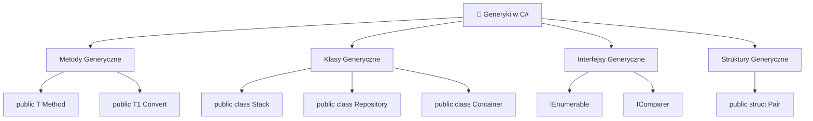
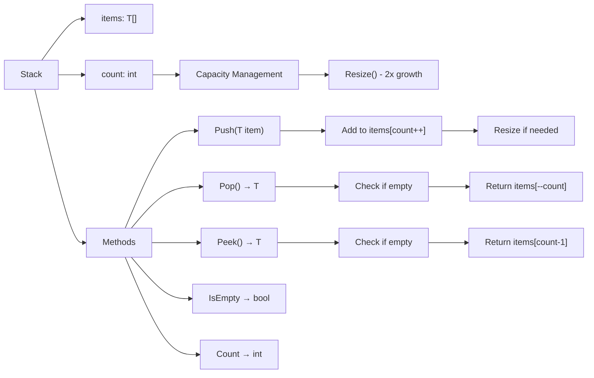
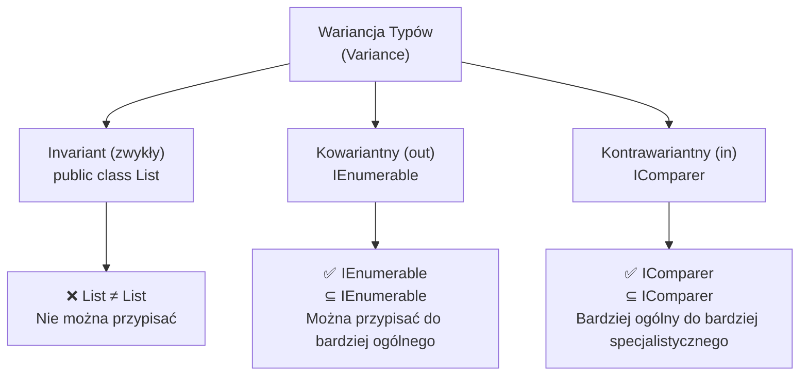
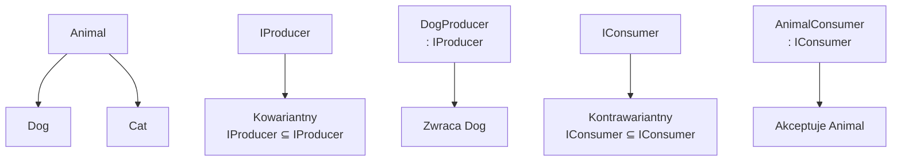
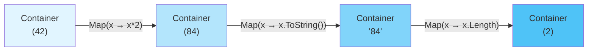
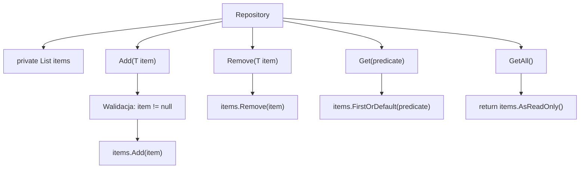
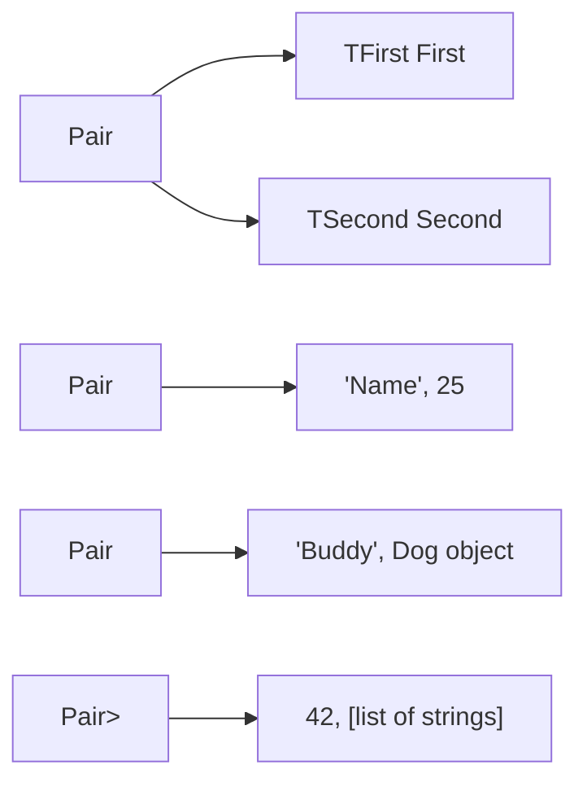
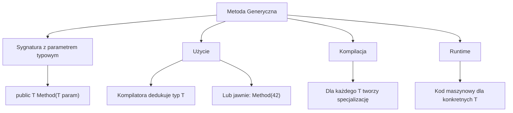
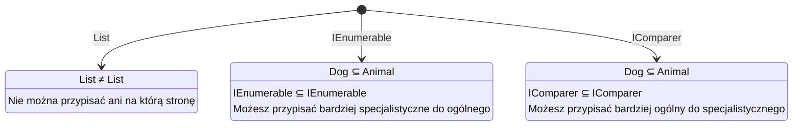

# Diagramy - Metody i Klasy Generyczne

## 1. Hierarchia Generyk w C#

## 2. Architektura Stack<T>

## 3. Wariancja Typów

## 4. Relacja Klas w Hierarchii Dziedziczenia

## 5. Transformacja Container<T> - Map Pattern

## 6. Przepływ Danych w Repository<T>

## 7. Pair<TFirst, TSecond> - Struktura Danych

## 8. Ogólny Schemat Metody Generycznej

## 9. Wariancja - Porównanie

