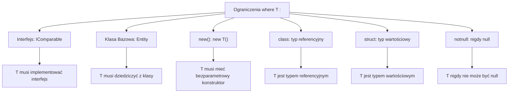

# 2. Ograniczenia Typów Generycznych

## 📌 Cel Tematu

- Zrozumienie klauzuli `where` i wszystkich typów ograniczeń
- `new()` - ograniczenie konstruktora
- Ograniczenia bazowe (klasa bazowa, interfejs)
- Wartość domyślna dla typów generycznych
- Spłycanie typów (type erasure)

## 🎯 Dlaczego Ograniczenia?

Bez ograniczeń, kompilator nie wie jakie operacje są dozwolone na typie `T`:

```csharp
// ❌ Błąd - nie wiadomo, czy T ma metodę CompareTo
public T GetMax<T>(T a, T b)
{
    return a.CompareTo(b) > 0 ? a : b;  // BŁĄD KOMPILACJI!
}
```

Z ograniczeniami:

```csharp
// ✅ OK - T musi implementować IComparable<T>
public T GetMax<T>(T a, T b) where T : IComparable<T>
{
    return a.CompareTo(b) > 0 ? a : b;
}
```

---

## 📖 Typy Ograniczeń

### 1. Ograniczenie Interfejsu

```csharp
public class SortedList<T> where T : IComparable<T>
{
    public void Sort(List<T> items)
    {
        // T gwarantuje metodę CompareTo
        items.Sort((a, b) => a.CompareTo(b));
    }
}
```

### 2. Ograniczenie Klasy Bazowej

```csharp
public class EntityRepository<T> where T : Entity
{
    public void Save(T entity)
    {
        if (entity.Id == 0)
            throw new InvalidOperationException("Entity must have ID");
        // Możesz używać właściwości z Entity
        Console.WriteLine($"Saving {entity.Name}...");
    }
}

public class Entity
{
    public int Id { get; set; }
    public string Name { get; set; } = "";
}
```

### 3. Ograniczenie Konstruktora `new()`

```csharp
public class Factory<T> where T : new()
{
    public T Create() => new T();  // Musi mieć bezparametrowy konstruktor
}

public class ProgramFactory : Factory<Configuration>
{
    // Configuration musi mieć Configuration() { }
}
```

### 4. Ograniczenie Klasy (Reference Type)

```csharp
public class Repository<T> where T : class
{
    public void Add(T item)
    {
        if (item == null)
            throw new ArgumentNullException(nameof(item));
        // T jest typem referencyjnym
    }
}
```

### 5. Ograniczenie Struktury (Value Type)

```csharp
public class ValueHolder<T> where T : struct
{
    public bool TryGetValue(out T value)
    {
        value = default(T);
        // T jest zawsze wartościowy, nigdy null
        return true;
    }
}
```

### 6. Ograniczenie `notnull` (C# 8+)

```csharp
public class NotNullCache<T> where T : notnull
{
    private Dictionary<T, object> cache = new();
    
    public void Add(T key, object value)
    {
        // T nigdy nie może być null
        cache[key] = value;
    }
}
```

### 7. Kombinacja Ograniczeń

```csharp
public class Entity
{
    public int Id { get; set; }
}

public interface ITimestamped
{
    DateTime CreatedAt { get; set; }
}

// T musi być: klasą, implementować interfejs, mieć Entity jako bazę, mieć new()
public class AuditedRepository<T> 
    where T : class, Entity, ITimestamped, new()
{
    public T Create()
    {
        var entity = new T();
        entity.CreatedAt = DateTime.Now;
        return entity;
    }
}
```

---

## 💾 Wartość Domyślna dla Typów Generycznych

### Operator `default`

```csharp
public T GetValueOrDefault<T>(T? value, T? defaultValue) 
    where T : class
{
    return value ?? defaultValue;
}

// Dla value types
public T GetValueOrDefault<T>(T value, T defaultValue) 
    where T : struct, IEquatable<T>
{
    return value.Equals(default(T)) ? defaultValue : value;
}

// Uniwersalne - C# 7.1+
public T GetDefault<T>()
{
    return default!;  // ! oznacza "nullable forgiving operator"
}
```

### Wyrażenie `default` (C# 7.1+)

```csharp
public T? TryParse<T>(string input) where T : struct
{
    if (int.TryParse(input, out int value) && value is T)
        return (T)(object)value;
    
    return default;  // Null dla nullable<T>
}
```

---

## 🔄 Spłycanie Typów (Type Erasure)

C# **NIE** stosuje type erasure jak Java. Każdy typ generyczny jest specjalizowany:

```csharp
// C# - tworzy osobny kod dla każdego T
List<int> ints = new();
List<string> strings = new();
List<Dog> dogs = new();
// Three completely separate generated types at runtime

// Sprawdzenie
Console.WriteLine(ints.GetType() == strings.GetType());  // false
Console.WriteLine(ints.GetType().IsGenericType);  // true
Console.WriteLine(ints.GetType().GetGenericArguments()[0]);  // System.Int32
```

---

## 🧩 Praktyczne Przykłady

### 1. Dependency Injection Pattern

```csharp
public interface IService { }

public class ServiceLocator<T> where T : class, IService, new()
{
    public T GetService()
    {
        return new T();  // new() constraint
    }
}

public class UserService : IService { }

var locator = new ServiceLocator<UserService>();
var service = locator.GetService();
```

### 2. Walidacja i Serializacja

```csharp
public interface IValidatable
{
    bool IsValid();
}

public class Validator<T> where T : class, IValidatable
{
    public bool Validate(T entity)
    {
        if (entity == null)
            return false;
        return entity.IsValid();
    }
}
```

### 3. Constraint Chaining

```csharp
public abstract class Animal
{
    public string Name { get; set; } = "";
}

public class AnimalCare<T> where T : Animal, new()
{
    public T CreateAnimal(string name)
    {
        return new T { Name = name };
    }
}
```

---

## 🆕 Nowoczesne Cechy (C# 9+)

### Record z Ograniczeniami

```csharp
public record Repository<T>(List<T> Items) 
    where T : class
{
    public int Count => Items.Count;
}
```

### Generic Virtual Members

```csharp
public interface ITransformer<T>
{
    TResult Transform<TResult>(T value) where TResult : class;
}
```

---

## 📊 Diagramy Ograniczeń



---

## 💡 Best Practices

1. **Minimal Constraints** – Używaj dokładnie tylu ograniczeń co trzeba
   ```csharp
   // ✅ OK
   public T GetMax<T>(T a, T b) where T : IComparable<T>
   
   // ❌ Zbyt dużo
   public T GetMax<T>(T a, T b) where T : class, new(), IComparable<T>
   ```

2. **Łączenie Ograniczeń** – Kolejność: klasa, interfejsy, new()
   ```csharp
   // ✅ Poprawna kolejność
   where T : class, IComparable, IEquatable<T>, new()
   ```

3. **Nullable Awareness**
   ```csharp
   // ✅ Lepsze - jawnie obsługujesz null
   public T? GetOrDefault<T>(T? value) where T : class
   ```

---

## 📚 Referencje

- [Docs: Constraints on Type Parameters](https://learn.microsoft.com/en-us/dotnet/csharp/programming-guide/generics/constraints-on-type-parameters)
- [GitHub: C# Language Proposals](https://github.com/dotnet/csharplang)

---

**Następnie:** [3. IEnumerable i IEnumerator]../_03_ienumerable_ienumerator/README.md
