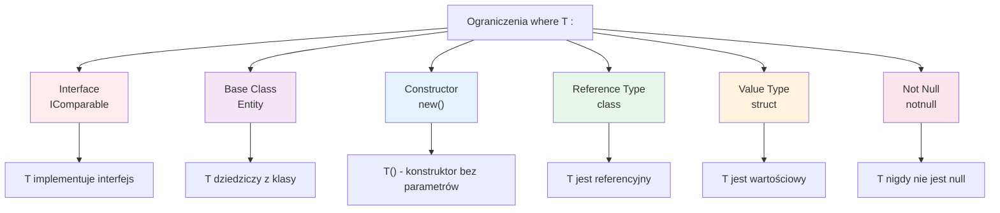
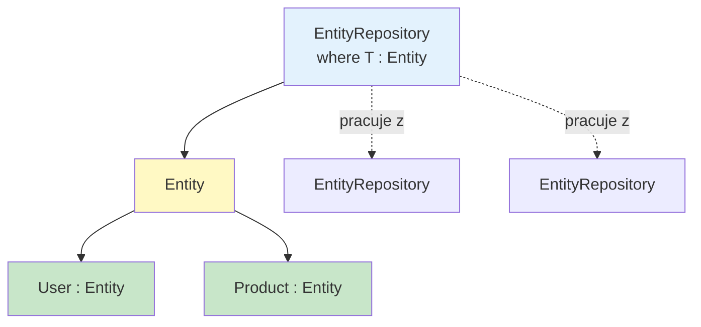
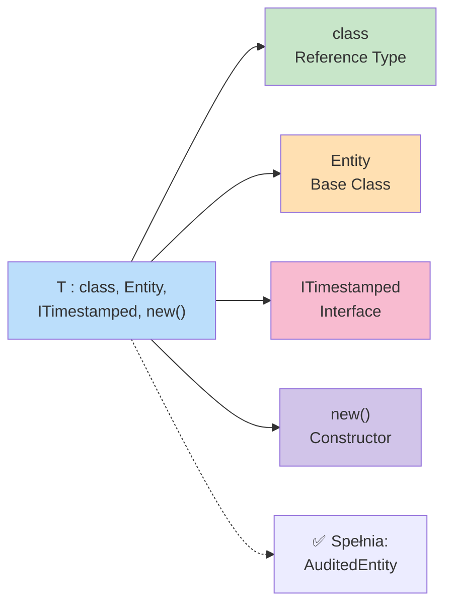
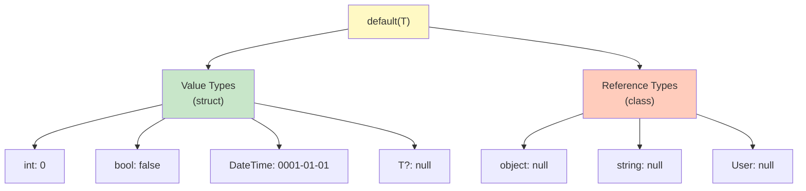
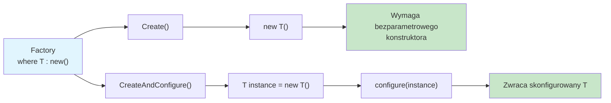
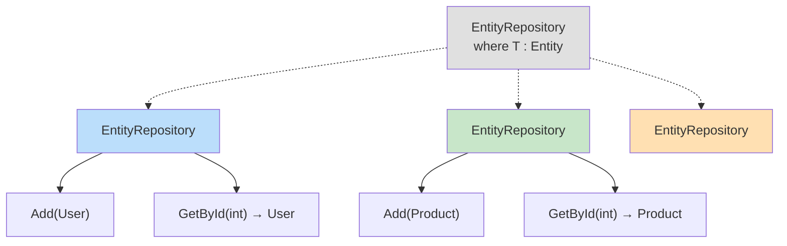
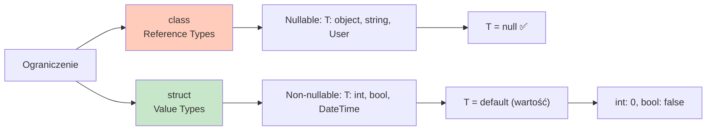
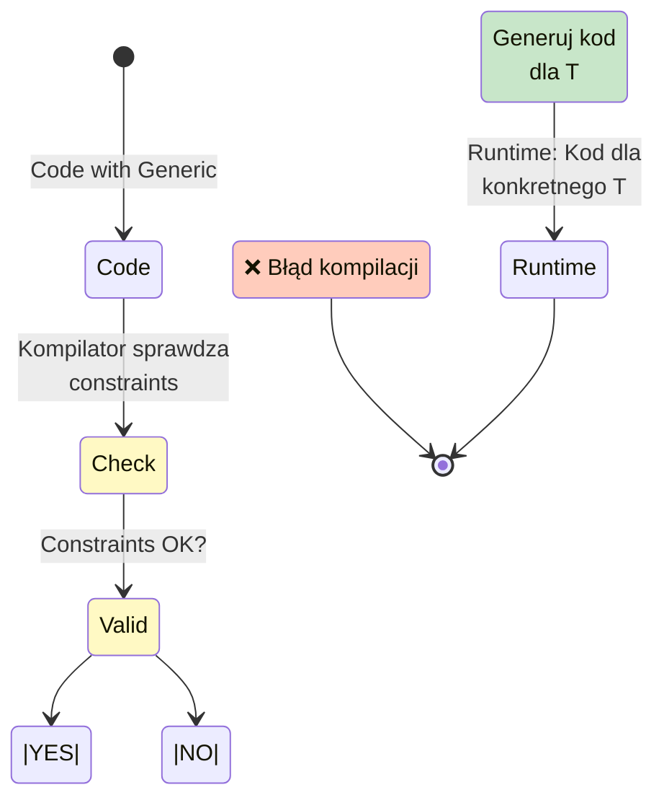

# Diagramy - Ograniczenia Typów Generycznych

## 1. Typy Ograniczeń

## 2. Hierarchia Klas z Ograniczeniami

## 3. Kombinacja Ograniczeń

## 4. Default Value dla Typów

## 5. Factory Pattern z new() Constraint

## 6. Specjalizacja Typów Generycznych

## 7. Reference Type vs Value Type

## 8. Constraint Flow - Walidacja Kompilacji

