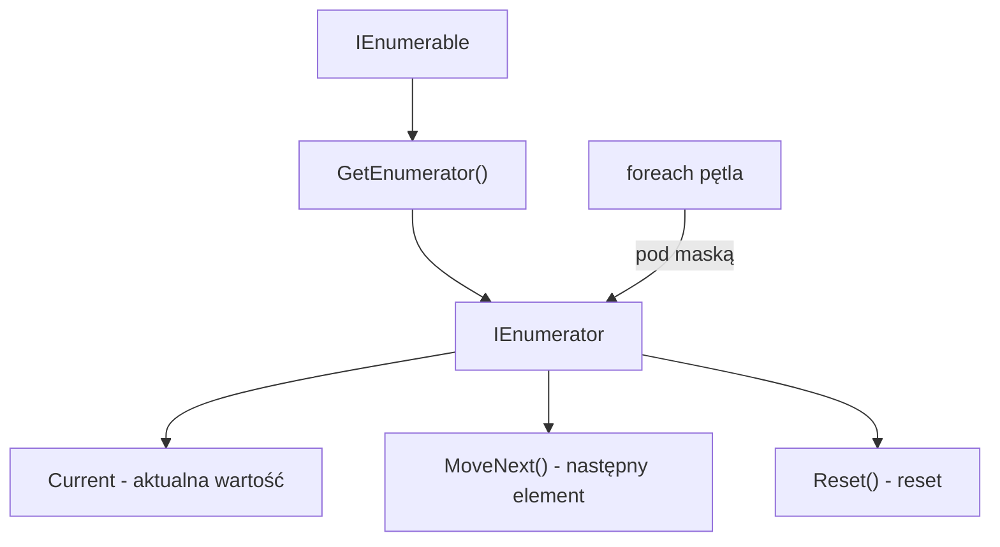

# 3. IEnumerable i IEnumerator

## 📌 Cel Tematu

- Zrozumienie `IEnumerable<T>` i `IEnumerator<T>`
- Implementacja niestandardowych kolekcji iterowalnych
- Iterator `yield` - upraszczanie implementacji
- Pętla `foreach` pod maską

## 🎯 Dlaczego IEnumerable?

`IEnumerable<T>` stanowi fundament iteracji w C#. Umożliwia:
- ✅ Jednolity interfejs dla wszystkich kolekcji
- ✅ Pętlę `foreach` dla dowolnych typów
- ✅ LINQ queries
- ✅ Deferred execution

## 📖 Interfejsy Fundamentalne

### IEnumerable<T>

```csharp
public interface IEnumerable<out T>
{
    IEnumerator<T> GetEnumerator();
}
```

Zwraca enumerator dla danej kolekcji.

### IEnumerator<T>

```csharp
public interface IEnumerator<out T> : IDisposable
{
    T Current { get; }
    bool MoveNext();
    void Reset();
}
```

Pozwala na iterację przez elementy.

---

## 🔄 Pętla `foreach` - Jak To Działa?

```csharp
// Pseudokod pętli foreach
foreach (var item in collection)
{
    Console.WriteLine(item);
}

// Tłumaczenie na IEnumerator
using (var enumerator = collection.GetEnumerator())
{
    while (enumerator.MoveNext())
    {
        var item = enumerator.Current;
        Console.WriteLine(item);
    }
}
```

---

## 💻 Implementacja Ręczna

### Iterator Ręczny

```csharp
public class ManualList<T> : IEnumerable<T>
{
    private T[] items;
    private int count;
    
    public ManualList()
    {
        items = new T[10];
        count = 0;
    }
    
    public void Add(T item)
    {
        items[count++] = item;
    }
    
    public IEnumerator<T> GetEnumerator()
    {
        return new ManualListEnumerator(this);
    }
    
    IEnumerator IEnumerable.GetEnumerator() => GetEnumerator();
    
    // Zagnieżdżona klasa Enumeratora
    private class ManualListEnumerator : IEnumerator<T>
    {
        private ManualList<T> list;
        private int index = -1;
        
        public ManualListEnumerator(ManualList<T> list)
        {
            this.list = list;
        }
        
        public T Current => list.items[index];
        
        object IEnumerator.Current => Current!;
        
        public bool MoveNext()
        {
            index++;
            return index < list.count;
        }
        
        public void Reset() => index = -1;
        
        public void Dispose() { }
    }
}
```

---

## 🚀 Iterator `yield` - Uproszczona Implementacja

### Yield Return

```csharp
public class YieldList<T> : IEnumerable<T>
{
    private T[] items;
    private int count;
    
    public YieldList()
    {
        items = new T[10];
        count = 0;
    }
    
    public void Add(T item)
    {
        items[count++] = item;
    }
    
    public IEnumerator<T> GetEnumerator()
    {
        for (int i = 0; i < count; i++)
        {
            yield return items[i];
        }
    }
    
    IEnumerator IEnumerable.GetEnumerator() => GetEnumerator();
}
```

Kompilator **automatycznie** generuje klasy enumeratora!

### Yield Break

```csharp
public IEnumerable<int> GetNumbersUntilZero()
{
    while (true)
    {
        int input = int.Parse(Console.ReadLine() ?? "0");
        if (input == 0)
            yield break;  // Przerwij iterację
        yield return input;
    }
}
```

---

## 🎯 Praktyczne Przykłady

### 1. Custom Range

```csharp
public class Range : IEnumerable<int>
{
    private int start;
    private int end;
    
    public Range(int start, int end)
    {
        this.start = start;
        this.end = end;
    }
    
    public IEnumerator<int> GetEnumerator()
    {
        for (int i = start; i < end; i++)
        {
            yield return i;
        }
    }
    
    IEnumerator IEnumerable.GetEnumerator() => GetEnumerator();
}

// Użycie
foreach (var i in new Range(1, 5))
{
    Console.WriteLine(i);  // 1, 2, 3, 4
}
```

### 2. Fibonacci Sequence

```csharp
public class Fibonacci : IEnumerable<long>
{
    private int count;
    
    public Fibonacci(int count) => this.count = count;
    
    public IEnumerator<long> GetEnumerator()
    {
        long a = 0, b = 1;
        for (int i = 0; i < count; i++)
        {
            yield return a;
            (a, b) = (b, a + b);  // Tuple deconstruction
        }
    }
    
    IEnumerator IEnumerable.GetEnumerator() => GetEnumerator();
}

// Użycie
foreach (var fib in new Fibonacci(5))
{
    Console.WriteLine(fib);  // 0, 1, 1, 2, 3
}
```

### 3. Reverse Iterator

```csharp
public class ReverseIterator<T> : IEnumerable<T>
{
    private T[] items;
    
    public ReverseIterator(T[] items) => this.items = items;
    
    public IEnumerator<T> GetEnumerator()
    {
        for (int i = items.Length - 1; i >= 0; i--)
        {
            yield return items[i];
        }
    }
    
    IEnumerator IEnumerable.GetEnumerator() => GetEnumerator();
}

// Użycie
var reversed = new ReverseIterator<int>(new[] { 1, 2, 3 });
// Iteruje: 3, 2, 1
```

---

## 🆕 Nowoczesne Cechy (C# 9+)

### Iterator as Method Group

```csharp
public IEnumerable<int> GetNumbers()
{
    yield return 1;
    yield return 2;
    yield return 3;
}

// Można używać jako LINQ source
var doubled = GetNumbers().Select(x => x * 2);
```

### Nullable Iterator

```csharp
public IEnumerable<string>? GetNames()
{
    if (someCondition)
        yield return "Alice";
    else
        yield break;  // Lub zwróć null
}
```

---

## 📊 Diagramy



---

## 💡 Best Practices

1. **Zawsze implementuj `IEnumerable` (non-generic)**
   ```csharp
   IEnumerator IEnumerable.GetEnumerator() => GetEnumerator();
   ```

2. **Używaj `yield` zamiast ręcznej implementacji**
   ```csharp
   // ✅ Proste i czytelne
   public IEnumerator<T> GetEnumerator()
   {
       foreach (var item in items)
           yield return item;
   }
   ```

3. **Dispose w enumeratorze**
   ```csharp
   public void Dispose() 
   {
       // Czyszczenie zasobów
   }
   ```

---

## 📚 Referencje

- [IEnumerable<T> Documentation](https://learn.microsoft.com/en-us/dotnet/api/system.collections.generic.ienumerable-1)
- [yield keyword](https://learn.microsoft.com/en-us/dotnet/csharp/language-reference/keywords/yield)

---

**Następnie:** [4. Interfejsy Porównania Obiektów]../_04_comparison_interfaces/
