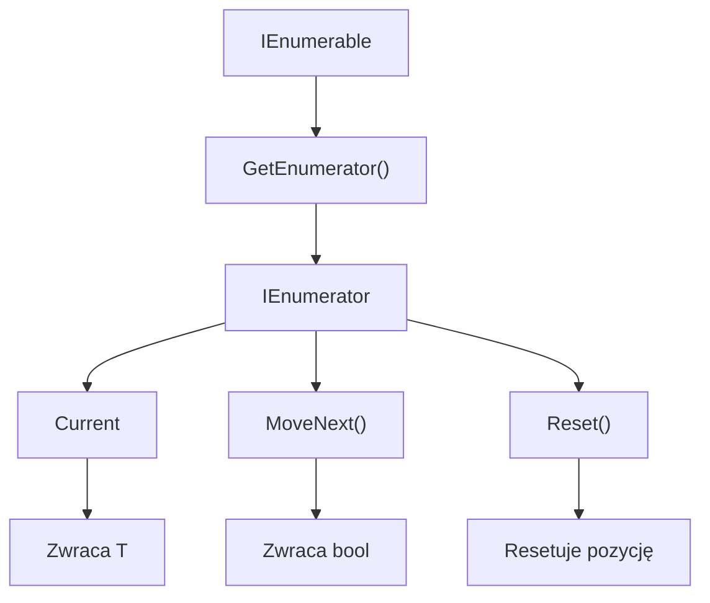
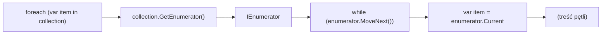
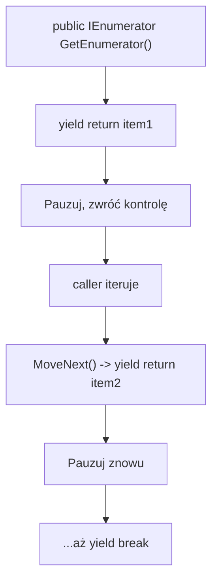

# Diagramy - IEnumerable i IEnumerator

## 1. IEnumerable i IEnumerator Hierarchy



## 2. Pętla foreach pod maską



## 3. Yield Iterator - Jak Działa



## 4. Iterator State Machine (uproszczenie)

```mermaid
graph TD
    A["IEnumerator<T>"]
    
    A --> S1["State 0: Start"]
    S1 --> S2["State 1: First Yield"]
    S2 --> S3["State 2: Second Yield"]
    S3 --> S4["State N: End"]
    
    S1 -->|MoveNext()| S2
    S2 -->|MoveNext()| S3
    S3 -->|MoveNext()| S4
    S4 -->|MoveNext()| S5["Return false"]
```
