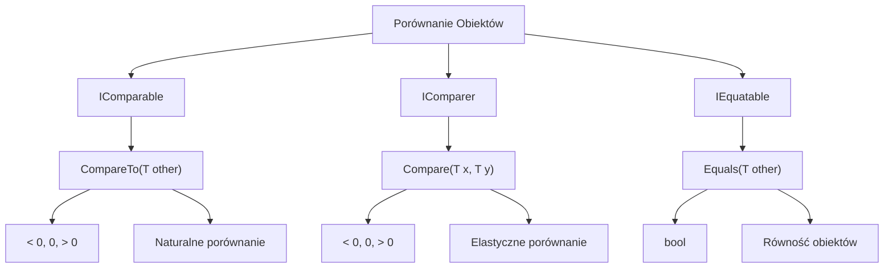

# 4. Interfejsy Porównania Obiektów

## 📌 Cel Tematu

- `IComparable<T>` - porównywanie dla sortowania
- `IComparer<T>` - elastyczne strategie porównywania
- `IEquatable<T>` - równość obiektów
- Case studies: sortowanie złożonych obiektów

## 🎯 IComparable<T> vs IComparer<T>

### IComparable<T> - Naturalne Porównanie

Definiuje domyślny sposób porównania obiektu:

```csharp
public interface IComparable<in T>
{
    int CompareTo(T? other);
}

// Zwraca:
// < 0: this < other
// = 0: this == other
// > 0: this > other
```

**Implementacja:**

```csharp
public class Person : IComparable<Person>
{
    public string Name { get; set; } = "";
    public int Age { get; set; }
    
    public int CompareTo(Person? other)
    {
        if (other is null) return 1;
        return this.Name.CompareTo(other.Name);  // Sortuj po nazwie
    }
}

// Użycie
var people = new List<Person> { ... };
people.Sort();  // Używa CompareTo
```

### IComparer<T> - Elastyczne Porównanie

Umożliwia wiele strategii sortowania:

```csharp
public interface IComparer<in T>
{
    int Compare(T? x, T? y);
}

// Implementacja
public class PersonAgeComparer : IComparer<Person>
{
    public int Compare(Person? x, Person? y)
    {
        if (x is null || y is null) return 0;
        return x.Age.CompareTo(y.Age);
    }
}

// Użycie
var people = new List<Person> { ... };
people.Sort(new PersonAgeComparer());  // Sortuj po wieku
```

---

## 🎯 IEquatable<T> - Równość Obiektów

```csharp
public interface IEquatable<T>
{
    bool Equals(T? other);
}

public class Product : IEquatable<Product>
{
    public int Id { get; set; }
    public string Name { get; set; } = "";
    
    public bool Equals(Product? other)
    {
        if (other is null) return false;
        return this.Id == other.Id;  // Porównaj po ID
    }
    
    public override bool Equals(object? obj) => Equals(obj as Product);
    
    public override int GetHashCode() => Id.GetHashCode();
}
```

---

## 💻 Praktyczne Przykłady

### 1. Sortowanie Pracowników

```csharp
public class Employee : IComparable<Employee>
{
    public string Name { get; set; } = "";
    public decimal Salary { get; set; }
    
    public int CompareTo(Employee? other)
    {
        if (other is null) return 1;
        return this.Name.CompareTo(other.Name);
    }
}

var employees = new List<Employee>
{
    new { Name = "Charlie", Salary = 50000 },
    new { Name = "Alice", Salary = 60000 },
    new { Name = "Bob", Salary = 55000 }
};

// Sortuj domyślnie (po nazwie)
employees.Sort();

// Sortuj po pensji
employees.Sort(new SalaryComparer());

public class SalaryComparer : IComparer<Employee>
{
    public int Compare(Employee? x, Employee? y)
    {
        if (x is null || y is null) return 0;
        return x.Salary.CompareTo(y.Salary);
    }
}
```

### 2. Comparison Delegate

```csharp
var people = new List<Person> { ... };

// Sortuj po wieku (bez tworzenia klasy Comparera)
people.Sort((x, y) => x.Age.CompareTo(y.Age));

// Sortuj malejąco
people.Sort((x, y) => y.Age.CompareTo(x.Age));
```

### 3. Generic Comparer Helper

```csharp
public static class Comparers
{
    public static IComparer<T> Create<T, TKey>(Func<T, TKey> keySelector)
        where TKey : IComparable<TKey>
    {
        return new GenericComparer<T, TKey>(keySelector);
    }
    
    private class GenericComparer<T, TKey> : IComparer<T>
        where TKey : IComparable<TKey>
    {
        private Func<T, TKey> keySelector;
        
        public GenericComparer(Func<T, TKey> keySelector)
        {
            this.keySelector = keySelector;
        }
        
        public int Compare(T? x, T? y)
        {
            if (x is null || y is null) return 0;
            return keySelector(x).CompareTo(keySelector(y));
        }
    }
}

// Użycie
people.Sort(Comparers.Create<Person, int>(p => p.Age));
```

---

## 📊 Diagramy



---

## 💡 Best Practices

1. **Implementuj IEquatable<T>** - dla efektywnego porównania
2. **GetHashCode() i Equals()** - muszą być spójne
3. **Używaj IComparer<T>** - dla wielu strategii sortowania
4. **Lambdy** - dla prostych porównań

---

**Następnie:** [5. Przegląd Kolekcji]../_05_collections_overview/
