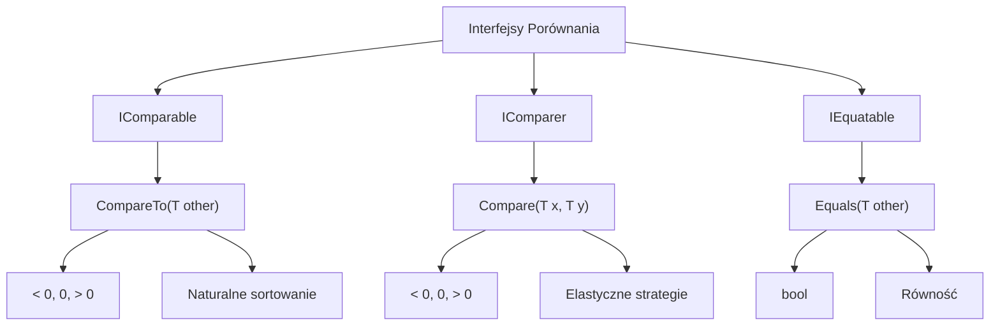

# Diagramy - Porównanie Obiektów

```mermaid
graph TD
    A["Interfejsy Porównania"]
    
    A --> B["IComparable<T>"]
    A --> C["IComparer<T>"]
    A --> D["IEquatable<T>"]
    
    B --> B1["CompareTo(T other)"]
    B1 --> B2["< 0, 0, > 0"]
    B1 --> B3["Naturalne sortowanie"]
    
    C --> C1["Compare(T x, T y)"]
    C1 --> C2["< 0, 0, > 0"]
    C1 --> C3["Elastyczne strategie"]
    
    D --> D1["Equals(T other)"]
    D1 --> D2["bool"]
    D1 --> D3["Równość"]
```
