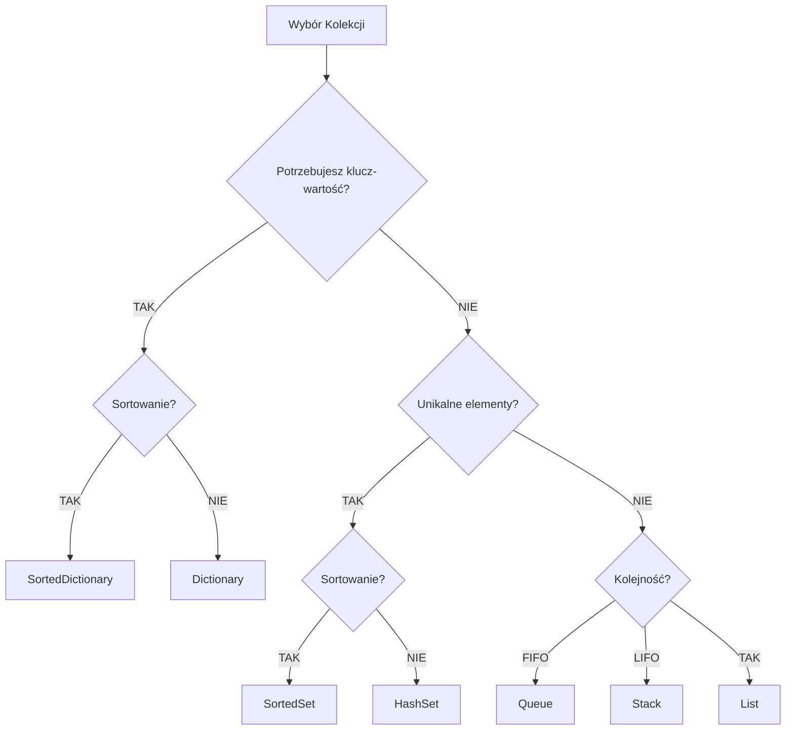

# 5. Przegląd Kolekcji

## 📌 Cel Tematu

- Hierarchia kolekcji w .NET
- Praktyczne zastosowania każdej kolekcji
- Wydajność i wybór właściwej struktury
- Initializers i collection expressions (C# 12)

## 🎯 Hierarchia Kolekcji

```
IEnumerable<T>
├── ICollection<T>
│   ├── List<T>          - Zmienialny array
│   ├── Dictionary<K,V>  - Key-value mapping
│   ├── HashSet<T>       - Unikalne elementy
│   ├── LinkedList<T>    - Linked list
│   └── Queue<T>, Stack<T>
│
├── ISet<T>
│   ├── HashSet<T>
│   └── SortedSet<T>
│
└── IDictionary<K,V>
    ├── Dictionary<K,V>
    └── SortedDictionary<K,V>
```

---

## 📖 Kolekcje

### 1. List<T> - Dynamiczny Array

```csharp
var list = new List<int> { 1, 2, 3 };
list.Add(4);
list.RemoveAt(0);
list.Insert(0, 0);

// Wydajność: O(1) Add (amortized), O(n) Remove
```

### 2. Dictionary<K,V> - Tablica Asocjacyjna

```csharp
var dict = new Dictionary<string, int>
{
    ["Alice"] = 25,
    ["Bob"] = 30
};

// Wydajność: O(1)Get/Set/Remove
```

### 3. HashSet<T> - Zbiór Unikalnych

```csharp
var set = new HashSet<int> { 1, 2, 3, 2, 1 };  // {1, 2, 3}

// Operacje: Union, Intersect, Except
set.UnionWith(new[] { 3, 4, 5 });  // {1, 2, 3, 4, 5}
```

### 4. Queue<T> - FIFO

```csharp
var queue = new Queue<int>();
queue.Enqueue(1);
queue.Enqueue(2);
int first = queue.Dequeue();  // 1
```

### 5. Stack<T> - LIFO

```csharp
var stack = new Stack<int>();
stack.Push(1);
stack.Push(2);
int last = stack.Pop();  // 2
```

### 6. LinkedList<T> - Lista Powiązana

```csharp
var linkedList = new LinkedList<int>();
linkedList.AddLast(1);
linkedList.AddLast(2);
linkedList.AddFirst(0);

// Wydajność: O(1) InsertAfter/RemoveAt (z węzłem)
```

### 7. SortedSet<T> - Posortowany Zbiór

```csharp
var sortedSet = new SortedSet<int> { 3, 1, 2 };  // {1, 2, 3}

// Elementy zawsze posortowane
// Wydajność: O(log n) Add/Remove
```

---

## 🆕 Collection Initializers (C# 9+)

```csharp
// Tradycyjnie
var list = new List<int> { 1, 2, 3 };

// C# 9 - Collection Expression
int[] array = [1, 2, 3];
List<int> list2 = [1, 2, 3];

// Spread operator (C# 12)
int[] combined = [..array, 4, 5];
```

---

## 💻 Praktyczne Przykłady

### 1. Cache z LRU Eviction

```csharp
public class LRUCache<TKey, TValue> 
    where TKey : notnull
{
    private Dictionary<TKey, TValue> data = new();
    private LinkedList<TKey> order = new();
    
    public void Add(TKey key, TValue value)
    {
        data[key] = value;
        order.AddLast(key);
    }
}
```

### 2. Unique Elements Counter

```csharp
public class FrequencyCounter<T> where T : notnull
{
    private Dictionary<T, int> frequencies = new();
    
    public void Add(T item)
    {
        if (frequencies.ContainsKey(item))
            frequencies[item]++;
        else
            frequencies[item] = 1;
    }
}
```

### 3. Graph dengan Adjacency List

```csharp
public class Graph<T> where T : notnull
{
    private Dictionary<T, HashSet<T>> adjacencyList = new();
    
    public void AddEdge(T from, T to)
    {
        if (!adjacencyList.ContainsKey(from))
            adjacencyList[from] = new HashSet<T>();
        adjacencyList[from].Add(to);
    }
}
```

---

## ⚡ Porównanie Wydajności

| Operacja | List<T> | Dictionary<K,V> | HashSet<T> | LinkedList<T> |
|----------|---------|-----------------|------------|---------------|
| Add      | O(1)*   | O(1)            | O(1)       | O(1)          |
| Get      | O(1)    | O(1)            | O(1)       | O(n)          |
| Remove   | O(n)    | O(1)            | O(1)       | O(n)          |
| Contains | O(n)    | O(1)            | O(1)       | O(n)          |

*Amortized

---

## 📊 Diagramy



---

## 💡 Best Practices

1. **List<T>** - Default choice dla sekwencji
2. **Dictionary<K,V>** - Lookup po kluczu
3. **HashSet<T>** - Zawieranie, unikalne elementy
4. **Queue/Stack** - Dla FIFO/LIFO
5. **Sorted* ** - Gdy wymagane sortowanie

---

**Następnie:** [6. LINQ - Wprowadzenie]../_06_linq_introduction/
