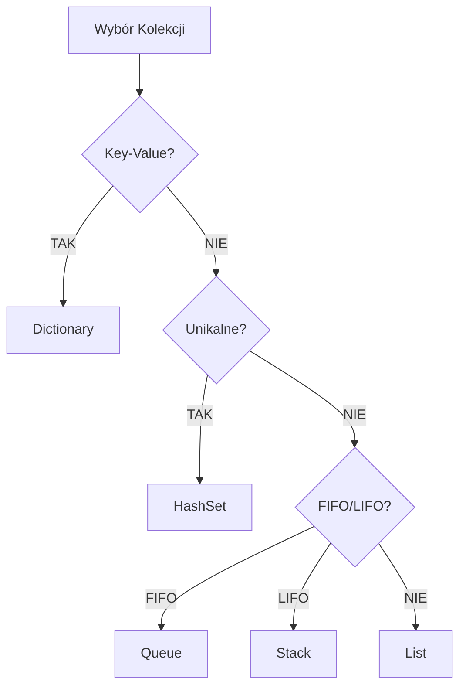

# Diagramy - Przegląd Kolekcji

```mermaid
graph TD
    A["Wybór Kolekcji"]
    
    A --> Q1{"Key-Value?"}
    Q1 -->|TAK| D1["Dictionary<K,V>"]
    Q1 -->|NIE| Q2{"Unikalne?"}
    
    Q2 -->|TAK| D2["HashSet<T>"]
    Q2 -->|NIE| Q3{"FIFO/LIFO?"}
    
    Q3 -->|FIFO| D3["Queue<T>"]
    Q3 -->|LIFO| D4["Stack<T>"]
    Q3 -->|NIE| D5["List<T>"]
```
