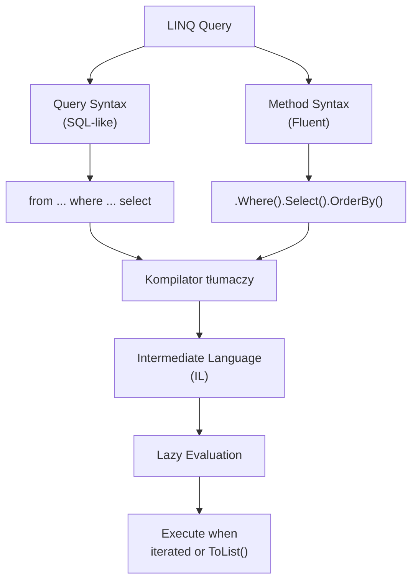

# 6. LINQ – Wprowadzenie

## 📌 Cel Tematu

- Historia i motywacja LINQ
- Query Syntax vs Method Syntax
- Podstawowe operatory: `Where`, `Select`, `OrderBy`, `GroupBy`
- Lazy evaluation i `IEnumerable<T>`
- LINQ to Objects

## 🎯 Dlaczego LINQ?

LINQ (Language-Integrated Query) umożliwia:
- ✅ Wyrażanie zapytań w C# (nie SQL)
- ✅ Unified API dla wielu źródeł danych
- ✅ Type-safe queries
- ✅ IntelliSense support

### Bez LINQ (Imperatywnie)

```csharp
var numbers = new[] { 1, 2, 3, 4, 5 };
var evenNumbers = new List<int>();

foreach (var num in numbers)
{
    if (num % 2 == 0)
        evenNumbers.Add(num);
}
```

### Z LINQ (Deklaratywnie)

```csharp
var numbers = new[] { 1, 2, 3, 4, 5 };
var evenNumbers = numbers.Where(n => n % 2 == 0).ToList();
```

---

## 📖 Query Syntax vs Method Syntax

### Query Syntax (SQL-like)

```csharp
var result = from person in people
             where person.Age > 25
             orderby person.Name
             select person;
```

### Method Syntax (Fluent)

```csharp
var result = people
    .Where(p => p.Age > 25)
    .OrderBy(p => p.Name);
```

Obie kompilują się do tego samego kodu!

---

## 💻 Podstawowe Operatory

### Where - Filtrowanie

```csharp
var adults = people.Where(p => p.Age >= 18);
```

### Select - Transformacja

```csharp
var names = people.Select(p => p.Name);
var ages = people.Select(p => p.Age);

// Transformacja do innego typu
var personDtos = people.Select(p => new { p.Name, p.Age });
```

### OrderBy - Sortowanie

```csharp
// Rosnąco
var byAge = people.OrderBy(p => p.Age);

// Malejąco
var byAgeDesc = people.OrderByDescending(p => p.Age);

// Wielopoziomowe
var sorted = people
    .OrderBy(p => p.Department)
    .ThenBy(p => p.Name);
```

### GroupBy - Grupowanie

```csharp
var byDepartment = people.GroupBy(p => p.Department);

foreach (var group in byDepartment)
{
    Console.WriteLine($"Department: {group.Key}");
    foreach (var person in group)
        Console.WriteLine($"  {person.Name}");
}

// Z projekcją
var departments = people
    .GroupBy(p => p.Department)
    .Select(g => new { Dept = g.Key, Count = g.Count() });
```

### First/FirstOrDefault/Single

```csharp
var first = numbers.First();  // Zwróć pierwszy, lub throw
var firstOrDefault = numbers.FirstOrDefault();  // Lub default(T)
var firstEven = numbers.First(n => n % 2 == 0);
```

### Take/Skip - Paginacja

```csharp
var page1 = numbers.Take(10);  // Pierwsze 10
var page2 = numbers.Skip(10).Take(10);  // Następne 10

// Any/All
bool hasEven = numbers.Any(n => n % 2 == 0);
bool allPositive = numbers.All(n => n > 0);
```

---

## 🔄 Lazy Evaluation

LINQ queries nie są wykonywane aż do iteracji:

```csharp
IEnumerable<int> query = numbers
    .Where(n => n % 2 == 0)
    .Select(n => n * 2);

// Query nie został wykonany! Jeśli nigdy nie iterujemy, nic się nie dzieje.

foreach (var item in query)  // Tutaj wykonanie następuje
    Console.WriteLine(item);
```

### Eager Evaluation - ToList(), ToArray()

```csharp
List<int> results = numbers
    .Where(n => n % 2 == 0)
    .ToList();  // Tutaj wykonanie się następuje
```

---

## 🆕 Nowoczesne Cechy (C# 9+)

### Records z LINQ

```csharp
public record Person(string Name, int Age);

var adults = people
    .Where(p => p.Age >= 18)
    .Select(p => new Person(p.Name, p.Age));
```

### With Expression

```csharp
var updated = people
    .Select(p => p with { Age = p.Age + 1 });
```

---

## 📊 Diagramy



---

## 💡 Best Practices

1. **Używaj Method Syntax** – Bardziej flexible
2. **Chain operatory** – Czytalne i eleganckie
3. **Pamiętaj o Lazy Evaluation** – Debug jest trudny
4. **Use ToList() for Side Effects** – Nie iteruj wiele razy

---

**Następnie:** [7. LINQ - Zaawansowane Techniki]../_07_linq_advanced/
