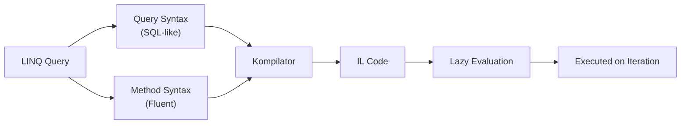

# Diagramy - LINQ Wprowadzenie

```mermaid
graph LR
    A["LINQ Query"]
    
    A --> B["Query Syntax<br/>(SQL-like)"]
    A --> C["Method Syntax<br/>(Fluent)"]
    
    B --> D["Kompilator"]
    C --> D
    
    D --> E["IL Code"]
    E --> F["Lazy Evaluation"]
    F --> G["Executed on Iteration"]
```
