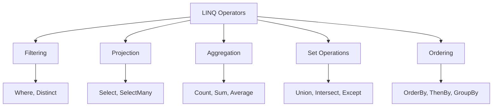

# 7. LINQ – Zaawansowane Techniki

## 📌 Cel Tematu

- Operatory agregujące
- Spłaszczanie i łączenie zbiorów
- Zaawansowane operacje
- Custom LINQ operators
- Performance considerations

## 🎯 Operatory Agregujące

### Count, Sum, Average

```csharp
var numbers = new[] { 1, 2, 3, 4, 5 };

int count = numbers.Count();  // 5
int sum = numbers.Sum();  // 15
double avg = numbers.Average();  // 3.0

var adults = people.Count(p => p.Age >= 18);
```

### Min, Max

```csharp
int minAge = people.Min(p => p.Age);
int maxAge = people.Max(p => p.Age);

Person youngest = people.OrderBy(p => p.Age).First();
```

### Aggregate

```csharp
int sum = numbers.Aggregate((acc, x) => acc + x);  // 15

// Z wartością początkową
int product = numbers.Aggregate(1, (acc, x) => acc * x);  // 120

// Z transformacją wyniku
string result = words.Aggregate("", (acc, w) => acc + w + " ");
```

---

## 🔄 SelectMany - Spłaszczanie

```csharp
var departments = new[]
{
    new { Name = "IT", Members = new[] { "Alice", "Bob" } },
    new { Name = "HR", Members = new[] { "Charlie", "Diana" } }
};

// Spłaszcz do listy wszystkich członków
var allMembers = departments.SelectMany(d => d.Members);
// ["Alice", "Bob", "Charlie", "Diana"]

// Z indeksem i departamentem
var withDept = departments.SelectMany(
    d => d.Members,
    (d, m) => new { Department = d.Name, Member = m }
);
```

---

## 🔗 Łączenie Zbiorów

### Join

```csharp
var employees = new List<Employee> { ... };
var departments = new List<Department> { ... };

var joined = employees.Join(
    departments,
    e => e.DepartmentId,  // Klucz z employees
    d => d.Id,            // Klucz z departments
    (e, d) => new { e.Name, d.DeptName }
);
```

### GroupJoin

```csharp
var grouped = departments.GroupJoin(
    employees,
    d => d.Id,
    e => e.DepartmentId,
    (d, emps) => new { d.Name, Employees = emps }
);
```

### Union, Intersect, Except

```csharp
var set1 = new[] { 1, 2, 3 };
var set2 = new[] { 3, 4, 5 };

var union = set1.Union(set2);  // [1, 2, 3, 4, 5]
var intersect = set1.Intersect(set2);  // [3]
var except = set1.Except(set2);  // [1, 2]
```

---

## 🎯 Take/Skip Operators

```csharp
var numbers = Enumerable.Range(1, 10);

numbers.Take(5);  // [1, 2, 3, 4, 5]
numbers.Skip(5);  // [6, 7, 8, 9, 10]

numbers.TakeWhile(n => n < 5);  // [1, 2, 3, 4]
numbers.SkipWhile(n => n < 5);  // [5, 6, 7, 8, 9, 10]

// Paginacja
int pageSize = 10;
int pageNumber = 2;
var page = items.Skip((pageNumber - 1) * pageSize).Take(pageSize);
```

---

## 🎁 Distinct

```csharp
var numbers = new[] { 1, 2, 2, 3, 3, 3 };
var unique = numbers.Distinct();  // [1, 2, 3]

// Z custom comparer
var people = new List<Person> { ... };
var uniqueByName = people.Distinct(
    EqualityComparer<Person>.Create(
        (p1, p2) => p1.Name == p2.Name,
        p => p.Name.GetHashCode()
    )
);
```

---

## 🆕 Custom LINQ Operators

```csharp
public static class EnumerableExtensions
{
    // Custom "Batch" operator
    public static IEnumerable<IEnumerable<T>> Batch<T>(
        this IEnumerable<T> source, int batchSize)
    {
        var batch = new List<T>(batchSize);
        foreach (var item in source)
        {
            batch.Add(item);
            if (batch.Count == batchSize)
            {
                yield return batch;
                batch = new List<T>(batchSize);
            }
        }
        if (batch.Count > 0)
            yield return batch;
    }
}

// Użycie
var batches = numbers.Batch(3);
```

---

## ⚡ Performance Considerations

### Avoid Multiple Enumeration

```csharp
// ❌ Zły - enumeration trzy razy
var query = collection.Where(x => x > 10);
var count = query.Count();
var sum = query.Sum();
var avg = query.Average();

// ✅ Dobry - materialize once
var materialized = query.ToList();
var count = materialized.Count;
var sum = materialized.Sum();
var avg = materialized.Average();
```

### Use Compiled Queries

```csharp
// Dla frequently used queries
static readonly Func<List<Person>, IEnumerable<Person>> 
    AdultQuery = Compile((List<Person> people) => 
        people.Where(p => p.Age >= 18)
    );
```

### PLINQ - Parallel LINQ

```csharp
var result = items
    .AsParallel()  // Enable parallel processing
    .Where(x => x > 10)
    .Select(x => x * 2);
```

---

## 🆕 Nowoczesne Cechy (C# 9+)

### Queries with Records

```csharp
public record Person(string Name, int Age);

var results = people
    .Where(p => p.Age >= 18)
    .GroupBy(p => p.Name)
    .Select(g => new Person(g.Key, g.Average(p => p.Age)));
```

### Deconstruction w LINQ

```csharp
var results = people
    .Select((p, index) => (Index: index, p.Name, p.Age))
    .Where(r => r.Index > 0);
```

---

## 📊 Diagramy



---

## 💡 Best Practices

1. **Chain operatory** – Czytalne pipelines
2. **Materialize when needed** – `.ToList()` dla wielokrotnego dostępu
3. **Use correct operators** – Nie iteruj wiele razy
4. **Consider performance** – Duże zbiory mogą być wolne
5. **Custom operators** - Rozszerz LINQ dla specyficznych potrzeb

---

## 📚 Referencje

- [LINQ Operators](https://learn.microsoft.com/en-us/dotnet/csharp/linq/standard-query-operators/)
- [Expression Trees](https://learn.microsoft.com/en-us/dotnet/csharp/expression-classes)
- [PLINQ](https://learn.microsoft.com/en-us/dotnet/standard/parallel-programming/parallel-linq-plinq)

---

**Koniec modułu** – Gratuluję! Nauczyłeś się typów genericznych, kolekcji i LINQ! 🎓
