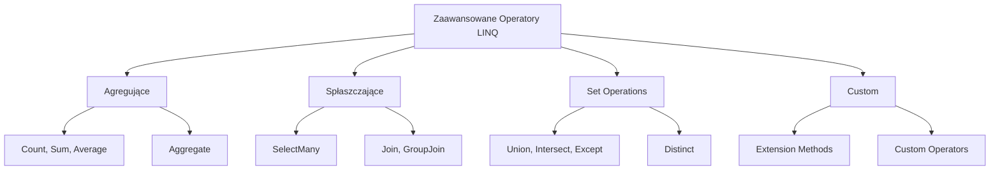

# Diagramy - LINQ Zaawansowane

```mermaid
graph TD
    A["Zaawansowane Operatory LINQ"]
    
    A --> B["Agregujące"]
    A --> C["Spłaszczające"]
    A --> D["Set Operations"]
    A --> E["Custom"]
    
    B --> B1["Count, Sum, Average"]
    B --> B2["Aggregate"]
    
    C --> C1["SelectMany"]
    C --> C2["Join, GroupJoin"]
    
    D --> D1["Union, Intersect, Except"]
    D --> D2["Distinct"]
    
    E --> E1["Extension Methods"]
    E --> E2["Custom Operators"]
```
