# 09 - Delegacje i Zdarzenia w C#

## 📚 Przegląd Modułu

Delegacje i zdarzenia to fundamentalne mechanizmy w C# umożliwiające pisanie elastycznego, słabo sprzężonego kodu. W tym module nauczysz się, jak implementować zaawansowane wzorce programowania z wykorzystaniem delegacji i zdarzeń.

### 🎯 Cele Nauczania

- Zrozumieć ideę delegacji jako mechanizmu late binding
- Poznać type safety w kontekście delegacji
- Nauczyć się definiować i używać delegacje
- Opanować predefiniowane delegacje generyczne (Action, Func, Predicate)
- Poznać wyrażenia lambda i metody anonimowe
- Zrozumieć standardowy wzorzec zdarzeń w .NET
- Nauczyć się wybierać między delegacjami a zdarzeniami
- Implementować event-driven architecture

---

## 📁 Struktura Modułu

```
09-delegacje_zdarzenia/
├── README.md (ten plik)
│
├── _01_delegates_idea_motivation/          # Delegacje: Idea i motywacja
│   ├── README.md
│   ├── code/
│   │   ├── Program.cs
│   │   └── Program.csproj
│   ├── diagrams/diagrams.md
│   └── tasks/EXERCISES.md
│
├── _02_delegates_definition/               # Delegacje: Definicja i składnia
│   ├── README.md
│   ├── code/
│   │   ├── Program.cs
│   │   └── Program.csproj
│   ├── diagrams/diagrams.md
│   └── tasks/EXERCISES.md
│
├── _03_predefined_generic_delegates/       # Action, Func, Predicate
│   ├── README.md
│   ├── code/
│   │   ├── Program.cs
│   │   └── Program.csproj
│   ├── diagrams/diagrams.md
│   └── tasks/EXERCISES.md
│
├── _04_lambda_anonymous/                   # Lambda i metody anonimowe
│   ├── README.md
│   ├── code/
│   │   ├── Program.cs
│   │   └── Program.csproj
│   ├── diagrams/diagrams.md
│   └── tasks/EXERCISES.md
│
├── _05_events_fundamentals/                # Zdarzenia: Fundamenty
│   ├── README.md
│   ├── code/
│   │   ├── Program.cs
│   │   └── Program.csproj
│   ├── diagrams/diagrams.md
│   └── tasks/EXERCISES.md
│
├── _06_events_patterns/                    # Wzorce pracy ze zdarzeniami
│   ├── README.md
│   ├── code/
│   │   ├── Program.cs
│   │   └── Program.csproj
│   ├── diagrams/diagrams.md
│   └── tasks/EXERCISES.md
│
├── _07_delegates_vs_events/                # Kiedy co wybrać?
│   ├── README.md
│   ├── code/
│   │   ├── Program.cs
│   │   └── Program.csproj
│   ├── diagrams/diagrams.md
│   └── tasks/EXERCISES.md
│
└── _08_event_driven_architecture/          # Większy przykład
    ├── README.md
    ├── code/
    │   ├── Program.cs
    │   └── Program.csproj
    ├── diagrams/diagrams.md
    └── tasks/EXERCISES.md
```

---

## 🗺️ Mapa Ścieżki Nauki

```mermaid
graph LR
    A["01: Idea<br/>Late Binding"] --> B["02: Definicja<br/>Składnia"]
    B --> C["03: Predefiniowane<br/>Action, Func"]
    C --> D["04: Lambda<br/>Anonymous Methods"]
    D --> E["05: Zdarzenia<br/>Fundamenty"]
    E --> F["06: Wzorce<br/>Praktyka"]
    F --> G["07: Vs Events<br/>Wybór"]
    G --> H["08: Architecture<br/>Real-world"]
    
    style A fill:#e1f5ff
    style B fill:#e1f5ff
    style C fill:#f3e5f5
    style D fill:#f3e5f5
    style E fill:#fff3e0
    style F fill:#fff3e0
    style G fill:#f1f8e9
    style H fill:#f1f8e9
```



---

## 🎓 Tematy Główne

### 1️⃣ **Delegacje: Idea i Motywacja**
- Czym są delegacje?
- Late binding (wiązanie opóźnione)
- Type safety w delegacjach
- Porównanie z callback'ami w innych językach
- **Klucz:** Zrozumienie "dlaczego" delegacje istnieją

### 2️⃣ **Delegacje: Definicja i Składnia**
- Deklaracja delegacji
- Instancjowanie delegacji
- Odwoływanie delegacji
- Multicast delegacje
- Variance (in/out) w delegacjach

### 3️⃣ **Predefiniowane Delegacje Generyczne**
- `Action<T>` - procedury bez wartości zwracanej
- `Func<T, TResult>` - funkcje ze zwracaną wartością
- `Predicate<T>` - predykaty logiczne
- Praktyczne zastosowania

### 4️⃣ **Wyrażenia Lambda i Metody Anonimowe**
- Delegacje inline - anonymous methods
- Wyrażenia lambda
- Closure i capturing zmiennych
- Expression bodied members

### 5️⃣ **Zdarzenia: Fundamenty**
- Rola zdarzeń w architekturze
- Publisher-Subscriber pattern
- Standardowy wzorzec zdarzeń .NET
- Obiekty `EventArgs`
- Best practices dla zdarzeń

### 6️⃣ **Wzorce Pracy ze Zdarzeniami**
- Event source i event subscriber
- Rejestrowanie i wyrejestrowanie nasłuchiwania
- Propagacja zdarzeń
- Unsubscribe trap - memory leaks
- Weak event patterns

### 7️⃣ **Delegacje czy Zdarzenia? Wybór**
- Kiedy używać delegacji?
- Kiedy używać zdarzeń?
- Best practices
- Anti-patterns do unikania
- Nowoczesne podejścia (async/await, reactive)

### 8️⃣ **Event-Driven Architecture - Większy Przykład**
- Implementacja system obserwacji
- Real-world scenario: Application Event Bus
- Kombinacja delegacji, zdarzeń i nowoczesnego C#
- Design patterns: Observer, Publisher-Subscriber

---

## ⚙️ Wymagania Techniczne

- **.NET SDK:** 9.0 lub nowszy
- **C# Version:** 12 (latest)
- **IDE:** Visual Studio Code + C# extension lub Visual Studio
- **XUnit:** Dla testów (zainstalowany via NuGet)

### Nowoczesne Cechy C# (stosowane w materiałach)

- ✅ **C# 8** - Nullable reference types, default interface members
- ✅ **C# 9** - Records, init-only properties, target-typed new
- ✅ **C# 10** - Global usings, file-scoped types
- ✅ **C# 11** - Required members, raw string literals
- ✅ **C# 12** - Collection expressions, primary constructors

---

## 🚀 Jak Uruchamiać Materiały

### Uruchamianie Kodu Demonstracyjnego

```bash
# Przejdź do wybranego tematu
cd src/09-delegacje_zdarzenia/_01_delegates_idea_motivation/code

# Uruchom program
dotnet run

# Uruchom z argumentami (jeśli dostępne)
dotnet run -- arg1 arg2
```

### Kompilacja

```bash
# W głównym katalogu tematu
dotnet build

# Uruchom testy (jeśli dostępne)
dotnet test
```

---

## 📖 Jak Korzystać z Materiałów

### Dla Wykładowcy/Instruktora
1. Przeczytaj **README.md** każdego tematu
2. Zapoznaj się z diagramami w **diagrams/diagrams.md**
3. Przegląd **Program.cs** dla zrozumienia praktycznych przykładów
4. Uruchom kod w Visual Studio Code na żywo podczas wykładu
5. Przydaj zadania z **EXERCISES.md** studentom
6. Pokaż rozwiązania z **SOLUTIONS.md** (gdzie dostępne)

### Dla Studenta
1. Przeczytaj **README.md** aby zrozumieć koncepcję
2. Przeanalizuj **diagramy Mermaid** w **diagrams/diagrams.md**
3. Uruchom **Program.cs** aby zobaczyć kod w akcji
4. Eksperymentuj z kodem - zmieniaj i testuj
5. Wykonaj zadania z **EXERCISES.md** (Basic → Intermediate → Advanced)
6. Porównaj swoje rozwiązania z **SOLUTIONS.md**

---

## 🔗 Referencje Zewnętrzne

### Dokumentacja Microsoft
- [Delegacje w C#](https://learn.microsoft.com/pl-pl/dotnet/csharp/fundamentals/types/delegates)
- [Zdarzenia w C#](https://learn.microsoft.com/pl-pl/dotnet/csharp/fundamentals/events/)
- [Action, Func, Predicate](https://learn.microsoft.com/en-us/dotnet/api/system.action?view=net-9.0)
- [EventHandler i EventArgs](https://learn.microsoft.com/en-us/dotnet/fundamentals/events/how-to-subscribe-to-and-unsubscribe-from-events)

### Artykuły i Tutoriale
- [C# Events Tutorial](https://www.tutorialsteacher.com/csharp/csharp-events)
- [Delegates in C# - The Complete Guide](https://www.codeproject.com/Articles/13254/Delegates-in-C-Covering-all-the-Bases)
- [Understanding the Publisher-Subscriber Pattern](https://learn.microsoft.com/en-us/archive/msdn-magazine/2011/february/msdn-magazine-patterns-understanding-the-observer-design-pattern)

---

## 📊 Statystyka Materiałów

| Komponent | Ilość |
|-----------|-------|
| Tematy główne | 8 |
| Pliki README.md | 8 |
| Programy demonstracyjne | 8 |
| Diagramy Mermaid | 15+ |
| Zadania dla studentów | 40+ |
| Przykłady kodu | 80+ |

---

## 🔄 Kolejność Rekomendowana

Materiały są projektowane do pracy **sekwencyjnie**:

1. **Fundamenty** (1-4) - Zrozumienie delegacji
2. **Praktyka** (5-6) - Implementacja zdarzeń
3. **Zaawansowane** (7-8) - Decyzje architektoniczne

Po ukończeniu tego modułu będziesz gotowy do:
- ✅ Projektowania słabo sprzężonych systemów
- ✅ Implementowania wzorców Observer i Publisher-Subscriber
- ✅ Pracy z event-driven architecture
- ✅ Rozumienia async/await z delegacjami
- ✅ Optymalizacji pod kątem memory leaks ze zdarzeniami

---

## 📋 Notatki Dla Instruktorów

### Czas Trwania (Orientacyjny)
- Temat 1-2: 1-2 godziny
- Temat 3-4: 1-2 godziny
- Temat 5-6: 2 godziny
- Temat 7-8: 2-3 godziny
- **Razem:** 8-10 godzin

### Sugerowane Aktywności
- Live coding podczas każdego tematu
- Interaktywne dyskusje o use cases
- Pair programming dla zadań Advanced
- Review rzeczywistych projektów pokazujących delegacje/zdarzenia

---

**Wersja:** 1.0  
**Ostatnia aktualizacja:** 2026-08-30  
**Status:** ✅ Gotowe do użytku dydaktycznego
