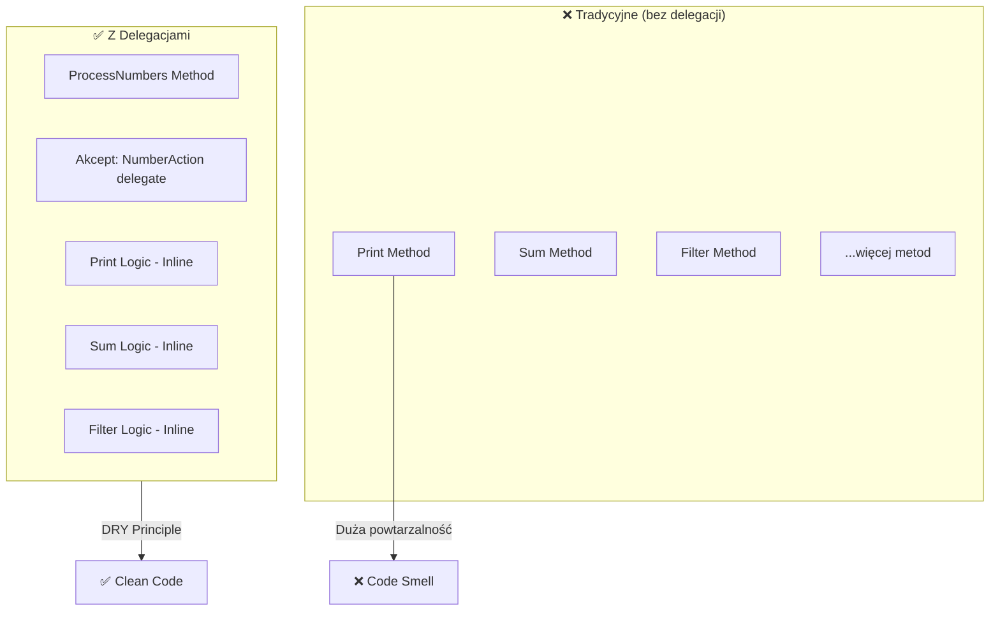
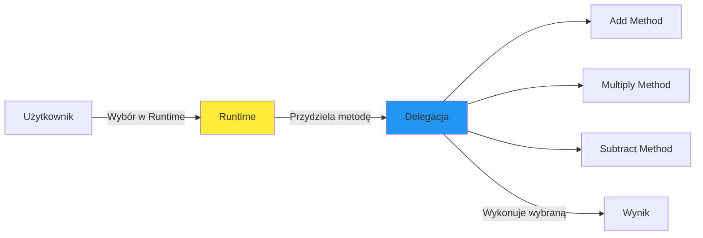
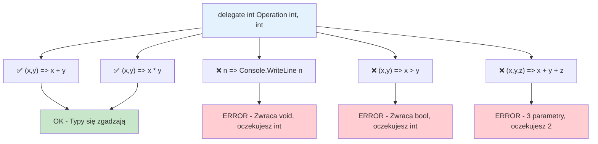
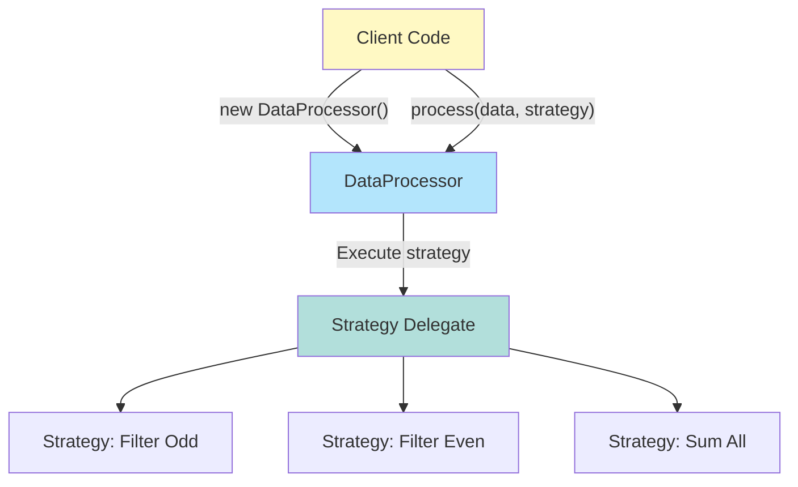
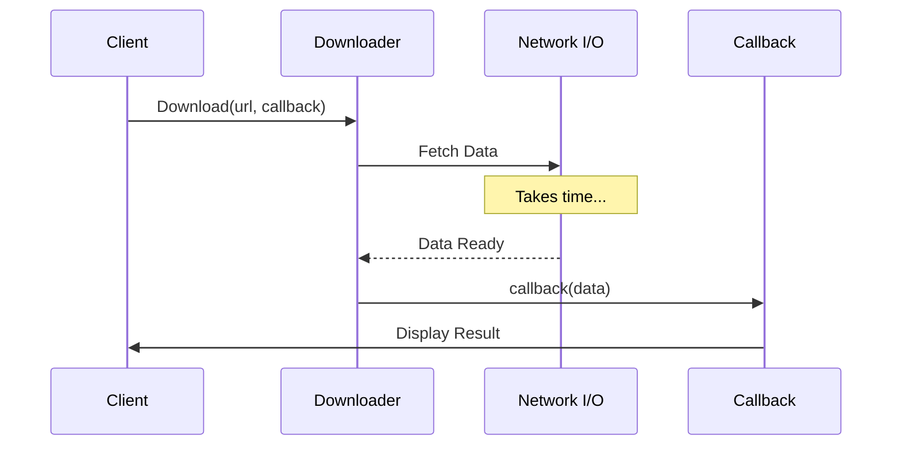
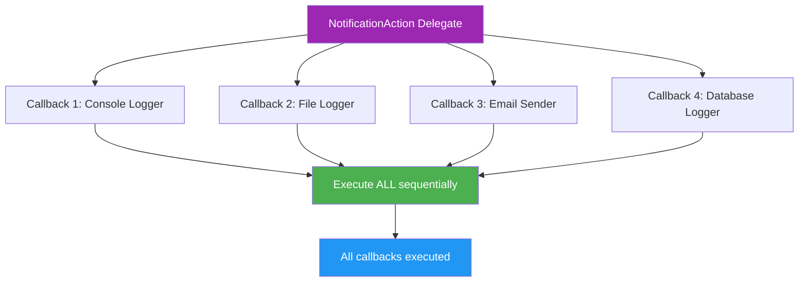
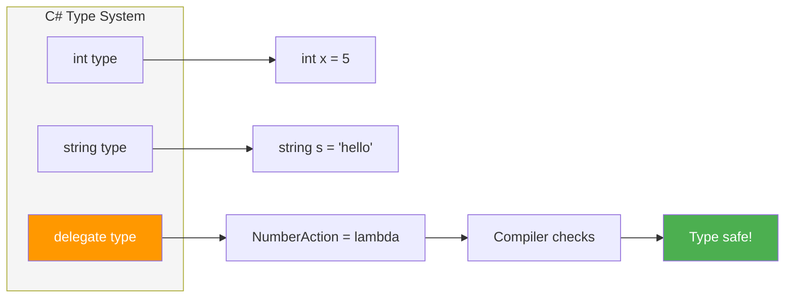
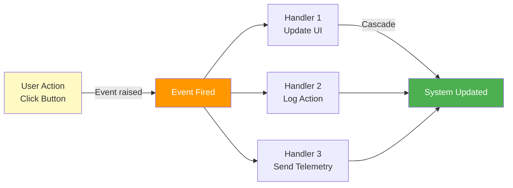
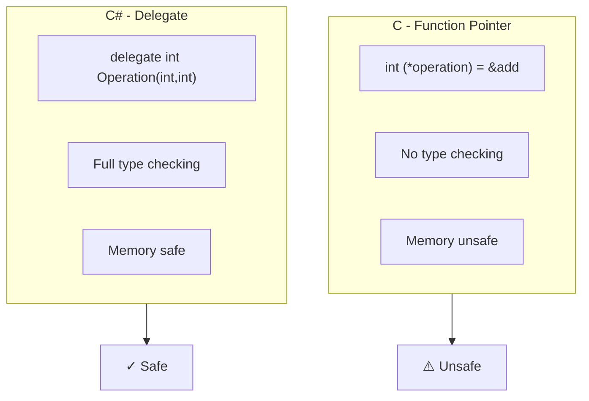

# Diagramy - Delegacje: Idea i Motywacja

## 1. Delegacje vs Tradycyjne Podejście

## 2. Late Binding Flow

## 3. Type Safety - Kompilator Sprawdza

## 4. Strategy Pattern - Architektura

## 5. Callback Pattern - Timeline

## 6. Multicast Delegates

## 7. Delegacja jako Typ

## 8. Real-World: Event Handling Pipeline

## 9. Porównanie: Function Pointer (C) vs Delegate (C#)

