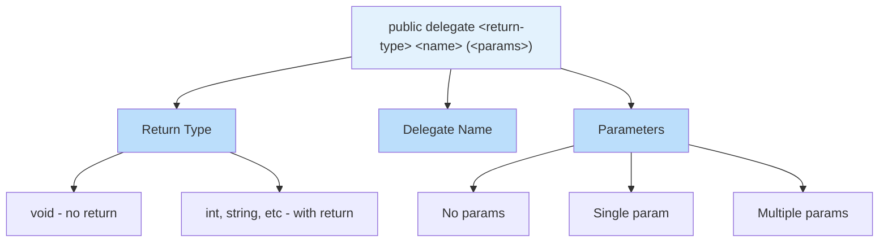
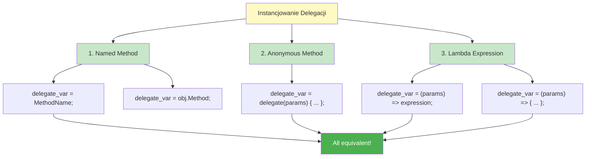
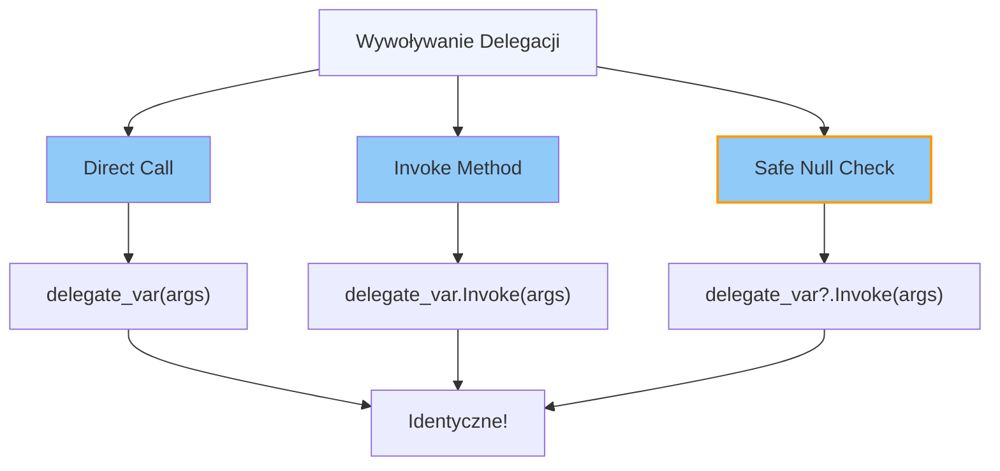
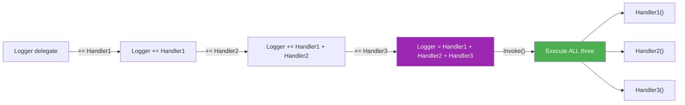
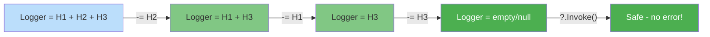
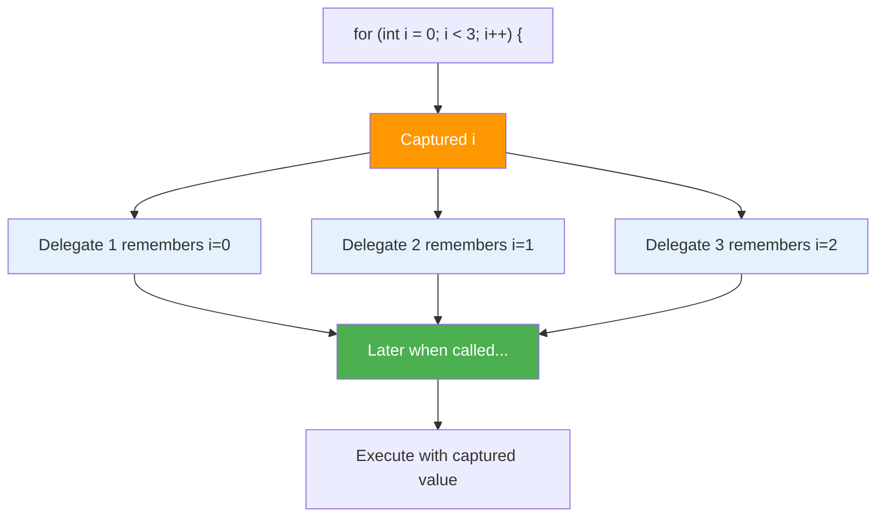
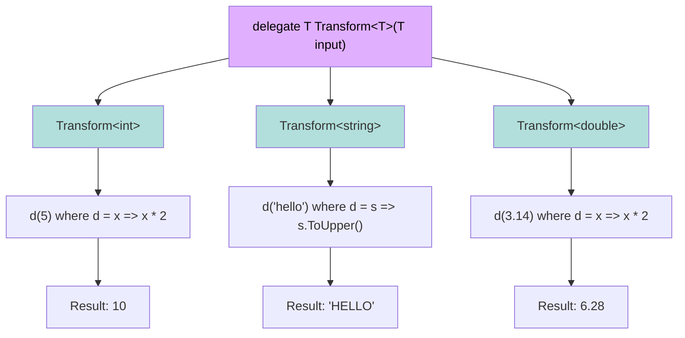
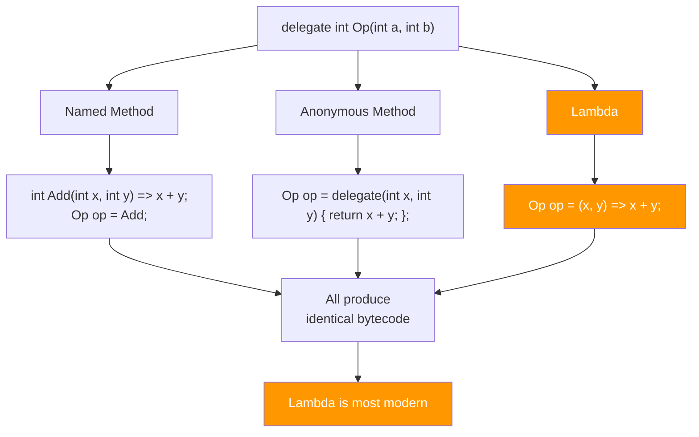

# Diagramy - Delegacje: Definicja i Składnia

## 1. Deklaracja Delegacji - Składnia

## 2. Instancjowanie - Trzy Metody

## 3. Odwoływanie - Metody

## 4. Multicast Delegates - Łączenie

## 5. Multicast Delegates - Usuwanie

## 6. Closure - Zmienna Przechwycona

## 7. Generic Delegates

## 8. Porównanie: Named vs Anonymous vs Lambda

