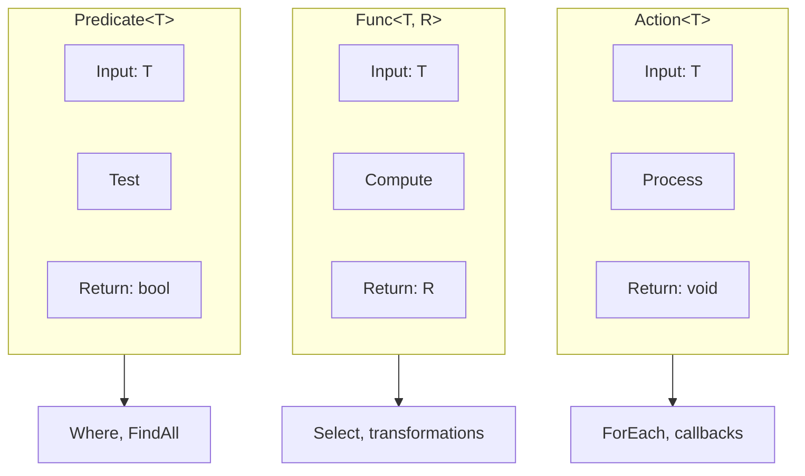
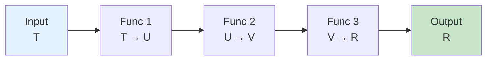
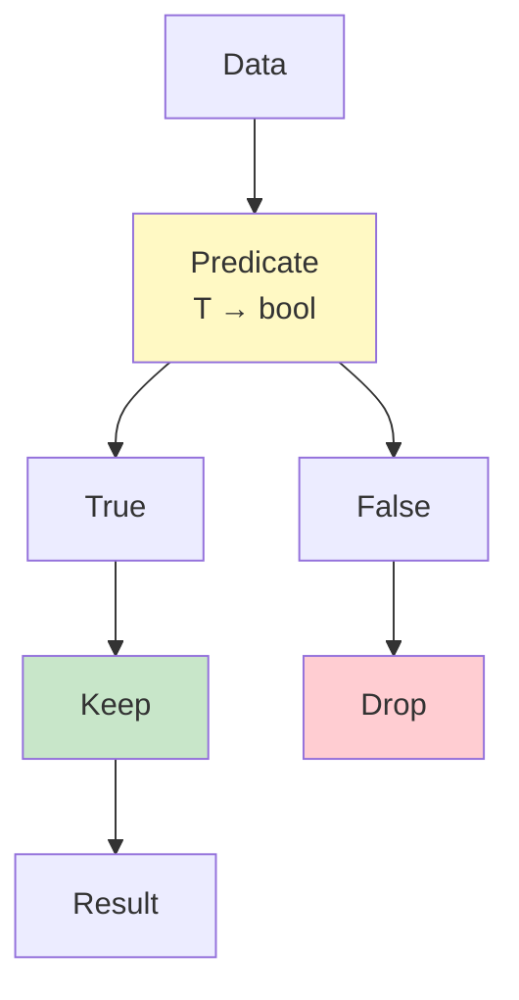
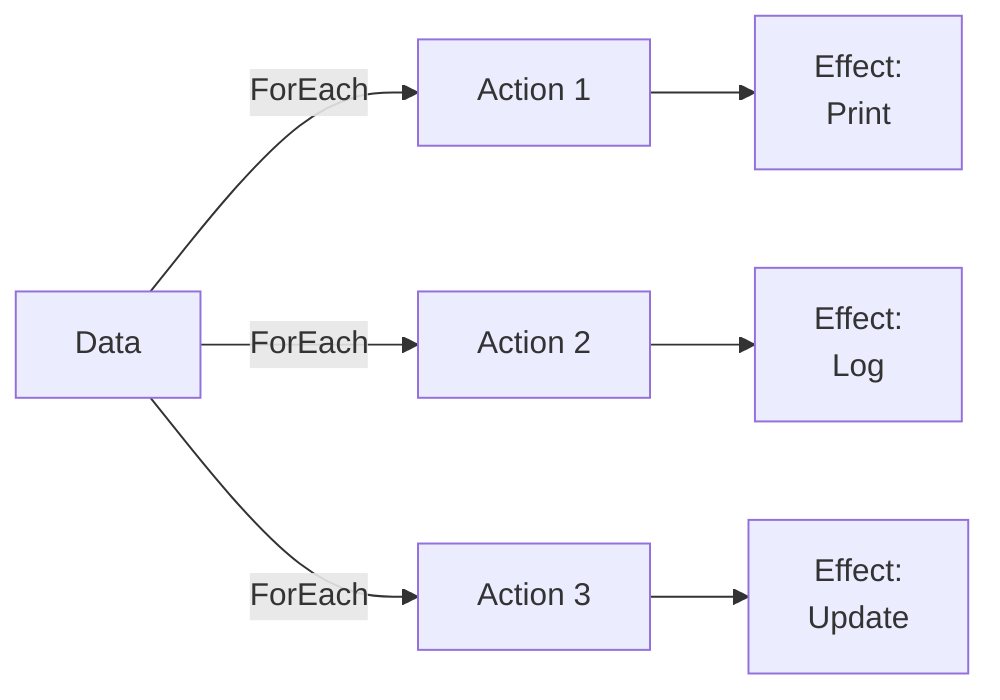

# Diagramy - Predefiniowane Delegacje Generyczne

## 1. Action vs Func vs Predicate

```mermaid
graph TB
    subgraph Action["Action&lt;T&gt;"]
        A1["Input: T"]
        A2["Process"]
        A3["Return: void"]
    end
    
    subgraph Func["Func&lt;T, R&gt;"]
        F1["Input: T"]
        F2["Compute"]
        F3["Return: R"]
    end
    
    subgraph Predicate["Predicate&lt;T&gt;"]
        P1["Input: T"]
        P2["Test"]
        P3["Return: bool"]
    end
    
    Action --> USE1["ForEach, callbacks"]
    Func --> USE2["Select, transformations"]
    Predicate --> USE3["Where, FindAll"]
```

## 2. Func - Transformacja

```mermaid
graph LR
    IN["Input<br/>T"]
    
    F1["Func 1<br/>T → U"]
    F2["Func 2<br/>U → V"]
    F3["Func 3<br/>V → R"]
    
    OUT["Output<br/>R"]
    
    IN --> F1
    F1 --> F2
    F2 --> F3
    F3 --> OUT
    
    style IN fill:#e3f2fd
    style OUT fill:#c8e6c9
```

## 3. Predicate - Filtrowanie

```mermaid
graph TB
    DATA["Data"]
    
    DATA --> P["Predicate<br/>T → bool"]
    
    P --> T["True"]
    P --> F["False"]
    
    T --> KEEP["Keep"]
    F --> DROP["Drop"]
    
    KEEP --> RESULT["Result"]
    
    style P fill:#fff9c4
    style KEEP fill:#c8e6c9
    style DROP fill:#ffcdd2
```

## 4. Action - Efekt Uboczny

```mermaid
graph LR
    DATA["Data"]
    
    DATA -->|ForEach| A1["Action 1"]
    DATA -->|ForEach| A2["Action 2"]
    DATA -->|ForEach| A3["Action 3"]
    
    A1 --> EFF1["Effect:<br/>Print"]
    A2 --> EFF2["Effect:<br/>Log"]
    A3 --> EFF3["Effect:<br/>Update"]
```
