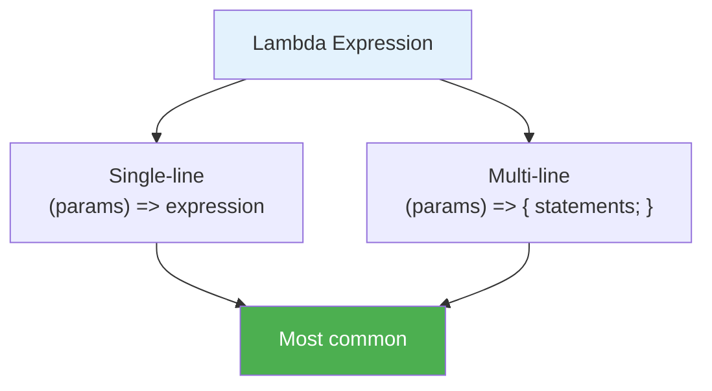

# Diagramy - Lambda i Anonymous Methods

```mermaid
graph TB
    A["Lambda Expression"]
    A --> B["Single-line<br/>(params) => expression"]
    A --> C["Multi-line<br/>(params) => { statements; }"]
    
    B --> U["Most common"]
    C --> U
    
    style A fill:#e3f2fd
    style U fill:#4caf50,color:#fff
```
